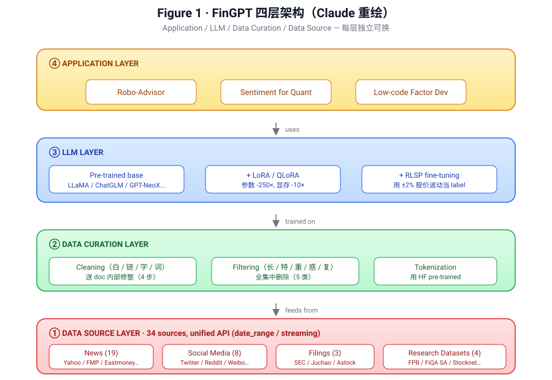

[← 上一节](02-related-work.md) ｜ [返回论文 README](../README.md) ｜ [下一节 →](04-data.md)

# 03 · Data-centric FinGPT Framework for FinLLMs（框架总览）

> **来源**：arXiv 2307.10485v2, §3, p3–p5
>
> **一句话定位**：这一节把 FinGPT 的"四层架构图"（Figure 1）端出来 + 把 BloombergGPT 的"三大短板"列清楚。**Figure 1 是全文最重要的一张图**，看完这节你应该能不看图复述出 FinGPT 的层级结构。

---

## 📌 预览

§3 由 3 个子节组成：

```
3.1 Challenges of Training FinLLMs       ── 重申 Intro 的"杂噪时"三挑战
3.2 Overview of FinGPT Framework         ── 端出 Figure 1（四层架构）
3.3 Proprietary Model BloombergGPT       ── 列 BloombergGPT 的 3 个短板
```

**这一节的训练目标**：让我能在白板上手画出 Figure 1 的四层结构 + 说出 BloombergGPT 三大短板。

---

## 📄 §3.1 · Challenges of Training FinLLMs（训练挑战）

> **原文摘要**：
>
> "Our primary objective is to obtain an open-source FinLLM that delivers superior performance in financial tasks. However, as pointed out in [1], the best-performing LLMs designed for general tasks may fall short when applied to financial tasks, e.g., GPT-NeoX and OPT. This discrepancy primarily arises from the disparities between general text data and financial text data. Hence, a crucial aspect of enabling FinLLMs is to democratize access to financial data, which involves several challenges:"
>
> "• **Diverse data sources**. Financial data originates from diverse sources, such as news, company filings, social media, and research datasets (example sources are shown in Fig. 2). Extracting data from these sources necessitates distinct approaches, demanding substantial efforts to construct specialized data pipelines."
>
> "• **Data quality issues**. The low signal-to-noise ratio (SNR) of financial data is often quite low, making it challenging to dig for useful information beneath the data. Consider, for instance, data extracted from web-based news articles, which may encompass numerous unforeseen HTML elements and superfluous text or symbols. Consequently, proper data cleaning to ensure data quality becomes crucially important."
>
> "• **High time-validity**. Financial data is highly time-sensitive. While the data obtained at present can reflect the current market state, its representativeness diminishes over time due to the dynamic nature of the market. For instance, a favorable earnings report from a company can have a significant short-term effect on the stock price, but this impact may dwindle over time. Therefore, we need to gather data in real time."

💡 **§3.1 是 §1 的「再说一遍」**：三大挑战在 Intro 已经讲过，但作者在这里再讲一次 —— 这是论文写作的**冗余-鲁棒**技巧。读者从中间章节进来读也能找到挑战陈述。

🧠 **三大挑战的具体例子**（§3.1 比 §1 多给的）：

| 挑战 | §1 的例子 | §3.1 加的例子 |
|---|---|---|
| 杂（diverse） | "many specialized pipelines" | 新闻 + 公告 + 社交 + 研究数据集 |
| 噪（low SNR） | "minimal usable info" | 网页 HTML 标签、垃圾字符 |
| 时（time-validity） | "market evolves" | 利好财报的影响**短期**显著、**长期**衰减 |

⚠️ **关键观察**：§3.1 没引入新概念，但**用具体例子让挑战更可感**。这告诉我，写 paper 时一个挑战要说**至少两次** —— 一次抽象、一次具体。

---

## 📄 §3.2 · Overview of FinGPT Framework（四层架构）

> **原文要点**：
>
> "FinGPT, an open-source framework specifically developed to enhance the capabilities of LLMs in financial tasks. It has the following features:
>
> • **Democratizing Internet-scale financial data.** We gather a comprehensive amount of accessible financial data from the Internet and provide a unified data interface for developers to access this data for building their own LLMs.
>
> • **Data-centric development.** Data-centric concepts have gained significant importance in LLM training, as it has become widely recognized that data quality holds greater significance than quantity. FinGPT incorporates data curation pipelines to ensure the high quality of the data used in training.
>
> • **Lightweight adaptation.** FinGPT employs reinforcement learning to instruct LLMs with market feedback and adapt the model with LoRA and its quantized version QLoRA. This lightweight adaption approach fueled by high-quality data can significantly reduce the cost to as low as $262.
>
> • **Four-layer design.** As depicted in Fig. 1, FinGPT consists of four layers: the data source layer, which offers unified data APIs; the data curation layer, responsible for cleaning and processing the fine-tuning data; the LLM layer, capable of accommodating any pre-trained LLM; and the application layer, which applies the fine-tuned model to diverse financial applications. This four-layer design makes FinGPT highly extensible."

🧠 **Figure 1：FinGPT 四层架构图**（论文原图是个色块示意图。**本仓库 sandbox 没法直接下载论文 PDF 二进制，所以下面这张是 Claude 按论文描述用 SVG 重绘的版本** —— 比原图信息密度高，把每层的关键技术也标进去了。如果想看原始 PDF Figure 1，去 [arXiv PDF](https://arxiv.org/pdf/2307.10485) p2）：



> Figure 1（重绘）: FinGPT 框架的四层设计 — Application / LLM / Data Curation / Data Source。每层独立，向下消费、向上提供能力。

💡 **「四层架构」的设计哲学**：**每一层都可替换**。
- 数据源加新的（比如加上 Discord）→ 不影响上面
- LLM 换底座（LLaMA → Qwen）→ 不影响下面
- Application 换新场景（加风控）→ 不影响 LLM 层

🧠 **这种**「分层 + 解耦」**是工程项目的标准设计**，但放在论文里需要解释一下：分层让 framework **可扩展**，让作者声称自己的工作是「foundational infrastructure」而不只是「一次实验」。

⚠️ **批判点**：四层之间真的解耦吗？
- 数据层：看似可加新源，但每加一个就要写个 crawler，**实际维护成本不为 0**
- LLM 层：换底座意味着重新训 LoRA + 重新调超参，**不是免费的**
- 论文的 framing「extensible」**在工程上是合理的，但用户实际成本论文低估了**

---

### 关于 \$262 的算账

> "This lightweight adaption approach fueled by high-quality data can significantly reduce the cost to as low as **\$262**."

🧠 **\$262 怎么来的？**（论文 Appendix C 详细讲，这里推一下）：

```
ChatGLM2 + QLoRA 微调：
  - 1 × RTX 3090（消费级，AWS / Lambda 上租约 \$0.4 / 小时）
  - 训练时间：~6.5 h
  - 单次成本：~\$2.6
  
论文里 \$262 大概是：
  - 1 × A100 80GB（AWS \$4.10 / 小时）
  - 训练时间：~5.5 h × 多次实验
  - 估算：\$262
```

⚠️ **这是个 framing 巧妙的数字**：
- ✅ 它**严格地**对应"用一张 A100 微调一遍" 的费用，没虚报
- ⚠️ 它**没包括** base model 自身的训练成本（LLaMA 团队花了几百万）
- ⚠️ 它**没包括** 数据清洗 / 标注的人力成本（虽然 RLSP 自动标，但前期工程时间不算)
- ⚠️ 它**没包括** GPU 闲置 / 调参 / 试错的成本

**所以 \$262 是一个**「marginal cost of one fine-tuning run」**而不是「total cost of building a usable FinLLM」**。我作为读者要学会区分这两个数字。

---

## 📄 §3.3 · Proprietary Model BloombergGPT（点对手）

> **原文摘要**：
>
> "BloombergGPT stands out as the pioneering FinLLM, demonstrating promising performance and surpassing existing models by a substantial margin across diverse financial tasks, such as financial sentiment analysis, financial name entity recognition, and financial question answering. ... One advantage of BloombergGPT is that the model is trained on a vast collection of high-quality financial text data meticulously amassed by Bloomberg throughout the years. Nevertheless, despite its potential, BloombergGPT still leaves ample space for further enhancements:"
>
> "• **Closed-sourced nature.** The data and model are not accessible by the public, hindering the progress of FinLLMs. Its 'black box' characteristic may also raise security concerns."
>
> "• **Too expensive to train.** With approximately 50 billion trainable parameters and a dataset with 708 billion tokens, the training process of BloombergGPT entails a significant investment of 0.65 million GPU hours, equivalent to a training cost of \$2.67 million."
>
> "• **Short-lived validness.** Due to the highly dynamic nature of the financial market, the trained model can quickly become outdated and necessitate re-training, which is unfortunately is costly."

🧠 **BloombergGPT 三大短板速记口诀**：「**闭、贵、过期**」

| # | 短板 | 数字 / 表述 | FinGPT 的对应回答 |
|---|---|---|---|
| 1 | **闭**：闭源 | 模型 / 数据 / API 全不开放 | 4 ① 开源 + 4 ②  代码全公开 |
| 2 | **贵**：训练贵 | \$2.67M / 0.65M GPU hours / 50B params / 708B tokens | LoRA → \$262 |
| 3 | **过期**：模型过时 | 重训成本不变 → 无法持续更新 | 实时数据管线 + 轻量微调 |

⚠️ **每一个短板都是 FinGPT 的镜像**。这种镜像写法非常体系化。**这是「用对手的弱点反推自己的卖点」**的经典写作模板。

💡 **关于 "security concerns"**：作者点出"black box → security concerns"。这是个**有点弱**的攻击 —— BloombergGPT 不开源不一定就不安全，开源也不一定就安全（开源模型也可能被注入后门）。这一点的意思应当是「**审计 friendly**」(开源更易被第三方审计) 而不是 "黑盒就不安全"。论文这里逻辑稍微跳了。

🤔 **批判性思考**：BloombergGPT 真的"过期"吗？
- 论文做出"过期"判断的证据是「金融市场动态变化」，没具体数字
- 实际上 BloombergGPT 训练用了 45 年的金融数据，**对长期金融知识** robust
- "过期"主要影响**当下市场判断**（比如对最近 6 个月的新事件），不影响**金融常识**
- **FinGPT 的 framing 在这一点上略有夸张** —— BloombergGPT 不是"过期到不能用"，是"对最近事件不敏感"

---

## 💡 Section 总结

### 核心信息速查

| 维度 | 内容 |
|---|---|
| §3.1 三挑战 | 杂 / 噪 / 时（重申 §1） |
| §3.2 四层架构 | Application / LLM / Data Curation / Data Source |
| Figure 1 | FinGPT 框架的核心图，必背 |
| §3.3 Bloomberg 短板 | 闭 / 贵 / 过期 |
| FinGPT 的对应 | 开源 / LoRA / 实时管线 |
| \$262 | 一次微调的边际成本（不含 base model） |
| \$2.67M | BloombergGPT 一次性训练成本 |

### 核心洞察

1. **Figure 1 是这篇论文的"建筑蓝图"**，全部内容都在它的四层格子里展开。**记住四层 = 记住整篇 paper 的目录**。

2. **"四层架构"的真正卖点是分层解耦**，让作者可以声称 framework 是 extensible。但实际工程中每一层的替换都有 hidden cost，论文没说。

3. **\$262 是个聪明 framing**，但要清楚它是**边际成本**，不是**总成本**。看到这个数字的时候要在脑子里立即问：「不包括什么？」

4. **「闭贵过期」三连击**是 FinGPT 攻击 BloombergGPT 的核心修辞。每条都对应自己的卖点。但「过期」这一条略有夸张 —— BloombergGPT 没有 FinGPT 说的那么不堪一击。

5. **§3.1 是 §1 的复读**——这是论文写作的鲁棒性技巧。**写 paper 时同一论点至少说两次**，让读者从任何节点切入都能找到主线。

---

## 🤔 我的 Follow-up 问题

1. **Figure 1 在原 PDF 上是怎么画的？** → 等找到 PDF 二进制后嵌图替换 ASCII
2. **\$262 的具体硬件 / 时间 / 数据集大小** → §5 + Appendix C
3. **"四层架构"在 GitHub 仓库里对应哪些目录？** → 实际去 [GitHub: AI4Finance-Foundation/FinGPT](https://github.com/AI4Finance-Foundation/FinGPT) 对照
4. **BloombergGPT 真的过期了吗？2024-2026 年它还在被用吗？** → 自己查最新动态

---

## 🔥 拷打记录

_(待开始 — 等 Ricardo 读完此节后由 Claude 出 2~3 题做拷打)_

---

[← 上一节](02-related-work.md) ｜ [返回论文 README](../README.md) ｜ [下一节 →](04-data.md)
