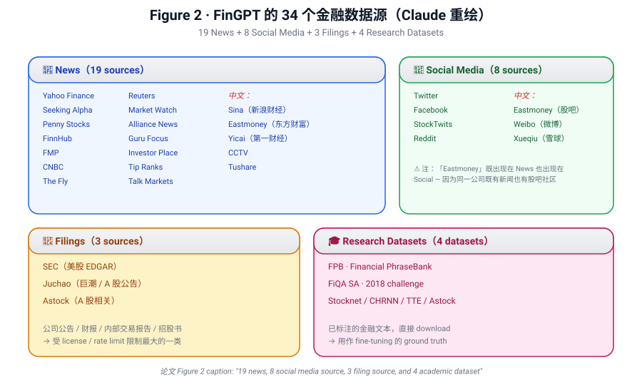

[← 上一节](03-framework.md) ｜ [返回论文 README](../README.md) ｜ [下一节 →](05-lightweight-adaptation.md)

# 04 · Democratizing Internet-scale Financial Data（数据工程，全节）

> **来源**：arXiv 2307.10485v2, §4.1–§4.6, p5–p7（含 Figure 2）
>
> **一句话定位**：这一节是论文最长、信息密度最高、也是最体力活的一节。**整个 §4 是 Figure 1 中"数据源层 + 数据策划层"的展开**，分 6 小节讲：数据从哪来 / 怎么取 / 怎么实时更新 / 怎么洗 / 怎么过滤 / 怎么 tokenize。

---

## 📌 预览

§4 的 6 小节构成一条**数据流水线**：

```
4.1 Data Sources              ── 哪些网站 / 数据集    （19+8+3+4 = 34 个）
        ↓
4.2 Data Interface            ── 怎么从代码里拿这些数据（date_range / streaming）
        ↓
4.3 Real-Time Curation Pipe   ── 实时拉数据的整体逻辑
        ↓
4.4 Data Cleaning             ── 4 步：去多余空白 / URL / 怪字符 / 长词
        ↓
4.5 Document Filtering        ── 5 类：长度 / 特殊字符 / 重复 / 困惑度 / 去重
        ↓
4.6 Tokenization              ── 用 HuggingFace tokenizer
```

🎯 **本节的训练目标**：
- 能脱口而出 4 类数据源的种类和数量
- 能解释为什么需要 cleaning + filtering 两层
- 能至少背 5 种 filtering 策略的名字

---

## 📄 §4.1 · Financial Data Sources（4 类数据源 × 34 个）

> **原文**：
>
> "Financial data comes from a variety of sources. Fig. 2 summarizes the various data sources supported in FinGPT. We delve into the specifics of different financial data sources:
>
> • **Financial news**: News is one critical financial data source since news is an official and direct channel for information release. ... We have included all of the mainstream news sources available online, such as Yahoo, Seeking Alpha, FinnHub, FMP, Eastmoney, Yicai, CCTV, Tushare, etc.
>
> • **Social media discussions**: ... Platforms such as Twitter, Facebook, Reddit, Weibo, and others...
>
> • **Company filings**: Websites of financial regulatory authorities, such as the SEC in the United States, offer access to company filings. ...
>
> • **Research datasets**: ... We include Stocknet, CHRNN, TTE, Astock, FiQA SA, and FPB."

🧠 **Figure 2 · 34 个数据源全集**（论文原图是各家网站 / 平台 logo 拼图。**本仓库 sandbox 没法直接下载论文 PDF 二进制，所以下面这张是 Claude 按论文描述用 SVG 重绘的版本**，按 4 类 + 中英分组排版，比原图更易读）：



> Figure 2（重绘）: FinGPT 的 34 个金融数据源，按 News / Social Media / Filings / Research Datasets 4 类分组。中文源单独标记。

也可以用文字版速查表对照（论文 Figure 2 没有这种结构化对应，是 Claude 整理的）：

| 类别 | 数量 | 数据源（按论文 Figure 2 列示） |
|---|---|---|
| **News（新闻）** | 19 | Sina（新浪财经）, Eastmoney（东方财富）, Yicai（第一财经）, CCTV, Tushare, FinnHub, CNBC, The Fly, Talk Markets, Yahoo Finance, Seeking Alpha, Penny Stocks, FMP（Financial Modeling Prep）, Reuters, Market Watch, Alliance News, Guru Focus, Investor Place, Tip Ranks |
| **Social Media（社交）** | 8 | Twitter, Facebook, StockTwits, Eastmoney（雪球同名平台）, Reddit, Weibo（微博）, Xueqiu（雪球） |
| **Filings（公告）** | 3 | SEC（美股）, Juchao（巨潮 / A 股公告平台）, Astock（A 股相关） |
| **Research Datasets（学术数据集）** | 4 | Stocknet, CHRNN, TTE, FiQA SA, FPB |

> 论文 Figure 2 caption 明说「19 news + 8 social + 3 filing + 4 academic = 34」，但具体列表里数量不太对得上（社交 7-8 个、研究数据集 5 个）—— 这是论文的小瑕疵，不必纠结。**记住"34 = 4 类的总和"**就够。

⚠️ **小白容易踩的坑**：
- **Eastmoney 出现两次**：一次在 News，一次在 Social Media。这是因为东方财富既有新闻频道，也有股吧（社区讨论）。**FinGPT 把它们当成两个独立数据源**。
- **Xueqiu（雪球）和 StockTwits 是中外对应的散户社区**：一个中文一个英文。这是 FinGPT 的"中英双覆盖"暗线。
- **SEC + Juchao 双覆盖** = 美股 + A 股的公司披露。
- **Research Datasets 里这 5 个的角色**：
  - **FPB (Financial PhraseBank)**: 4845 句金融新闻，3 分类情绪标签（pos/neg/neutral）→ FinGPT 用来训情绪
  - **FiQA SA**: 2018 challenge 数据集，金融新闻 + 微博头条情绪
  - **Stocknet**: tweets + 价格数据，预测涨跌
  - **CHRNN / TTE / Astock**: 中文金融文本数据集

🔥 **关键洞察**：FinGPT 的"数据源" = **"实时新闻 + 社交" (要自己 crawl) + "现成数据集" (research datasets, 直接 download)**。后者是固定的，前者是流式的。**两类数据的处理方式完全不同**，但论文把它们打包成一个"统一接口"。

---

## 📄 §4.2 · Data Interface（统一接口）

> **原文**：
>
> "We provide unified access to various data sources. FinGPT supports two types of data interfaces:
>
> • **Date range**: The input contains parameters start_date and start_date, and the interface can return the data in this specified date range.
>
> • **Streaming**: The input parameter pages determines the specific pages of the latest content to be returned. Users can utilize this interface to acquire real-time data."

💡 **两种接口的取舍**：

| 接口 | 用途 | 适合 |
|---|---|---|
| **date_range** | 按时间窗口取历史数据 | 训练数据 / 回测 |
| **streaming** | 取最新的 N 页 | 推理时拿实时输入 |

⚠️ **论文有个 typo**：原文写 `start_date and start_date`（两个 start，第二个应该是 `end_date`）。这是论文小 bug，不必当真。

🧠 **「不是所有数据源都支持两种接口」** —— 比如：
- SEC 公告：只有 streaming（按发布时间）
- FPB 数据集：只有 date_range（静态）
- Twitter API：两种都有（但要 token）

⚠️ **批判性思考**：「unified API」听起来很美，但**接口统一不等于数据可用性统一**：
- 推特 / Reddit 现在收钱了（2023 后期）
- 微博 / 雪球有反爬虫
- SEC EDGAR 是免费的，但有 rate limit
- **「34 数据源」中可能 1/3 在论文发表 1 年后就不再可用**

这是 FinGPT 长期价值的真正风险点 —— **数据源会衰减**。

---

## 📄 §4.3 · Automated Real-Time Data Curation Pipeline（实时管线）

> **原文**：
>
> "Financial markets operate in real-time and are highly sensitive to news and sentiment. Prices of securities can change rapidly in response to new information, and delays in processing that information can result in missed opportunities or increased risk. As a result, an automated real-time data curation pipeline is essential in training or fine-tuning LLMs. FinGPT enables the following pipeline to supply high-quality data for training LLMs."

💡 **§4.3 是个"过场段"**：它没具体描述管线长什么样，只是**在转入 §4.4–§4.6 前做一个 motivation**。读这一段时不用花太多时间。

🧠 **但「real-time」这个词值得反思**：
- **论文里的 real-time**：每分钟 / 每小时拉一次新数据
- **实际交易里的 real-time**：毫秒级 (HFT)
- **FinGPT 的 real-time**适合的是**情绪 / 新闻驱动的中低频策略**（持仓数小时到数天），不适合高频。

⚠️ **小白别误读**：FinGPT 的"实时"对**日内信号**勉强够用，对**毫秒级套利**完全不够用。**大多数论文 demo 里的 "real-time" 都是分钟级到小时级**，而非真正的实时。

---

## 📄 §4.4 · Data Cleaning（4 步清洗）

> **原文**：
>
> "We provide a detailed description of the steps involved in removing non-natural language components from the documents:
>
> • **Standardizing white spaces** ... removing extra spaces, tabs, and line breaks ...
> • **Removing URL links** ... reducing noise and maintaining the integrity of the data ...
> • **Eliminating uncommon characters** ... unusual or uncommon characters that can hinder the analysis ...
> • **Filtering out excessively long words** ... very long words can be uncommon and not needed in natural language generalization."

🧠 **4 步速记**：「**白、链、字、词**」（白空格 / URL链接 / 怪字符 / 长词）

| 步骤 | 处理对象 | 为什么必须做 |
|---|---|---|
| 1. 白 | `\t \t \n   ` 等多余空白 | 节省 token，避免噪声 token 占用窗口 |
| 2. 链 | URL / 超链接 | URL 是无意义的 noise，浪费 token |
| 3. 字 | 怪字符（emoji / 控制符 / 乱码） | 影响 tokenizer，可能引入 OOV |
| 4. 词 | 异常长的词（>30 字符） | 通常是 base64 / 哈希 / hex，没语义 |

⚠️ **小白别误读**：这些操作**会丢信息**：
- emoji 在社交媒体上有情绪信号（🔥 / 📉 / 💰 都有金融语义）
- URL 中包含的链接来源（cnbc.com vs reddit.com）也是信息
- "filter out long words" 可能误删某些正常的复合词

**FinGPT 的清洗是「为了 LLM 训练简洁」而牺牲一些 social media 特有信号**。这个 trade-off 论文没讨论。

🤔 **可以追问的点**：FinGPT 在 social media 数据上是不是丢了 emoji 的情绪信号？这是个**潜在改进方向**。

---

## 📄 §4.5 · Document Filtering（5 类过滤）

> **原文**：
>
> "After completing the cleaning process, selecting high-quality documents is a crucial step for training LLMs. Following [43], we design multiple filtering strategies for selecting financial documents:
>
> • **Filtering out excessively short or overly long documents** ...
> • **Eliminating documents with an abundance of special characters** ...
> • **Removing documents with significant word and sentence repetitions** ... We analyze the document by calculating n-gram frequencies.
> • **Filtering documents with low perplexity scores and language identification prediction scores** ... We obtain perplexity scores following [44] and use fastText [45] to obtain the language identification prediction scores.
> • **Deduplication** ... identifying and removing identical or highly similar documents."

🧠 **5 类速记**：「**长、特、重、惑、复**」

| 步骤 | 准则 | 工程实现 |
|---|---|---|
| 1. **长**（length） | 太短 → 没内容；太长 → 噪声 | 阈值过滤 |
| 2. **特**（special chars） | 大量特殊字符 → 不是自然语言 | 计 ratio |
| 3. **重**（repetition） | 重复词 / 重复句 | n-gram 频率 |
| 4. **惑**（perplexity） | 困惑度低 + langID 不准 → 质量差 | KenLM perplexity, fastText langID |
| 5. **复**（dedup） | 相同 / 高度相似的 doc | hashing / MinHash |

💡 **「Following [43]」**：这是引用 BLOOM 训练管线 (Laurençon et al. 2022)。FinGPT 没自创清洗策略，而是**采用 BLOOM 团队建立的标准开源 pipeline**。这是个聪明的工程决策：**避免重新造轮子，复用业界已验证的方法**。

⚠️ **「Filtering documents with low perplexity scores」是个 confusing 的表达**：
- 直觉：困惑度**低** = 文本"更顺"
- 论文表达：filter out **low** perplexity → 难道"顺的文本"反而要过滤？

**正确解读**：BLOOM 的 filtering 是把**困惑度极低或极高的两端**都过滤 —— 极低意味着模板化 / 重复内容（spam / 自动生成），极高意味着乱码。论文这里写得 sloppy，应该写 "filter low or high"。

🧠 **5 类过滤的设计哲学**：
- 1-3 是 **形态层** 过滤（看长度、字符、重复）
- 4 是 **语言模型层** 过滤（看 LLM 觉得这段文本怎么样）
- 5 是 **集合层** 过滤（去重）

**3 层正交，从粗到细**。这是数据预处理的经典设计模式，**未来读 LLM pretraining 论文（Llama / Phi / Qwen）会反复看到类似结构**。

---

## 📄 §4.6 · Tokenization（分词）

> **原文**：
>
> "Tokenization allows the text to be divided into smaller units or tokens. We use the pre-trained tokenizer provided in HuggingFace at https://huggingface.co/docs/transformers/main_classes/tokenizer."

💡 **§4.6 极短 —— 一句话**：用 HuggingFace 的 pre-trained tokenizer，不自己训。

🧠 **为什么不自己训 tokenizer？** 因为 FinGPT 的策略是**"加在现成 LLM 上微调"**，所以必须用底座 LLM 自己的 tokenizer。如果你自己训一个，token 词表对不上，没法和 base model 对齐。

⚠️ **批判性思考**：金融文本里有大量股票代码（$AAPL）、价格（$1.23B）、百分比（+2.5%）等，**通用 tokenizer 切这些会比较碎**（$AAPL 可能切成 `$`, `A`, `AP`, `L`），损失信息。如果训一个金融专用的 BPE tokenizer，会更高效。

但 FinGPT 没做 —— **因为这与"用现成 LLM"的设计哲学冲突**。这是 FinGPT 路线的一个隐性代价。

---

## 💡 Section 总结

### 核心信息速查

| 维度 | 内容 |
|---|---|
| 4 类数据源 | News (19) + Social Media (8) + Filings (3) + Research Datasets (4) = 34 |
| 接口 | date_range（取历史） + streaming（取实时） |
| 清洗 4 步 | 白 / 链 / 字 / 词 |
| 过滤 5 类 | 长 / 特 / 重 / 惑 / 复 |
| Tokenization | 用 HuggingFace pre-trained tokenizer，不自己训 |
| 借鉴的清洗管线 | BLOOM / Laurençon et al. 2022 [43] |

### 核心洞察

1. **数据源的"中英双覆盖"是 FinGPT 的隐性卖点**：东方财富 / 雪球 / Weibo / 巨潮 + Yahoo / SEC / Reddit / Twitter，让它在中美两个市场都能用。这是相对 BloombergGPT（主英文）的优势。

2. **Cleaning（4 步）vs Filtering（5 类）的区别**：
   - Cleaning 是**逐 doc 内部修整**（去 URL、白空格）
   - Filtering 是**全集中删除**（这个 doc 整篇不要）
   - 顺序：先 clean 再 filter
   - **这是数据预处理的标准流水线，今后看任何 LLM 论文 §3 / §4 都能套用这个区分**

3. **「34 数据源」的真正风险是衰减**：API 收钱、网站改版、被反爬、license 变化都会让数据源失效。**论文没承认这一点** —— 数据 framework 的"半衰期"通常 1-2 年。

4. **\$262 微调成本不包括「数据收集 / 清洗的工程时间」**：写 34 个 crawler + 跑 5 类 filter 的人力是巨大的隐性成本。FinGPT 把这部分摊到"开源仓库"上，让社区贡献，但**新用户接手时仍要付出 ramp-up cost**。

5. **§4 是论文最有"工程感"的一节，也是最容易被忽视的一节**。它没炫技、没新算法，但**这是 FinGPT 真正的 contribution 所在**。论文标题里 "data-centric" 不是空喊，是 §4 的实操承诺。

---

## 🤔 我的 Follow-up 问题

1. **「34 个数据源」是否到 2026 年都还能用？** → 去 GitHub 仓库 issue 区看
2. **FinGPT 的清洗代码和 BLOOM [43] 完全一样吗？** → 看 GitHub `FinNLP` 仓库
3. **针对中文金融文本，Tokenizer 的损失有多大？** → 没数据，需要自己测
4. **金融数据的 `low SNR` 到底有多低？1%? 10%?** → 论文没量化
5. **34 个数据源里哪些有 license 风险（不能商用）？** → 论文没提，但实际部署很关键

---

## 🔥 拷打记录

_(待开始 — 等 Ricardo 读完此节后由 Claude 出 2~3 题做拷打)_

---

[← 上一节](03-framework.md) ｜ [返回论文 README](../README.md) ｜ [下一节 →](05-lightweight-adaptation.md)
