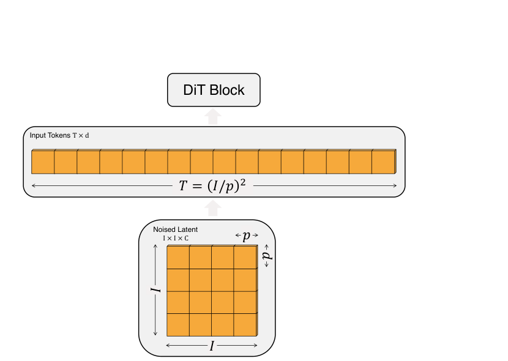
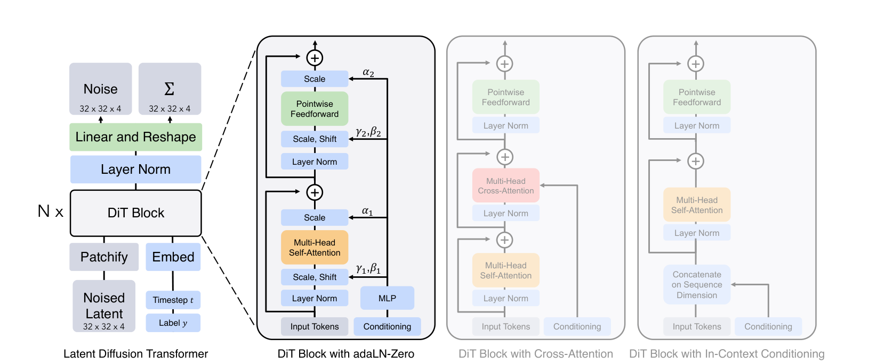

[← 返回主页](../README.md)

# §3 Diffusion Transformers（方法核心）

## §3.1 Preliminaries（扩散基础速过）

### 扩散公式

> 前向加噪过程：`q(x_t|x_0) = N(x_t; √ᾱ_t·x_0, (1−ᾱ_t)I)`，常数 ᾱ_t 是超参。
> 重参数化采样：`x_t = √ᾱ_t·x_0 + √(1−ᾱ_t)·ε_t`，其中 `ε_t ~ N(0,I)`。

**翻译**：高斯扩散假设一个前向加噪过程，逐步把噪声加到真实数据 x₀ 上。

> 反向过程：神经网络预测 `p_θ(x_{t−1}|x_t) = N(μ_θ(x_t), Σ_θ(x_t))`。

训练目标：把 μ_θ 重参数化成**噪声预测网络 ε_θ**，用简单 MSE 训练：

> `L_simple(θ) = ||ε_θ(x_t) − ε_t||²`

**翻译**：模型学着把前向加的噪声预测出来，用预测噪声和真噪声的均方误差训练。**额外要学协方差 Σ_θ 时，才需要优化完整的 KL 项**（follow Nichol & Dhariwal：ε_θ 用 L_simple 训，Σ_θ 用完整 L 训）。

### Classifier-free guidance（CFG）

> 条件扩散吃额外信息（如 class label c）。CFG 引导采样朝"使 logp(c|x) 高"的方向走：
> `ε̂_θ(x_t,c) = ε_θ(x_t,∅) + s·(ε_θ(x_t,c) − ε_θ(x_t,∅))`，s > 1 是 guidance scale。

**翻译**：训练时随机把条件 c 丢掉、换成可学的"null" embedding ∅。采样时用上式放大"有条件 vs 无条件"的差，**显著提升样本质量**（s=1 退化成普通采样）。DiT 也吃这套，结果里的 `-G` 就是用了 CFG。

### Latent diffusion models（LDM）

> "Training diffusion models directly in high-resolution pixel space can be computationally prohibitive. LDMs tackle this with a two-stage approach: (1) learn an autoencoder that compresses images into smaller spatial representations with a learned encoder E; (2) train a diffusion model of representations z = E(x) instead of a diffusion model of images x (E is frozen)."

**翻译**：直接在高分辨率像素空间训扩散太贵。LDM 两阶段：①学一个 autoencoder 把图压成更小的空间表示（encoder E）；②在表示 `z=E(x)` 上训扩散（**E 冻结**）。生成时从扩散模型采 z，再用 decoder 解回图 `x=D(z)`。

> 🔑 DiT 应用在 latent space（虽然原理上也能直接用在像素空间）。所以整条 pipeline 是**混合式**：现成的卷积 VAE + Transformer DDPM。

---

## §3.2 Diffusion Transformer Design Space（设计空间，重点）

> "We aim to be as faithful to the standard transformer architecture as possible to retain its scaling properties... DiT is based on the Vision Transformer (ViT) architecture which operates on sequences of patches."

**翻译**：尽量忠于标准 Transformer 以保留 scaling 性质，DiT 基于 ViT（在 patch 序列上操作）。

### Patchify（切块）

> "The input to DiT is a spatial representation z (for 256×256×3 images, z has shape 32×32×4). The first layer of DiT is 'patchify,' which converts the spatial input into a sequence of T tokens, each of dimension d, by linearly embedding each patch in the input. Following patchify, we apply standard ViT frequency-based positional embeddings (the sine-cosine version) to all input tokens."

**翻译**：DiT 输入是空间表示 z（256 图 → z 是 `32×32×4`）。第一层 **patchify** 把空间输入切成 **T 个 token**（每个 d 维），靠线性嵌入每个 patch。之后加标准 ViT 的正弦-余弦位置编码。

> 🔑 **关键机制（Figure 4）**：token 数 `T = (I/p)²`，由 patch size `p` 决定。
> - `p` 减半 → T 翻 4 倍 → transformer Gflops 至少翻 4 倍。
> - **改 `p` 对下游参数量几乎无影响** —— 只改算力。
> - 设计空间：`p ∈ {2, 4, 8}`。

### DiT block design（4 种条件注入，全文核心 ablation）

扩散模型除了吃噪声图，还要吃条件（timestep `t`、class label `c` 等）。**怎么把条件喂进 transformer block？** 试了 4 种（图 3 右半）：

**① In-context conditioning（上下文）**
> "We simply append the vector embeddings of t and c as two additional tokens in the input sequence, treating them no differently from the image tokens. This is similar to cls tokens in ViTs... After the final block, we remove the conditioning tokens."

把 t、c 当 2 个额外 token 拼进序列（像 ViT 的 cls token），最后一层后移除。**几乎不增 Gflops，但效果最差。**

**② Cross-attention block（交叉注意力）**
> "We concatenate the embeddings of t and c into a length-two sequence... The transformer block is modified to include an additional multi-head cross-attention layer following the multi-head self-attention block."

t、c 拼成长度 2 的序列，block 里在 self-attention 后加一层 cross-attention 去 attend 它们（类似 Vaswani 原始设计 / LDM 的 class 条件）。**加最多 Gflops（约 +15% 开销）。**

**③ Adaptive layer norm (adaLN)**
> "Rather than directly learn dimension-wise scale and shift parameters γ and β, we regress them from the sum of the embedding vectors of t and c. Of the three block designs we explore, adaLN adds the least Gflops and is thus the most compute-efficient. It is also the only conditioning mechanism that is restricted to apply the same function to all tokens."

不直接学 LayerNorm 的 scale γ / shift β，而是**从 t+c 的 embedding 之和回归出 γ、β**。加 Gflops 最少（最省）。**唯一一个"对所有 token 施加相同函数"的机制。**

**④ adaLN-Zero（招牌设计）⭐**
> "Prior work on ResNets has found that initializing each residual block as the identity function is beneficial... We explore a modification of the adaLN DiT block which does the same. In addition to regressing γ and β, we also regress dimension-wise scaling parameters α that are applied immediately prior to any residual connections within the DiT block. We initialize the MLP to output the zero-vector for all α; this initializes the full DiT block as the identity function."

在 adaLN 基础上，**额外回归一个 scale 参数 α**，加在每个残差连接前；并把回归 α 的 MLP **初始化成输出 0** → 整个 DiT block 初始等于**恒等函数**。灵感来自 ResNet 的"零初始化最后一层加速大规模训练"（Goyal 等）。**加的 Gflops 可忽略，效果最好。**

> 图 3 中间 block 里：self-attention 前有 `γ₁,β₁`（scale+shift）和 `α₁`（残差前 scale）；FFN 前有 `γ₂,β₂` 和 `α₂`。全从条件回归，α 初始化 0。

### Model size（模型尺寸）

> "we use four configs: DiT-S, DiT-B, DiT-L and DiT-XL. They cover a wide range of model sizes and flop allocations, from 0.3 to 118.6 Gflops."

跟随 ViT 配置，联合 scale 层数 N / 隐藏维度 d / 注意力头数：

| Model | Layers N | Hidden d | Heads | Gflops (I=32, p=4) |
|---|---|---|---|---|
| DiT-S | 12 | 384 | 6 | 1.4 |
| DiT-B | 12 | 768 | 12 | 5.6 |
| DiT-L | 24 | 1024 | 16 | 19.7 |
| DiT-XL | 28 | 1152 | 16 | 29.1 |

### Transformer decoder（输出头）

> "After the final DiT block, we need to decode our sequence of image tokens into an output noise prediction and an output diagonal covariance prediction... We use a standard linear decoder... linearly decode each token into a p×p×2C tensor... Finally, we rearrange the decoded tokens into their original spatial layout."

**翻译**：最后一个 DiT block 后，用标准线性 decoder（先 LayerNorm，adaLN 时是自适应的）把每个 token 解码成 `p×p×2C` 张量（2C 是因为同时出**噪声**和**协方差**），再重排回原始空间布局。

> **完整 DiT 设计空间 = patch size + block 架构 + 模型尺寸。**

---

## 💡 §3 批注

- **adaLN-Zero 为什么 work**：恒等初始化让训练初期梯度信号干净，残差路径主导，训练稳定（论文提到训练全程稳定、不需要 lr warmup、没出现 transformer 常见的 loss spike）。这是个非常"工程审美"的设计 —— 极简、零成本、却是性能关键。
- **对我 VLA-WM 调研的直接关联**：我读过的 action 注入方式，本质都在这 4 条路里选 —— 比如很多 AC-WM 用 **cross-attention 注入 action**（Ctrl-World 的 frame-level cross-attention 就是这条），有的用 **adaLN 风格调制**。理解了 DiT 这张图，就理解了"条件/action 注入"的母版谱系。
- **patchify 旋钮 `p`** 在视频 WM 里同样关键 —— 视频是 3D（时空）token，token 数爆炸，所以视频 DiT 怎么切 patch（spatial + temporal patch size）直接决定算力可行性。

---

[← §1 Introduction](01-introduction.md) | [§4-5 Experiments & Conclusion →](04-experiments.md)
