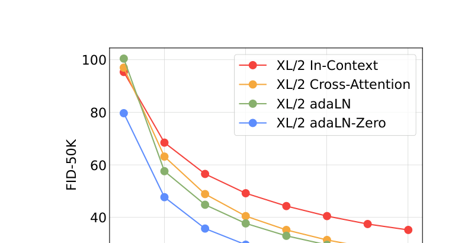
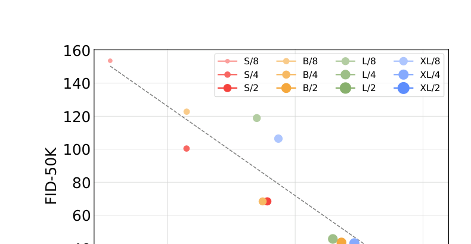

[← 返回主页](../README.md)

# §4 Experimental Setup + §5 Experiments + §6 Conclusion

## §4 Experimental Setup（训练配置）

> "Our models are named according to their configs and latent patch sizes p; for example, DiT-XL/2 refers to the XLarge config and p=2."

**命名规则**：`DiT-XL/2` = XLarge 配置 + patch size 2。

**训练**：
- ImageNet，256×256 和 512×512，class-conditional。
- 最后一层线性层零初始化，其余用 ViT 标准初始化。
- AdamW，**恒定 lr 1e-4，无 weight decay，batch size 256**。
- 唯一数据增强：水平翻转。
- **不需要 lr warmup、不需要正则化** —— 训练全程高度稳定，没出现 transformer 常见的 loss spike。
- 维护 EMA（decay 0.9999），所有结果用 EMA 模型。
- **所有尺寸/patch size 共用同一套超参，几乎全继承自 ADM，没调 lr / decay / warmup / Adam β**。

**扩散**：用 Stable Diffusion 的现成预训练 VAE（下采样 8 倍，256 图 → `32×32×4` latent）。扩散超参继承 ADM。

**评估**：主指标 **FID-50K**（250 步 DDPM 采样），用 ADM 的 TensorFlow 评估套件保证可比。次要指标 IS / sFID / Precision / Recall。**除非注明，FID 不用 CFG。**

**算力**：JAX 实现，TPU-v3 pod 训练。DiT-XL/2 在 TPU v3-256 上约 5.7 iter/s。

---

## §5 Experiments

### §5.1 DiT block design（条件注入 ablation）

训 4 个最高 Gflops 的 DiT-XL/2，各用一种 block 设计，看 FID 随训练变化（Figure 5）：

> "The adaLN-Zero block yields lower FID than both cross-attention and in-context conditioning while being the most compute-efficient. At 400K training iterations, the FID achieved with the adaLN-Zero model is nearly half that of the in-context model... adaLN-Zero, which initializes each DiT block as the identity function, significantly outperforms vanilla adaLN. For the rest of the paper, all models will use adaLN-Zero DiT blocks."

🔥 **翻译**：**adaLN-Zero 既最好又最省 Gflops**。400K 步时它的 FID 几乎只有 in-context 的一半 → **条件注入机制对质量至关重要**。恒等初始化（adaLN-Zero）显著超过普通 adaLN → **初始化也很重要**。后续全用 adaLN-Zero。

### Scaling model size and patch size（核心 scaling 实验）

训 12 个 DiT（S/B/L/XL × p=2/4/8），看 FID：

> "Across all four configs, significant improvements in FID are obtained over all stages of training by scaling the transformer depth/width. Similarly, holding model size constant, increasing the number of tokens (decreasing patch size) yields large FID improvements throughout training."

**翻译**：① 固定 patch size，加大模型（depth/width）→ FID 大幅改善；② 固定模型尺寸，增加 token 数（减小 patch）→ FID 大幅改善。**两条路都灵。**

> "Transformer Gflops are strongly correlated with FID... model Gflops seem to be the key to improved performance."

🔥🔥 **翻译（核心结论）**：**Transformer Gflops 和 FID 强相关（-0.93）**。同参数量但不同 Gflops（不同 token 数）的模型，FID 差很多 → **Gflops（不是参数量）才是性能关键**。

> "DiT Gflops are critical to improving performance. The results of Figure 8 suggest that parameter counts do not uniquely determine the quality of a DiT model. As model size is held constant and patch size is decreased, the transformer's total parameters are effectively unchanged (actually, total parameters slightly decrease), and only Gflops are increased."

**翻译**：参数量不能唯一决定 DiT 质量 —— 固定模型、减小 patch 时参数量几乎不变（甚至略降），**只有 Gflops 增加，FID 却显著改善**。

### §5.2 Scaling model vs. sampling compute（模型算力 vs 采样算力）

> "Consider DiT-L/2 using 1000 sampling steps versus DiT-XL/2 using 128 steps. In this case, L/2 uses 80.7 Tflops to sample each image; XL/2 uses 5× less compute—15.2 Tflops... Nonetheless, XL/2 has the better FID-10K (23.7 vs 25.9). In general, scaling-up sampling compute cannot compensate for a lack of model compute."

🔥 **翻译**：DiT-L/2 用 1000 步采样（每图 80.7 Tflops）vs DiT-XL/2 用 128 步（每图 15.2 Tflops，省 5 倍算力）—— **XL/2 的 FID 反而更好（23.7 vs 25.9）**。结论：**加大采样算力补不上模型算力的不足。** 小模型多采样几步也追不上大模型。

### State-of-the-Art 结果

**Table 2 — ImageNet 256×256**：

| Model | FID↓ | IS↑ |
|---|---|---|
| StyleGAN-XL | 2.30 | 265.12 |
| LDM-4-G (cfg=1.50) | 3.60 | 247.67 |
| ADM-G, ADM-U | 3.94 | 215.84 |
| **DiT-XL/2-G (cfg=1.50)** | **2.27** | **278.24** |

**Table 3 — ImageNet 512×512**：

| Model | FID↓ |
|---|---|
| ADM-G, ADM-U | 3.85 |
| StyleGAN-XL | 2.41 |
| **DiT-XL/2-G (cfg=1.50)** | **3.04** |

> "Our method achieves the lowest FID of all prior generative models, including the previous state-of-the-art StyleGAN-XL... DiT-XL/2 achieves higher recall values at all tested classifier-free guidance scales compared to LDM-4 and LDM-8."

**翻译**：DiT-XL/2 在两个分辨率都拿 SOTA FID，且 recall 全面高于 LDM（生成多样性更好）。512 上只用 **524.6 Gflops**，而 ADM-U 用 **2813 Gflops** —— **又好又省**。即使只训 2.35M 步（和 ADM 相当），XL/2 的 FID 2.55 也已超过所有此前扩散模型。

---

## §6 Conclusion

> "We introduce Diffusion Transformers (DiTs), a simple transformer-based backbone for diffusion models that outperforms prior U-Net models and inherits the excellent scaling properties of the transformer model class. Given the promising scaling results in this paper, future work should continue to scale DiTs to larger models and token counts. DiT could also be explored as a drop-in backbone for text-to-image models like DALL·E 2 and Stable Diffusion."

**翻译**：提出 DiT —— 一个简单的、基于 Transformer 的扩散模型 backbone，超过此前 U-Net 模型，并继承 Transformer 的优秀 scaling 性质。未来应继续把 DiT scale 到更大模型和更多 token，也可探索把 DiT 当文生图模型（DALL·E 2 / Stable Diffusion）的即插即用 backbone。

> 致谢里点名感谢 **Kaiming He**（何恺明）等人。

---

## 💡 §4-6 整段批注

- **"加模型算力 > 加采样算力"** 这条结论很反直觉但很重要：它给后来的"无脑 scale backbone"路线（→ Sora）背书 —— 与其在采样上做花活，不如把骨架做大。
- 训练**极其稳定、几乎不调参**（共用 ADM 超参、无 warmup、无 weight decay）—— 这本身就是"Transformer 比 U-Net 更省心"的证据，也是论文"做减法"品味的体现。
- **结论里那句"drop-in backbone for text-to-image / DALL·E 2 / Stable Diffusion"**，一年内就应验了：Stable Diffusion 3、PixArt、Sora 全是 DiT 系。一作 Peebles 去 OpenAI 做 Sora，等于把这句话做成了视频版。
- **对我研究方向的意义**：DiT → 视频 DiT → 世界模型 是一条清晰主线。我 VLA-WM 调研里的 Wan2.2（Uni-WAM 计划用的 backbone）就是 DiT 后代。读透这篇 = 理解我所有研究对象的"母架构"。

---

[← §3 Method](03-method.md) | [返回主页 →](../README.md)
