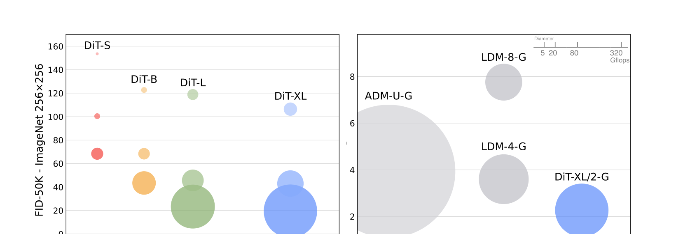

[← 返回 DiT 主页](../README.md)

# 🌟 DiT 串讲速读（5 张图过全文）

> 一句话：**DiT = 把扩散模型里"默认的 U-Net backbone"换成纯 Transformer（ViT 风格），并证明它和 Transformer 一样"越大越好"（Gflops ↔ FID 强相关），最终在 ImageNet 上拿下 SOTA。**
>
> 它要回答的核心问题：**扩散模型一定要用 U-Net 吗？U-Net 的归纳偏置（inductive bias）到底重不重要？**
> 答案：**不重要。换成标准 Transformer 照样能 work，而且 scaling 性质更好。**

这篇是谢赛宁的代表作之一（一作 William Peebles，Peebles 后来去了 OpenAI 主导 Sora）。**几乎所有现代视频生成 / 世界模型的 backbone 都是 DiT 的后代**（Wan、CogVideoX、Cosmos、Stable Diffusion 3 全是 DiT 系），所以读懂这篇 = 读懂我们 VLA-WM 调研里所有模型的"地基"。

---

## 📍 图 1：DiT 在 scaling 上完胜 U-Net（动机图）

**Figure 2** 是全文的"成绩单"，两张气泡图（气泡面积 = 模型 Gflops）：

- **左**：四个 DiT 尺寸（S < B < L < XL）在 400K 训练步时的 FID-50K。**模型 flops 越大，FID 越低（越好），单调下降。**
- **右**：最好的 **DiT-XL/2** 和此前所有 U-Net 扩散模型（ADM / LDM）比 —— **DiT-XL/2 又好又省**（Gflops 比 ADM 小一个量级，FID 反而更低）。

> 原文：*"DiTs with higher Gflops—through increased transformer depth/width or increased number of input tokens—consistently have lower FID."*
> 翻译：Gflops 更高的 DiT（靠增加 transformer 深度/宽度，或增加输入 token 数）一致地有更低的 FID。

**这就是全文的论点**：扩散模型的 backbone 可以、而且应该"Transformer 化"，从而继承 Transformer 的可扩展性。

---

## 📍 图 2：DiT 架构全景（最核心的一张图）

**Figure 3** 是必须刻进脑子的图。分左右两半：

### 左半：整体 pipeline（Latent Diffusion Transformer）

DiT 工作在 **latent space**（不是像素空间），沿用 LDM 的两阶段思路：

1. 一张 256×256×3 的图，先用**冻结的 VAE encoder** 压成 `32×32×4` 的 latent（下采样 8 倍）。
2. **Patchify**：把这个 latent 切成 patch，线性嵌入成一串 token（详见图 3）。
3. 过 **N 个 DiT Block**（同时吃进条件：timestep `t` + class label `y`）。
4. **Linear and Reshape**：最后一层把 token 解码回空间布局，输出两个东西 —— 预测的**噪声 Noise** (`32×32×4`) + 预测的**协方差 Σ** (`32×32×4`)。
5. 采样出新 latent 后，用 **VAE decoder** 解回像素图。

> 关键：**DiT 本身不碰像素，只在 VAE 的 latent 空间里做去噪。** 这让它计算高效（这也是它能 scale 的前提）。

### 右半：四种 DiT Block 变体（怎么把条件 t/y 喂进去）

这是论文的核心 ablation —— **条件信息（timestep + class label）怎么注入 Transformer block？** 试了 4 种：

| 变体 | 做法 | 结论 |
|---|---|---|
| **In-Context** | 把 t、c 的 embedding 当成 2 个额外 token 拼到序列里（像 ViT 的 cls token）| 最简单，但效果最差 |
| **Cross-Attention** | t、c 拼成长度 2 的序列，block 里加一层 multi-head cross-attention 去 attend 它们 | 效果中等，但 **+15% Gflops**（最贵）|
| **adaLN**（adaptive LayerNorm）| 不直接学 LayerNorm 的 scale γ / shift β，而是**从 t+c 的 embedding 回归出 γ、β** | 加的 Gflops 最少（最省），效果好 |
| **adaLN-Zero** ⭐ | 在 adaLN 基础上，额外回归一个 scale 参数 **α**，加在每个残差连接前；并把它**初始化成 0** → 让每个 DiT block 初始等于恒等函数 | **最优**，全文后续都用它 |

> 🔑 **adaLN-Zero 是 DiT 的招牌设计**。图 3 中间那个 block 里能看到 `γ₁,β₁ / α₁`（self-attention 前）和 `γ₂,β₂ / α₂`（FFN 前）—— 都是从条件回归出来的，α 初始化为 0。
>
> 原文：*"adaLN-Zero, which initializes each DiT block as the identity function, significantly outperforms vanilla adaLN."*
> 翻译：把每个 DiT block 初始化成恒等函数的 adaLN-Zero，显著超过普通 adaLN。

---

## 📍 图 3：Patchify —— patch size `p` 是 scaling 的关键旋钮

**Figure 4** 解释 patchify：把 `I×I×C` 的 latent（图里 I=32）按 `p×p` 切块，得到 `T = (I/p)²` 个 token，每个嵌入成 `d` 维。

> 🔑 **核心机制**：patch size `p` **越小 → token 数 T 越多 → Gflops 越大**。
> - `p` 减半 → T 翻 4 倍 → transformer Gflops 至少翻 4 倍。
> - 但 **改 `p` 几乎不改参数量**（只改算力和序列长度）。
>
> DiT 设计空间里 `p ∈ {2, 4, 8}`。所以 **"DiT-XL/2"** 的意思是：XL 配置 + patch size 2（最大算力）。

这就解释了为什么增加算力有两条路：① 加大模型（depth/width，即 S→B→L→XL）；② 减小 patch（即 /8→/4→/2，token 更多）。**两条路都降 FID。**

---

## 📍 图 4：adaLN-Zero 确实最好（条件注入 ablation）

**Figure 5**：四种条件注入策略在 DiT-XL/2 上的 FID 训练曲线。**蓝线（adaLN-Zero）全程最低**，红线（In-Context）最差。

> 原文：*"At 400K training iterations, the FID achieved with the adaLN-Zero model is nearly half that of the in-context model, demonstrating that the conditioning mechanism critically affects model quality."*
> 翻译：在 400K 步时，adaLN-Zero 的 FID 几乎只有 in-context 的一半 —— 说明**条件注入机制对模型质量至关重要**。

值得注意：**adaLN-Zero 既最好又最省 Gflops**（cross-attention 又贵又不如它）。这是个"白吃的午餐"，所以成了事实标准。

---

## 📍 图 5：Gflops 和 FID 强相关（scaling 的硬证据）

**Figure 8**：横轴 transformer Gflops（log），纵轴 FID-50K。12 个 DiT 模型（S/B/L/XL × p=2/4/8）几乎落在一条直线上，**相关系数 -0.93**。

> 原文：*"Transformer Gflops are strongly correlated with FID."*
> 翻译：Transformer 的 Gflops 和 FID 强相关 —— **算力是预测样本质量的好指标，参数量不是**（因为参数量没算进分辨率/token 数的影响）。

**另一个重要发现（Figure 10，未截图）**：**加大模型算力 > 加大采样算力**。小模型就算多采样几步（更多 test-time 算力）也补不上大模型的差距 —— DiT-L/2 用 1000 步采样仍输给 DiT-XL/2 用 128 步。

---

## 🏆 最终战绩（Table 2 / Table 3）

| Benchmark | 模型 | FID↓ | 此前 SOTA |
|---|---|---|---|
| **ImageNet 256×256** | DiT-XL/2-G (cfg=1.50) | **2.27** | StyleGAN-XL 2.30 / LDM-4 3.60 |
| **ImageNet 512×512** | DiT-XL/2-G (cfg=1.50) | **3.04** | ADM-G,U 3.85 |

- `-G` = 用 classifier-free guidance；`cfg` = guidance scale。
- DiT-XL/2 在 512 分辨率只用 **524.6 Gflops**，而 ADM-U 用 **2813 Gflops** —— 又好又省。

---

## 🧠 核心 takeaway（要熟记于心）

1. **U-Net 的归纳偏置对扩散模型不是必需的** —— 标准 Transformer 可直接替换。这是全文最重要的"祛魅"论断。
2. **DiT 继承了 Transformer 的 scaling law**：Gflops ↑ → FID ↓（-0.93 相关）。这给"无脑堆算力造更好生成模型"提供了第一份系统证据。
3. **adaLN-Zero** 是把条件注入 Transformer 的最优、最省方式（初始化成恒等函数 + 从条件回归 γ/β/α）。
4. **patch size `p`** 是控制算力的关键旋钮（小 p → 多 token → 高算力 → 低 FID，且不增参数）。
5. **工作在 VAE latent 空间**（LDM 框架）让它高效到能 scale。
6. **加模型算力 > 加采样算力**。

---

## 🔗 为什么这篇对我（Ricardo）特别重要

- **目标导师代表作**：谢赛宁的奠基性工作，要熟读于心、能随口讲清楚 adaLN-Zero / patchify / scaling 论点。
- **是我整个 VLA-WM 调研的"地基"**：我读的 Wan2.2 / CogVideoX / Cosmos / EA-WM 等几乎全是 DiT backbone。理解 DiT 的 patchify + adaLN-Zero + latent diffusion，等于理解了这些视频世界模型在架构层"action / 条件怎么注入"的母版（很多 action 注入就是在 adaLN 或 cross-attention 这两条路上做文章）。
- **一作去向**：William Peebles 后来主导 OpenAI Sora —— Sora 本质就是把 DiT scale 到视频。这条"DiT → 视频 DiT → 世界模型"的线，正好是我研究方向的主干。

---

## 📊 论文基本信息

- **标题**：Scalable Diffusion Models with Transformers
- **作者**：William Peebles (UC Berkeley)，**Saining Xie (NYU)**
- **arXiv**：2212.09748v2 [cs.CV]，发表于 **CVPR 2023**（Oral）
- **代码/项目页**：https://www.wpeebles.com/DiT
- **关键数字**：DiT-XL/2，ImageNet 256 FID **2.27**（SOTA），118.6 Gflops

---

[返回主页 →](../README.md)
