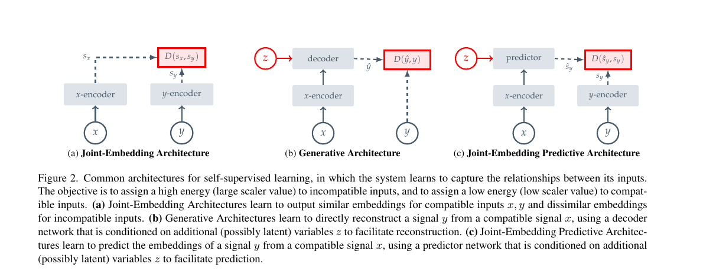
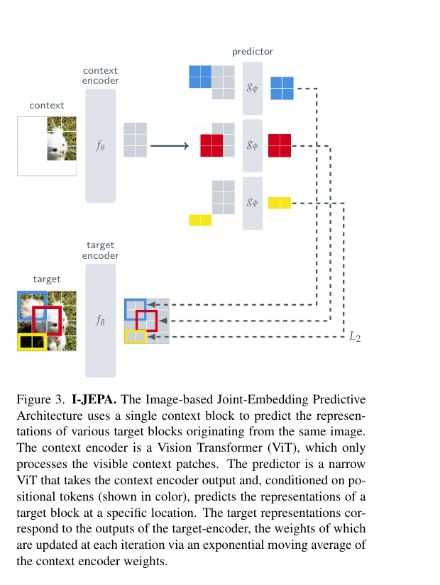
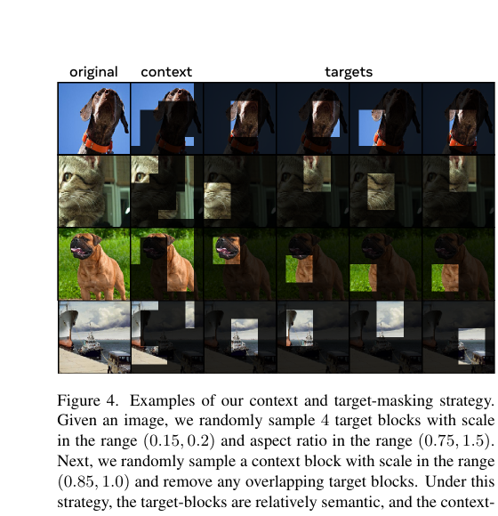

[← 返回 I-JEPA 主页](../README.md)

# 串讲 · 三张图过完 I-JEPA

> **arXiv 2301.08243** · CVPR 2023 · Assran / Duval / Misra / Bojanowski / Vincent / Rabbat / LeCun / Ballas
>
> **阅读目标**：别把这篇当成"又一个自监督方法"。这篇最值钱的地方是把 **JEPA 范式** 讲清楚：**不是补像素，而是预测表征**。

---

## 1. 这篇 paper 解决的是什么问题？

作者想解决的核心问题是：

| 痛点 | 现状 |
|---|---|
| **想学到高语义 level 的 image representation** | 现有方法常走两条路：**表示对齐** 或 **像素重建** |
| **表示对齐方法（如 DINO 一类）依赖手工 data augmentation** | 裁剪、抖颜色、做 view augmentation，本质上带了很多人为先验 |
| **像素重建方法（如 MAE 一类）容易过度关注低层细节** | 模型很容易学纹理、颜色、边缘，却不一定真的更懂"图里是什么" |

**I-JEPA 一句话定位**：
> 与其让模型去补目标区域的像素，不如让它**根据已知区域，去预测目标区域的高层表征**。

---

## 2. Figure 2：I-JEPA 到底属于哪一类方法？

Figure 2 在对比 3 种自监督思路：

### (a) Joint-Embedding Architecture

- 输入两份相关内容 `x` 和 `y`
- 分别编码成 `s_x` 和 `s_y`
- 训练目标是让两个表示彼此接近

**一句话**：
> **A = 表示对齐**。

这类方法的重点是：
- "这两个 view 本来是同一个东西，所以表示要靠近"
- 学的是 **invariance**，不是缺失预测

### (b) Generative Architecture

- 从 `x` 出发
- 通过 decoder 重建出 `ŷ`
- 再拿 `ŷ` 和真实 `y` 去比较

**一句话**：
> **B = 内容重建**。

这类方法的重点是：
- "把目标内容本身补回来"
- 容易更关心像素、纹理、边缘这些低层细节

### (c) Joint-Embedding Predictive Architecture

- 从 `x` 出发
- 通过 predictor 预测 `ŝ_y`
- 再拿 `ŝ_y` 和真实表示 `s_y` 去比较

**一句话**：
> **C = 表示预测**。

这就是 I-JEPA 所属的类别。

---

### Figure 2 最该记住的区别

| 架构 | 本质 |
|---|---|
| **A** | 把两个已有输入的表示拉近 |
| **B** | 把目标内容本身重建出来 |
| **C** | 从已知输入去预测目标内容的表征 |

🔥 **真正的关键句**：
> I-JEPA 的核心不只是"有预测"，而是**在表征空间里做预测**，不是在像素空间里做重建。

---

## 3. Figure 3：I-JEPA 具体怎么做？

Figure 3 是这篇 paper 最关键的一张图。

### 3.1 先看各个角色

| 部件 | 作用 |
|---|---|
| **context** | 已知区域，模型真正能看到的部分 |
| **context encoder** | 把已知区域编码成内部表示 |
| **target** | 待预测区域 |
| **target encoder** | 把 target 编码成"答案表征" |
| **predictor** | 根据 context 表征 + 目标位置提示，预测 target 的表征 |

### 3.2 整个流程

1. 从一张图里取一个 `context`
2. 再从同一张图里取几个 `target block`
3. 用 `context encoder` 把 context 变成内部表示
4. 用 `target encoder` 把各个 target 变成监督答案
5. `predictor` 结合 **context 的语义理解** 和 **目标位置提示**，去预测每个 target 的表征
6. 最后用 `L2` 让预测表征接近真实 target 表征

### 3.3 这张图最重要的 3 个理解点

#### 点 1：它预测的不是像素，是表征

如果改成预测像素，模型最容易学到的是：
- 颜色怎么接
- 纹理怎么延续
- 边缘怎么补齐

但 I-JEPA 想逼模型学到的是：
- 这块区域属于什么物体
- 这个位置更可能是什么部件
- 局部和整体之间有什么结构关系

→ **像素是图片表面长相，表征是模型内部理解。**

#### 点 2：predictor 必须带"位置提示"

同一个 context，对不同位置，正确答案不同。

比如同一张猫图里：
- 右上角 target 可能更像耳朵/背景
- 中间 target 可能更像脸/毛发
- 左下角 target 可能更像阴影/身体

所以 predictor 不只是问"这图是什么"，而是在问：
> **既然我已经大致知道这是什么图，那指定这个位置，它应该是什么表示？**

#### 点 3：`context encoder` 和 `predictor` 分工不同

- `context encoder`：负责**读懂已知部分**
- `predictor`：负责**根据已知部分去猜未知部分**

一个像"审题"，一个像"答题"。

---

## 4. Figure 4：为什么这种 masking 会更容易学到语义？

Figure 4 讲的是：**I-JEPA 不是随便遮 patch，而是在认真设计训练题目。**

### 4.1 这张图在展示什么

对每张图，作者都做了三件事：

- 取一个比较大的 `context`
- 取 4 个比较大的 `target block`
- 去掉 `context` 和 `target` 的重叠部分

训练任务变成：
> 根据一个足够有信息的已知区域，去推测多个位置上较大语义块的表示。

### 4.2 为什么 `target` 要比较大？

因为如果 target 是很多零碎小 patch，模型很容易学成：
- 补纹理
- 补颜色
- 补边缘连续性

这会让任务退化成：
> **局部连续性预测**

而 I-JEPA 想要的是：
> **语义一致性预测**

所以 target 变大后，模型更容易被逼着学：
- 这块区域属于什么物体
- 在整体结构里扮演什么角色
- 这个位置更可能出现什么部件

### 4.3 为什么 `context` 也要比较大？

因为 context 太小的话，模型信息不够，只能乱猜。

比如只看见一点白毛，你很难稳定判断：
- 是猫
- 是狗
- 是毛绒玩具
- 还是白布

所以大 context 的作用是：
- 给足够的整体线索
- 给足够的场景线索
- 给足够的空间分布线索

→ 模型才有机会形成 **全局理解**。

### 4.4 为什么 `context` 和 `target` 又不能大量重叠？

因为一旦重叠太多，模型就相当于已经看见 target 内容了。

这时任务会变成：
- 不是在预测
- 而是在抄答案

所以必须去掉重叠部分，让模型只能根据上下文去推断。

---

## 5. Summary · 整篇 paper 一段话

> **I-JEPA** 提出一种图像版 JEPA：从同一张图中取一个较大的 `context` 和多个较大的 `target block`，不去重建 target 的像素，而是让 predictor 在 **表征空间** 里预测 target 的表示，再和 target encoder 给出的真实表征对齐。  
> 它的关键不只是"预测"，而是**预测表征**；它的关键不只是"masking"，而是通过 carefully designed masking，把任务从"补纹理"推向"猜语义"。

### 三个最该记住的点

| # | 点 | 一句话 |
|---|---|---|
| 1 | **JEPA vs MAE** | **JEPA 预测表征，MAE 重建像素** |
| 2 | **predictor 的角色** | context encoder 负责看懂已知部分，predictor 负责猜指定位置的未知部分 |
| 3 | **masking strategy** | `target` 要大、`context` 要大、两者不能直接重叠，题目才能逼出语义 |

### 一句话标签

> **I-JEPA = 看图的一部分，去猜另一部分在表征空间里应该是什么。**

---

### 对后续读 V-JEPA 的价值

- ✅ 先把 **"表征预测"** 这个母概念钉牢
- ✅ 理解 JEPA family 为什么总在强调 **semantic prediction**
- ✅ 之后再看视频版 JEPA / world model，就不会把它误读成"又一种 masked autoencoder"
