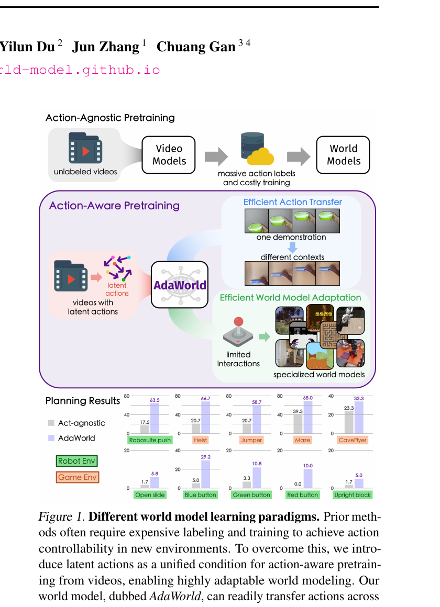
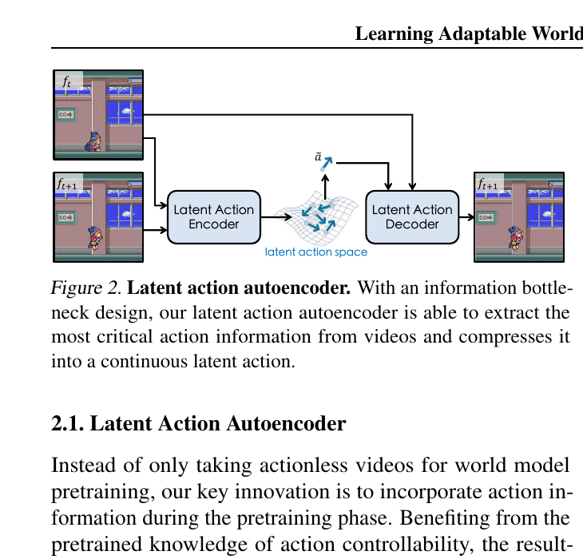
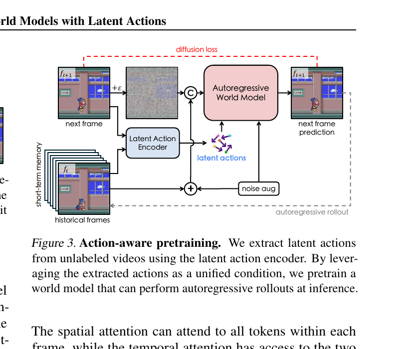
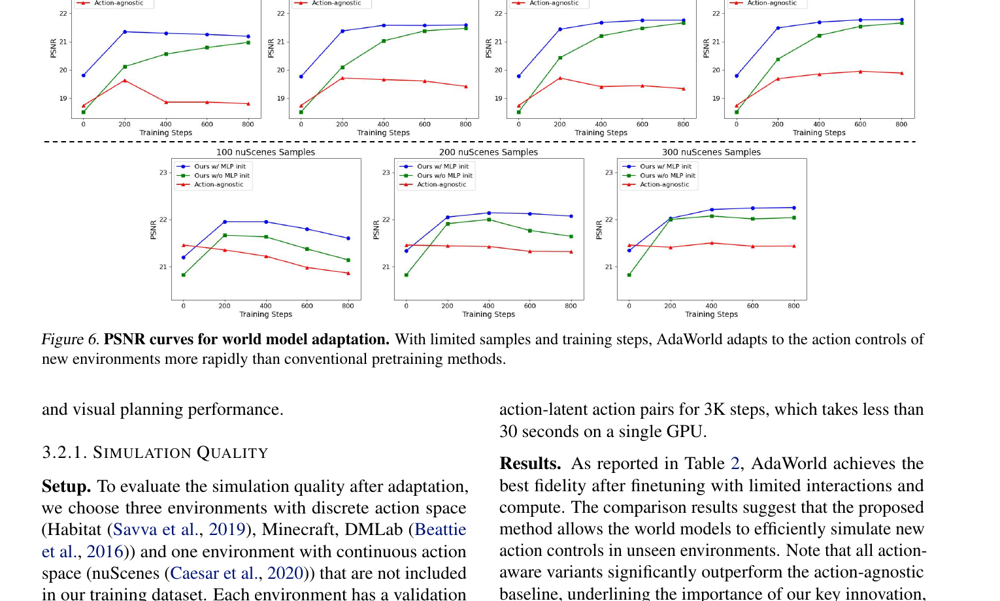

[← 返回 AdaWorld 主页](../README.md)

# 串讲 · 几张图过完 AdaWorld

> **arXiv 2503.18938** · ICML 2025 · 作者 Gao / Zhou / Du / Zhang / Gan (HKUST / Harvard / UMass / MIT-IBM)
>
> **Uni-WAM 视角的前置判断**：a 类 AC-WM，**但 action 是 latent action（从 video 里 unsupervised 学出来的）**，不是数值 action。这是 AdaWorld 区别于 Ctrl-World / Dreamer 4 的核心点。

---

## 1. 这篇 paper 解决的是什么问题？

| 痛点 | 现状 |
|---|---|
| **想 train 一个能跨环境泛化的 AC-WM** | 现有 AC-WM 训于一个环境（如 DROID 真机 / Minecraft）→ **换环境就废**（action 空间、视觉风格都不同）|
| **action label 太贵** | 每个新环境都要采集 (obs, action, next_obs) 标注数据 |
| **unlabeled video 浪费** | 网上海量 video 没 action label，无法直接训 AC-WM |

**AdaWorld 一句话定位**：
> 从 **unlabeled video** 里 unsupervised 抽出一种 **latent action 通用接口**，让一个 WM 能 cover 多个环境，新环境只需少量 finetune 就能适配。

→ **类比**：通用 USB 接口。不管什么环境（Habitat / Minecraft / DMLab），action 都先编码成 latent action（USB 协议），WM 只学这个统一接口，迁移成本低。

---

## 2. 方案全景 · 一张图看懂 AdaWorld 的思路

**Figure 1 展示了 AdaWorld 和"老套路 AC-WM"的对比**（三块从上到下）：

### 块 1：Action-Agnostic Pretraining（老套路 / 上方）
- 输入：unlabeled videos
- 输出：Video Models（被动 video gen，**不接 action**）
- → 经典 T2V 路线，可控性差

### 块 2：Action-Aware Pretraining（AdaWorld 的创新 / 中间）⭐
- 输入：unlabeled videos
- 引擎：**AdaWorld**
  - 先从 video 里**抽出 latent actions**（unsupervised）
  - 再用 latent action 条件化训练 world model
- 输出：能接 latent action 的 WM

### 块 3：Efficient Transfer（下游应用）
- One demonstration → latent action transfer
- 少量交互 → efficient world model adaptation
- 输出：在 specialized world models 上 work

🔥 **核心 insight**：
> 与其等"手工标注的 numerical action"，不如**直接从 video 帧之间的变化学一个 latent action representation**。这样任何 video 都能用来训 AC-WM。

---

## 🔄 前置认知：AdaWorld vs Ctrl-World / Dreamer 4

| 维度 | Ctrl-World | Dreamer 4 | **AdaWorld** |
|---|---|---|---|
| Action 表示 | Cartesian 6D pose + gripper（**数值**）| Minecraft 键盘鼠标（**离散**）| **Latent action（连续向量，learned）**|
| 训练数据要求 | 必须 (obs, action, next_obs) 三元组 | unlabeled video + 少量 labeled | **大量 unlabeled video（不需 action label）**|
| Action 注入 | Frame-level cross-attention | Action token 拼接 | **Latent action 作为条件**注入 |
| 跨环境泛化 | 弱（绑定 DROID）| 中（限 Minecraft）| **强（unsupervised latent 跨环境）**|

→ AdaWorld 走的是和 Dreamer 4 类似的"unlabeled video pretraining"路线，但**更激进**：连 action label 都不要，直接从 video 里学。

---

## 3. 核心方法 · 两张图看清

### 3.1 Figure 2：Latent Action Autoencoder（核心创新）

**结构**：
- 输入：连续两帧 $f_t$（当前帧）+ $f_{t+1}$（下一帧）
- **Latent Action Encoder** → 压缩"两帧之间发生了什么"成一个**latent action 向量** $a$
- **Latent Action Decoder** → 从 $a$ 重建 $f_{t+1}$
- 中间是 **latent action space**（连续向量空间，黄色绕线箭头表示空间结构）

**关键设计**：**information bottleneck**
- Encoder → Decoder 之间强行通过低维 latent
- 强迫 latent 只保留**最关键的 action 信息**（不能保留全图细节）
- → 类似 VAE 但目标是"action 含义"，不是"图像重建"

💡 **类比**：你看两张连续的 game screenshot，脑子里抽出"角色向左移动了一格"这个**抽象动作概念** —— 这就是 latent action。

### 3.2 Figure 3：Action-Aware Pretraining

**用 latent action 训练 WM 的 pipeline**：

1. **左下：short-term memory + historical frames** → 历史观测
2. **左中：next frame** → 通过 Latent Action Encoder 抽出 latent actions
3. **中间：noise aug + autoregressive World Model** → 接收（历史 + latent action）→ 预测下一帧
4. **右上：next frame prediction** → 用 diffusion loss 监督

**关键**：
- WM 的 action 输入**完全来自 Latent Action Encoder**（不需要任何外部 action label）
- 训练时端到端
- Inference 时也用 Latent Action Encoder 从"demo video"里抽 latent action 作为 condition

→ 这个 pipeline 把"AC-WM 训练"从"必须有 (obs, action, next_obs)"放松到了"**只要有连续 video frames 就行**"。

---

## 4. 实验 · Figure 6 主结果

**实验场景**：4 个 unseen 环境
- **Habitat**（discrete action）
- **Minecraft**（discrete action）
- **DMLab**（discrete action）
- **nuScenes**（continuous action，驾驶）

**对比**：4 种 baseline
- **Act-agnostic**（无 action 条件 baseline）
- **Flow cond**
- **Discrete cond**
- **AdaWorld** ⭐

**横轴**：finetuning 时用多少 samples（few-shot 测试）
**纵轴**：PSNR（视觉质量越高越好）

🔥 **结论**：
- 横向所有 4 个环境，**AdaWorld 蓝线一直领先**
- **越少 finetuning data，AdaWorld 优势越大**
- → 证明 latent action pretraining 的迁移效率确实高

**额外发现**：30 秒内（在单 GPU 上）AdaWorld 就能完成新环境的 finetune（800 步 × 5e-5 学习率），远快于其他方法。

---

## 5. Summary · 整篇 paper 一段话

> **AdaWorld** 提出一种 **latent action** 范式：用 information bottleneck autoencoder 从 unlabeled video 里 unsupervised 抽出 action representation，再用这个 latent action 作为 WM 的 conditioning input。这样训练出的 WM **跨环境通用**，新环境只需少量 demonstration 或 interaction 就能 adapt。
>
> 核心创新有 3 点：
> 1. **Latent Action Autoencoder**（Figure 2）：从两帧之间学 latent action，不需 action label
> 2. **Action-Aware Pretraining**（Figure 3）：用 latent action 条件训 WM，比 action-agnostic 大幅提升可控性
> 3. **Few-Shot Adaptation**：30 秒内 finetune 到新环境，在 Habitat / Minecraft / DMLab / nuScenes 上都 work

### 三个最该记住的点

| # | 点 | 一句话 |
|---|---|---|
| 1 | **Latent action** | unsupervised 从 video 抽出 action 表示，**取代外部 action label** |
| 2 | **Information bottleneck** | 强迫 latent 只保留 action 信息，不保留 obs 内容 |
| 3 | **跨环境通用接口** | 一个 WM cover 多个环境，新环境少量 finetune 即可 |

### 一句话标签

> **AdaWorld = "latent action 当通用 USB 接口"的 AC-WM**，最大卖点是从 unlabeled video 学 + few-shot 跨环境 adapt。

---

### 🔥 Uni-WAM 视角的简评（不展开）

**对 Uni-WAM 有用的部分**：
- ✅ **latent action 思路给"data pipeline 之外的另一条数据路径"**：可以考虑从公开 video（YouTube / 真机录像）里学 latent action 而不是只靠仿真器
- ✅ **information bottleneck 设计**：可能启发 IDM 的反向正则化设计（latent action 也是一种"压缩的 action 表示"）

**不直接帮的部分**：
- ⚠️ **Uni-WAM 5 类 off-expert 测试用数值 action 设计（pose / joint）**，而 AdaWorld 用 latent action —— **测试体系不直接套用**
- ⚠️ AdaWorld **关心可控性**（视觉跟得上动作），**不关心 dynamics vs task prior 的解耦**（Uni-WAM 的核心质疑）

**分类**：a 类 AC-WM（但 action 表示和其他 a 类不同：latent 而非数值）。
