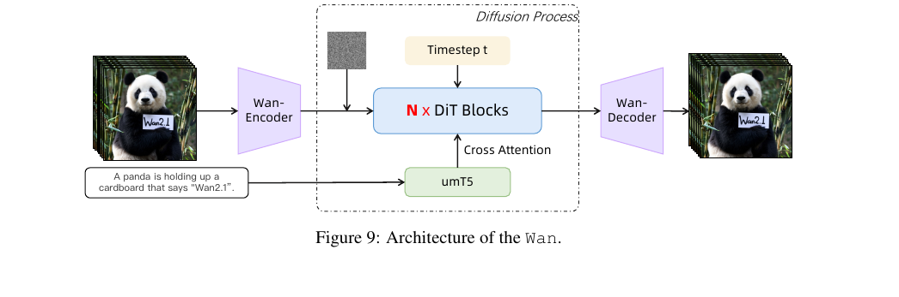
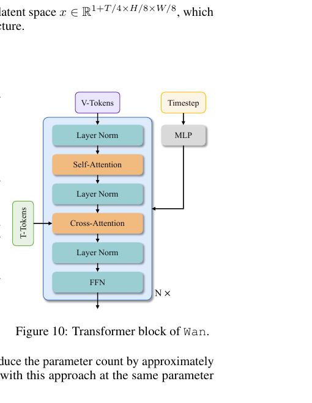

[← 返回论文 README](../README.md) ｜ [← 上一节 04.1 VAE](04-method-vae.md) ｜ [下一节 04.3-4 Scaling/Inference →](04-scaling-inference.md)

# 04.2 · Model Training（DiT 架构 + Pre-training + Post-training）

> **来源**：Wan paper §4.2（p13–15，full.md 行 755–858）
>
> **一句话定位**：上一节讲了"怎么把视频压成 latent"（VAE），这一节讲"在 latent 空间里**怎么生成**" —— Wan 用的 **Diffusion Transformer (DiT)** 架构、**Flow Matching** 训练目标、**3 阶段渐进式预训练**。

---

## 📌 预览

```
   §4.2.1  架构（DiT block 设计）
   ────────────────────────────────────
   • 整体 = VAE Encoder + DiT × N 个块 + VAE Decoder + umT5 文本编码器
   • Patchify: 3D conv (1,2,2) 把 latent 再切一次 → token 序列 (B, L, D)
   • Block 内：LayerNorm → Self-Attn → Cross-Attn(注入 umT5 文本) → FFN
   • Time embedding 经 MLP 生成 6 个 modulation 参数
   • 关键工程优化：MLP 在所有 block 间共享 → 省 25% 参数

   §4.2.2  训练目标 + 预训练
   ────────────────────────────────────
   • Flow Matching：x_t = t·x_1 + (1-t)·x_0，预测 velocity v_t = x_1 - x_0
   • Loss = MSE(model output, v_t)
   • 渐进式 resolution：256px image → 192px+256px joint → 480px → 720px
   • bf16-mixed, AdamW, lr=1e-4

   §4.2.3  后训练
   ────────────────────────────────────
   • 同架构 / 同优化器，从 pre-trained 初始化
   • 480px + 720px 用 §3.2 的高质量数据
```

---

## 📄 原文 + 批注

### 整体架构（Figure 9）



💡 **图怎么读** —— 一条主线，两个旁路：

```
主线（视频生成 pipeline）：
   输入视频 ──Wan-Encoder──> latent ──N×DiT Blocks──> 生成 latent ──Wan-Decoder──> 输出视频

旁路 1（条件注入）：
   "A panda is holding up a cardboard..." ──umT5──> text embedding ──> 通过 cross-attention 注入到每个 DiT Block

旁路 2（去噪步控制）：
   Timestep t ──> 通过 MLP 注入到每个 DiT Block (decide 当前是哪一步去噪)
```

⚠️ **小白要记住**：**架构里有 4 个网络**：
1. **Wan-VAE**（上一节讲的，pixel ↔ latent）
2. **DiT**（这一节的主角，latent → latent，N 个 block 堆叠）
3. **umT5**（文本编码器，把 prompt 变成 token）
4. **MLP for time**（处理 timestep，最小但必不可少）

**整个生成过程发生在 latent 空间**（除了首尾的 VAE encoder/decoder）。

---

### §4.2.1 Video Diffusion Transformer

#### 三大组件

> "The diffusion transformer mainly consists of three components: a patchifying module, transformer blocks, and an unpatchifying module."

```
latent x  ──Patchify──>  tokens (B, L, D)  ──N×Transformer Block──>  tokens  ──Unpatchify──>  latent x'
                              ↑                                                                ↓
                         "切碎成可以 attend 的小块"                              "拼回 latent shape"
```

#### Patchify 是什么？

> "we use a 3D convolution with a kernel size of (1, 2, 2) and apply a flattening operation to convert x into a sequence of features with the shape of (B, L, D), where L = (1 + T/4) × H/16 × W/16"

💡 **关键观察**：注意 L 公式里是 **H/16 / W/16**，不是 H/8 / W/8。**为什么？**

VAE 已经把空间压到 H/8、W/8，**DiT 又用 (1, 2, 2) 卷积再压一次**：
- kernel (1, 2, 2) 表示 **时间维 1**（不压时间）+ **空间维 2×2**（再压一半）
- 所以最终 L = (1+T/4) × **(H/8)/2** × **(W/8)/2** = (1+T/4) × H/16 × W/16

🪄 **算一下 L**（用我们 5 秒 720×720 例子）：

```
1 + T/4 = 31
H/16 = 720/16 = 45
W/16 = 720/16 = 45
L = 31 × 45 × 45 = 62,775 个 token
```

所以一个 5 秒 720p 视频在 DiT 里是 **6 万多个 token 的序列**。这个数字决定了后面 §4.3 §4.4 必须做大量并行 / 缓存优化（attention O(L²) ≈ 39 亿次，单 GPU 跑不动）。

⚠️ **小白别 confuse**：
- VAE 压缩 = 4×8×8（时空形状）
- VAE + Patchify 总共 = **4×16×16**（时空形状，patchify 又压了空间一半）

#### Transformer Block 内部（Figure 10）



💡 **每个 block 内部 7 步**（顺着图从上往下）：

```
1. V-Tokens（视频 token）进来
       ↓
2. Layer Norm                          ← 稳定化
       ↓
3. Self-Attention                      ← 视频内部互相 attend (full ST attn)
       ↓
4. Layer Norm
       ↓
5. Cross-Attention   ←──── T-Tokens   ← umT5 编码的文本 token 作为 K/V
       ↓
6. Layer Norm
       ↓
7. FFN（前馈网络）
       ↓
   输出 → 进入下一个 block

   Timestep ──> MLP ──> 6 个 modulation params 注入到所有 LayerNorm 之间
```

⚠️ **关键设计**：**Self-Attention 在前，Cross-Attention 在后**。先让视频内部"自我协调"，再让文本"提要求"。

#### 关键工程优化：Shared MLP

> "we employ an MLP with a Linear layer and a SiLU layer to process the input time embeddings and predict six modulation parameters individually. **This MLP is shared across all transformer blocks**, with each block learning a distinct set of biases. ... this design can reduce the parameter count by approximately 25% and reveal a significant performance improvement"

💡 **这个设计很巧妙**：

```
方案 A（朴素）                方案 B（Wan 选）
─────────────────────────────────────────────
每个 block 各自带一个 MLP    所有 block 共享同一个 MLP
处理 timestep                 但每个 block 学独立的偏置
                              （bias 是小参数）
─────────────────────────────────────────────
N × MLP 参数                  1 × MLP + N × bias
                              ≈ 25% 参数减少
─────────────────────────────────────────────
```

🤔 **为什么共享 MLP 不损性能反而提升**？因为**所有 block 处理的"timestep 概念"是一样的**（都是"现在是哪一步去噪"），用同一套权重学这个映射更稳。每个 block 通过独立 bias 微调到自己的 layer-specific 用法。**这是个典型的"参数共享带来正则化"效应**。

⚠️ **6 个 modulation params** 是 **AdaLN-zero** 风格（DiT 论文 Peebles & Xie 2023 提的）。每个 LayerNorm 用 timestep 调制 scale + shift + gate × 3 处 = 6 个参数。这是 DiT 标配。

#### Text Encoder = umT5

> "Wan's architecture uses the umT5 to encode input text. Through extensive experiments, we find that umT5 has several advantages: 1) strong multilingual encoding capabilities (Chinese and English); 2) outperforms other unidirectional attention mechanism LLMs in composition; 3) superior convergence."

💡 **umT5 是啥**：Universal multilingual T5 —— Google 的 T5 多语言版。

| 选项 | 缺点 | umT5 优点 |
|---|---|---|
| GPT-style decoder-only LLM | 单向 attention，对 composition（长 prompt 多对象组合）建模较差 | umT5 是 encoder（双向 attention），可全局理解整个 prompt |
| 英文 T5 | 不支持中文 | umT5 多语言原生支持 |
| BERT | 没在 video 任务上验证过 | umT5 有大量经验证据 |

💡 **回到 Abstract 的"中英双语视觉文本"卖点**：umT5 是这个能力的**文本侧基础**。VAE 让视觉细节保真，umT5 让 prompt 多语言理解，两者配合实现"画面里写中文也写得对"。

---

### §4.2.2 Pre-training

#### Flow Matching 训练目标 —— 最关键的数学

> "We leverage the flow matching framework to model a unified denoising diffusion process across both image and video domains."

💡 **Flow Matching 是 diffusion 的训练目标的一种新表述**（详见 _concepts，待写）。直觉版：

**老 diffusion (DDPM)**：学"如何从噪声 denoise 回数据"，公式复杂（noise schedule + score function）。

**Flow Matching (Rectified Flow)**：把"从噪声到数据"看作**直线插值**，学这条直线上每个点的"速度向量"。

**具体公式**（Wan 用的 Rectified Flow 版本）：

```
给定：
   x_1: 真实数据 (清晰 latent 视频)
   x_0: 纯噪声  ~ N(0, I)
   t:   时间步 ∈ [0, 1]，从 logit-normal 采样

定义中间状态（线性插值）：
   x_t = t · x_1 + (1 - t) · x_0

定义 ground truth 速度：
   v_t = dx_t/dt = x_1 - x_0   ← 一个常数向量！

模型 u(x_t, ctxt, t; θ) 学习预测 v_t

损失函数：
   L = E[ ||u(x_t, ctxt, t; θ) - v_t||² ]
                                          ↑
                                       简单的 MSE
```

🪄 **Flow Matching 为什么是 2024-2025 主流**：
- **训练稳定**：直接预测 v_t 是个常数 + 周围有噪声，比 score matching 平稳
- **采样快**：可以用更少 step（比如 4-50 step vs DDPM 的 1000 step）
- **公式简洁**：MSE 一个 loss 解决一切，没有复杂 noise schedule

⚠️ **logit-normal 时间采样**：不是均匀采样 t ∈ [0,1]，而是用 logit-normal 分布（在中间 t≈0.5 概率高，两端低）。**因为中间步的 denoising 任务最困难，多采样让模型多练**。

#### 为什么先做 Image Pre-training？

> "Extended sequence lengths (typically 81 frames for 1280×720 video) substantially reduce training throughput. Excessive GPU memory consumption forces suboptimal batch sizes."

💡 **直接训高清视频的两大灾难**：

```
问题 1: 序列太长 → 训练慢
   81 帧 720p = 几十万 token / sample
   → forward + backward 一次几十秒
   → 单位时间见的样本太少 → 收敛慢

问题 2: 显存爆 → batch size 必须小
   batch=1 时 gradient 方差大
   → 训练不稳，loss 抖动
```

**解法**：先**只训 256px 图像**（短得多的序列），让模型先学会：
- **跨模态对齐**（文本 ↔ 视觉特征）
- **几何结构 fidelity**（物体长啥样、空间关系）

然后**再渐进引入视频**。

#### 3 阶段联合训练

> "(1) 256 px images + 5-second 192 px @ 16 fps videos. (2) 480 px both. (3) 720 px both."

```
Stage 1: 图像 256px + 视频 192px@16fps   ← 低清入手，建立基础
   ↓
Stage 2: 图像 480px + 视频 480px         ← 中清，加分辨率
   ↓
Stage 3: 图像 720px + 视频 720px         ← 高清，最终目标
```

💡 **图像和视频联合训练 (joint training) 的好处**：
- 图像数据**远多于**视频数据 → 给模型大量"静态视觉先验"
- 视频数据补充"动态信息"
- **共享 latent 空间 + 共享 DiT** → 互相增益

#### 训练超参

| 项 | 值 | 含义 |
|---|---|---|
| **精度** | bf16-mixed | 大部分计算用 bfloat16（半精度），关键部分用 fp32（防溢出） |
| **优化器** | AdamW | 标配，带 weight decay 修正 |
| **Weight decay** | 1e-3 | 防过拟合 |
| **初始 LR** | 1e-4 | 行业 standard |
| **LR 衰减** | 由 FID + CLIP Score plateau 触发 | 不是固定 schedule，看指标停滞才降 |

🤔 **小白补充知识**：
- **bf16** = bfloat16 = 16-bit 浮点。和 float16 相比指数位多动态范围大不易溢出，是大模型训练事实标准
- **AdamW** = Adam + decoupled weight decay。是 LLM / diffusion 标配优化器
- **FID** = Fréchet Inception Distance，衡量生成图像分布质量
- **CLIP Score** = 用 CLIP 模型测"生成图 ↔ prompt 对齐度"

---

### §4.2.3 Post-training

> "we maintain the same model architecture and optimizer configuration from the pre-training stage, initializing the network with the pre-trained checkpoint. We conduct joint training at resolutions of 480px and 720px using the post-training video dataset detailed in Sec. 3.2."

💡 **Post-training = 用更高质量的小规模数据"精修"**：

```
Pre-training:                       Post-training:
─────────────────────                ─────────────────────
大规模通用数据                       小规模高质量数据 (§3.2)
广覆盖，但有噪声                     人工筛选，干净
学习"通用视频模式"                   学习"高质量视觉品味"
─────────────────────                ─────────────────────
对应 LLM 的 pre-training            对应 LLM 的 SFT (instruction tuning)
```

**架构和优化器不变，只换数据集** —— 这是**两阶段训练范式**的标准做法（LLM 也是这样，先海量预训练再 SFT/RLHF）。

---

## 💡 Section 总结

### 核心信息速查

| 维度 | 内容 |
|---|---|
| **整体架构** | VAE + DiT × N + umT5 + MLP for time |
| **DiT 三大组件** | Patchify (3D conv 1×2×2) → N × Transformer Block → Unpatchify |
| **Block 内部** | LayerNorm → Self-Attn → Cross-Attn (text) → FFN，timestep 通过 6 modulation params 注入 |
| **VAE+Patchify 总压缩** | 4×16×16（时空形状） |
| **5s 720p 视频 token 数** | ≈ 6.3 万 token |
| **关键工程优化** | Shared MLP for time → 省 25% 参数 |
| **Text Encoder** | umT5（多语言 + 双向 attention + 收敛快） |
| **训练目标** | Flow Matching: 预测 velocity v_t = x_1 - x_0，MSE loss |
| **时间步采样** | Logit-normal（中间 t 多采样） |
| **预训练 3 阶段** | 256px image → 192-256px joint → 480px → 720px |
| **优化器** | AdamW + bf16-mixed, lr=1e-4, wd=1e-3 |
| **Post-training** | 同架构同优化器，换 §3.2 高质量数据 |

### 核心洞察

1. **DiT 是单一 Transformer，不是 encoder-decoder**：和 VAE 不同，DiT 输入和输出形状一样（都是 latent），它就是在 latent 空间内做"去噪迭代"

2. **Patchify 是 VAE 之外又一次压缩**：H/8 (VAE) → H/16 (patchify)。这一刀让 token 数减 4 倍，后面 attention 算量减 16 倍 —— 这是必要的工程妥协

3. **Shared MLP for time 是 Wan 自己的小创新**：省 25% 参数还提升性能，背后逻辑是"timestep 概念全 block 通用，参数共享带正则化"

4. **Flow Matching 是 2024-2025 视频生成的训练目标共识**：Sora / SD3 / Wan / HunyuanVideo 全用这个。比老 DDPM 训练稳采样快

5. **Image-Video Joint Training 是 Wan 数据策略的关键**：图像数据多视频数据少，先用图像建立基础再用视频加动态。回到 Intro 的"图像视频联合"设计哲学

6. **Logit-normal 时间采样是个细节但重要**：让模型多练中间难步骤。这种"小细节驱动大效果"在大模型训练里很常见

7. **Pre/Post-training 分离 = LLM 范式向视频生成的迁移**：和 GPT 系列的 pretrain → SFT 完全同构。说明这种"两阶段优化"是通用范式

---

## 🤔 我的 Follow-up 问题

1. **Shared MLP 具体怎么实现的**？6 个 modulation params 在每个 block 通过什么方式合并 bias？论文没展开
2. **Logit-normal 的均值和方差怎么设的**？影响训练稳定性的关键超参，论文没说
3. **3 阶段训练每阶段多少步 / 多少 GPU-hours**？论文给的细节有限，可能要看附录
4. **umT5 用了哪个 size**？(small / base / large / XL)？这关系到文本编码质量
5. **Post-training 数据集 §3.2 多大**？是 K 级 / M 级 / B 级？
6. **Wan 1.3B 和 14B 训练流程一样吗**？还是 1.3B 走 short cut（如直接从某个 stage 开始）？

---

## 🔥 拷打记录

### Round 4 · 2026-05-10

> **格式**：新格式 —— 题 + 标答同时给，Ricardo 阅读后有追问再讨论。

#### Q4.2.1 ｜ Patchify 的二次压缩

**问题**：VAE 已经把视频压到了 H/8 × W/8。为什么 DiT 还要再做一次 patchify (3D conv 1×2×2) 把空间再砍一半到 H/16？这个二次压缩的代价和收益是什么？

**标准答案**：

**收益**：
- token 数减 4 倍（H 减半 + W 减半）
- attention 算量减 16 倍（O(L²)，L 减 4 倍 → L² 减 16 倍）
- 5 秒 720p 视频 token 从 ~25 万 token 减到 6.3 万 token，**这个量级 DiT 才能跑得动**

**代价**：
- 进一步丢失空间细节（精度下降）
- 但因为 VAE 已经做了主要压缩，patchify 这一刀**只是"在已经压过的 latent 上再多压一点空间"**，损失可控

**为什么是 (1, 2, 2) 不是 (2, 2, 2)**？因为时间维已经压过 4 倍了（VAE 压了），**继续压时间会丢动作信息**。空间维冗余还有得压，所以只压空间。

**Take-away**：VAE 解决"pixel → latent"的大头压缩，patchify 是**为了让 attention 算量可控的二次空间压缩**。整个 pipeline 的总形状压缩 = VAE (4×8×8) + Patchify (1×2×2) = **4×16×16**。

---

#### Q4.2.2 ｜ Flow Matching 训练目标的核心方程

**问题**：用你自己的话解释这三行公式：
```
x_t = t·x_1 + (1-t)·x_0
v_t = x_1 - x_0
L = ||u(x_t, ctxt, t; θ) - v_t||²
```

**标准答案**：

**第一行（中间状态）**：把"纯噪声 x_0"和"真实视频 x_1"用 **t** 做线性插值：
- t=0 时 x_t = x_0（纯噪声）
- t=1 时 x_t = x_1（清晰视频）
- 0<t<1 时是两者的混合（部分噪声 + 部分清晰）

**第二行（速度向量）**：从噪声走到清晰的"方向" = x_1 - x_0。这个方向**和 t 无关**（线性插值的导数是常数）。

**第三行（损失函数）**：模型 u 输入 (x_t, 文本 ctxt, 时间 t)，输出预测的速度。我们让它和 ground truth v_t 的 MSE 最小。

**整体目标的直觉**：让模型在每个噪声水平 t 上都学会"**给我一个噪声中间态，告诉我应该往哪个方向走才能到达清晰视频**"。推理时反过来：从纯噪声开始，按预测的速度方向多步前进，最后到达清晰视频。

**类比**：盲人摸象的反向工程。训练时给模型很多"半成品象"（不同噪声水平），让它指出"去清晰象的方向"。推理时模型从一堆噪声开始，按它学到的方向一步步走，最后走出一头象。

**Take-away**：Flow Matching 把 diffusion 训练问题简化为**"在每个 t 上回归一个常数向量 v_t = x_1 - x_0"**。这是 DDPM 的简化升级版。

---

#### Q4.2.3 ｜ Shared MLP 为什么不损性能反而提升？

**问题**：每个 DiT block 处理 timestep 的 MLP 是**共享的**，但每个 block 有独立的 bias。这个设计省了 25% 参数。**为什么参数变少反而性能提升**？

**标准答案**：

**直觉**：**timestep 在所有 block 处理的"概念"是一样的** —— 都是"现在是哪一步去噪"。

```
方案 A（朴素）：每 block 一个 MLP                方案 B（Wan 选）：所有 block 共享 MLP
─────────────────────────────────────────────────────────────────────────────
N 个 MLP 各自学一遍同一件事                       1 个 MLP 学一次，N 个 block 共享
                                                 + 每个 block 用独立 bias 微调
─────────────────────────────────────────────────────────────────────────────
风险：不同 block 学到不一致的 timestep 编码      优势：
导致 block 之间协同变难                          - 强制 timestep 表征**一致**（block 之间不打架）
                                                 - 参数共享 = 隐式正则化（防过拟合）
                                                 - 减少冗余学习
```

**核心机制：参数共享带来正则化效应**。当一组参数被多次复用时，它必须学到"通用的"表征 —— 而不是过度适配某一个 block 的细节。这种"通用化压力"反而让模型学到更鲁棒的 timestep 表征。

**类比**：N 个学生分别背 9×9 乘法表（每人都过拟合自己的版本）vs N 个学生共用一套乘法表（被迫学到正确通用规则）。第二种结果好。

⚠️ **6 个 modulation params 的细节**：是 **AdaLN-zero**（DiT 论文 Peebles & Xie 2023 提出的）。每个 LayerNorm 用 timestep 调制 scale + shift × 3 处 = 6 个参数。这是 DiT 标配。

**Take-away**：参数共享 ≠ 一定是省钱牺牲；当被共享的功能在所有调用点是同一件事时，共享反而带正则化效应，性能不掉甚至提升。这种"看似简化反而更强"的设计在大模型工程里很常见。

---

### Round 4 总结

| 题 | Take-away |
|---|---|
| Q4.2.1 | VAE 主压缩 + Patchify 二次空间压缩 = 4×16×16 总形状压缩，让 attention 算得动 |
| Q4.2.2 | Flow Matching = "每个 t 回归常数向量"，比 DDPM 简单稳定 |
| Q4.2.3 | "timestep 概念全 block 通用" → shared MLP 不仅省参数还做隐式正则 |

**累积概念词典新增**：
- [diffusion-basics.md](../../../_concepts/diffusion-basics.md) — Timestep / MLP / Modulation
- [transformer-block-stacking.md](../../../_concepts/transformer-block-stacking.md) — N× 是什么意思
- [training-vs-inference.md](../../../_concepts/training-vs-inference.md) — 训练 vs 推理数据流差别

**衍生讨论**：阅读 §4.2 过程中，Ricardo 进一步问了：
- "timestep / MLP 是什么" → 抽象到 [diffusion-basics.md](../../../_concepts/diffusion-basics.md)
- "Figure 10 单个 block 还是 N 个" → 抽象到 [transformer-block-stacking.md](../../../_concepts/transformer-block-stacking.md)
- "训练时 vs 推理时 走的流程一样吗" → 抽象到 [training-vs-inference.md](../../../_concepts/training-vs-inference.md)

这一节的拷打**不仅打通了 §4.2 内容，还顺手沉淀了 3 个跨论文复用的基础概念**。

---

[← 返回论文 README](../README.md) ｜ [← 上一节 04.1 VAE](04-method-vae.md) ｜ [下一节 04.3-4 Scaling/Inference →](04-scaling-inference.md)
