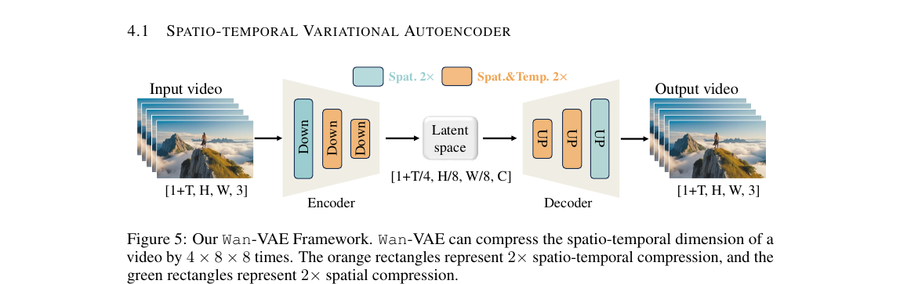
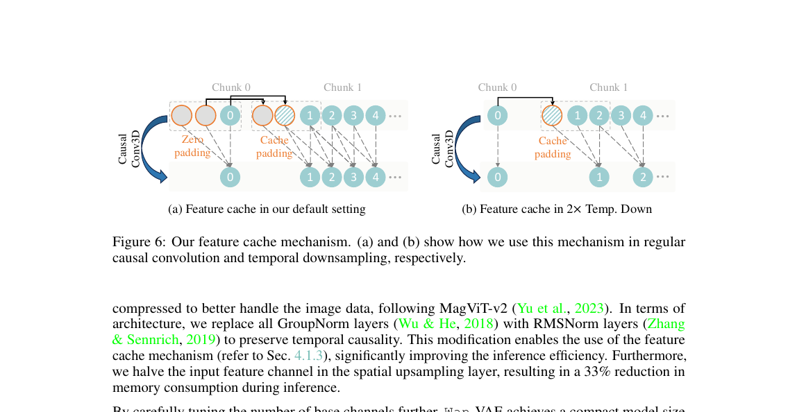
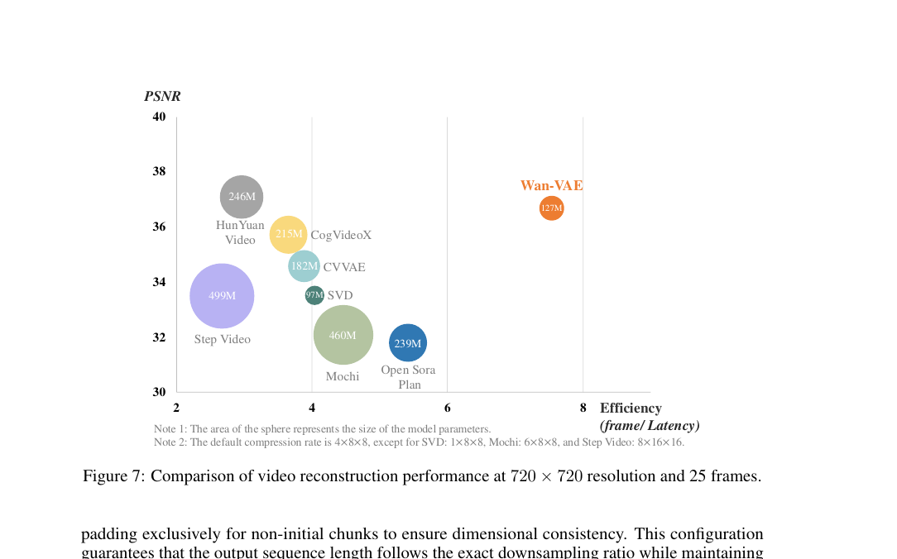
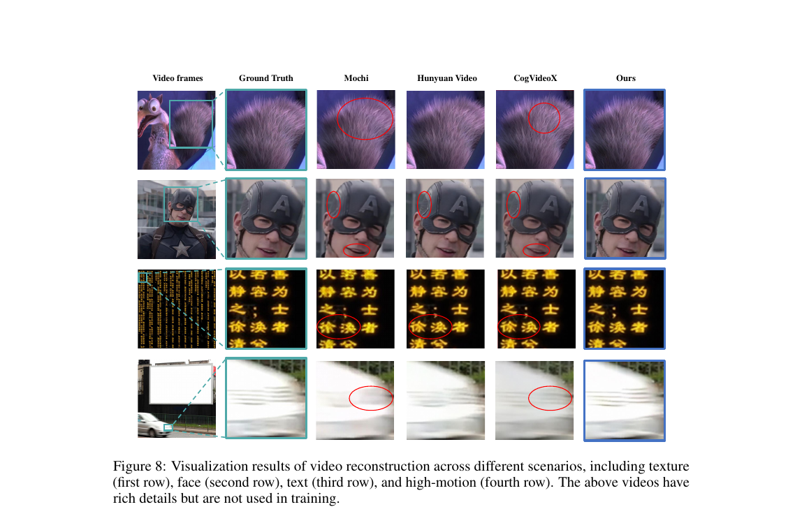

[← 返回论文 README](../README.md) ｜ [← 上一节 01-introduction](01-introduction.md) ｜ [下一节 04-method-dit →](04-method-dit.md)

# 04.1 · Spatio-temporal Variational Autoencoder（Wan-VAE）

> **来源**：Wan paper §4.1（p10–12，full.md 行 521–754）
>
> **一句话定位**：这一节讲 Wan **自研的 3D 因果 VAE**，把视频从 pixel 空间压成 latent 空间，是 Wan **核心创新之一**。压缩比 4×8×8，模型只有 127M 参数（最小），但 PSNR 和速度同时 SOTA。

---

## 📌 预览

```
   挑战：视频 VAE 怎么做？
       ① 视频既有空间又有时间维度 (3D 而非 2D)
       ② 视频数据维度高 → 内存爆炸
       ③ 必须保证时间因果性（未来帧不影响过去帧）
            ↓
   Wan 的解法：3D Causal VAE
       • 压缩比 4×8×8，channel 扩到 16
       • 首帧只做空间压缩（MagViT-v2 技巧）
       • RMSNorm 替代 GroupNorm（保因果）
       • 半减 spatial up-layer channel → 内存 -33%
       • 共 127M 参数
            ↓
   3-stage 训练：
       Stage 1: 2D image VAE 训练
       Stage 2: 膨胀到 3D Wan-VAE，低分辨率 5 帧训练
       Stage 3: 高质量视频 + GAN loss 微调
            ↓
   Efficient Inference: Feature Cache（关键工程）
       • 视频切 chunks 顺序处理
       • 跨 chunk 缓存特征 → 支持无限长视频
            ↓
   Eval：PSNR + 速度双 SOTA
       • 比 HunyuanVideo VAE 快 2.5×
       • 参数最少（127M vs HY 246M）
       • 在 texture / face / text / high-motion 场景视觉重建质量最佳
```

---

## 📄 原文 + 批注

### Why VAE? 视频 VAE 的三大挑战

> "Variational Autoencoders (VAEs) play a crucial role in learning compact latent representations from high-dimensional visual data (especially videos), facilitating scalable and efficient training of generative models, e.g., diffusion models."

💡 **VAE 在视频生成里的位置**（呼应你之前问"视频 latent 是什么"）：

```
   原始视频 ─VAE Encoder→ Latent ←DiT 在这里训练→ Latent ─VAE Decoder→ 生成视频
   (pixel 空间)        (压缩空间)               (压缩空间)             (pixel 空间)
```

VAE = Variational Autoencoder（变分自编码器）。"Variational" 是数学上的训练目标特性（KL 散度约束），暂时不必深究。**关键认知**：VAE 就是个**编解码器，把高维 pixel 压成低维 latent**。

> "However, designing effective VAEs for video generation tasks faces several challenges. First, videos inherently possess both spatial and temporal dimensions, requiring the VAE to capture complex spatio-temporal dependencies. Second, the inherent high-dimensional nature of video... increases memory consumption and computational costs... Third, ensuring temporal causality (i.e., future frames do not influence past frames) is critical..."

💡 **三大挑战，逐个 unpack**：

| 挑战 | 难在哪 | 类比 |
|---|---|---|
| **① 时空依赖** | 普通 2D VAE 只压空间，视频还要压时间，且空间和时间互相影响 | 拍延时摄影：单张照片好压，但要让连续 100 张一起压并保持流畅，难了 |
| **② 内存爆炸** | 一段 5 秒 720p 视频 = 3.3 亿像素，VAE 中间激活更大 | 普通 2D VAE 内存按 H×W 算，3D 要按 T×H×W 算，差几十倍 |
| **③ 时间因果性** | 第 5 帧的压缩**不能**用到第 6 帧的信息 | 视频是顺序的：写到第 5 帧时不能"剧透"未来 |

⚠️ **第三点为什么关键**：因为生成时是**逐 chunk 流式生成**的。如果 VAE 编码用了未来信息，那生成 5 秒视频时，encoder 拿不到第 6 秒的"未来"，结果就和训练分布不一致。**Causal 设计是流式生成的前提**。

---

### §4.1.1 Model Design — 3D Causal VAE



> Figure 5: Our Wan-VAE Framework. Wan-VAE can compress the spatio-temporal dimension of a video by 4 × 8 × 8 times. The orange rectangles represent 2× spatio-temporal compression, and the green rectangles represent 2× spatial compression.

💡 **图怎么读**：

输入是 `[1+T, H, W, 3]`（注意是 1+T 不是 T，"+1" 是首帧），经过 **3 个 Down 块** 压缩：

```
[1+T, H, W, 3]
     ↓ Down 1 (Spat 2×, 绿色)     —— 只压空间一半
     ↓ Down 2 (Spat&Temp 2×, 橙色) —— 时空都压一半
     ↓ Down 3 (Spat&Temp 2×, 橙色) —— 时空都压一半
[1+T/4, H/8, W/8, C]   ← Latent 空间，C=16
     ↓ Decoder 镜像还原
[1+T, H, W, 3]   ← 输出视频
```

🪄 **算压缩比**：
- 时间方向：T → T/4（**只压 4 倍**，因为只有 2 个橙色块；首帧 +1 不压）
- 空间方向：H → H/8 / W → W/8（**压 8 倍**，因为 3 个块都压空间）
- 总：**4×8×8 = 256 倍**

💡 **关键设计 1：首帧只做空间压缩（MagViT-v2 技巧）**

> "the first frame is only spatially compressed to better handle the image data, following MagViT-v2."

为什么单独处理首帧？因为很多视频生成任务（特别是 **I2V**）输入是**一张图 + 文本**，模型要把这张图当作"第一帧"开始生成视频。**让首帧保持纯空间压缩，等于让模型可以无缝接入 image-to-video 任务**。这就是为什么 latent shape 是 `[1 + T/4, ...]` 而不是 `[T/4, ...]`。

⚠️ **小白别误会**：这个 "+1" 不是说多一帧，而是首帧用**和图像 VAE 兼容的方式**单独处理一下，让它"既是视频开头又是独立图像"。

💡 **关键设计 2：RMSNorm 替代 GroupNorm**

> "we replace all GroupNorm layers with RMSNorm layers to preserve temporal causality."

| Norm | 计算什么 | 时间因果? |
|---|---|---|
| **GroupNorm**（老） | 在 channel 分组上算均值方差 | ✅ 但实现复杂 |
| **RMSNorm**（新） | 只算 RMS（均方根），无均值 | ✅ 更简单，配合 feature cache 友好 |

🤔 **为什么 GroupNorm 影响因果性**？因为在视频里，如果 GroupNorm 跨时间帧算均值方差，未来帧就影响了过去帧的 normalization。RMSNorm 可以更容易地做"per-frame"或"causal-window"版本，**不污染过去**。

💡 **关键设计 3：半减 spatial up-layer channel**

> "we halve the input feature channel in the spatial upsampling layer, resulting in a 33% reduction in memory consumption during inference."

工程优化：上采样层入口 channel 数砍半，省 33% 推理内存。这是个**超实用的 trick**，几乎不影响精度，但显著降低部署成本。

💡 **127M 参数 — 最小的 SOTA VAE**

> "Wan-VAE achieves a compact model size of only 127M parameters."

对比同期：HunyuanVideo VAE 246M、Step Video 499M、Mochi 460M。**Wan-VAE 是最小但最精的**（见 Figure 7）。

---

### §4.1.2 Training — 3-Stage Pipeline

> "We adopt a three-stage approach to train Wan-VAE."

💡 **3 阶段训练**（这是个很经济的训练策略）：

```
Stage 1: 训 2D image VAE
   • 同样的网络结构，但只在图像上训
   • 学到"如何压缩单帧图像"
            ↓
Stage 2: 膨胀到 3D Wan-VAE (Inflation)
   • 把 2D weights 扩展到 3D 时空卷积（"inflate"）
   • 在低分辨率 (128×128) + 短视频 (5 frames) 上训
   • 收敛快很多（因为 2D 已经学好了空间压缩）
            ↓
Stage 3: 高分辨率精修
   • 高质量视频 + 多分辨率 + 多帧数
   • 加 GAN loss（来自 3D discriminator）
   • 重建质量进一步提升
```

⚠️ **"Inflation" 是个重要技术**：把 2D 模型的权重**扩展**到 3D —— 比如把 `Conv2D(3×3)` 变成 `Conv3D(1×3×3)`，时间维度初始化为 1。**这相当于让 3D 模型从一个"已经会做图像压缩"的起点开始训**，而不是从随机权重开始。**显著加速训练**。

💡 **损失函数的权重配比**（Stage 2）：

| Loss | 权重 | 作用 |
|---|---|---|
| **L1 重建** | 3 | 像素级别还原准确性 |
| **KL 散度** | 3e-6 | 让 latent 服从某个先验分布（很小，主要不是约束这个） |
| **LPIPS 感知** | 3 | 让人眼觉得"看起来像"（不光像素准确） |

🤔 **LPIPS 是什么**？Learned Perceptual Image Patch Similarity —— 用预训练的 CNN 比较两张图的"感知差异"。比单纯 L1 / L2 更接近人眼判断。

💡 **Stage 3 加 GAN loss**：让一个 discriminator 判断 "重建视频 vs 真实视频"，VAE 努力骗过它。这是经典 VAE-GAN 套路，能让重建结果**更锐利、细节更多**（L1 倾向输出模糊，GAN 倾向输出锐利）。

---

### §4.1.3 Efficient Inference — Feature Cache（关键工程）



> Figure 6: Our feature cache mechanism. (a) and (b) show how we use this mechanism in regular causal convolution and temporal downsampling, respectively.

> "To efficiently support the encoding and decoding of arbitrarily long videos, we implement a feature cache mechanism within the causal convolution module of Wan-VAE."

💡 **要解决的问题**：长视频不能一次塞进 GPU。比如 1 分钟的 720p 视频有 1440 帧，整段做 VAE encoding 内存会爆。

💡 **Feature Cache 的核心想法**：

```
传统做法：                               Feature Cache 做法：
─────────────────────                  ─────────────────────────
一次塞整个视频                           视频切成 chunks（每 chunk 4 帧左右）
内存爆炸 ❌                              逐 chunk 处理 ✅
                                         每个 chunk 处理时缓存上一个 chunk 的
                                         "边界帧特征"，给当前 chunk 用
                                         → 既省内存，又保因果连续性
```

🪄 **图 6(a)** 默认场景（卷积不改变帧数）：
- Conv3D 的 kernel size = 3，所以需要"我"+"前 1 帧"+"前 2 帧"
- 第 0 chunk：前面没有，用 zero padding 填两帧
- 后续 chunk：从前一个 chunk 拿最后两帧作为 cache，丢掉更老的

🪄 **图 6(b)** 2× 时间下采样场景（stride=2）：
- 处理时帧数会减半
- 需要只缓存 1 帧（不是 2 帧），因为下采样后的依赖窗口变了

💡 **效果**：

> "this feature cache mechanism not only optimizes memory utilization but also preserves feature coherence across chunk boundaries, thereby supporting stable inference for infinite-length videos."

**支持无限长视频的 VAE 编解码**。这对于流式视频生成、长视频处理至关重要。

⚠️ **小白要 get 的点**：feature cache 这个 idea **本质和 LLM 推理里的 KV cache 是一回事** —— 都是"上一步的中间特征别扔，下一步用得着"。技术名字不同，思想一致。

---

### §4.1.4 Evaluation — 双 SOTA

#### Quantitative：PSNR vs Efficiency



> Figure 7: Comparison of video reconstruction performance at 720 × 720 resolution and 25 frames.

💡 **图怎么读**：
- **横轴 = Efficiency**（frames / latency，越右越快）
- **纵轴 = PSNR**（重建质量，越高越好）
- **圆圈大小 = 模型参数量**

```
理想位置：右上角（又快又好），且圆圈小（参数省）
─────────────────────────────────────────────────
Wan-VAE（127M）        →  右上角 ⭐ 唯一在 efficiency=8 附近且 PSNR≈37 的
HunYuan Video（246M）  →  PSNR 高但慢（左中）
CogVideoX（215M）      →  PSNR 中速度中（中中）
CVVAE（182M）          →  中规中矩
SVD（97M）             →  小但慢
Step Video（499M）     →  超大模型但最慢且 PSNR 低
Mochi（460M）          →  大模型但 PSNR 低
Open Sora Plan（239M） →  中等
```

🪄 **Wan-VAE 的"双 SOTA"姿态**：在 PSNR 接近最高的同时，efficiency 是**别人 2–3 倍**，且参数量最小。论文原话：

> "our VAE's reconstruction speed is 2.5 times faster than the existing SOTA method (i.e., HunYuan Video)."

⚠️ **图里的 compression rate 注解**：除了 SVD（1×8×8）、Mochi（6×8×8）、Step Video（8×16×16），其他都是 4×8×8。这个 caveat 很重要 —— 不同压缩比下 PSNR 不能直接比。Step Video 压缩比更激进（8×16×16），所以 PSNR 低。

#### Qualitative：4 种典型场景视觉对比



> Figure 8: Visualization results of video reconstruction across different scenarios, including texture (first row), face (second row), text (third row), and high-motion (fourth row).

💡 **4 类场景，逐行对比**：

| 行 | 场景 | Wan-VAE 优势 |
|---|---|---|
| 1 | **Texture（纹理）** | 头发、毛皮等细节方向和质感更准 |
| 2 | **Face（人脸）** | 嘴唇周围模糊和扭曲更少 |
| 3 | **Text（画面文字）** | 字符还原清晰、不掉字 |
| 4 | **High-motion（高速运动）** | 帧间锐利度保持得好 |

🪄 **为什么挑这 4 类**：这是视频 VAE 最容易"翻车"的 4 个场景：
- **纹理**容易模糊化
- **人脸**容易扭曲（uncanny valley）
- **文字**容易变形成乱码
- **高速运动**容易抖动 / 拖影

Wan 选这 4 类做对比，是有意 highlight 自己在"难场景"上的优势。

---

## 💡 Section 总结

### 核心信息速查

| 维度 | 内容 |
|---|---|
| **架构类型** | 3D Causal VAE |
| **压缩比** | 4×8×8（时间 4，空间 8×8） |
| **Latent channel** | 16 |
| **参数量** | 127M（同期最小） |
| **首帧处理** | 只做空间压缩（MagViT-v2，便于 I2V） |
| **Norm 选择** | RMSNorm（替换 GroupNorm，保因果） |
| **训练策略** | 3 阶段：2D VAE → inflate to 3D → 高质量+GAN |
| **Loss 配比** | L1=3, KL=3e-6, LPIPS=3, 末段+GAN |
| **Inference 关键** | Feature Cache（chunk-wise 处理） |
| **速度优势** | 比 HunyuanVideo VAE 快 2.5× |
| **PSNR 位置** | 接近最高，配合 efficiency 双 SOTA |

### 核心洞察

1. **三大挑战决定了三大设计选择**：
   - 时空依赖 → 3D 卷积
   - 内存爆炸 → 4×8×8 高压缩 + feature cache
   - 时间因果 → RMSNorm + causal padding

2. **"+1" 首帧设计是为 I2V 任务铺路**：让 VAE 既能整体处理视频，又能干净地"从一张图开始"生成视频。这种小设计往往隐藏着对下游任务的考虑。

3. **3-stage training 体现"先易后难"哲学**：从 2D image VAE 起步，逐步加时间维度、加分辨率、加 GAN loss。每一步在前一步基础上加难度。比"从头硬训" 3D VAE 快很多。

4. **Feature Cache = 视频 VAE 版的 KV Cache**：本质都是"中间特征别扔，下一步还用得着"。**LLM 和视频生成在工程优化上的趋同性值得关注**。

5. **Wan-VAE 是"小而精"的范例**：127M 打 246M / 460M / 499M 的对手且 PSNR 不输。**这印证了"模型大不等于性能强"**，架构设计 + 训练策略才是关键。

6. **回到 §1 的 3 大 Gap**：Wan-VAE 同时打掉了 Performance（PSNR SOTA）和 Efficiency（最小参数 + 2.5× 速度）。这一节是整篇论文里**最强的"3 大 Gap 同时解"的证据**之一。

---

## 🤔 我的 Follow-up 问题

1. **127M 是怎么压到这么小的？** 论文说 "carefully tuning the number of base channels" —— base channel 数具体多少？深度多少？没给细节
2. **GroupNorm vs RMSNorm 的精度差别**？只说了因果性优势，但没说精度上是否有 trade-off
3. **Inflation 时 2D weights 怎么具体扩展到 3D**？论文没展开数学细节，需要看 MagViT-v2 原文
4. **Feature cache 在训练时也用吗，还是只在推理用**？训练用的话怎么和反向传播兼容？
5. **首帧 +1 设计对 T2V（不是 I2V）任务有没有副作用**？

---

## 🔥 拷打记录

_(待填充 — Round 3 Q&A 将在这里整段回写)_

---

[← 返回论文 README](../README.md) ｜ [← 上一节 01-introduction](01-introduction.md) ｜ [下一节 04-method-dit →](04-method-dit.md)
