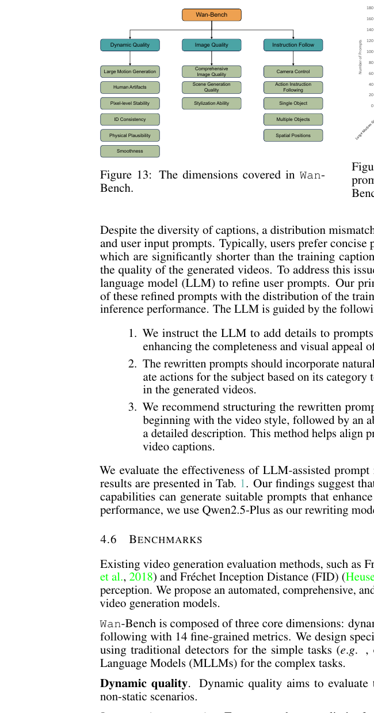

[← 返回论文 README](../README.md) ｜ [← 上一节 04.3-4 Scaling+Inference](04-scaling-inference.md) ｜ [下一节 05.1 I2V →](05-i2v.md)

# 04.5-4.7 · Prompt 对齐 + Wan-Bench + 评测结果

> **来源**：Wan paper §4.5-4.7（p19–25，full.md 行 1111–1804）
>
> **一句话定位**：模型训完了 + 推理优化做了，现在要回答两个问题：(a) 用户的 prompt 怎么和模型训练时的 caption 对齐（§4.5）？(b) **怎么证明模型确实强**（§4.6 设计 benchmark + §4.7 评测 + ablation）？

---

## 📌 预览

```
   §4.5 Prompt Alignment ── 让用户的 prompt 适配模型
   ──────────────────────────────────────
   • 问题: 训练 caption 是长详细的，用户输入是短简单的 → 分布不匹配
   • 解法: (1) 训练时 caption 多样化  (2) 推理时用 LLM rewrite 用户 prompt
   • Rewriter: Qwen2.5-Plus，输出"风格→摘要→详描述"格式
   
   §4.6 Wan-Bench ── 自建评测体系
   ──────────────────────────────────────
   • 3 大维度: Dynamic Quality / Image Quality / Instruction Following
   • 14 个细粒度指标（每个用专门的检测器或 MLLM 评分）
   • 人类反馈引导的加权策略（不是简单平均）
   
   §4.7 Evaluation ── 实测结果
   ──────────────────────────────────────
   • 量化: Wan-Bench 总分 0.724 > Sora 0.700 > 国内商业
   • 量化: VBench 总分 86.22%（公开 leaderboard SOTA）
   • 人类评测: T2V 任务，Wan 14B 在所有维度领先
   • Ablations: 验证 shared AdaLN / umT5 / VAE 设计选择
```

---

## 📄 §4.5 Prompt Alignment —— 用户 prompt 怎么对齐训练分布

### 问题：训练 caption 和用户 prompt "说的不是一种话"

```
训练时的 caption（长，详细，结构化）：
"In a documentary photography style, the camera follows a motorboat
 chasing a pod of dolphins leaping out of the vast ocean. On the motorboat,
 there is a driver wearing a life jacket and a safety helmet, with a focused
 and excited expression..."

用户实际输入（短，简单）：
"motorboat chasing dolphins in the sea"
```

⚠️ **训练时模型学的是"长 caption → 视频"的映射**。用户给短 prompt 时，相当于让模型在**训练分布外**工作 → 生成质量下降。

### 两个解法

#### 解法 1：训练时数据增强 —— "教模型听各种话"

> "we augment each video with a variety of captions, thereby increasing diversity"

每个训练视频配多种 caption：
- **长度**：long / medium / short
- **风格**：formal / informal / poetic
- 让模型在训练时就**习惯各种长度和风格的输入**

#### 解法 2：推理时 LLM 改写用户 prompt（实际部署用这个）

> "we rewrite user prompts by utilizing a large language model (LLM) to refine user prompts"

**用 Qwen2.5-Plus 把用户的短 prompt 改写成训练时的长 caption 格式**。

**改写原则 3 条**：
1. 加细节，但**不改原意**
2. 加合适的运动属性（人在跑、车在开...）让生成更自然
3. 用 post-training caption 的格式："风格 → 摘要 → 详细描述"

**Table 1 给的实例**：

```
原 prompt: "motorboat chasing dolphins in the sea"
       ↓ Qwen2.5-Plus
改写: "In a documentary photography style, the camera follows a motorboat
       chasing a pod of dolphins leaping out of the vast ocean..."
```

💡 **这是实际推理 pipeline 中"看不见但很重要"的一步**。你跑 Wan 时，**模型实际接收的 prompt 已经被 LLM 重写过**了。

---

## 📄 §4.6 Wan-Bench —— 评测设计

### 为什么自建 benchmark？

> "Existing video generation evaluation methods, such as Fréchet Video Distance (FVD) and Fréchet Inception Distance (FID), lack alignment with human perception."

老方法（FVD / FID）和**人类感知不一致** —— 视频 FID 高不代表人觉得好看。Wan 自建一个**对齐人类偏好**的 benchmark。

### Wan-Bench 的 3 大维度 + 14 个指标



> Figure 13: The dimensions covered in Wan-Bench.

| 大类 | 子维度 |
|---|---|
| **Dynamic Quality**（动态质量） | Large Motion / Human Artifacts / Physical Plausibility / Smoothness / Pixel-level Stability / ID Consistency |
| **Image Quality**（视觉质量） | Comprehensive Image Quality / Scene Generation / Stylization |
| **Instruction Following**（指令遵从） | Single Object / Multiple Objects / Spatial Positions / Camera Control / Action Instruction |

⚠️ **每个指标对应一个具体的评分算法**，不是简单平均：
- 简单任务（如 object detection）：用传统检测器
- 复杂任务：用 **MLLM**（如 Qwen2-VL）做"video question-answering"

### 几个具体指标的测法

| 指标 | 测法 |
|---|---|
| **Large Motion Generation** | 用 RAFT 算光流幅度 |
| **Human Artifacts** | 自训 YOLOv3 在 20K 标注图上检测 AI 痕迹 |
| **Physical Plausibility** | Qwen2-VL 看视频回答"违反物理规律了吗" |
| **ID Consistency** | DINO 抽特征算帧间相似度 |
| **Single/Multiple Object** | Qwen2-VL 数物体数量是否对 |
| **Camera Control** | 5 种相机运动类型 + 130 个 prompt + RAFT/Qwen2-VL 检测 |

### 人类反馈引导的加权（Wan 的关键创新）

> "we collect over 5,000 pairwise comparisons of videos generated by different models including Wan. Users evaluate pairs based on a given text..."

不是简单把 14 个指标平均，而是：
1. 找人做 5000+ 对视频对比（A vs B 哪个更好？）
2. 计算每个指标分数和人类评分的 **Pearson correlation**
3. 用 correlation 作为权重 → 最终总分**对齐人类偏好**

⚠️ **意义**：Wan-Bench 不只是"机器评分"，是**"机器评分 + 人类校准"**的混合体系。

---

## 📄 §4.7 Evaluation —— 实测结果

### §4.7.1 Quantitative Results（量化对比）

#### Table 2: Wan-Bench 综合对比

```
模型                           Weighted Score
─────────────────────────────────────────
Wan 14B            ⭐ 0.724    ← SOTA
Sora                  0.700
CN-TopA               0.693
CN-TopB               0.690
Wan 1.3B              0.689    ← 1.3B 的小弟还能进 Top 5
Hunyuan               0.673
Mochi                 0.639
```

⚠️ **Wan 14B 0.724 > Sora 0.700**：3.4% 的领先幅度。**1.3B 也接近 0.69，惊人的"小模型大能力"**。

⚠️ **逐个维度看 Table 2**：Wan 14B 不是每个指标都第一，但综合最高。比如：
- Large Motion：Sora 0.482 > Wan 14B 0.415（Sora 强）
- Physical Plausibility：Wan 14B 0.939 > Sora 0.933（Wan 略强）
- Smoothness：Wan 14B 0.910 > Sora 0.930（Sora 略强）
- Stylization：CN-TopB 0.623 > Wan 14B 0.328（Wan 弱）

**Wan 的优势**：物理合理性、ID 一致性、单/多物体准确性、空间位置。
**Wan 的弱项**：大运动幅度（不如 Sora）、风格化能力（不如商业模型）。

#### Table 3: Human Win Rate (T2V)

人类盲评 Wan 14B vs 4 个对手：

```
对手        Visual Quality 上 Wan 赢      Motion Quality 上 Wan 赢      Overall
CN-TopA          30.6%（输）                   16.1%（输）                  44.0%
CN-TopB          15.9%（输）                   9.7%（输）                   44.0%
CN-TopC          27.8%（输）                   14.9%（输）                  48.9%
Runway           48.1%（接近平）                40.3%（接近平）               67.6%
```

⚠️ **意外**：人类盲评里 Wan 14B 在 visual / motion 上**输给某些 CN 商业模型**？这看似和 Wan-Bench 结果冲突。

🤔 **可能解释**：
- 商业模型在"视觉冲击力"上调优过
- Wan-Bench 测的是综合多维度，不是单纯"好看"
- 这也是为什么人类评测有 5000+ 对，不是几十对

#### Table 4: VBench 公开 leaderboard（最有说服力）

```
模型                Quality   Semantic   Total
─────────────────────────────────────────
Wan 14B            ⭐ 86.67%   84.44%    86.22%
Sora                  85.51%   79.35%    84.28%
Wan 1.3B              84.92%   80.10%    83.96%
Hunyuan (open)        85.09%   75.82%    83.24%
Kling                 83.39%   75.68%    81.85%
```

⚠️ **VBench 是第三方评测**（不是 Wan 自建），所以这个比 Wan-Bench 更难"数据造假"。Wan 14B 在 VBench 是第 1，**这才是最强证据**。

---

### §4.7.2 Ablation Studies

3 个核心 ablation 验证设计选择：

#### Ablation 1: Adaptive Normalization（验证 shared AdaLN 对 § 4.2.1 的优势）

| 配置 | 参数量 | 结论 |
|---|---|---|
| Full-shared-AdaLN-1.3B（基线） | 1.3B | training loss 略高 |
| Half-shared-AdaLN-1.5B | 1.5B | 中等 |
| **Full-shared-AdaLN-1.5B（深度+5）** | **1.5B** | **训练 loss 最低** ⭐ |
| Non-shared-AdaLN-1.7B | 1.7B | 不如 full-shared |

⚠️ **结论**：**与其在每 block 加 AdaLN 参数，不如把省下的参数用来加深网络**。这就是为什么 Wan 选 full-shared + 增加 layer 数。**这个 ablation 直接支撑了我们 Q4.2.3 的标答**。

#### Ablation 2: Text Encoder（验证 umT5 对其他 LLM 的优势）

测了 3 个 bilingual encoder：
- **umT5（5.3B）** ⭐ training loss 最低
- Qwen2.5-7B-Instruct
- GLM-4-9B

**为什么 umT5 赢**：
- decoder-only LLM（Qwen / GLM）用 **causal attention**（单向）
- umT5 是 encoder，用 **bidirectional attention**（能看完整 prompt）
- diffusion 模型更喜欢 bidirectional encoder

⚠️ **HunyuanVideo 也得出同样结论**。bidirectional encoder 是视频生成的当前主流。

#### Ablation 3: VAE vs VAE-D

VAE-D = 把 VAE 的 reconstruction loss 换成 diffusion loss 的变体。结果 VAE-D **FID 更高**（更差）。**所以保留传统 VAE**。

---

## 💡 Section 总结

### 核心信息速查

| 维度 | 内容 |
|---|---|
| **§4.5 Prompt 对齐** | 训练时 caption 多样化 + 推理时用 Qwen2.5-Plus rewrite |
| **Wan-Bench 维度** | 3 大类 × 14 子指标 + 人类 5000+ 对比加权 |
| **关键评测工具** | RAFT（光流）/ Qwen2-VL（MLLM）/ DINO（特征）/ YOLOv3（artifact）/ MANIQA / MUSIQ |
| **Wan-Bench 总分** | Wan 14B 0.724 > Sora 0.700 > 国内商业 |
| **VBench 公开** | Wan 14B 86.22% (SOTA) > Sora 84.28% |
| **Wan 强项** | 物理合理性 / ID 一致性 / 物体计数 / 空间位置 |
| **Wan 弱项** | 大幅运动 / 风格化（不如 Sora / 商业模型） |
| **Ablation 关键** | shared AdaLN > non-shared / umT5 > 其他 / VAE > VAE-D |

### 核心洞察

1. **Prompt rewrite 是隐藏但关键的一步**：用户输入和训练分布不匹配是普遍问题，业界通用解法是用 LLM 改写。这一步**不是模型能力**，是**部署工程**。

2. **Benchmark 自建有"自卖自夸"嫌疑，第三方更可信**：Wan-Bench 的 0.724 vs Sora 0.700 要打折扣，但 VBench 86.22% (Wan) > 84.28% (Sora) 更可信。**读 paper 时分清楚 self-evaluation 和 third-party**。

3. **不同维度强弱不同 → benchmark 设计要多维 + 加权**：Wan 在某些维度（动作幅度）输给 Sora，在另一些（物理合理性）赢。**单一指标都会误导**。

4. **Ablation 的 "Full-shared-AdaLN-1.5B (extended)" 是关键证据**：训练 loss 最低，证明"省 AdaLN 参数 + 加 layer 深度 > 原版"的策略对路。**深度 > AdaLN 参数密度**。

5. **bidirectional encoder（umT5） > unidirectional decoder LLM（Qwen/GLM）作为视频生成 text encoder**：causal attention 看不到完整 prompt 的后半段，对 diffusion 不友好。这是个实用的 takeaway。

---

## 🤔 我的 Follow-up

1. **Wan-Bench 5000 对人类评比怎么找的人**？专业评估者还是 crowdsourcing？影响可信度
2. **Prompt rewrite 后用户原意是否真的不变**？Qwen2.5-Plus 偶尔会"过度发挥"添加用户没要求的元素
3. **Wan-Bench 各指标的 Pearson correlation 具体数值**？哪些指标最影响人类偏好？
4. **Wan 在风格化（Stylization）上 0.328 显著低于 CN-TopB 0.623**，是数据问题还是架构问题？
5. **VBench 的 16 维度和 Wan-Bench 的 14 维度重叠度多少**？

---

## 🔥 拷打记录

### Round 6 · 2026-05-10（新格式）

#### Q4.5 ｜ Prompt rewrite 为什么必要？

**问题**：用户给 Wan 短 prompt 时，为什么需要先用 LLM 改写成长 caption，而不是直接传给 Wan？

**标答**：因为 Wan 训练时看到的 caption 都是**长详细结构化的**（带风格、相机角度、物体细节）。用户输入短 prompt 时，相当于在**训练分布外**工作 —— 模型对短输入"没见过"，生成质量下降。

LLM rewrite 把用户的短 prompt 翻译成训练时的 caption 格式，让模型在熟悉的"输入分布"下工作 → 生成质量大幅提升。

**Take-away**：现代 generative AI 系统的"prompt"和"模型"之间通常有**适配层**（rewrite / 模板），这是部署工程的隐藏环节。**用户感受到的质量 = 模型能力 × prompt 适配质量**。

---

#### Q4.6 ｜ Wan-Bench 比 FVD/FID 强在哪？

**问题**：FVD 和 FID 是经典 video / image quality 指标。Wan 团队为什么不直接用它们，而要自建 Wan-Bench？

**标答**：FVD / FID 都基于"特征分布距离"（用 Inception/I3D 抽特征算 Frechet 距离），有两个问题：
1. **不对齐人类感知**：FID 低不代表人觉得好看（特征空间和"美感"是两回事）
2. **粗粒度**：只给一个总分，**不告诉你哪里强哪里弱**

Wan-Bench 的设计哲学：
- **多维度细分**（14 个）→ 能定位优劣势
- **人类反馈加权**（5000 对比赛）→ 总分对齐人类偏好
- **每维度专属评测器**（RAFT / Qwen2-VL / DINO）→ 针对性强

**Take-away**：现代生成模型评测从"单一指标"走向"多维度 + 人类校准"。这反映了模型能力越来越复杂，**单一标量分数无法覆盖**。

---

#### Q4.7 ｜ 怎么判断 Wan 真的比 Sora 强？

**问题**：Wan-Bench 上 Wan 14B (0.724) > Sora (0.700)。但 Wan-Bench 是 Wan 团队自建。**怎么判断这个对比真的可信**？

**标答**：

**自建 benchmark 的可信度问题**：理论上有 4 种"舞弊"可能：
1. 选对自家强的维度建 benchmark
2. 设计评分算法偏向自家
3. 用自家训练数据相似的 prompt
4. 选时点（用 Sora 弱时数据对比）

**Wan-Bench 一定程度上规避了这些**：
- 14 维度比较全面，覆盖了 Wan 弱项（如 stylization 上 Wan 也输了）
- 人类 5000 对比加权，不是机器自己说了算

**但更有说服力的证据**：**Table 4 的 VBench**（第三方 leaderboard）。
- Wan 14B 86.22% > Sora 84.28%
- VBench 不是 Wan 团队设计，无法操纵
- 这是 Wan 真的强于 Sora 的**最硬证据**

**Take-away**：读 paper 时，**自评 benchmark 的分数要打折扣，第三方 / 公开 leaderboard 的分数才是真金**。这呼应了 Q0.3 我们讨论过的"Win Rate vs Score"原则。

---

### Round 6 总结

| 题 | Take-away |
|---|---|
| Q4.5 | Prompt rewrite 是部署工程的隐藏环节，弥补"用户输入分布"和"训练分布"的差距 |
| Q4.6 | 现代生成模型评测：单一指标 → 多维度 + 人类校准 |
| Q4.7 | 自评 benchmark 打折扣，第三方 leaderboard 才是真金（呼应 Q0.3） |

---

[← 返回论文 README](../README.md) ｜ [← 上一节 04.3-4 Scaling+Inference](04-scaling-inference.md) ｜ [下一节 05.1 I2V →](05-i2v.md)
