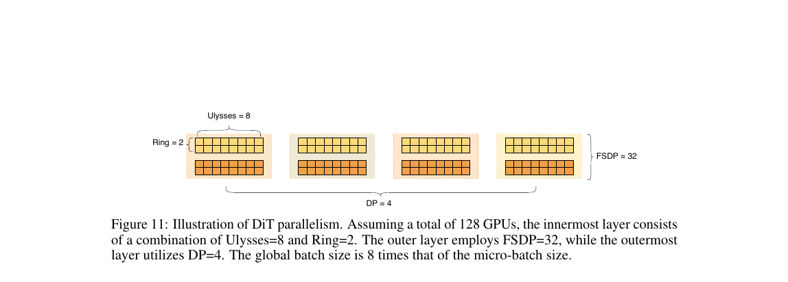
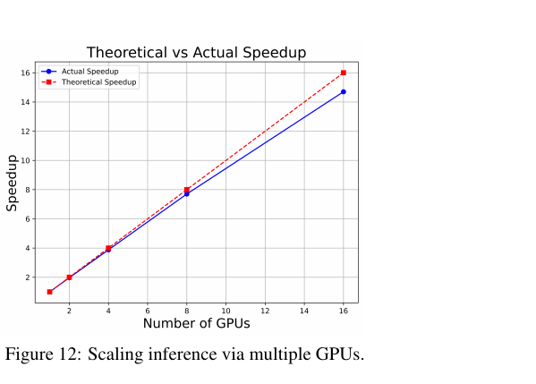

[← 返回论文 README](../README.md) ｜ [← 上一节 04.2 DiT](04-method-dit.md) ｜ [下一节 04.5-7 Prompt+Eval →](04-prompt-eval.md)

# 04.3-4.4 · Scaling 训练效率 + Inference 推理优化

> **来源**：Wan paper §4.3-4.4（p15–18，full.md 行 860–1109）
>
> **一句话定位**：上一节给了 DiT 架构和训练目标，但**实际跑起来要解决两件事**：训练时怎么让 14B 模型 + 100 万 token 序列**能 fit 进集群**（§4.3），推理时怎么让**50 步迭代不至于跑几十分钟**（§4.4）。这是工程章节，回答"前面架构设计的代价怎么扛"。

---

## 📌 预览

```
   §4.3 训练效率 (让训练跑得动)
   ──────────────────────────────────────
   • 主要瓶颈：DiT 占 85% 计算，attention 复杂度 O(s²)，1M token 时 attention 占 95% 时间
   • 14B model + 1M token + batch=1 → 激活内存 8 TB（必须分布式）
   • 解法：FSDP（参数 sharding）+ 2D Context Parallel（Ulysses + Ring）
   • 内存优化：activation offloading + gradient checkpointing
   
   §4.4 推理优化 (让推理跑得快)
   ──────────────────────────────────────
   • 推理 = 50 次 DiT forward 串行 → 必须每步加速
   • 4 大手段：
     1. 并行（FSDP + 2D CP，几乎线性 speedup）
     2. Diffusion Cache（attention + CFG 跨步复用）→ 1.62×
     3. FP8 GEMM（替代 BF16）→ 1.13×
     4. 8-bit FlashAttention → 1.27×
```

---

## 📄 §4.3 Model Scaling and Training Efficiency

### §4.3.1 Workload Analysis —— "瓶颈到底在哪"

> "DiT model accounts for more than 85% of the overall computation during training... the cost is given by the expression L(αbsh² + βbs²h)"

💡 **Wan 训练的两大成本来源**：

```
DiT 计算成本公式：L · (α·b·s·h² + β·b·s²·h)
                  ↑   ↑               ↑
                  L 层 |             |
                       Linear 层成本   Attention 成本
                       O(b·s·h²)      O(b·s²·h)
                       sequence 线性增长   sequence 平方增长
```

参数含义：
- **L** = block 数（如 30）
- **b** = micro batch size（如 1-4）
- **s** = sequence length（**1M token 量级！**，这是 Wan 训练的核心挑战）
- **h** = hidden dimension（如 4096）

⚠️ **关键观察**：当 s 很大时（视频是大头），**attention 的 s² 项主导**。论文原话：

> "In scenarios where the sequence length reaches 1 million, the computation time for attention can account for up to 95% of the end-to-end training time."

**1M token 时 attention 占 95% 时间** —— 解释了为什么 §4.3.2 整节都在讲 attention 怎么并行。

💡 **GPU 显存也很要命**：

> "the total GPU memory usage for activations in a 14B DiT model can exceed 8 TB"

**14B model + 1M token + batch=1 → 激活 8 TB**。这远超单卡 80GB，**必须靠分布式**。

---

### §4.3.2 Parallelism Strategy —— "怎么把训练摊到上百张 GPU"



💡 **Wan 的并行策略 = 4 层嵌套**（128 GPU 配置示例）：

```
最外层：DP (Data Parallel) = 4
   └── 把数据切成 4 份，4 组各处理 1 份

第二层：FSDP (Fully Sharded Data Parallel) = 32
   └── 模型参数 / 梯度 / 优化器状态 横切到 32 张 GPU
       不再每张 GPU 都存完整模型

第三层：CP (Context Parallel) Ring = 2
   └── attention 序列维度切 2 份，跨机器通信

最内层：CP Ulysses = 8
   └── attention head 维度切 8 份，机内通信

总共：4 × 32 = 128 GPU
全局 batch size = 8b（DP=4 × FSDP=32 / CP=16 = 8 倍 micro batch）
```

#### 各策略的"角色"

| 策略 | 解决什么 | 通信开销 |
|---|---|---|
| **DP（Data Parallel）** | 多卡同时训不同 batch，最简单 | 每步同步梯度（all-reduce） |
| **FSDP** | 模型太大单卡放不下 → 把参数切到多卡 | 计算时按需 gather |
| **TP（Tensor Parallel）** | 把单个矩阵乘法切到多卡（Megatron） | 通信很重 |
| **CP（Context Parallel）** | 把序列维度切到多卡，专为长 token 设计 | 比 TP 轻得多 |

**Wan 的选择**：FSDP + CP（不用 TP）。理由：
- FSDP 通信能 overlap 计算
- CP 通信比 TP 小
- 对 1M 长 token 场景特别友好

#### 2D Context Parallelism（Wan 的独门工程）

> "We have designed a two-dimensional (2D) CP that combines the characteristics of Ulysses and Ring Attention... outer layer employs Ring Attention, and the inner layer leverages Ulysses."

💡 两种 CP 的优缺点互补：

| | Ulysses | Ring Attention |
|---|---|---|
| **怎么切** | 切 attention head 维 | 切 sequence 维 |
| **通信特点** | 通信量小但**跨机慢** | 块大才高效，**机内快** |
| **缺点** | 跨机器通信开销大 | 块小时低效 |

**2D 组合**：
- **机内用 Ulysses**（head 维切分，block size 不限）
- **跨机用 Ring**（sequence 维切分，跨机通信用 ring topology）
- 把两者优势叠加，劣势抵消

⚠️ **效果**：256K 序列 + 16 GPU + 2 机器场景下：
- 单纯 Ulysses：通信开销 > 10%
- 2D CP（Wan）：通信开销 < 1%

---

### §4.3.3 Memory Optimization —— Activation Offloading

> "PCIe transfer time for offloading the activation of one DiT layer can be overlapped with the computation of just 1 to 3 DiT layers."

💡 **观察**：长序列场景下，**算 attention 比传输激活到 CPU 慢**。所以可以"偷"一波内存：把激活临时挪到 CPU 内存，需要时再传回，**计算时间足够 cover 传输时间**。

```
传统做法（小模型）：       Wan 做法（大模型）：
─────────────────────       ─────────────────────────
所有激活留 GPU              算完一层激活 → 传 CPU 内存
需要时直接读                需要时再传回 GPU
内存爆炸                    内存省了，但要传输
                             因为传输比 attention 计算快
                             所以没多花时间
```

**配合 Gradient Checkpointing（GC）**：对内存/算量比特别高的层用 GC（重算激活），其他层用 offload。

### §4.3.4 Cluster Reliability —— 阿里云调度

阿里云的智能调度 + 故障自愈，确保训练几个月不挂掉。**这是大厂论文的"硬件 flex"** —— 学术界通常没这种基础设施。

---

## 📄 §4.4 Inference

### 推理为什么要这么多优化？

回想：**Diffusion 推理 = 50 次 DiT forward 串行**（见 [_concepts/training-vs-inference.md](../../../_concepts/training-vs-inference.md)）。每次都跑一遍 6 万 token 的视频 latent → 不优化等几十分钟。

§4.4 总优化效果（叠加）：

```
基线：FP16 单卡推理
   ↓ 并行加速（FSDP + 2D CP）→ 几乎线性 speedup
   ↓ Diffusion Cache → 1.62×
   ↓ FP8 GEMM → 1.13×
   ↓ 8-bit FlashAttention → 1.27×
   ↓
最终：~ 2.3× 整体加速 + N 卡线性 speedup
```

---

### §4.4.1 Parallel Strategy



💡 **复用训练时的 FSDP + 2D CP 策略**。在 Wan 14B 上**几乎线性 speedup** —— 加 N 倍 GPU 推理时间约缩短 N 倍（不是大多模型那种 sub-linear scaling）。

---

### §4.4.2 Diffusion Cache（最聪明的优化）

> "Within the same DiT block, attention outputs across different sampling steps exhibit significant similarity."
>
> "In the later stages of sampling, there is a notable similarity between conditional and unconditional DiT outputs."

💡 **两个观察**：

**观察 1：Attention 跨 step 高度相似**

```
Step 23 的 attention 输出 ≈ Step 24 的 attention 输出 ≈ Step 25 的 ...
   ↓ 既然这么像，何必每步都重算？
   ↓
缓存 step 23 的 attention 输出，step 24/25 直接复用
每隔几步才真算一次 → 省大约 50-70% attention 计算
```

**观察 2：CFG（Classifier-Free Guidance）后期冗余**

CFG 是什么？推理时跑 2 次 forward：
- 一次有条件（输入 prompt）
- 一次无条件（空 prompt）
- 输出 = 加权组合两者，让生成更贴合 prompt

**观察**：在生成后期，有条件和无条件输出非常像 → 可以**少跑无条件 forward**。

```
传统 CFG:                       Wan Diffusion Cache + CFG cache:
─────────────────────          ─────────────────────
每步 2 次 DiT forward           大部分步只跑 1 次（条件）
                                偶尔跑 2 次（无条件）
                                + 用残差补偿小细节
2× 计算量                        节省 ~30-40% CFG 计算
```

⚠️ **量化**：Diffusion Cache 在 Wan 14B 文本到视频任务上 → **1.62× 推理加速**。

---

### §4.4.3 Quantization（FP8 + 8-bit FlashAttention）

#### FP8 GEMM

把所有 GEMM（矩阵乘法）操作从 BF16 降到 FP8：
- 用 per-tensor 量化权重，per-token 量化激活
- FP8 vs BF16：理论上算力 2×

**实际效果**：DiT 模块 1.13× 加速（不是理论 2× 因为还有 attention / 其他开销）。

#### 8-bit FlashAttention

> "FlashAttention3 achieves high performance, its native FP8 implementation suffers from significant quality degradation"

直接用 FP8 FlashAttention3 → 视频质量崩。Wan 团队的 hybrid 方案：

```
原版 FA3-FP8:                   Wan 的 FA3-INT8/FP8 hybrid:
─────────────────────           ─────────────────────
Q, K, V 全 FP8                   Q, K → FP8
S = QK^T → FP8                   S = QK^T → INT8 (高精度)
P × V → FP8                      P × V → FP8

WGMMA 14-bit accumulator         FP32 accumulator (跨 block)
（容易溢出）                     （不溢出）

视频质量: 严重下降 ❌            视频质量: 几乎无损 ✅
```

**两个工程优化**：
1. **混合 8-bit 量化**：S 用 INT8（更稳），PV 用 FP8（更快）
2. **FP32 跨 block 累加**：用 CUDA core + FP32 register，避免 14-bit accumulator 溢出

⚠️ **效果**：8-bit FlashAttention 在 H20 GPU 上 **95% MFU**（极高），整体推理加速 1.27×。

---

## 💡 Section 总结

### 核心信息速查

| 维度 | 内容 |
|---|---|
| **训练瓶颈** | 1M token 时 attention 占 95% 时间，激活显存 8 TB |
| **训练并行 4 层** | DP × FSDP × Ring × Ulysses（128 GPU = 4 × 32 × 2 × 8） |
| **2D Context Parallel** | Ulysses（机内）+ Ring（跨机），通信开销 10% → <1% |
| **训练内存** | activation offloading + gradient checkpointing |
| **推理本质** | 50 次 DiT forward 串行，必须加速 |
| **Diffusion Cache** | attention 跨步缓存 + CFG 缓存 → 1.62× |
| **FP8 GEMM** | per-tensor + per-token 量化 → 1.13× |
| **8-bit FA** | INT8/FP8 hybrid + FP32 累加 → 1.27× |
| **总加速** | 几乎线性 GPU scaling × ~2.3× 单卡优化 |

### 核心洞察

1. **架构选择驱动工程付出**：Wan §4.2 选了 full ST attention（强大但 O(s²)），§4.3-4.4 整两章都在还这个债。**架构和工程是耦合的**。

2. **2D Context Parallel 是 Wan 自创的并行策略**：合并 Ulysses 和 Ring 的优势，机内 Ulysses + 跨机 Ring，通信开销降到 <1%。

3. **Diffusion 推理的 50 步串行是核心痛点**：单卡 50 步 → 多卡并行的边际收益小（forward 之间有依赖）。所以 **Diffusion Cache 这种"跨步复用"是关键创新**。

4. **量化要"分情况精度"**：FP8 GEMM 没问题，但 FP8 attention 出大问题 → 必须用 INT8/FP8 hybrid。**全量化是错的，分模块量化是对的**。

5. **大厂的工程优势在这一章最明显**：阿里云的弹性调度 + 自愈 + 高速通信 —— 这些是学术界做不到的"基础设施 flex"。

---

## 🤔 我的 Follow-up

1. **Diffusion Cache 具体每隔几步重算一次 attention**？论文没明说，应该是个超参
2. **2D CP 的 Ulysses=8 / Ring=2 是怎么调出来的**？和 GPU 拓扑（NVLink / IB）关系大
3. **8-bit FA 在非 Hopper GPU 上**（A100, V100）能跑吗？论文只提了 H20，移植性不明
4. **CFG cache 的"残差补偿"具体公式是什么**？论文一句话带过

---

## 🔥 拷打记录

### Round 5 · 2026-05-10（新格式）

#### Q4.3-4.1 ｜ 训练为什么需要这么多并行策略？

**问题**：Wan 训练用了 4 层嵌套并行（DP × FSDP × Ring × Ulysses）。**为什么需要这么多层？单纯用 DP 不行吗**？

**标答**：

DP（Data Parallel）只能解决**算力不足**问题（多卡同时训），**解决不了**两件事：
1. **模型本身放不下单卡**：14B 模型在 fp16 下 ~28GB，加上梯度、优化器状态、激活，远超 80GB → 必须 sharding 模型
2. **激活内存爆**：1M token + batch=1 → 8 TB 激活，DP 把每张 GPU 当独立训不解决这个

**所以分层叠加**：
- **DP** 解决"多 batch 同时训"（最简单的并行）
- **FSDP** 解决"模型参数太大"（参数 sharding）
- **CP（2D：Ulysses + Ring）** 解决"序列太长，attention 算不完 + 激活太大"（序列 sharding）

每一层解决不同维度的资源紧张。**一种并行解决一种瓶颈**。

**Take-away**：大模型训练的并行策略不是单选题，是**多种正交方案叠加**。理解每种方案"专治什么病"是关键。

---

#### Q4.4.1 ｜ Diffusion Cache 为什么这么有效？

**问题**：Diffusion Cache 跨 step 复用 attention 结果，效果 1.62× 加速。**为什么 attention 在不同 step 间会相似到可以复用？这背后的物理直觉是什么**？

**标答**：

**直觉**：相邻 step 的 noise level 几乎一样（t=20 vs t=21 差别很小），所以**输入 latent 的全局结构几乎相同**，attention 算出来的"哪些位置该关注哪些"也几乎相同。

```
Step 20:                        Step 21:
噪声水平 0.4                    噪声水平 0.42
输入 latent 还在"模糊轮廓"阶段   还在同一阶段
attention 关注 "整体布局"       同样关注 "整体布局"
                                  ↓
                         attention 输出几乎相同
```

只在某些"阶段切换点"（噪声水平变化引起任务变化），attention 才会显著变化。其他时候直接复用旧的就行。

**类比**：你画一幅画，画到第 50 笔和第 51 笔时，你脑子里"还在想构图哪里需要加深"几乎一样。第 51 笔不用重新评估画面整体，直接接着第 50 笔的判断走就行。

**Take-away**：Diffusion 推理的"时间相邻性"是巨大的优化空间。**任何"在相邻 step 间稳定"的中间结果都可以缓存**。

---

#### Q4.4.2 ｜ 为什么 FP8 attention 不行但 FP8 GEMM 可以？

**问题**：Wan 把 GEMM 量化到 FP8 没问题，但 attention 量化到 FP8 视频质量崩。**为什么 attention 对精度更敏感**？

**标答**：

**两个原因**：

1. **数值动态范围**：attention 涉及 softmax(QK^T)，softmax 输入很大时输出几乎 0，输入很小时几乎 1。FP8 精度低，**softmax 输入的微小差异**在 FP8 下就被截断，导致 attention 权重错乱。

2. **跨 token 累积**：attention 的 P × V 是大矩阵乘，**累加器精度低 → 累加误差累积放大**。FP8 用的 14-bit accumulator 在长序列下会溢出。

**Wan 的解决方案**：
- **S = QK^T 用 INT8**（动态范围更稳）
- **P × V 用 FP8 + FP32 跨 block 累加**（避免溢出）

这是 INT8/FP8 hybrid 设计的核心。

**Take-away**：量化不是越激进越好。**不同操作对精度敏感度不同**：GEMM 容忍 FP8，attention 需要 INT8/FP8 hybrid + FP32 累加。**精度分配是工程艺术**。

---

### Round 5 总结

| 题 | Take-away |
|---|---|
| Q4.3-4.1 | 多层并行 = 多种方案叠加，每种解决不同瓶颈 |
| Q4.4.1 | Diffusion 推理的"step 相邻性"是缓存的物理基础 |
| Q4.4.2 | 量化精度要按操作分类设计，attention 比 GEMM 敏感得多 |

---

[← 返回论文 README](../README.md) ｜ [← 上一节 04.2 DiT](04-method-dit.md) ｜ [下一节 04.5-7 Prompt+Eval →](04-prompt-eval.md)
