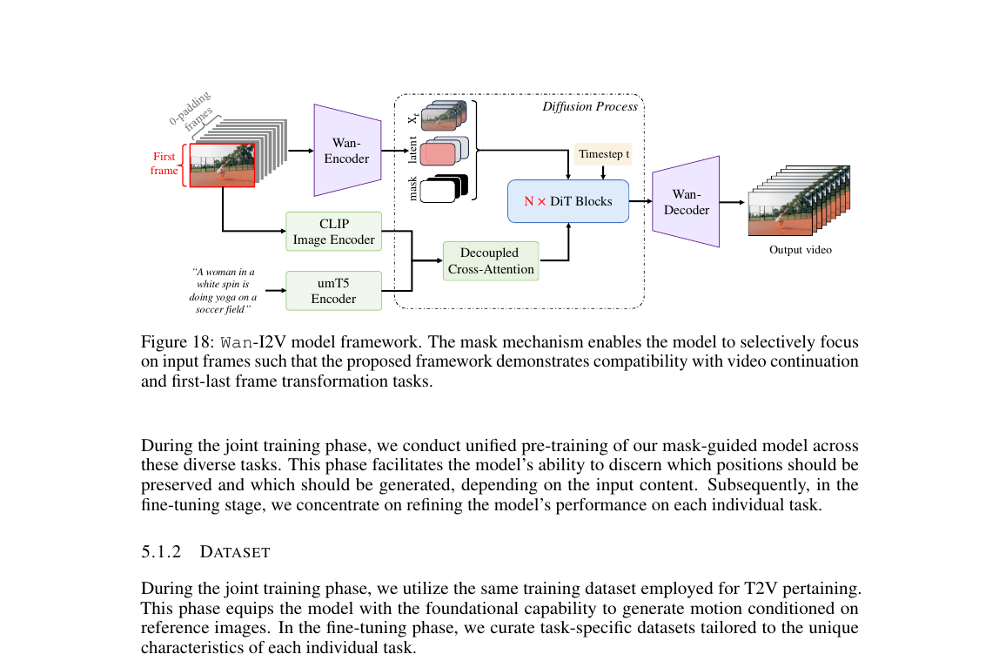

[← 返回论文 README](../README.md) ｜ [← 上一节 04.5-7 Prompt+Eval](04-prompt-eval.md)

# 05.1 · Image-to-Video Generation（贴近你的使用场景）

> **来源**：Wan paper §5.1（p26–29，full.md 行 1807–1965）
>
> **一句话定位**：T2V（文生视频）的扩展任务 —— **给一张图 + 一段文字，让图"动起来"成为视频**。这是你之前在 RoboTwin 上跑的那个任务（用 Wan-I2V 给仿真机器人初始帧加上 prompt 生成动作视频）。Wan-I2V 在 T2V 基础上加了"图像锚定"机制。

---

## 📌 预览

```
   I2V 任务 = 给图 + 文字 → 输出视频（首帧 = 输入图 + 后续 = 模型生成）
   
   核心架构修改（vs T2V）：
   ──────────────────────────────────────
   1. Mask 机制: 用 binary mask 标记"哪些帧是输入 / 哪些要生成"
   2. Condition latent: 输入图 → Wan-Encoder → condition latent，和 noise latent 沿 channel 轴 concat
   3. CLIP 全局上下文: 输入图过 CLIP encoder + 3层 MLP → decoupled cross-attention 注入 DiT
   4. 多任务统一: I2V / 视频续写 / 首尾帧过渡 / 帧插值 都用同一框架
   
   训练 2 阶段：
   ──────────────────────────────────────
   Stage 1 (joint pre-training): 用 T2V 数据集，多任务统一训练
   Stage 2 (task-specific fine-tuning): 每个具体任务用专属数据集 SFT
                                        SFT 阶段才加入 CLIP image encoder
```

---

## 📄 §5.1 框架与架构

### Figure 18 —— Wan-I2V 完整流程



> Figure 18: Wan-I2V model framework. The mask mechanism enables the model to selectively focus on input frames such that the proposed framework demonstrates compatibility with video continuation and first-last frame transformation tasks.

💡 **图怎么读** —— 比 T2V 多两个旁路：

```
T2V 时（你已学过）:                I2V 多了什么:
─────────────────────              ─────────────────────────
text → umT5 → cross-attn           ✓ 还有 (T2V 的部分都保留)
noise latent → DiT → output                +
                                   ┌─ 输入图 → Wan-Encoder → condition latent
                                   │       (和 noise 沿 channel concat)
                                   │
                                   ├─ Mask: 标"哪些帧是输入"，concat 到 channel
                                   │
                                   └─ 输入图 → CLIP Image Encoder → 3-layer MLP
                                              → 全局上下文 → decoupled cross-attn
```

**整个 forward pass**：

1. 文本走 umT5 → 文本 token
2. 输入图（"first frame"）走 Wan-Encoder → image latent
3. **mask** 标记图所在的位置（首帧位置=1，其他=0）
4. **noise latent + condition latent + mask 沿 channel 轴 concat** → DiT 的输入 channel 数翻倍多了点
5. 输入图**额外**走 CLIP encoder → MLP → 通过 **decoupled cross-attention** 注入到 DiT 每个 block
6. DiT N × blocks 处理
7. Wan-Decoder → 输出视频

⚠️ **DiT 的输入 channel 比 T2V 多**：T2V 是 c=16，I2V 是 2c+s（约 33 channel）。论文增加一个 **zero-initialized projection layer** 来吸收这个差异。

---

### §5.1.1 Model Design 详细拆解

#### 设计 1：Channel-wise Concat（继承 I2VGen-XL / SVD 思路）

> "we concatenate the condition image I ∈ R^(C×1×H×W) with zero-filled frames along the temporal axis, and these guidance frames Ic are compressed by Wan-VAE into condition latent zc"

```
输入图 I:  C × 1 × H × W   (只有 1 帧)
       ↓ 拼接 0 帧到时间维 (T-1 个零帧)
Guidance Ic: C × T × H × W    (T 帧，第 1 帧是输入图，其他是 0)
       ↓ Wan-VAE Encode
condition latent zc: 16 × t × h × w  (压缩到 latent)
       ↓ 沿 channel 轴 concat
和 noise latent zt 一起进 DiT
```

⚠️ **关键不是"覆盖首帧"而是"每帧都给 DiT 看一份输入图压缩信息"**。这让模型在生成每一帧时都能参考这张输入图。

#### 设计 2：Mask 机制（Wan 的关键创新）

> "we introduce a binary mask M ∈ {0, 1}^(1×T×h×w) where 1 indicates the preserved frame and 0 denotes the frames to be generated"

**Mask 的作用**：明确告诉 DiT "**哪些帧是已知的（要保留），哪些帧是需要你生成的**"。

```
I2V 任务:                          视频续写任务:                     首尾帧过渡任务:
mask = [1, 0, 0, ..., 0]            mask = [1, 1, ..., 1, 0, 0, ..., 0]   mask = [1, 0, ..., 0, 1]
       ↑首帧已知                          ↑前 1.5s 已知，后 3.5s 生成        ↑首尾已知
```

🪄 **巧妙之处**：**同一个模型 + 不同 mask = 不同任务**。这就是 Figure 18 caption 说的 "compatibility with video continuation and first-last frame transformation tasks"。

#### 设计 3：CLIP Image Encoder + Decoupled Cross-Attention（全局上下文）

> "we utilize the image encoder of CLIP to extract feature representations from the condition image, and the extracted features are projected by a three-layer MLP, which plays a role as global context. The produced global context is then injected into the DiT model via decoupled cross-attention."

**为什么除了 channel concat 还要再加 CLIP**？

```
Channel concat 给模型的是"压缩后的图像 latent"
   → 局部空间细节强
   → 但全局语义可能丢

CLIP 给模型的是"图像的 high-level 语义特征"
   → 全局语义强
   → 通过 cross-attention 注入到 DiT 每个 block

两者互补 = 局部 + 全局都覆盖
```

⚠️ **Decoupled cross-attention** = 和 umT5 文本 cross-attention **平行**的另一路 cross-attention，专门给 CLIP 图像特征用。两路 cross-attention 互不干扰（"decoupled"）。

#### 设计 4：多任务统一框架

> "we incorporate multiple tasks, i.e., image-to-video generation, video continuation, first-last frame transformation, and random frame interpolation, into our unified framework"

**4 个任务，一个模型**：
- I2V：首帧已知
- 视频续写（continuation）：前 1.5s 已知
- 首尾帧过渡：首尾帧已知
- 随机帧插值：中间一些帧已知

通过 **mask 不同**实现不同任务。这是模型架构设计的优雅之处 —— **同样的训练 + 推理 pipeline 服务多任务**。

---

### §5.1.2 Dataset —— 数据筛选很讲究

#### Joint pre-training 阶段：用 T2V 数据集

不挑数据，让模型先学到"图像 + 视频"的基本对应关系。

#### Fine-tuning 阶段：每任务专属精筛

**I2V 数据集**：

> "when the first frame in the training data significantly differed from the video content, the model struggled to learn stable image-driven video generation."

**首帧和视频内容差距大 → 模型学不会"以图为锚"**。Wan 怎么解：

```
1. 用 SigLIP 抽首帧特征 + 后续帧的平均特征
2. 算 cosine similarity
3. 只保留 similarity > 阈值 的视频
   → 数据里"首帧能预测后续"的样本占主导
```

**视频续写数据集**：用 SigLIP 算 "前 1.5s 与后 3.5s" 的相似度，**保留时间连贯性强**的样本。

**首尾帧过渡数据集**：相反，**保留首尾差异显著**的样本（让模型学"做大转场"）。

⚠️ **数据筛选体现任务理解**：每个任务对数据的"理想性质"不同，用 SigLIP cosine similarity 作为信号很巧妙。

---

### §5.1.3 Evaluation

#### 训练分两阶段

> "In the initial pre-training stage, we employ the same dataset as that used in the T2V task. Given the slightly larger number of frames involved in this stage, **the image encoder branch is excluded**"

⚠️ **Pre-training 阶段不加 CLIP image encoder**！为什么？
- 让模型先**强化文本-视频的对齐**
- 避免 CLIP 特征 "干扰" pre-training 阶段的纯视觉学习

**SFT 阶段才加入 CLIP**，提供 global context。

#### Table 7: I2V Win Rate

```
对手        Visual Quality  Motion Quality  Matching   Overall
CN-TopA       29.2%（输）       21.7%（输）   -4.2%（输） 10.8%（输）
CN-TopB       60.8%（赢）       21.7%（输）   35.0%（输） 47.5%（输）
CN-TopC       24.6%（输）       32.5%（输）   51.7%（赢） 50.8%（接近平）
CN-TopD       55.6%（赢）       67.0%（赢）   72.2%（赢） 81.6%（大胜）
```

⚠️ **意外发现**：Wan-I2V **不是全胜**。在 CN-TopA 上反而**输得明显**（10.8% overall ranking）。

🤔 **可能原因**：CN-TopA 在 I2V 这个赛道是国内 Top 玩家。Wan 14B 主要 T2V 旗舰，I2V 是 SFT 衍生 → 不一定干得过专做 I2V 的对手。

⚠️ **结合你的实际使用场景**：你跑的是 RoboTwin 仿真器，不是普通自然视频。**Wan-I2V 在仿真域的表现可能和 Table 7 完全不一样** —— 仿真数据分布特殊。

---

## 💡 Section 总结

### 核心信息速查

| 维度 | 内容 |
|---|---|
| **任务** | 给图 + 文字 → 输出视频（首帧锚定） |
| **关键架构修改** | Channel concat (image latent + noise + mask) + CLIP global context |
| **Mask 机制** | binary mask 标记输入帧 vs 待生成帧 |
| **多任务统一** | I2V / 视频续写 / 首尾帧 / 帧插值 共用框架 |
| **CLIP 注入方式** | Decoupled cross-attention（和 umT5 cross-attn 平行） |
| **DiT 输入 channel** | T2V: c=16；I2V: 2c+s ≈ 33（多了 condition + mask） |
| **训练 2 阶段** | Pre-training（无 CLIP 分支）→ SFT（加入 CLIP） |
| **数据筛选关键** | SigLIP cosine similarity 选首帧-内容高一致性的视频 |
| **测试结果** | 对国内 I2V Top 玩家（CN-TopA）偶有败绩，对其他模型领先 |

### 核心洞察

1. **I2V 不是 T2V + "把首帧固定" 这么简单**：需要 channel concat + mask + CLIP global context 三个机制配合。**架构设计是结构性的，不是参数微调**。

2. **Mask 机制实现了多任务统一**：I2V / 视频续写 / 首尾帧过渡 / 帧插值 全部共用一个模型，通过 mask 模式区分。这是**架构层面的优雅**。

3. **CLIP image encoder 和 channel concat 是互补的**：channel concat 给"局部 latent 表征"，CLIP 给"全局语义"。**多通路条件注入**是当前 conditional generation 的标配。

4. **Pre-training 阶段不加 CLIP** 是个值得记住的 trick：强化基础能力时不引入额外条件，等基础稳固后 SFT 阶段再加。

5. **数据筛选 = "用什么数据决定模型学什么样"**：I2V 要"首帧能预测后续"的视频；视频续写要时间连贯的；首尾帧过渡要差异大的。**对不同任务用不同筛选标准**。

6. **Wan-I2V 在 I2V 这个赛道不是绝对 SOTA**：对国内 Top 玩家有败绩。这提醒我们 —— Wan 的强项在 **T2V 通用能力**，I2V 是 SFT 衍生，**特定垂直领域可能输给专精模型**。

---

## 🤔 我的 Follow-up

1. **CLIP image encoder 选的哪个版本**？ViT-L？ViT-G？影响 global context 表征能力
2. **Decoupled cross-attention 具体在 block 里和 umT5 cross-attn 是并行还是串行**？影响训练动力学
3. **mask 的 spatial size 和 condition latent 一致 → mask 在 latent 空间还是 pixel 空间**？论文有点含糊
4. **首帧外的 zero-filled frames 真的会被 VAE encode 吗**？还是只 encode 第一帧再 broadcast？这是工程实现细节
5. **你跑 Wan-I2V 在 RoboTwin 上感觉效果如何**？你的实战经验是个独特视角，值得记下来

---

## 🔥 拷打记录

### Round 7 · 2026-05-10（新格式）

#### Q5.1.1 ｜ I2V 比 T2V 多了哪些"东西"？

**问题**：Wan-I2V 在 T2V 基础上额外加了哪几个机制？分别解决什么问题？

**标答**：

| 机制 | 解决的问题 |
|---|---|
| **Channel concat (condition latent + noise + mask)** | 让 DiT 在生成每帧时都能看到输入图的"局部 latent 表征" |
| **Mask 机制** | 明确告诉模型"哪些帧已知 / 哪些要生成"，支持 I2V / 续写 / 首尾帧 / 帧插值 多任务 |
| **CLIP image encoder + Decoupled cross-attn** | 给 DiT 注入输入图的"全局语义" —— 和 channel concat 互补（局部 + 全局） |
| **Zero-initialized projection layer** | 因为 I2V DiT 输入 channel 数比 T2V 多（2c+s vs c），需要新的入口投影层 |

**Take-away**：I2V ≠ T2V + 简单覆盖首帧。需要**多通路条件注入**（channel + cross-attn）+ **任务 routing**（mask）。这是结构性架构修改，不是简单 fine-tune。

---

#### Q5.1.2 ｜ 为什么 Pre-training 不加 CLIP，SFT 才加？

**问题**：Wan-I2V 训练分 pre-training（不加 CLIP 分支）+ SFT（加 CLIP）两阶段。**为什么这么分**？

**标答**：

**Pre-training 目的**：让模型**先学好"文本 → 视频"基础对齐**。
- 强化 text-video alignment
- 让 DiT 在没有图像条件的情况下也能生成
- 这是基础能力

**SFT 目的**：在已有基础上精修 I2V 特定能力。
- 加入 CLIP image encoder
- 用 task-specific 数据微调
- 让模型学会"以图为锚"

**反过来想**：如果 pre-training 就加 CLIP，会怎样？
- 模型可能"过度依赖图像信号"，T2V 能力受损
- pre-training 数据质量参差不齐，CLIP 引入额外噪声
- 训练动力学变复杂，可能不稳定

**Take-away**：**循序渐进**是大模型训练的核心原则。基础能力先建立，特殊能力后加入。这呼应了 §4.2.2 的 "256→480→720 渐进 resolution" 哲学。

---

#### Q5.1.3 ｜ Mask 机制怎么实现"一个模型多任务"？

**问题**：Wan-I2V 用 mask 让同一个模型支持 I2V / 视频续写 / 首尾帧过渡 / 帧插值。**举例说明 4 种任务对应的 mask 长什么样**？

**标答**：

```
T 帧视频，mask 是 [m_1, m_2, ..., m_T]，每个 m_i ∈ {0, 1}

I2V (首帧给定):
mask = [1, 0, 0, 0, ..., 0]
       ↑首帧已知，后面全生成

视频续写 (前段给定):
mask = [1, 1, 1, 1, 1, 0, 0, ..., 0]
       ↑前 5 帧已知，后面生成

首尾帧过渡 (首尾给定):
mask = [1, 0, 0, 0, ..., 0, 1]
       ↑首尾已知，中间生成（动作转场）

随机帧插值 (中间几帧给定):
mask = [1, 0, 0, 1, 0, 0, ..., 0, 1]
       ↑某些位置已知，其他生成
```

**关键洞察**：模型不需要知道"现在在做什么任务"，**它只需要知道"哪些位置已知 vs 哪些要生成"**。这层抽象让一个模型自然支持多任务。

**Take-away**：好的多任务设计 = 找到一个**通用抽象**（这里是 mask），不同任务在这个抽象下成为参数化的特例。**比给每个任务训独立模型优雅 10 倍**。

---

### Round 7 总结

| 题 | Take-away |
|---|---|
| Q5.1.1 | I2V 是结构性架构扩展（channel + cross-attn + mask），不是简单 fine-tune |
| Q5.1.2 | 训练循序渐进：基础能力先稳固，特殊能力后注入 |
| Q5.1.3 | Mask 抽象让一个模型支持 4 种任务 —— 通用抽象 > 独立模型 |

**§5.1 完成 ✅**

---

[← 返回论文 README](../README.md) ｜ [← 上一节 04.5-7 Prompt+Eval](04-prompt-eval.md)
