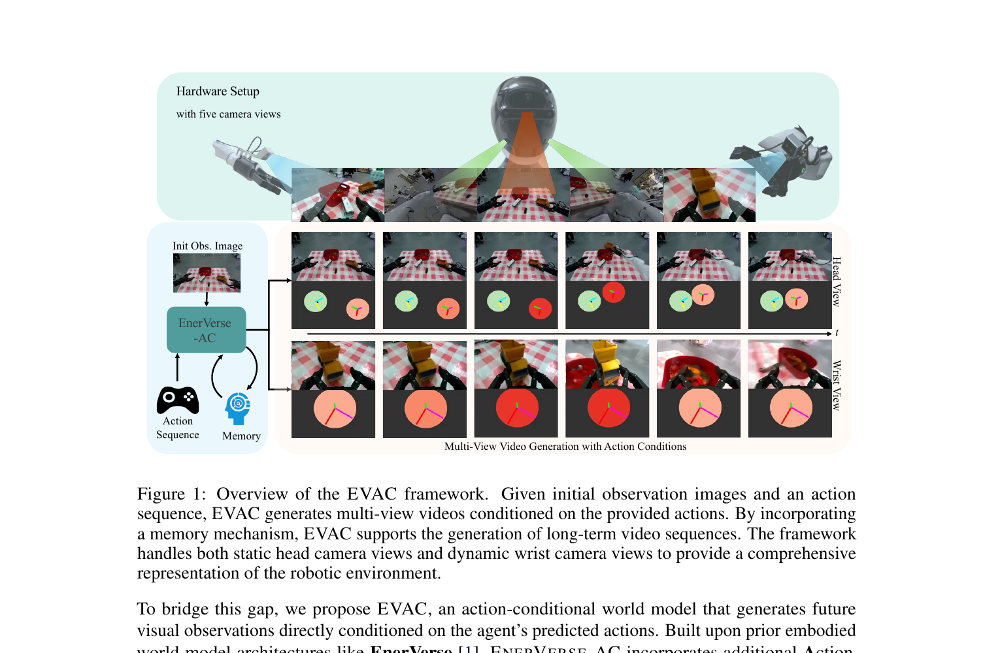
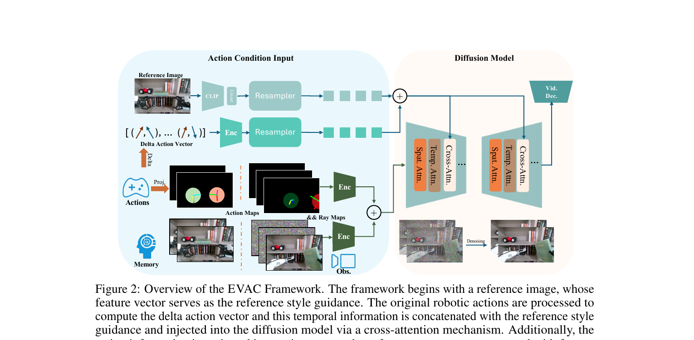
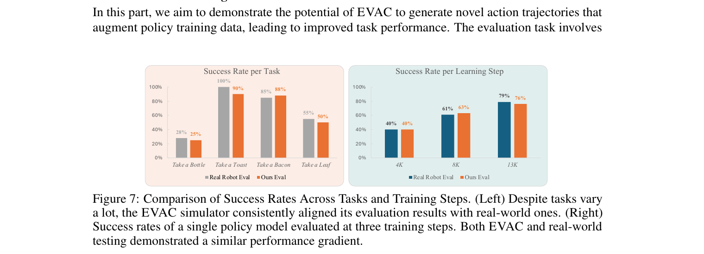

[← 返回 EnerVerse-AC 主页](../README.md)

# 串讲 · 几张图过完 EnerVerse-AC

> **arXiv 2505.09723** · 2025/05 · 作者 Jiang / Chen / Huang / 等多人 (AgiBot + SJTU + MMLab-CUHK)
>
> **Uni-WAM 视角的前置判断**：**a 类 AC-WM，真正具身 robot manipulation 场景** ⭐。来源于 EnerVerse 系列（同一团队前作），是 Ctrl-World §5.2 的对照 baseline。

---

## 1. 这篇 paper 解决的是什么问题？

| 痛点 | 现状 |
|---|---|
| **真机评估 policy 太贵** | 部署机器人去测 policy generalization 既费时又难规模化 |
| **WM 作为 evaluator 缺乏 action 控制** | EnerVerse 前作（同团队 2024）是 video gen 但不接 action，无法做 closed-loop policy eval |
| **失败 trajectory 数据少** | 仅用成功 demo 训 WM, 无法在多样真实场景里维持 fidelity |

**EnerVerse-AC 一句话定位**：
> 在 EnerVerse 基础上**加 action condition**，做成 **多视角 + 长时 + 数据增强**的真机 robot manipulation AC-WM，专门用来替代真机做 policy evaluation。

---

## 2. 方案全景 · Figure 1 看懂

**Figure 1 展示 EVAC 的工作流**：

### 输入端（左侧）
- **Hardware Setup**：5 个相机视角的真实机器人
- **Init Obs Image**：初始观测
- **End Effector** + **Action Sequence**：从 policy 输出的动作
- **Memory**：历史帧记忆

### 核心引擎（中间）
- **EVAC** = 接受 (obs + action) → 生成 multi-view video

### 输出端（右侧）
- **Multi-View Video Generation with Action Conditions**
- 含 static 相机和 dynamic wrist 相机视角

🔥 **核心特点**：
- **5 个相机视角联合预测**（含 wrist-view dynamic 相机）
- **长时 chunk-wise inference**（保持时序一致性）
- 训练数据包含 **人工收集的 failure trajectories**（关键创新）

---

## 🔄 前置认知：EnerVerse-AC vs Ctrl-World

两篇都是 robot manipulation AC-WM evaluator，但有差异：

| 维度 | Ctrl-World | **EnerVerse-AC** |
|---|---|---|
| 时间 | 2025/10 | 2025/05 |
| 团队 | Stanford + Tsinghua | **AgiBot + SJTU + CUHK**（中国学术界+产业）|
| 数据 | DROID（公开）| **AgiBot World**（私有，AgiBot 自己 1M+ trajectories）|
| 相机数 | 3 cam（含 wrist） | **5 cam（含 dynamic wrist）**|
| Backbone | SVD 1.5B | **EnerVerse 自家 video diffusion (VDM, GO-1)** |
| Action 注入 | Frame-level cross-attention | **Multi-level action condition injection（spatial + delta + RGB）**|
| Failure 数据 | 来自 DROID（19k human failure）| **人工 augmented failure trajectories** |
| 用途 | Policy ranker + synthetic data | Policy evaluator + data engine（生成新 action）|

→ **EnerVerse-AC 更工业向**（AgiBot 系），数据更专门（含人工 augmented failure），多视角更激进（5 cam）。

---

## 3. 核心方法 · Figure 2 架构

**架构两块**：

### 左半：Action Condition Input
- **Reference Image** + **Initial Action** + **Delta Action**（动作变化量）
- 通过 multi-level encoding 形成 action condition

### 右半：Diffusion Model
- 接 action condition 输入
- 输出 multi-view video chunk
- 配合 **Cross-Attention** + **Memory** 模块

🔥 **Action 注入方式 = Multi-Level Action Condition**（论文 §3.1）：

| 子模块 | 内容 |
|---|---|
| **Spatial-Aware Pose Injection** | 把 6D pose（位置 + 朝向）画成 RGB image，再喂进 diffusion model（视觉 token level）|
| **Delta Action Attention** | 动作变化量（delta）通过 cross-attention 注入（temporal 一致性）|
| **End-effector Pose RGB** | gripper open/close 用颜色 magnitude 编码（visualize 进 RGB）|

→ 这是**比 frame-level cross-attention 更多样化的 action 注入**（多个层面 + 视觉 + cross-attention 多管齐下）。

---

## 4. 实验 · Figure 7 主结果

**实验目标**：验证 EVAC 评估结果和真机一致

### 左图：Success Rate per Task
- 4 个 task：Take a Bottle / Toast / Bacon / Leaf
- 灰色 = Real Robot Eval, 橙色 = Ours (EVAC) Eval
- **数字几乎完全对齐**：28%/25% / 100%/90% / 85%/88% / 55%/50%

### 右图：Success Rate per Learning Step
- 单一 policy 在 3 个训练 step（4K / 8K / 13K）的表现
- 真机 vs EVAC 在每个 checkpoint 上**变化趋势完全一致**

🔥 **结论**：EVAC 作为 evaluator **不只是平均分对**，**逐 task / 逐 training step 都对得上**。比 Ctrl-World 的 r=0.78 / y=0.87x-0.04 更精细对齐。

---

## 5. Summary · 整篇 paper 一段话

> **EnerVerse-AC** 是 AgiBot 团队在 EnerVerse 前作基础上**加 action 条件**做出来的 robot manipulation AC-WM。核心创新：**5 相机多视角**（含 dynamic wrist）、**multi-level action condition injection**（pose RGB + delta cross-attention + gripper RGB）、**人工 augmented failure trajectories** 训练数据。
>
> 主结果：在 4 个 task 上, EVAC 评估和真机评估**逐 task + 逐训练 step 都对齐**。可以作为 policy evaluator **和 data engine**（生成 novel action trajectories augment 训练数据）。

### 三个最该记住的点

| # | 点 | 一句话 |
|---|---|---|
| 1 | **Multi-Level Action Injection** | pose RGB + delta cross-attention + gripper magnitude RGB, 多管齐下 |
| 2 | **失败数据的 human augmentation** | 人工生成 failure trajectories 加强 training data 覆盖 |
| 3 | **逐 task + 逐 step 对齐** | 比 Ctrl-World 更细粒度验证 evaluator 可靠性 |

### 一句话标签

> **EnerVerse-AC = AgiBot 出品的"多视角 + 多级 action 注入 + 人工 failure 数据"robot AC-WM**。

---

### 🔥 Uni-WAM 视角的简评

**对 Uni-WAM 的高价值借鉴**：
- ✅ **多视角 + 多级 action 注入**：Uni-WAM 也想做多视角，可以借鉴 spatial-aware pose injection 的工程做法
- ✅ **人工 augmented failure data**：和 Uni-WAM 的"仿真器造 off-expert"思路异曲同工 —— 都是认识到"光用 expert demo 不够"
- ✅ **逐 task / 逐 step 对齐验证**：比 Ctrl-World 的 ranking alignment 更严格，Uni-WAM 可借鉴

**仍未碰的部分**（Uni-WAM 切入空间）：
- ⚠️ 失败数据是 **人工 collected real-world failure**，仍是"human-attempted"分布，**不是 systematic off-expert（counterfactual / random-feasible）**
- ⚠️ 评估 policy 都是公司内部 policy（VLA-MLLMs），没测 sub-optimal RL checkpoint
- ⚠️ 没有 OOD action 评估的 metric 设计

**分类**：a 类 AC-WM (真具身 robot manipulation)。
