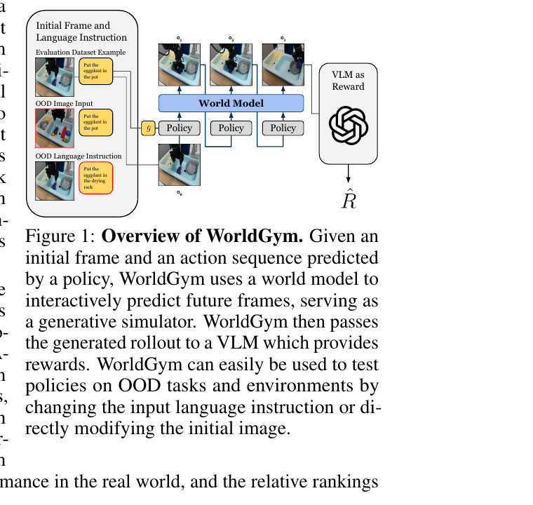
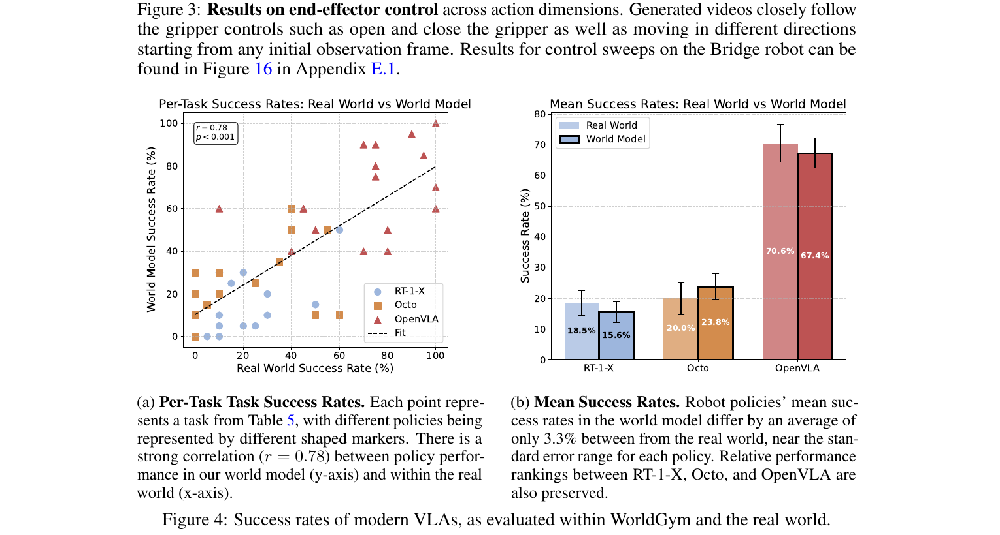
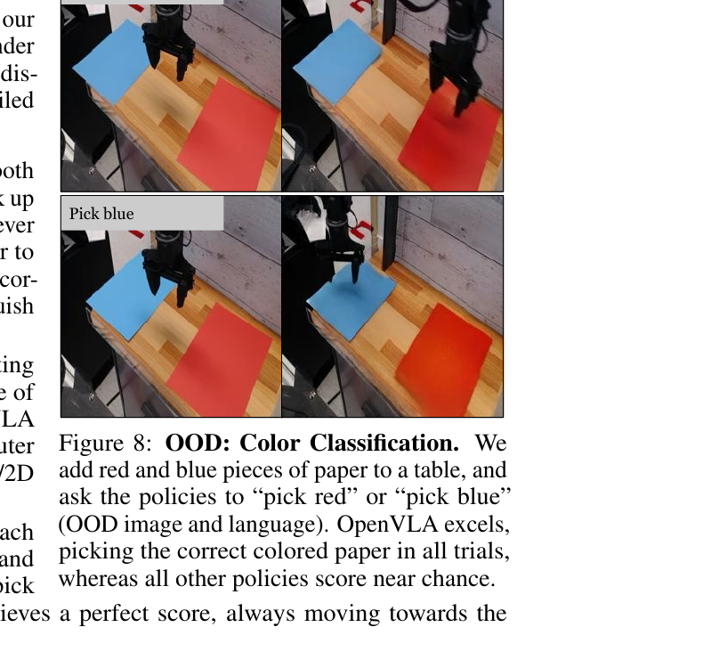

[← 返回 WorldGym 主页](../README.md)

# 串讲 · 几张图过完 WorldGym (WPE)

> **arXiv 2506.00613 (v3 2025/09)** · 作者 Quevedo / Sharma / Sun / Suryavanshi / Liang / Yang (Stanford / NYU / Google DeepMind)
>
> ⚠️ **命名变更**：paper v1 叫 "WPE (World-model-based Policy Evaluation)"，**v3 改名 "WorldGym"**。文件名沿用 WPE。
>
> ⚠️ **可能与翔哥已填的 WorldGym (2025/05) 是同一篇** —— 翔哥写"测了 OOD language + OOD initial image / 没考虑 OOD action"，和这篇完全对得上。

---

## 1. 这篇 paper 解决的是什么问题？

| 痛点 | 现状 |
|---|---|
| **评估 robot policy 太贵** | 需要真机反复 rollout，手工 task setup，工程复杂，难规模化 |
| **现有 WM 评估范围窄** | 只能用 training 分布内的 task，不能造新 OOD 场景 |

**WorldGym 一句话定位**：
> 训一个 **action-conditioned video gen WM**，把它当 simulator，**给定 initial image + language + action sequence，模拟出 rollout video**，再用 **VLM 当 reward model** 判断 task success。

→ **核心 claim**：在 WorldGym 里评估 policy 排名，**和真机排名高度相关（r=0.78）**，且**可以改 image / 改 language 测 OOD setting**。

---

## 2. 方案全景 · Figure 1 看懂

**3 路输入**（左侧）：
- **Initial Frame + Language Instruction**（标准 setting）
- **OOD Image Input**（改图片测 OOD）
- **OOD Language Instruction**（改语言测 OOD）

**核心循环**：
- Initial frame + instruction → **Policy** 输出 action
- Action → **World Model** 生成下一段 frame
- Frame → Policy → 下一段 action → ... 循环

**右侧**：
- 完整 rollout video → **VLM as Reward** → 判断 success / 输出 R̂

🔥 **WorldGym 的核心 trick**：
- **WM 学的是 action-conditioned video gen**（autoregressive，diffusion-based）
- **Reward 不学，直接用 VLM 当 oracle**（如 GPT-4o）

→ 解决了 Ctrl-World §4.2 那个"human-preference labeling 太贵"的痛点：**用 VLM 自动判 reward**。

---

## 🔄 前置认知：WorldGym vs Ctrl-World

两篇 paper 解决**同一个问题**，但路线不同：

| 维度 | Ctrl-World | **WorldGym** |
|---|---|---|
| 时间 | 2025/10 | 2025/06 (v3 2025/09) |
| WM 起点 | **SVD 1.5B**（passive video gen + AC finetune）| **从头训 diffusion video gen** |
| Action 注入 | Frame-level cross-attention | **Bidirectional attention + diffusion forcing**（chunk-wise causal）|
| Reward | **人工标注** success/failure | **VLM (GPT-4o) 自动判** |
| 测的 policy | 3 个 generalist VLA（π₀ / π₀-FAST / π₀.₅）| **3 个不同 VLA**（RT-1-X / Octo / OpenVLA）|
| 数据 | DROID（含 76k success + 19k failure）| **Bridge / Open X-Embodiment**（标准 robot demo）|
| OOD 测试维度 | 新相机位姿（视觉 OOD）| **OOD image + OOD language**（场景 OOD）|

→ **互为对照**：两篇都没碰 **off-expert action OOD**，但都做了某种 OOD 测试。

---

## 3. 核心方法（简略）

WorldGym 的 method 没有 Ctrl-World 那种突出的"frame-level cross-attention"创新。它更像**工程整合**：

1. **WM 架构**：autoregressive diffusion video model，类似 Diffusion Forcing (Chen et al. 2024)
2. **Action 注入**：每 chunk 16 帧 bidirectional attention + causal cross-chunk
3. **训练**：在 Bridge / Open X-Embodiment 等真机数据上 fine-tune
4. **Reward**：VLM (GPT-4o) 看 generated video，prompt 工程判 success

🔥 **WorldGym 的 method 贡献不大，主要贡献在"系统化的 evaluation framework"**。

---

## 4. 实验 · Figure 4（核心结果）

**这张图证明 WorldGym 是个 reliable evaluator**。

### (a) Per-Task Success Rate
- 横轴：每个 task 在**真机**上的成功率
- 纵轴：同 task 在 **WorldGym** 里的成功率
- 颜色 = policy（RT-1-X / Octo / OpenVLA）
- 形状 = task
- **Pearson r = 0.78**（强正相关）

### (b) Mean Success Rate
- 三组柱状图：RT-1-X / Octo / OpenVLA
- 每组里 Real World vs World Model
- → WorldGym 大致**保留了 policy 排序**（虽然绝对值偏低，但 ranking 一致）

🔥 **结论**：WorldGym 作为 policy ranker 可用，**和 Ctrl-World §5.3 的 y=0.87x-0.04 是同样性质的结果**。

---

### Figure 8：OOD 测试示例

**OOD Color Classification**：给 policy 加难度
- 改 instruction："Pick red"/"Pick blue"（不是 just "pick")
- 测 policy 能不能根据颜色区分

→ WorldGym 可以**改 image + 改 language** 来造 OOD setting，是它区别于 Ctrl-World 的一个能力。

---

## 5. Summary · 整篇 paper 一段话

> **WorldGym** 提出一个 **action-conditioned video gen WM + VLM reward** 的 evaluation framework，让 VLA policy 可以在 imagination 里被 rank。在 RT-1-X / Octo / OpenVLA 上证明 ranking 和真机相关性 r=0.78，且能造 **OOD image / OOD language** 场景测 policy generalization。
>
> 核心定位：**用 WM 当 simulator + VLM 当 judge 的 policy evaluation 范式**（系统化整合，method 贡献不大）。
>
> ⚠️ **没测 OOD action**（这是翔哥点的 ❌）—— OOD 只在 image 和 language 两个轴，**没在 action 轴**。

### 三个最该记住的点

| # | 点 | 一句话 |
|---|---|---|
| 1 | **VLM as Reward** | 用 GPT-4o 自动判 success，省人工标注（vs Ctrl-World 的人工标注）|
| 2 | **OOD 维度** | 改 image / 改 language，**没改 action** |
| 3 | **真机相关性 r=0.78** | 和 Ctrl-World y=0.87x-0.04 是同等级证据 |

### 一句话标签

> **WorldGym = "VLM as judge + AC video gen as simulator"的 policy evaluation 框架**。

---

### 🔥 Uni-WAM 视角的简评（不展开）

- ✅ **VLM as reward 思路启发**：Uni-WAM 的 GPR Component 3（物理交互合理性用 Qwen3-VL）就是这个思路的实现
- ✅ **OOD image / language 测试范式可借鉴**
- ⚠️ **完全不测 OOD action**（翔哥点的 ❌）—— 正是 Uni-WAM 切入的空白
- ⚠️ Method 贡献偏弱，可以 focus on 它的 evaluation framework 思路而不是架构

**分类**：a 类 AC-WM。
