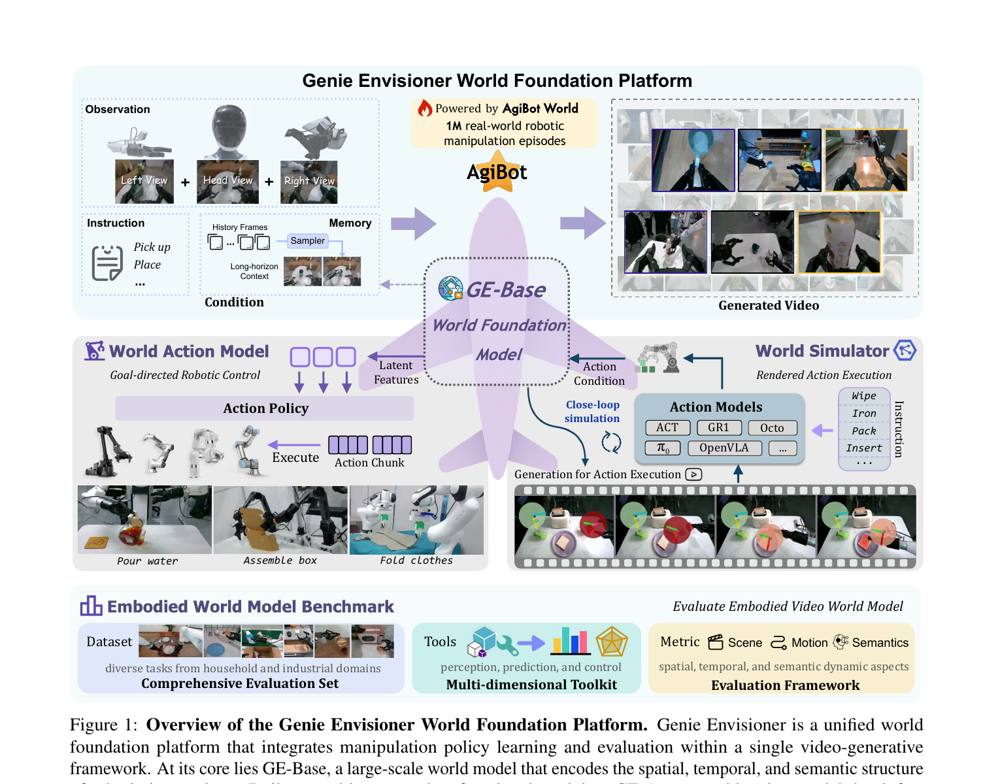
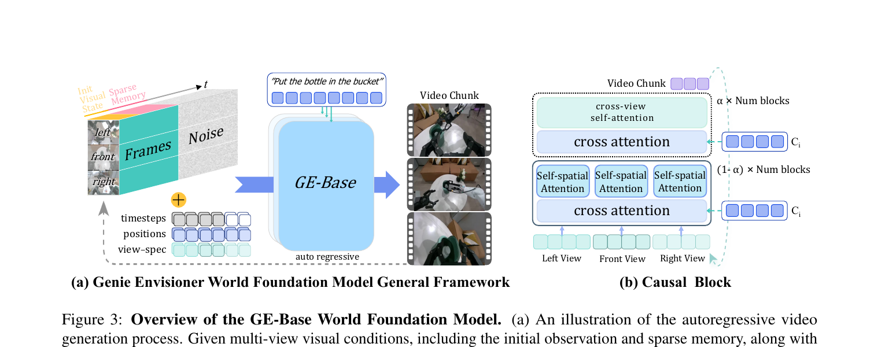
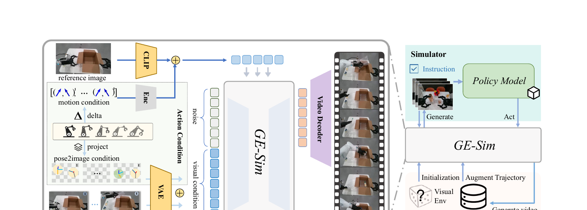
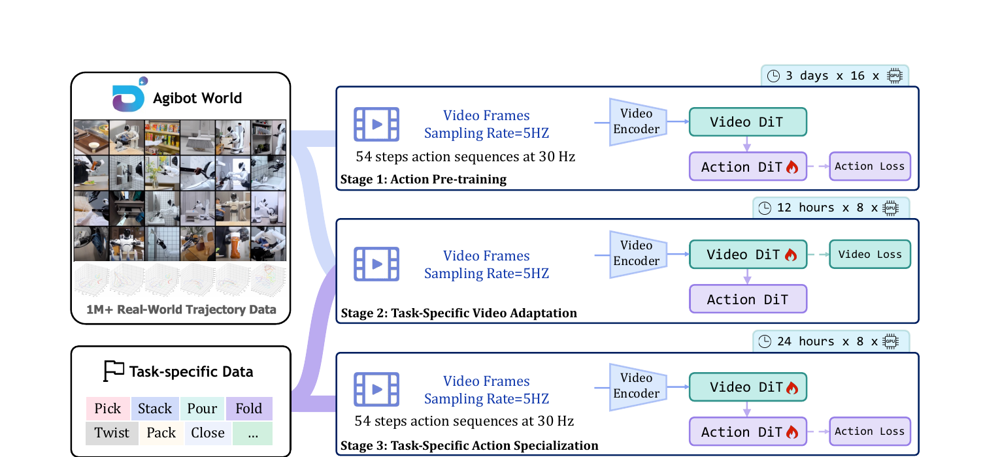

[← 返回 Genie Envisioner 主页](../README.md)

# 串讲 · 几张图过完 Genie Envisioner

> **arXiv 2508.05635 (v3 2025/11)** · 2025/08 首次发布 · 作者 Liao / Zhou / Huang 等 14 人 (AgiBot Genie Team + LV-NUS + BUAA)
>
> **Uni-WAM 视角的前置判断**：**a 类 AC-WM 平台** ⭐⭐ — 真具身 manipulation；**EnerVerse-AC 的同团队后续 + 统一框架**。

---

## 1. 这篇 paper 解决的是什么问题？

| 痛点 | 现状 |
|---|---|
| **现有 robot manipulation 系统是"补丁堆叠"** | data collection / training / evaluation 各自独立, 用不同 representation |
| **Manual reprogramming 难规模化** | 新任务、新模态、新场景都需要手工调整, hindering scalability |
| **现有 video gen WM 缺 closed-loop** | T2V model 能生成视频但**不能 act**, 形成不了 policy 闭环 |

**Genie Envisioner 一句话定位**：
> AgiBot 团队把**数据 / 训练 / 评估 / 模拟**全部塞进**一个 closed-loop video generative world model framework**。模式：先训一个超大 video diffusion (GE-Base)，再衍生出 policy (GE-Act) + simulator (GE-Sim) + benchmark (EWMBench)。

---

## 2. 方案全景 · Figure 1 看懂（详细带读版）



Figure 1 是这篇论文的"地图"——读懂它,全文一大半就通了。我们一块一块拆。

### 2.1 第一眼:这张图的"机翼"布局

注意正中间那架紫色的飞机——这不是装饰,是作者特意安排的视觉隐喻。**机身 = GE-Base**(整个平台的基座),两翼挂着两个功能模块,最下面是一套评估套件。所以全图实际上是**四个区**:

```
                ┌───────────────────────────────────────────────┐
                │  上方:GE-Base World Foundation Model         │  ← 机身
                │      (基座:视频生成基础模型)                 │
                └───────────────────────────────────────────────┘
                ┌─────────────────────┐  ┌────────────────────┐
                │  左翼:GE-Act        │  │  右翼:GE-Sim       │
                │  (World Action      │  │  (World Simulator)  │  ← 两翼
                │   Model,出动作)    │  │  (闭环仿真)         │
                └─────────────────────┘  └────────────────────┘
                ┌───────────────────────────────────────────────┐
                │  底部:EWMBench                                │
                │       (评估套件)                              │
                └───────────────────────────────────────────────┘
```

🔑 **看图最先要抓的一点**:这张图想强调的核心是**"unified(统一)"** ——**四个模块共享同一个 GE-Base 基座**,不是四个独立系统拼一起。机翼可以拆下,机身始终在;基座撑起整个平台。

---

### 2.2 上方机身:GE-Base(视频基础模型)

**一句话钉死它是什么**:GE-Base 是一个**大规模 instruction-conditioned 视频扩散模型**,在 **AgiBot-World-Beta 100 万条真机操作 episode** 上预训练(图里那个红火苗 + AgiBot 星标就是在强调这一点)。它和 DiT 是同一家族(diffusion transformer),只是任务从"生成单张图"换成了"生成机器人操作的视频片段"。

#### 三路输入(Condition 区)

GE-Base 不凭空生成视频,它要看三样东西:

**① Observation(多视角观测)** —— 三张图:`Left View + Head View + Right View`。AgiBot 这套机器人头上和左右各装摄像头,**三个角度同时看**,这是模型当前的"眼睛"。为什么要多视角?单视角看不到自己手臂背面、看不到桌面遮挡区域,多视角让模型对 3D 场景有更完整的理解(Figure 3 的 cross-view causal block 专门处理这种跨视角一致性)。

**② Instruction(指令)** —— 自然语言任务描述,比如 `Pick up`、`Place`……告诉模型"接下来要干什么",通过文本编码器变成语义向量。类似 DiT 里的 class label `y` 起的作用 —— 当条件指导生成。

**③ Memory(记忆)** —— 这是 GE-Base 区别于单帧扩散模型的特色,有三个关键子部件:

- **History Frames**:不只看"当前这一帧",还看**过去发生过的若干帧**。机器人操作是连贯过程,没历史就会失忆(比如"刚才已经把瓶子拿起来了"的信息就丢了)。
- **Sampler**:历史帧可能成百上千,不能全塞,所以用一个 Sampler **稀疏采样几个关键帧**。
- **Long-horizon Context**:采出来的关键帧拼成"长程上下文",和当前观测一起喂给模型 ——让 GE-Base **既能看清"当下"又能记得"之前"**,生成长视频时保持时间连贯。

> ⚠️ **澄清一个易混点**:Memory 进 GE-Base 时**不是文本形式**,而是**视频 token 形式**。具体路径:历史帧 → Sampler 稀疏采样 → 每帧过 Video VAE encoder 压成 latent → patchify 切成 token → 拼进主序列。和 Observation 走的是同一条预处理管线,**只有 Instruction 那一路是文本 token**。

#### 中间:GE-Base 本体

机身的飞机就是 GE-Base。它做的事可以简化成:

```
三视角观测 + 指令 + Memory  ──→  GE-Base  ──→  下一段多视角视频(video chunk)
```

几个关键点:

- **一次只生成一小段视频**(叫 video chunk,比如几秒/几十帧),不是一次几分钟。这是因为视频生成开销巨大,而且要给"看清当下→生成下一段→再回头看→再生成"的循环留余地。
- 内部架构(Figure 3 详讲)是 **autoregressive 多视角视频扩散 Transformer**:多个视角并行生成 + 用 causal block 让三视角之间**互相通信保持一致**(不能左视角生成的是杯子、右视角却是碗)。
- 飞机贯穿上下两半——强调 **GE-Base 是平台所有其他模块的共享基座**。

#### 输出 + 自回归回路(关键)

输出是**多视角生成视频**(右边那个网格,每行对应一个视角,展示了不同操作场景的连续帧)。

仔细看:右边 Generated Video 那块有一条**虚线箭头反向指回 Memory**——这正是 **autoregressive(自回归)** 的本质:

```
[当前obs + 指令 + 历史memory]
         ↓
       GE-Base
         ↓
   生成 video chunk_1
         ↓
   chunk_1 加入历史 memory
         ↓
       GE-Base
         ↓
   生成 video chunk_2
         ↓
       (循环……)
```

就像"接龙写故事"——写一段(chunk),把它加进上下文,再续写下一段,每一段都依赖前面所有段,保证整个长视频是连贯的一条故事线。

---

### 2.3 左翼:GE-Act(World Action Model)

**一句话钉死**:GE-Act = 挂在 GE-Base 上的"动作分支",把 GE-Base 学到的"对世界的视觉理解",**翻译成真机能执行的一串动作**。

类比一下:**GE-Base 是"看懂世界"的视觉皮层,GE-Act 是"指挥肌肉"的运动皮层**。后者依赖前者的感知,负责把感知转成动作输出。

#### 数据流(从右往左追)

```
                   GE-Base
                     │  Latent Features
                     ▼
              ┌─────────────┐
              │ Action Policy│
              └──────┬──────┘
                     │
              ┌──────▼──────┐
              │ Action Chunk │  ← 一串动作,不是单个动作
              └──────┬──────┘
                     │ Execute
                     ▼
        ┌──────────────────────────┐
        │  各种机器人(多臂/形态)   │
        └──────────────────────────┘
        例:Pour water / Assemble box / Fold clothes
```

#### 关键细节

**① 输入是 Latent Features,不是 Generated Video**

划重点:GE-Act 吃的是 GE-Base **中间层的视觉 latent 特征**(还没被解码回像素的"内部状态"),不是 GE-Base 输出的像素视频。这么设计的两个原因:

- **省算力**:不需要先解码成视频、再让 GE-Act 重新编码——直接共享中间表示,跳过来回转换的浪费。
- **信息更丰富**:latent 比解码后的像素视频保留了更多结构化信息(像素化会损失细节)。

> 类比 DiT 你学过的概念:latent 是"VAE 压缩后的中间表示,信息密度高且省算力"。GE-Act 直接拿这层 latent 用,等于"我不需要看你画的图,我看你脑子里那张图的草稿就够了"。

**② Action Policy:并行 Transformer 分支**

它是一条**和 GE-Base 并行的 Transformer 分支**(类似挂了一个"动作头"),通过 cross-attention 从 GE-Base 那边吸取视觉信息,用 flow-matching(扩散家族的一种,跟 DiT 的去噪是亲戚)做动作生成 —— 从噪声出发,一步步去噪成"清晰的动作序列"。架构细节在 Figure 6。

**③ Action Chunk:一次出一串动作**

输出是 **Action Chunk** —— 注意这个词:**一次性输出"一串"动作,而不是一次只出一个动作**。图里画 4 个小方块是示意,实际是 **54 步一 chunk**。

每个"单步动作"是一个向量,装着这一瞬间机器人每个关节该转到哪、夹爪该张到多少;chunk 就是把这种"一帧动作"按时间排起来,N 个一组,合成一段未来的"动作脚本"。

为什么要 chunk 而不是单步?这是现代 VLA(π₀、ACT、Diffusion Policy)的共识做法:

- **一次预测多个未来步骤** → 减少推理频率 → 实时性好。
- **整段动作更平滑连贯**,不像单步预测容易抖。
- **拉开"推理时间 vs 执行时间"的余量**(后面那条 200ms / 54 步就是这个意思)。

**④ 实时性:200ms 生成 54 步**

论文里强调 GE-Act 能在 **200ms 内生成 54 步动作**(用一块 RTX 4090)。这个数字翻译一下:

- 动作模型设定为 30Hz → `54 步 ÷ 30步/秒 = 1.8 秒`(机器人执行这一 chunk 要 1.8 秒)。
- 推理这一 chunk 只用 0.2 秒。
- **机器人执行当前 chunk 的 1.8 秒里,下一 chunk 早在 0.2 秒就算好了**。等当前 chunk 跑完,下一 chunk 已经在等着——动作流连续,机器人永远不需要"停下来等模型想"。
- **9 倍余量 + 消费级 GPU + 能装机器人身上做 on-board inference**——这是它能在真机上跑实时操作的工程基础。

**⑤ Execute → 多种真机形态**

下面那一排不同的机械臂(双臂、人形、单臂……)是想强调 **cross-embodiment(跨形态)** —— GE-Act 不绑定一种机器人,**可以迁移到 AgiBot G1、AgileX Cobot Magic、Dual Franka 等多个平台**(只需少量该平台的微调数据,比如"一小时遥操作")。下方实拍图(Pour water、Assemble box、Fold clothes)是真机执行成功样例,都是接触丰富的硬任务。

#### GE-Act vs 传统 VLA(理解"统一"的关键)

| | 传统 VLA(π₀、OpenVLA 等)| GE-Act |
|---|---|---|
| 中介表示 | 把视觉→**语言空间**(VLM 把图变成"描述") | 把视觉→**视觉 latent 空间**(GE-Base 的中间表示)|
| 优势 | 语义抽象 | 保留空间/时间细节,更适合物理交互 |
| 平台耦合 | 一般需单独训 VLM + policy | **共享 GE-Base,policy 是"挂件"** |

GE 团队的论点:**机器人操作是物理任务,过语言空间会丢空间细节;直接在视觉空间做更合适**。这就是 "GE 是 vision-centric platform" 的来源。

---

### 2.4 右翼:GE-Sim(World Simulator)

**一句话钉死**:GE-Sim = **把 GE-Base 改造成一个"神经渲染器/神经仿真器"** —— 给它喂一段动作,它就生成"如果机器人按这段动作执行,接下来会看到什么视频"。

**和 GE-Act 反向看就明白了**——同一个 GE-Base 被两种不同接口复用:

| | GE-Act(左翼) | GE-Sim(右翼) |
|---|---|---|
| Action 的角色 | **输出**(模型生成动作) | **输入条件**(外部喂动作进来) |
| 输出 | 动作 chunk | 渲染出来的未来视频 |
| 一句话 | "看世界 → 出动作" | "给动作 → 生未来" |
| 类比 | 机器人的运动皮层 | 机器人的"想象力" |

> **两翼互为反向**:GE-Act 是 obs → action,GE-Sim 是 action → obs。这是 GE-Base 被两种接口复用的精妙之处。

#### 数据流(从右往左追)

```
Instruction(Wipe / Iron / Pack / Insert...)
       │
       ▼
Action Models(ACT / GR1 / Octo / π₀ / OpenVLA / ...)  ← 各种外部 policy
       │
       ▼ Action Condition
   ┌───────────┐
   │  GE-Base  │  (改造成 action-conditioned 版)
   └─────┬─────┘
         │ Rendered Action Execution
         ▼
   生成的视频(下面那条胶片)
         │
         └────── 🔄 Close-loop simulation ──── 回到 Action Models
```

#### 关键零件

**① Action Models(右上)**:ACT / GR1 / Octo / π₀ / OpenVLA…… 都是**别人家训好的 policy**。GE-Sim 不挑模型,**谁都能接进来测**——它是一个**通用的 policy 测试平台**,不绑定特定策略。

**② Instruction**:和 GE-Base 那边一样,告诉系统"这一轮的任务"。这指令同时给 Action Models(让它出对应任务的动作)和 GE-Base(让它生成对应任务上下文的视频)。

**③ Action Condition(动作 → 条件)**:外部 policy 算出来的动作序列,**作为"条件"喂给 GE-Base**。这一步是 GE-Sim 的灵魂:**action 在这里从"输出"变成了"输入条件"**。

但注意:action 是一串数值(关节角/末端位姿/夹爪),GE-Base 是个视频扩散模型,**它不会直接读这种数字**。所以中间必须有一套"把动作翻译成 GE-Base 能理解的条件"的机制 —— 论文用的是 **Pose2Image + Motion Vector** 两套组合(详见 Figure 14 / §5 GE-Sim)。

> 💡 **这正好是 Uni-WAM proposal 的核心关切**:**"action 怎么注入到 WM 里去"**。GE-Sim 的方案(Pose2Image + Motion Vector)是众多 action 注入方案中的一种,和 EA-WM 的 KVAFs、Ctrl-World 的 frame-level cross-attention、Action Images 的 mask 方案是**同一谱系的兄弟**。

**④ GE-Base(action-conditioned 版)** —— 中间共享的基座

注意飞机机身那架 GE-Base **同时出现在左翼和右翼**——但右翼用的是它的"**action-conditioned 变体**":

- 左翼用 GE-Base 是直接拿它的视觉 latent 喂给 GE-Act;
- 右翼用 GE-Base 是给它**加一个动作条件接口**,让它从"指令条件视频生成"升级成"指令+动作 双条件视频生成"。
- 但**底层权重是同一个基座 GE-Base 的微调版本**,不是从零另训的网络。这就是"统一平台"的真正体现。

**⑤ 输出:Generation for Action Execution(渲染视频)**:GE-Base 吐出一段视频,展示"**如果机器人按你给的这段动作走,接下来 N 帧会是什么样**"。下面那条胶片就是示意——你能看到机械臂一帧帧动起来执行任务的画面。

**⑥ 🔄 Close-loop simulation(闭环箭头,关键)**:Action Models 和生成的视频之间那个**双向循环箭头**,是 GE-Sim 真正威力的体现:

```
Policy 给出动作 a₁
     ↓
GE-Sim 生成"按 a₁ 走"的下一段视频 v₁
     ↓
Policy 看到 v₁,基于 v₁ 给出 a₂
     ↓
GE-Sim 生成 v₂
     ↓
... (循环)
```

把 GE-Sim **当成"虚拟真机"用** —— policy 不用真机就能跑完一整个任务,GE-Sim 全程当环境陪它演。

> 💡 **澄清开环 vs 闭环**:判断标准不是"有没有反馈",而是**"动作是不是由观测驱动的"**:
> - 预录动作 → WM 按动作画视频 = **开环**(就算把上一 chunk 最后一帧反馈给下一 chunk 当上下文,只要动作是事先定好的,就还是开环)。
> - Policy 看 obs → 临场决策 action → 喂回 WM → WM 生成新 obs → Policy 再看……= **闭环**(obs 真的影响了下一步 action)。
>
> GE-Sim 的 🔄 箭头就是闭环的标志。

#### GE-Sim 的两大用途

1. **Closed-loop Policy Evaluation(闭环 policy 评估)**:不用买十台真机、不用招遥操作员,把新 policy 接进 GE-Sim 跑几百次任务、看成功率 —— 省钱、安全、可批量、可复现。
   - ⚠️ **但这正是 Uni-WAM proposal 要拷打的点**:GE-Sim 的可信度依赖"WM 在 policy 出的各种动作下能否生成真实视频"。policy 是 expert 时 GE-Sim 可能没事;但 policy 是早期菜鸟、出 off-expert action 时,GE-Sim 还可信吗?**这正是 Action Following Fidelity benchmark 要量化的事**。
2. **Controllable Data Generation(可控数据生成)**:给一个指令 + 一段动作,GE-Sim 生成对应视频。把这些 (action, video) 对**当合成数据**喂给下游 policy 训练 → **数据增强**。论文叫 **Data Engine**。

---

### 2.5 底部:EWMBench(评估套件)

**一句话钉死**:EWMBench = **专门给具身视频世界模型打分的评估套件**。GE-Base / GE-Act / GE-Sim 都能生成视频,但生成得**好不好、能不能信任**需要有人评 —— EWMBench 干的就是这件事。

#### 为什么需要它

机器人世界模型生成视频有个天然评估难题:**生成出来的画面没有 ground truth**(模型脑补的,谁来打分?)。视频生成圈早就有的 FID(回忆 DiT)只测**单帧视觉真实度**,但机器人场景的好坏远不只"画得像"——还要看动作连不连贯、物理违不违和、操作对不对。所以**专门为具身视频造一套评估**很有必要。

#### 三个底座

Figure 1 底部把 EWMBench 拆成三块:

**① Dataset:Comprehensive Evaluation Set(评估数据集)** —— **提供"标准考卷"**。一组精心策划的评估用机器人操作场景,涵盖家庭和工业。所有 WM 都在同一份考卷上跑,才好跨模型比较。(类比:DiT 用的 ImageNet 让大家都在同一个 benchmark 上算 FID。)

**② Tools:Multi-dimensional Toolkit(多维评估工具箱)** —— **提供"测量仪器"**。一组可复用的评测脚本/工具,覆盖 perception / prediction / control。比如:SAM 提取末端轨迹、CLIP/DINO 算视觉一致性、RAFT 算光流评运动质量、VLM 评指令-动作对齐……(类比 WorldArena 的 16 指标速查表——工具盒子里的"测量笔"。)

**③ Metric:Evaluation Framework(评估框架)** —— 把工具组织成**三大维度**:

| 维度 | 代表什么 | 关注的"动态" |
|---|---|---|
| 🎬 **Scene** | 场景质量 | **空间(spatial)** —— 画面里的物体、背景、布局对不对 |
| 🐍 **Motion** | 运动质量 | **时间(temporal)** —— 帧之间运动连贯吗?物理合理吗?轨迹准吗? |
| 🧠 **Semantics** | 语义对齐 | **语义(semantic)** —— 视频内容跟指令/任务要求一致吗? |

这三维基本覆盖了"一段机器人操作视频好不好"的所有关键侧面。

#### EWMBench 在平台里的角色

布局上 EWMBench 放在**最底部、横跨整图宽度**,不连任何箭头 —— 这是有讲究的:

- 它**为 GE-Base / GE-Act / GE-Sim 三个模块"统一服务"** —— 上面任何一个模块产出的视频都能扔到 EWMBench 打分。
- 它**不参与生成流程**,只在"想评估某个模块好不好"时被拿出来用。

> 类比:GE-Base / GE-Act / GE-Sim 是**运动员**,EWMBench 是**裁判+评分表+成绩册**。裁判不下场,但每个运动员的表现都靠它衡量。

> 📌 EWMBench 后来被作者**独立写成一篇论文**(`[arXiv 2505.09694] EWMBench`),专门讲它的设计细节、指标公式、跨模型评估结果。Figure 1 里的描述只是简略版,真正细节都在那篇里。

---

### 2.6 Figure 1 一句话收束

> **Genie Envisioner = 一个共享的视频扩散基座(GE-Base) + 两个挂在上面的功能机翼(GE-Act 控真机、GE-Sim 做闭环仿真) + 一个评估套件(EWMBench)**,组成"训练 / 部署 / 评估"一体化的具身操作平台。

🔥 **关键 insight**:
- **GE-Base 是 backbone**,所有其他模块都从它衍生(机身,撑起整张图)
- **policy 和 simulator 共享 backbone** —— Uni-WAM proposal 里"MoT 一体化"思路的现实版本
- **EVAC 演化为 GE-Sim** —— 同团队同思路,但更大规模、更系统化
- **两翼互为反向**:GE-Act 是 obs → action,GE-Sim 是 action → obs

---

## 🔄 前置认知：GE 是 EnerVerse-AC 的"宏大版"

| 维度 | EnerVerse-AC (2025/05) | **Genie Envisioner (2025/08+)** |
|---|---|---|
| 范围 | 单个 AC-WM (评估器 + 数据引擎) | **平台**: WM + Policy + Simulator + Benchmark |
| Backbone | EnerVerse VDM | **LTX-Video 2B** + 自家改造 |
| 训练数据 | AgiBot World 一部分 | **AgiBot-World-Beta 全集, 1M+ trajectories, 3000+ hours** |
| 训练计算 | 32 A100 × 8 days | **GE-Base: 16×8 = 128 A100 × 数天; GE-Act: 8 A100 × 36 hours** |
| Policy output | ❌ 不直接出 action（只是 simulator）| ✅ **GE-Act 直接出 action chunk** |
| Benchmark | 无 | **EWMBench 配套** |
| 开源 | ✅ | ✅ (https://genie-envisioner.github.io) |

→ **Genie Envisioner = EnerVerse-AC 升级 + Policy 模块 + Benchmark**。同团队（Yuxin Jiang 也在作者列表里）。

---

## 3. 核心方法 · Figure 3 + Figure 7

### Figure 3：GE-Base 架构 = autoregressive video chunk generation



**(a) 左图**：autoregressive 工作流
- 历史 frames + noise → GE-Base → 下一段 video chunk
- 一个 chunk 一个 chunk 地预测，每个 chunk 内多视角联合

**(b) 右图**：Causal Block 内部
- **Self-Spatial Attention**（左视角 / 前视角 / 右视角各做空间 attention）
- **Cross-Attention**（跨视角信息交换）
- 总共 N+M blocks

🔥 **Action 注入方式 ≠ 在 GE-Base 里**：
- **GE-Base 是 instruction-conditioned**（接语言, **不接 action**）
- 它本质是个 **language-conditioned video gen model**
- Action conditioning **发生在 GE-Sim** 中（GE-Sim 是 GE-Base 的 action-conditioned 衍生）

→ 严格说 GE-Base 自己**不是 AC-WM**，但**整个平台是**。GE-Base + action condition adapter = GE-Sim = AC-WM。

### Figure 14：GE-Sim 的 action 注入机制（详细带读版）



**§5 GE-Sim 是 paper 真正的 AC-WM 部分**，独立成章。Figure 14 是 GE-Sim 整章的"招牌图"，分两个 panel：
- **(a) Action-conditioned GE-Sim Framework** —— 怎么把外部 action 注入 GE-Base（核心）
- **(b) Simulator and Data Engine** —— 训完后两大用途

---

#### 14(a) Framework：三路输入流汇入 GE-Sim

GE-Sim 的本质是 **GE-Base 的 action-conditioned 改造版**。看图 (a)，GE-Sim 主干（白色大方块）左边**三路输入流并行**：

```
┌─────────────────────────────────────────────────┐
│ ① 顶路：reference image → CLIP        (风格锚) │
│              ↓                                   │
│ ② 中路：motion condition → Enc → Action Cond   │
│      (动作 delta 编码)                           │
│              ↓                                   │
│ ③ 底路：pose2image + 历史帧 → VAE → Visual Cond│
│      (动作的"空间形状" + 当下场景)               │
└─────────────────────────────────────────────────┘
                    ↓ (三路合流)
                  GE-Sim
                    ↓
              Video Decoder
                    ↓
             生成的未来视频
```

**为什么是"三路"而不是"一路"** —— 一个 action 同时被"分解"成空间和时间两个维度去喂，再加一个风格锚：

| 路 | 编码 action 的什么角度 | 用什么形式 | 注入位置 |
|---|---|---|---|
| **底路** Pose2Image | **"空间"角度**：这一帧机器人**在哪、怎么摆**（末端位姿） | 把 7D pose 渲染成 RGB 图，跟历史帧用同一个 VAE 编 | **拼进视觉 token 主序列**（visual condition）|
| **中路** Motion Vector | **"时间"角度**：相邻两帧 action **变化了多少**（delta） | delta 向量过 encoder | 通过 **cross-attention** 从旁边注入 |
| **顶路** Reference Image | **"风格"角度**（不是 action，是稳定基准） | 一张参考图过 CLIP | 帮中路保持视觉风格一致 |

> 💡 **核心直觉**：**底路告诉模型"姿势长什么样"，中路告诉模型"姿势在怎么变"，顶路告诉模型"画风别跑偏"**。

---

#### 底路 Pose2Image —— 把数字 action 画成图

**核心矛盾**：GE-Sim 收到的 action 是一串**数字**（7D 向量），但 GE-Base 是个**视频扩散模型**，它的语言是 patch token / 视觉 latent。底路的答案是：**别让模型学着读数字，直接把动作"画成一张图"，然后用 GE-Base 自带的 video VAE encoder 编码** —— 不增加新模块，完美复用现有能力。

**Step 1：理解 7D pose 装了什么**

```
a_i = [x, y, z,    roll, pitch, yaw,    gripper]
       └─位置─┘    └─── 朝向 ────┘    └─夹爪开合─┘
       (在哪)         (怎么转)            (张多大)
```
- 前 3 维：末端的 3D 位置
- 中 3 维：末端的 3D 朝向（欧拉角）
- 最后 1 维：夹爪开合度 ∈ [0, 1]
- 双臂时拼成 14 维（左 7 + 右 7）

**Step 2：`project` —— 把 7D 数字画成 pose image**

每一帧 action `a_i` 渲染成一张 RGB 图 `P_i`，三件事画在一起：

1. **位置（xyz）→ 在图上点一个点** —— 用相机内外参把 3D 世界坐标 `(x,y,z)` 投影到 2D 图像坐标 `(u,v)`
2. **朝向（rpy）→ 画三根方向轴** —— 欧拉角转 3×3 旋转矩阵 → 三列正好是末端坐标系的三个正交轴 → 投影到图像平面 → 从①的位置画三根带颜色的小线段（看上去就像 3D 软件里物体上那个"小三角箭头"）
3. **夹爪开合 → 用颜色深浅** —— 在末端位置画一个单位圆，**颜色深浅代表开合程度**（淡色=张开，深色=闭合）
4. **双臂任务时左右臂用不同颜色区分**

K 步 action 就画成 K 张 pose 图 `[P_1, P_2, ..., P_K]`（图里底路上方那串小图）。

**Step 3：VAE encoder —— 用 GE-Base 自带的眼睛去看 pose 图**

关键的"免费午餐"：**pose image 和历史帧用同一个 VAE encoder**。

```
历史帧 I_i    ──→ VAE encoder ──→ latent ε(I_i)
pose 图 P_i  ──→ 同一个 VAE encoder ──→ latent ε(P_i)
```

为什么这是"免费午餐"？
- GE-Base 已经训好了 video VAE encoder，**不用为 action 单独训一个**。
- pose image 本质就是 RGB 图，VAE 一样能编码。
- 让"动作的视觉表达"和"画面的视觉表达"**进了同一个 latent 空间** —— 后面才能直接做加法融合。

**Step 4：⊕ Element-wise Add（逐元素相加）融合**

$$v_i = \varepsilon(I_i) + \varepsilon(P_i)$$

为什么是加法？**简单、零参数**；维度一样保留信息；**可叠加多个条件**。融合后的 `v_i` 就是图里的 **visual condition**，作为视觉 token 直接进 GE-Sim 主序列，和噪声 token 一起被去噪。

**底路一句话钉死**：
> 底路 Pose2Image = 把 7D 数字 action **渲染成 RGB pose 图 → 用 GE-Base 自带 VAE 编 latent → 和同时刻历史帧 latent 逐元素相加 → 作为 visual condition 喂进 GE-Sim**。
> 核心哲学：**不让模型读数字，把动作变成图像、复用现成 encoder、用相加做无参数融合**。

---

#### 中路 Motion Vector —— 编码"动作怎么变"，用 cross-attention 注入

底路解决了"动作的**空间**"（这一帧姿势在哪），但还有件事没传达：**两帧之间动了多快、往哪动**。这就是中路要补的"**时间**"维度。

> 类比：底路像 GPS 上的"小红点"告诉你现在在哪；中路像速度计 + 方向盘告诉你正在往哪去、动得多快。

**Step 1：Δ delta —— 算相邻两帧的"变化量"**

```
原始 action:  a_1, a_2, a_3, ..., a_K
            ↓ 计算相邻差
delta:        Δa_i = a_i - a_{i-1}    (也是 7D，但含义变了)
```

含义不再是"在哪"，而是"**位置变了多少、朝向转了多少、夹爪变了多少**"。

为什么用 delta 而不是 absolute？
- **聚焦"运动"** —— 绝对位置底路已经传达了
- **数值范围小、模型好学** —— 相邻动作变化不大，delta 接近 0
- **位置不变性** —— 学到的是动作模式，不是具体坐标

**Step 2：Enc —— 把 delta 序列编成 motion token**

delta 序列过一个**可学习的小 encoder**（通常是几层 MLP 或小 transformer），把每个 delta 映射成高维 token：`Δa_i → m_i`。这串 motion token 就是图里 **Action Condition** 那一栏。

**Step 3：和顶路 reference image 拼起来（风格锚）**

motion tokens 出来后，**和顶路 reference image 经 CLIP 编出来的 style token concatenate**。

为什么要拼上 reference image？
- Motion tokens 只编码"动作变化"，**完全不含视觉风格信息**
- 如果只拿 motion tokens 喂进去，cross-attention 时模型容易"被动作信息拉走"，画风可能漂移
- 拼上一个 style token 当**风格基准**，让 cross-attention 时模型既看动作又瞥风格

> 类比：你跟画师说"画我家狗在跑"，同时塞一张"我家狗"的参考照 → 画师知道画的是金毛，不会画成二哈。

**Step 4：Cross-attention 注入 GE-Sim 每一层**

回忆 DiT 里讲过的 cross-attention：**主干 token（Q）主动"看" 外部条件序列（K, V），按相关性吸取信息**。

在 GE-Sim 这里：
- **Q** = 主干视频 token（正在被去噪）
- **K, V** = `motion token + reference image style token`
- 每个 GE-Sim block 加一层 cross-attention，让主干**主动"查询"动作变化信息**

---

#### 两路注入的设计哲学对比（精髓）

| | 底路 Pose2Image | 中路 Motion Vector |
|---|---|---|
| 编码什么 | **空间**（姿势在哪） | **时间**（姿势怎么变） |
| 编码形式 | 渲染成 RGB 图 | delta 数字 → encoder token |
| 注入方式 | **逐元素加（⊕）** | **Cross-attention** |
| 为什么这样 | pose 图和帧图**严格空间对齐**（同一像素对应同一物理点），加法直接融合最自然 | 动作变化**不是空间对齐**的（是时间序列），cross-attention 更灵活地让主干"按需查询" |
| 类比 | 把两张透明胶片**叠在一起**（空间对齐） | 主干随时"翻字典查动作"（灵活查询） |

> 💡 **一句话**：**底路是"空间对齐的图层叠加"，中路是"灵活的查询机制"** —— 两种注入方式各自匹配它要传递的信息特性。设计非常考究。

---

#### 14(b) Simulator and Data Engine：训完后两大用途

**① Simulator（闭环仿真，虚拟真机）**

```
Instruction ──→ Policy Model
                    │ Act
                    ▼
                  GE-Sim
                    │ Generate(下一段视频)
                    ▼
                 视频画面 ──→ 回到 Policy Model 看
```

**用途**：虚拟评估 policy。任何外部 policy 接进 GE-Sim 跑几百次任务、统计成功率，不用真机。

> ⚠️ **这是 Uni-WAM proposal 要拷打的最大场景**：GE-Sim 当虚拟真机的可信度，完全取决于"WM 在 policy 出的各种 action 下生成视频是否真实"。policy 是 expert 时可能还行，policy 是 sub-optimal 菜鸟时，GE-Sim 在 off-expert action 上还能信吗？**没人系统验证过 —— 这正是 Action Following Fidelity benchmark 要补的洞**。

**② Data Engine（可控数据工厂）**

```
Visual Env(初始场景) + Initialization
            │
            ▼
         GE-Sim
            │
            ▼
   Augment Trajectory(给一段动作) → Generate video
            │
            ▼
   合成 (obs, action, video) 三元组 → 喂下游 policy 训练
```

**用途**：合成训练数据扩充下游 policy 训练集。

> 💡 这条线和**你 proposal 第 ③ 条解决方案是同源思路** —— 你设想的是"仿真器采 off-expert action → Cosmos-Transfer 风格迁移 → 喂下游训练"；GE 这边的 Data Engine 是"用 GE-Sim 直接生成视频 → 喂下游训练"。**两者本质都是 WM-as-data-engine**，只不过你用真仿真器 + 视觉迁移，GE 用神经仿真器一步到位。

---

#### Figure 14 一句话钉死

> Figure 14 = **(a) GE-Sim 怎么造**（三路输入：Pose2Image 空间 + Motion Vector 时间 + Reference Image 风格 → 共享 GE-Base 主干扩散）+ **(b) 怎么用**（虚拟真机做闭环 policy 评估 + 数据工厂生成合成数据）。

#### GE-Sim vs EnerVerse-AC（同团队前作的对比）

| | EnerVerse-AC | **GE-Sim** |
|---|---|---|
| Spatial-Aware Pose RGB | ✅ | ✅ Pose2Image Conditioning |
| Delta Action Cross-Attention | ✅ | ✅ Motion Vector Conditioning |
| Gripper magnitude RGB | ✅ | ✅（合并在 Pose2Image 里）|
| Failure data | ✅ 人工 augmented | ✅ AgiBot-World-Beta 含 failure |
| Backbone | EnerVerse VDM | GE-Base (LTX-Video 2B 或 COSMOS2 2B)|
| 规模 | 中 | 大（用 GE-Base-MR）|

→ **GE-Sim ≈ EnerVerse-AC 的升级实现** —— 同思路、同两路注入、更大 backbone、更大数据。

#### 训练（§5.2 简略）

- 从 **GE-Base-MR**（high-temporal-resolution variant）初始化
- 在 **full AgiBot-World-Beta** 上训
- 用 **ground-truth action trajectories** 做 conditioning input
- 训练 corpus 加入 **failure cases**（incomplete behaviors, suboptimal control）— 和 EVAC 一脉相承

#### 对 Uni-WAM proposal 的直接借鉴（关键三点）

1. **"action 画成图"是一个被反复验证有效的范式** —— EA-WM（KVAFs）、Action Images、GE-Sim 都走这条路。核心优势是绕开"模型读不懂数字"的难题，把动作变成 backbone 天然擅长处理的视觉。
2. **共享 VAE encoder 是个零成本招** —— Uni-WAM 用 Wan2.2-TI2V-5B 时，**它的 VAE 也能直接复用**，不用单独训 action encoder。
3. **"空间 + 时间"分双路注入是个稳健配方** —— GE-Sim 不押宝单一注入方式，而是用两种互补机制覆盖动作的两个维度。Uni-WAM 设计 action 注入时**可以考虑也做双路**：空间对齐的条件用加法，时序/语义类条件用 cross-attention。
4. **Reference image 当风格锚的小技巧** —— 任何 cross-attention 注入条件时，如果担心风格漂移，**配一个风格锚 token 一起注入**是个低成本兜底。

### Figure 7：GE-Act 3-Stage 训练



**3 阶段 pipeline**（不同 GPU 时长）：
- **Stage 1**: Action Pre-training（54 step 序列 @ 30Hz, **AgiBot-World-Beta full data**, 3 days × 16×8 GPU）
- **Stage 2**: Task-Specific Video Adaptation（freeze GE-Base, 微调到 task data, 12 hours × 8 GPU）
- **Stage 3**: Task-Specific Action Specialization（24 hours × 8 GPU）

🔥 **GE-Act 是 VLA 范式**: vision-language-action, 但**搭载在 video world model 上**作为 backbone。

---

## 4. 实验（简略）

Paper 的实验主要 demo GE-Base 在 multi-view robot manipulation 视频生成上质量高（Figure 5 等定性结果）+ GE-Act 在 AgiBot 上能完成多种 robot task。

具体的 ranking alignment / OOD action 测试**不是 Genie Envisioner 的重点** —— 它聚焦"作为基础设施"，不是 evaluation framework。

→ **量化对比 baseline** 在 EWMBench 上（不在这篇 paper 里）。

---

## 5. Summary · 整篇 paper 一段话

> **Genie Envisioner (GE)** 是 AgiBot Genie Team 提出的 robot manipulation **统一世界基础模型平台**。它把**数据 / WM 训练 / Policy 推理 / Simulator / Benchmark** 全部塞进**一个 closed-loop video-generative framework**:
> - **GE-Base** = 大规模 video diffusion (LTX-Video 2B based)，instruction-conditioned 多视角 video gen
> - **GE-Act** = lightweight flow-matching decoder, 把 latent → action chunk（policy）
> - **GE-Sim** = action-conditioned 衍生, 当 simulator 用（**EnerVerse-AC 的演进**）
> - **EWMBench** = 配套 benchmark
>
> 训练数据：AgiBot-World-Beta **1M+ trajectories, 3000+ hours video**。模型、checkpoints、code 全开源。

### 三个最该记住的点

| # | 点 | 一句话 |
|---|---|---|
| 1 | **平台范式** | 4 个模块共享 backbone, 一体化 closed-loop（数据 / WM / Policy / Sim / Bench）|
| 2 | **GE-Base 是 instruction-conditioned, 不直接接 action** | Action 在 GE-Sim 衍生 |
| 3 | **EnerVerse-AC 的演化** | EVAC = GE-Sim 的前作, 同团队同思路, 但更小规模 |

### 一句话标签

> **Genie Envisioner = AgiBot 出品的"robot 版 Cosmos 平台"** — 不只是一个 model, 是一个 4-in-1 unified framework。

---

### 🔥 Uni-WAM 视角的简评

**对 Uni-WAM 的高价值**:
- ✅ **平台范式启发**：Uni-WAM proposal 里"MoT 一体化"思路在 GE 上有现实版本（不同模块共享 backbone）
- ✅ **数据规模参考**：AgiBot 1M+ trajectories 是真机数据上限的 reference
- ✅ **GE-Sim 作为 AC-WM 的实现**：和 EnerVerse-AC 思路一脉相承, 但更大规模, **是 Uni-WAM 的直接竞品**
- ⚠️ Paper 主要做"基础设施", **没系统对照 off-expert action 评估**

**Uni-WAM 仍能切入的空白**:
- GE 平台**不做** off-expert action 系统化诊断
- EWMBench 是从 GE 系列的"自评"角度做的, 不像 Uni-WAM 的 Action Following Fidelity 那样**主动暴露 WM 弱点**

**分类**：**a 类 AC-WM 平台**（GE-Sim 部分）+ **b 类候选**（GE-Base 是 backbone, 提供完整 finetune pipeline）。
