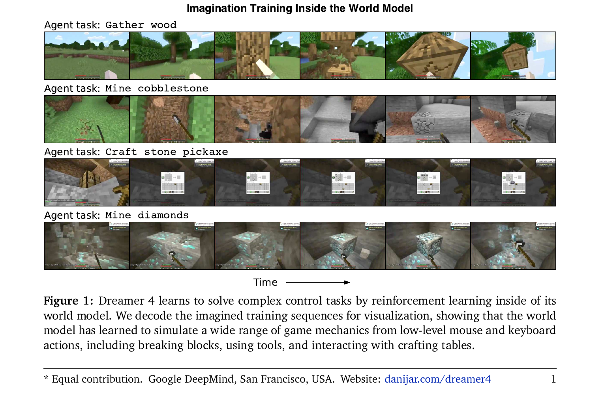
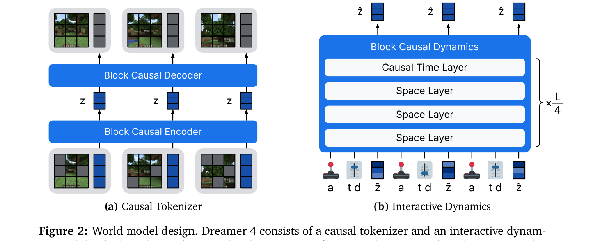
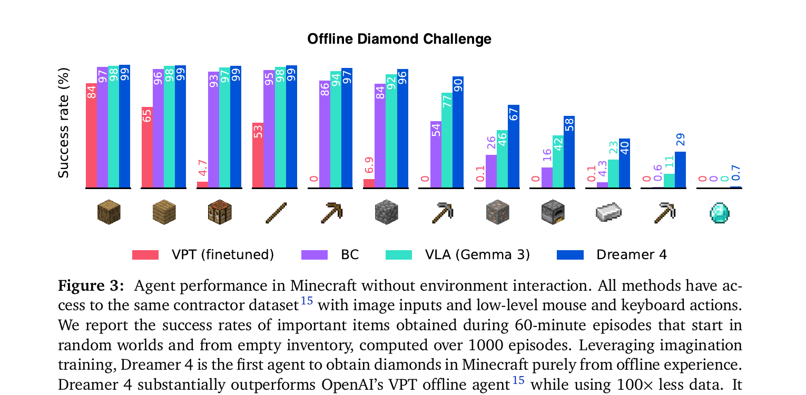
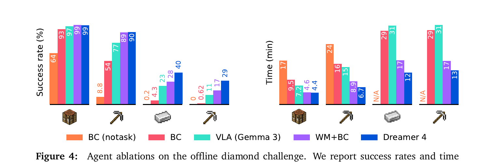
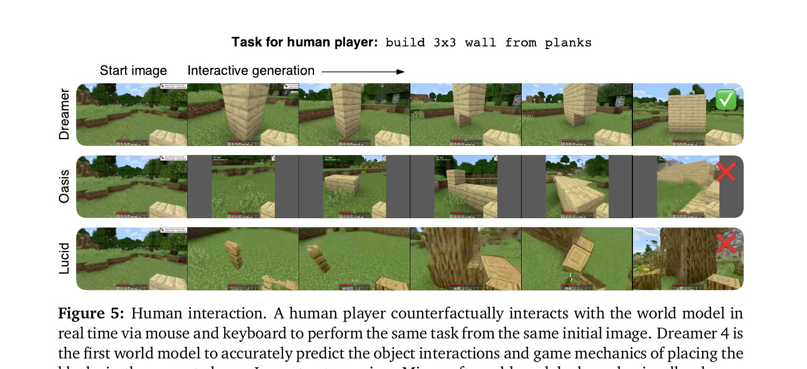

[← 返回 Dreamer 4 主页](../README.md)

# 串讲 · 几张图过完 Dreamer 4

> **重要更名**：之前 backlog 误写"DreamerV3 latest"。**实际是 Dreamer 4（不是 V3 续作）** —— paper 标题 "Training Agents Inside of Scalable World Models"，作者 Hafner / Yan / Lillicrap (Google DeepMind, Sep 2025)，arXiv 2509.24527。
>
> **Uni-WAM 视角的前置判断**：这是 **Minecraft game agent paper**，不是 robot manipulation。Action 是键盘+鼠标，**对 Uni-WAM 调研有方法论借鉴价值**（3-phase 训练 / shortcut forcing），**但不是直接对照**（场景不同）。

---

## 1. 这篇 paper 解决的是什么问题？

| 痛点 | 现状 |
|---|---|
| **想训 generalist RL agent** | 现有 model-based RL（DreamerV3 / TD-MPC）做不到复杂场景（如 Minecraft），WM 不够准 |
| **想用现成的 video model 当 WM** | Genie / Sora 这类 controllable video model 训练后能模拟场景，**但太慢，不能 real-time interactive** |
| **想从 unlabeled video 中学 dynamics** | 之前 AC-WM 需要 action label 才能训练，**缺 label 的 raw video 浪费了** |

**Dreamer 4 一句话定位**：
> 第一个**既快又准**的可控 WM，**能从大量 unlabeled video 里学通用 dynamics**，再在小量 action-labeled 数据上 finetune；用 imagination RL 训练 agent，**在 Minecraft 上首次纯 offline 拿到 diamonds**。

---

## 2. 方案全景 · 一张图看懂 Dreamer 4 在做什么



**这张图（Figure 1）展示了 Dreamer 4 的本质**：

它在**自己的 imagination 里**训练 agent 完成 Minecraft 的 4 个长时任务：
1. **Gather wood**（采集木头）
2. **Mine cobblestone**（挖鹅卵石）
3. **Craft stone pickaxe**（合成石稿）
4. **Mine diamonds**（挖钻石）⭐ 终极目标

**每一行是一段 imagination rollout**：从初始帧出发，agent 想象自己执行一连串键盘+鼠标动作，画面逐帧演化。

🔥 **关键观察**：
- 这是**视频生成 + agent 行为**的统一 —— WM 既画画面又模拟行为
- Agent **完全在 imagination 里训练**，不接触真实游戏 —— "offline imagination RL"
- Dreamer 4 是**第一个**在 Minecraft 上**纯 offline 拿到 diamonds** 的 agent

---

## 🔄 前置认知：Dreamer 4 是怎么来的

```
            DreamerV1 (2019, Hafner) — Atari、小型环境
                         ↓
            DreamerV2 (2020) — 离散 latent space
                         ↓
            DreamerV3 (2023) — Atari/Crafter/DMC 通用 hyperparameter
                         ↓
       Dreamer 4 (2025/09, Hafner et al.) — 本篇
       ─ 跳出小型环境 → Minecraft 大规模
       ─ 全新架构：causal tokenizer + 2D transformer
       ─ 训练范式：3-phase pipeline (offline pretraining + finetune + imagination RL)
       ─ 全新目标：shortcut forcing（vs flow matching）
```

**和 DreamerV3 的核心断代**：

| 维度 | DreamerV3 | Dreamer 4 |
|---|---|---|
| 架构 | RSSM (Recurrent State Space Model) | **Block Causal Tokenizer + 2D Transformer** |
| 训练数据 | 在线 RL（边交互边学）| **离线 video pretrain + 少量 labeled finetune** |
| 目标 task | Atari / Crafter / DMC | **Minecraft（真大规模 game）** |
| WM 速度 | 慢 | **real-time inference on 1 GPU** |
| Loss | KL 散度 + reconstruction | **shortcut forcing**（distill flow matching → fewer steps）|

→ **Dreamer 4 几乎是从头重新设计的 model 和 pipeline**，叫 V3 不准。

---

## 3. 核心方法 · Figure 2 架构图



**两块设计**（左右两个子图）：

### (a) Causal Tokenizer

- 上排：**Block Causal Decoder**（latent → image patches）
- 下排：**Block Causal Encoder**（image patches → latent z）
- 中间：3 个 latent token `z` 串成时序
- **关键约束**：causal —— 第 t 个 latent 只能看到 ≤ t 的 image patches

**作用**：把每帧 image 压成低维 latent，方便 dynamics 处理。

### (b) Interactive Dynamics ⭐ 真正的 AC-WM 核心

- 中间是**Block Causal Dynamics**（堆叠的 transformer block）
- 每个 block 由 4 层组成（× L/4 重复）：
  - **Causal Time Layer**（时间维度的因果 attention）
  - **3 × Space Layer**（空间维度的 attention）
- 底部输入：`a`（action）+ `t`（time）+ `d`（distance/step size）+ `ž`（noised latent）
- 顶部输出：`ẑ`（去噪后的下一个 latent）

🔥 **Action 注入方式**：
- Action `a` 作为 token 拼在 latent token 序列里（不是 cross-attention）
- 每个 time step 一个 `a` token
- → 这是**方式 4 (Action prefix token)** 风格的注入（参考 [`_concepts/action-conditioned-wm.md`](../../../_concepts/action-conditioned-wm.md)）

**和 Ctrl-World 的对比**：

| 维度 | Ctrl-World | Dreamer 4 |
|---|---|---|
| Backbone | SVD 1.5B (passive video gen) | 自己设计的 2D transformer |
| Action 注入 | Frame-level cross-attention（pose K/V）| **Action 作为 token 拼接** |
| Action 表示 | Cartesian 6D + gripper | Minecraft 键盘 + 鼠标（121 类离散）|
| 训练数据 | DROID 真机 expert | **VPT 离线 video + contractor gameplay** |

### 3-Phase 训练 Pipeline（Algorithm 1）

| Phase | 名字 | 做什么 | 用什么数据 |
|---|---|---|---|
| **Phase 1** | World Model Pretraining | 训练 tokenizer + dynamics | 大量 **unlabeled video** |
| **Phase 2** | Agent Finetuning | 加 policy + value head 微调 | 少量 **action-labeled** 数据 |
| **Phase 3** | Imagination Training | 在 WM 里跑 RL | **完全 offline**（不接真环境）|

🔥 **关键 insight**：Phase 1 用大量 unlabeled video 学通用 dynamics，Phase 2 用少量 labeled video 学 action conditioning，Phase 3 完全在 imagination 里训 policy。

→ **解决了 AC-WM 长期的训练数据瓶颈**：原来需要海量 (obs, action, next_obs) 三元组，现在用大量 video + 少量 labeled 就够。

---

## 4. 实验 · Figure 3 主结果



**Offline Diamond Challenge** —— 主战场。

每一列是 Minecraft 里的一种物品（从最易"木板"到最难"钻石"💎）。每个物品 4 个 bar：
- 🟥 **VPT (finetuned)** —— OpenAI 之前的 baseline（finetuned on contractor data）
- 🟪 **BC** —— Behavior Cloning
- 🟦 **VLA (Gemma 3)** —— 用 Gemma 3 做 vision-language-action policy
- 🟦 **Dreamer 4** ⭐

### 关键发现

| 难度 | 任务 | VPT | BC | VLA | Dreamer 4 |
|---|---|---|---|---|---|
| 简单（木头 / 工作台）| 84% / 65% / 4.7% / 53% | 84% | 97% | 98% | **99%** |
| 中等（镐头 / cobblestone）| | 86% / 6.9% | 94% / 84% | 97% / 92% | **97% / 96%** |
| 难（iron / furnace）| | 0% / 0.1% | 26% / 16% | 46% / 42% | **67% / 58%** |
| **极难（diamond 💎）** | | **0%** | **0%** | **0%** | **0.7%** |

**结论**：
- ✅ Dreamer 4 在**几乎所有物品上都超越其他 baseline**
- ✅ **第一次纯 offline 拿到 diamond**（0.7% 成功率虽然低，但其他 baseline 全部 0%）
- ✅ 用 **100× 更少的数据**击败 OpenAI VPT

---

### Figure 4：Ablation 谁起作用？



对比 5 个版本：
- BC (notask) / BC / VLA (Gemma 3) / **WM+BC**（用 WM 表示学 BC）/ **Dreamer 4**（imagination RL）

**结论**：
- **WM+BC** 已经显著优于纯 BC —— 证明 **WM 学到的表示对 policy 有帮助**
- **Dreamer 4 > WM+BC** —— 证明 **imagination RL 进一步提升**

→ Dreamer 4 的成功有两个来源叠加：
1. WM 学到的 **representation**（让 policy 学习更高效）
2. **imagination RL**（在 imagination 里继续优化 policy）

---

### Figure 5：Human Interaction（值得记住）



人类玩家给 3 个 WM 出题："build 3x3 wall from planks"（造 3x3 木板墙）。

- **Dreamer 4** ✅：墙真的盖起来了
- **Oasis** ❌：积木摆放混乱
- **Lucid** ❌：完全幻觉

→ Dreamer 4 是**第一个能让真人 counterfactually 交互**的 Minecraft WM，而且在 paper 之前从没见过的任务上也 work。

---

## 5. Summary · 整篇 paper 一段话

> **Dreamer 4** 是 Hafner 团队在 DreamerV3 之后的**架构 + 数据范式重启**。它把 Minecraft 当主战场，**完全 offline** 训练出第一个能在 imagination 里拿到 diamond 的 agent。
>
> 核心创新有 3 点：
> 1. **架构**：Block Causal Tokenizer + 2D 时空 Transformer，实时 inference on 1 GPU
> 2. **训练范式**：3-Phase = 大量 unlabeled video pretrain → 少量 labeled finetune → imagination RL
> 3. **效率**：shortcut forcing 蒸馏 flow matching，从 64 步降到 4 步采样
>
> **结果**：纯 offline 拿到 Minecraft diamond，比 OpenAI VPT 用 100× 更少数据。

### 三个最该记住的点

| # | 点 | 一句话 |
|---|---|---|
| 1 | **数据范式**：unlabeled video + 少量 labeled 就能训 AC-WM | 解决了 AC-WM 数据瓶颈 |
| 2 | **3-Phase pipeline**：pretrain → finetune → imagination RL | **完全 offline** 训 agent 的路径 |
| 3 | **场景**：Minecraft（不是 robot manipulation）| 对 Uni-WAM 是**方法论参考**，不是直接对照 |

### 一句话标签

> **Dreamer 4 = 在 Minecraft 上证明"unlabeled video → AC-WM → imagination RL agent"这条 pipeline 可行的 paper**。

---

### 🔥 Uni-WAM 视角的简评（不展开，等 Phase 2 浓缩时再细写）

- **场景不对**：Minecraft game ≠ robot manipulation，但 method 可借鉴
- **数据范式启发大**：unlabeled video pretrain 给 Uni-WAM 提供了"data pipeline 之外"的另一条路（除了仿真器+Cosmos-Transfer）
- **3-Phase pipeline 值得借鉴**：Uni-WAM 可以考虑类似分阶段训练（先 video 学 dynamics，再 finetune 接 action）
- **不直接帮 5 类 off-expert 测试**：Dreamer 4 没碰 off-expert action 这个轴
