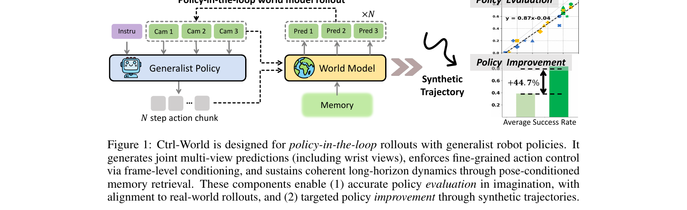

[← 返回 Ctrl-World 主页](../README.md)

# §1 Introduction

> **本节阅读重点**：抓 Ctrl-World 对"现状痛点"的诊断 + 自己的 3 个 contribution。这里能看到 paper 对"AC-WM 现有 limitation"的 self-positioning，**对 Uni-WAM 调研价值最大** —— 看它没说什么。

---

## ¶1 · 问题语境：policy evaluation 和 improvement 都贵

> "Recent advances in vision-language-action (VLA) models have demonstrated competence across a wide range of manipulation tasks and scenarios... Despite their promise, current policies remain brittle when tested in open-world circumstances. A central challenge is **policy evaluation**. Assessing generalist policy performance typically requires large numbers of real-world rollouts, carefully repeated across tasks and environments to achieve statistical significance. Such protocols are logistically demanding, slow down iteration, and inhibit nuanced understanding of current policy capabilities. Equally critical is **policy improvement**: once weaknesses are revealed, existing methods offer few ways to strengthen policies on failure cases **beyond collecting more expert data**. Although large-scale pretraining provides some robustness, policies often remain fragile when they encounter unfamiliar objects or instructions. What is missing is a fast and cheap feedback-driven mechanism for refining generalist models..."

**翻译**：
VLA 模型最近进步很大，但在 open-world 仍然脆弱。两个核心挑战：
1. **Policy Evaluation**：评估通用 policy 需要大量真机 rollout，**反复跨任务跨环境**，logistically 难、慢、阻碍迭代
2. **Policy Improvement**：发现弱点后，现有方法**除了收集更多 expert 数据外几乎没有别的提升手段**。大规模 pretrain 给了一些 robustness，但面对没见过的物体/指令仍脆弱。

缺一个 **fast and cheap 的反馈驱动机制**：能暴露失败案例、采集纠错经验、迭代改进 policy。

🔥 **Uni-WAM 关联**：
- "evaluating large numbers of real-world rollouts" —— 这是 Uni-WAM 关心的 policy evaluation 场景，但 Ctrl-World 关注的是**成本**（贵），Uni-WAM 关注的是**有效性**（评估出来的结论是否可靠）
- "**few ways to strengthen policies beyond collecting more expert data**" —— 🔥 Ctrl-World **明确承认了 expert-data-only 是一个问题**，但它的解法是"在 imagination 里合成 successful trajectories"，**而不是**用 off-expert 训 WM。这是个微妙但关键的分歧点

---

## ¶2 · prior AC-WM 的 3 大缺陷（Ctrl-World 自己点的）

> "While prior work has explored action-conditioned world models, most approaches focus on **passive video prediction settings** and are not sufficient to actively interact with advanced generalist policies. We observe several important limitations that hinder their ability to support policy-in-the-loop rollouts.
> **First**, these models typically simulate **only a single third-person camera view**, which can lead to severe partial observability and, in turn, cause hallucinations (e.g., an object snapping into the gripper without prior physical contact). This single-view input is also incompatible with many modern VLA policies that require both third-person and wrist-view cameras as input.
> **Moreover**, existing models typically lack the **fine-grained control** required to capture the causal effects of high-frequency actions.
> **Finally**, they **struggle to maintain temporal consistency** across long-horizon video generations."

**翻译**：
现有 AC-WM 大都聚焦"被动 video prediction"，不足以和高级 generalist policy 主动交互。Ctrl-World 点出 prior AC-WM 的 3 大缺陷：

| # | 缺陷 | 后果 |
|---|---|---|
| 1 | **只单视角**（single third-person）| 部分观测 → 幻觉（物体凭空进 gripper）+ 不兼容 VLA 需要 wrist-view |
| 2 | **缺细粒度动作控制** | 不能捕捉高频 action 的因果效应 |
| 3 | **长时一致性差** | 长序列预测崩坏 |

⚠️ **Uni-WAM 视角的关键观察**：

Ctrl-World 把 prior AC-WM 的 limitation 归结为**视角 / 控制粒度 / 长时一致** 三个**工程问题**。**它完全没把"训练数据偏倚 expert / 没测 off-expert action"列入 limitation**。

→ 这正是 Uni-WAM 的切入空白。**Ctrl-World 自己的 limitation 自查里，缺了翔哥诊断的那一条**。

---

## 🎯 Figure 1：Ctrl-World 全图（一图看懂整篇 paper）

**整张图的故事线**：
1. **左侧 policy-in-the-loop rollout**：Instruction + 3 个相机视角 → Generalist Policy 输出 N-step action chunk → World Model 接收 (obs, action) → 输出 3 个预测视角 + Memory → 循环 ×N 次
2. **右上 Policy Evaluation**：跑出来的合成 trajectory 用来给 policy 排名（散点图：WM ranking ≈ real ranking，y=0.87x-0.04）
3. **右下 Policy Improvement**：合成的 successful trajectory 拿来做 SFT，提升 policy 成功率 **+44.7%**

💡 **看这张图就抓住了 Ctrl-World 的全部贡献**：3 个组件（multi-view + memory + action chunk）→ 2 个 use case（eval + improve）。

---

## ¶3 · Ctrl-World 的 3 个 contribution

> "In this paper, we introduce Ctrl-World, a Controllable, multi-view generative world model designed for policy-in-the-loop interaction, enabling multi-step rollouts entirely within imagination space, as illustrated in Figure 1. Our design relies on three key components:
> **(1) Joint multi-view prediction** captures a more comprehensive visual representation of the scene and meets the input format of modern VLA policies. Notably, the inclusion of wrist-camera prediction significantly reduces hallucinations during contact-rich object interactions.
> **(2) Frame-level action conditioning** tightly aligns visual dynamics with control signals, ensuring that generated rollouts reflect the causal effect of each action.
> **(3) Memory retrieval**, which adds sparse history frames into the context and projects corresponding pose information into each frame, allows the model to attend to similar past states and retrieve relevant information. This mechanism stabilizes long-horizon rollouts and preserves temporal consistency.
> Together, these mechanisms allow us to transform a pre-trained passive video generator into a policy-compatible interactive simulator."

**翻译**：
Ctrl-World 是一个 controllable, multi-view 的 generative world model，专为 policy-in-the-loop 交互设计，能在 imagination 里做 multi-step rollout。三大核心组件**正好对应上面 3 个缺陷**：

| # | 组件 | 解决什么 | 详见 |
|---|---|---|---|
| 1 | **Joint multi-view prediction** | 单视角 → 三视角联合预测（含 wrist-view） | §4.1 Multi-View Joint Predictions |
| 2 | **Frame-level action conditioning** | 控制粒度差 → 每帧都接 action 输入 | §4.1 Frame-level Action Conditioning |
| 3 | **Pose-conditioned memory retrieval** | 长时崩坏 → 用稀疏历史帧 + pose 做 re-anchor | §4.1 Pose-conditioned Memory Retrieval Mechanism |

→ 把一个 **pretrained passive video generator** 改造成 **policy-compatible interactive simulator**。

🔥🔥 **Uni-WAM 关联**：
- "**transform a pre-trained passive video generator into a policy-compatible interactive simulator**" —— Ctrl-World 的本质是**在 SVD video model 上做 fine-tune 加 action 控制**。这一句话定性它属于 **a 类 AC-WM**（原本就是 AC-WM，从头按 AC 设计训），而不是 b 类（pretrained WM 提供 AC finetune pipeline）
- ⚠️ 但**也可以视角切换**：它本质上**是把 SVD（被动 T2V）改造成 AC-WM** —— 从这个角度可以理解为 **b 类的开源实现案例**。等读完 §4.1 训练目标再下结论

---

## ¶4 · Headline experiments（pitch 的成果）

> "The core contribution of this work is a controllable world model for robot manipulation. In experiments, we find this model enables a new imagination-based workflow in which policies can be both evaluated—**with ranking alignment to real-world rollouts**—and improved—through targeted synthetic data that boosts success rates. Specifically, we train Ctrl-World on the DROID dataset and show that it generalizes to novel scenes and camera placements, sustaining coherent rollouts for over 20 seconds. We further show that imagination-based evaluations with Ctrl-World **faithfully reflect policies' real-world instruction-following ability**. Finally, we demonstrate that we can improve the performance of π0.5 - DROID on downstream tasks **with unseen objects and novel instructions** by **synthesizing successful trajectories inside the world model** and performing supervised fine-tuning with these synthetic rollouts."

**翻译**：
核心贡献是一个 robot manipulation 用的 controllable WM。实验里展示了 imagination-based workflow 能做：
- **Policy Evaluation**：排名和真机一致
- **Policy Improvement**：合成数据提升成功率

具体地：训于 DROID → 泛化到 novel scenes / camera placement，长时一致 > 20s → "imagination-based evaluation faithfully reflects real-world instruction-following ability" → 在 π0.5 上做了改进实验：**在 unseen objects 和 novel instructions 上**，通过**合成 successful trajectories** 做 SFT。

🔥 **Uni-WAM 关联**：

1. **"ranking alignment to real-world rollouts"** —— 这是 Uni-WAM 关心的循环论证场景。Ctrl-World 实验设定下 ranking aligned，但**它的 policy 集合是 expert-quality（π0/π0-FAST/π0.5），都在 DROID 分布内**。如果换上一个**早期 RL checkpoint 的 sub-optimal policy**，alignment 还成立吗？这是 Uni-WAM 的核心质疑

2. **"unseen objects and novel instructions"** —— 注意 OOD 维度是 **objects + instructions**，**不是 action**。Ctrl-World 没在 OOD action 上验证

3. **"synthesizing successful trajectories"** —— 重申：他们合成的是 **successful** 的，跳过 failure / off-expert。这是 Uni-WAM 要打破的范式

---

## 💡 §1 整段 takeaway

Ctrl-World 的故事链：
1. Generalist policy 评估 + 改进 慢/贵 → 需要 imagination simulator
2. Prior AC-WM 有 3 个工程问题：单视角 / 控制粒度 / 长时一致
3. Ctrl-World 用 3 个组件解决这 3 个问题
4. 实验展示：排名一致 + 合成成功轨迹 SFT 提升

**Ctrl-World self-positioning**：解决"工程能力问题"的 AC-WM，让 policy 在 imagination 里能跑得稳、跑得准。

**Uni-WAM 视角的解读**：
- Ctrl-World **没在自己的 problem framing 里**包含"WM 训练数据偏倚 / 评估在 expert 分布内"这一层
- 它的整套 pipeline 假设：**只要 imagination 准、policy 在 ID setting 排名对，就够了**
- → 翔哥的 circular reasoning 担忧、5 类 off-expert action 测试，**Ctrl-World 完全没碰**
- → Uni-WAM 不是 Ctrl-World 的"竞争对手"，而是**Ctrl-World 假设的"补丁"**：哪怕 Ctrl-World 在 ID 上排名对，Uni-WAM 要问"OOD 上呢？"

---

## 🤔 §1 留下的问题

| Q | 在哪个 section 找答案 |
|---|---|
| frame-level action conditioning 的具体数学形式？ | §4.1 |
| pose-conditioned memory 的 retrieval 机制是什么？ | §4.1 |
| DROID 数据具体什么样？只有 successful 吗？ | §5.1 |
| ranking alignment 怎么验证的？多少 trial？ | §5.3 |

---

[← §0 Abstract](00-abstract.md) | [§2.2 AC-WM Related Work →](02-related-work-acwm.md)
