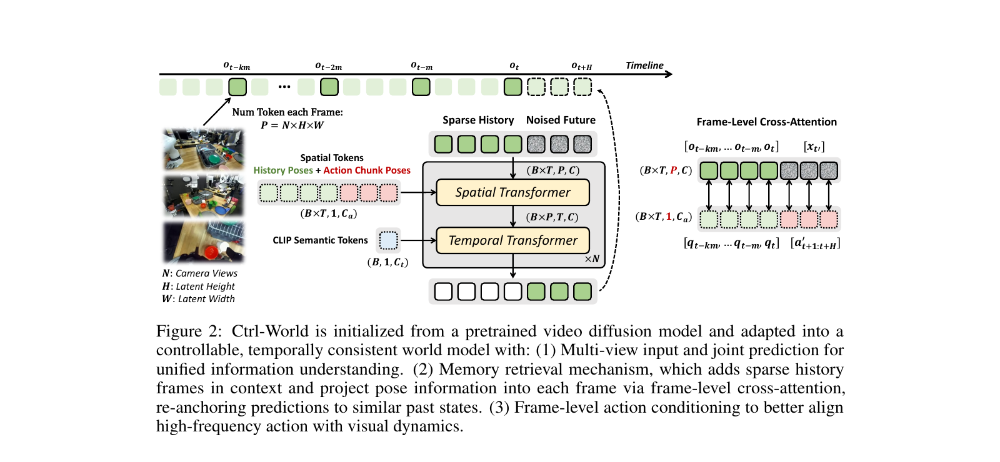
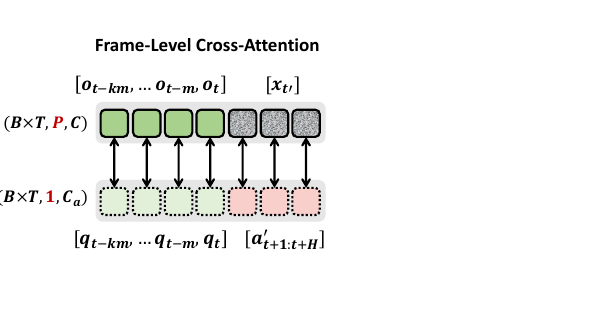
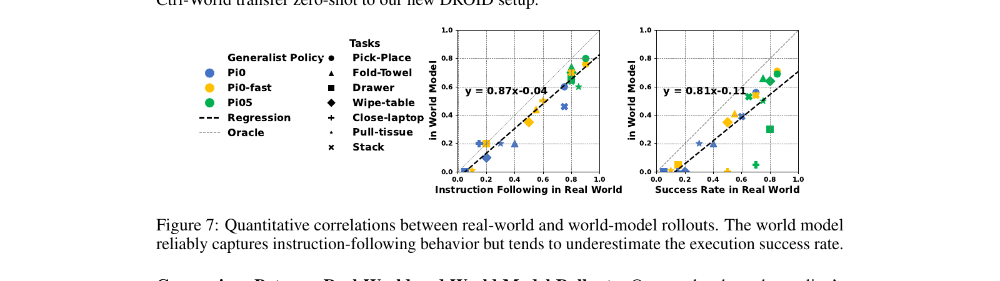
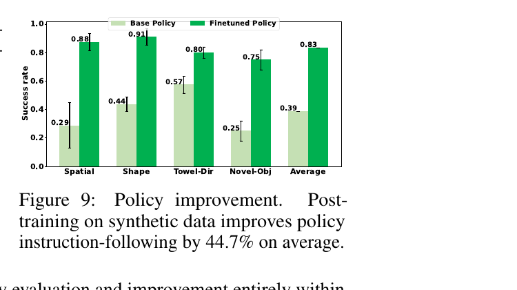

[← 返回 Ctrl-World 主页](../README.md)

# 串讲 · 一张图 + 几句话读懂 Ctrl-World

> **目的**：用最少的字数 + 几张关键 figure 把这篇 paper 串起来。不重复 sections/ 里的逐段细节，**只抓骨架**。

---

## 1. 这篇 paper 解决的是什么问题？

**两个痛点**（都属于 generalist robot policy 的研发循环）：

| 痛点 | 现状 | 为什么麻烦 |
|---|---|---|
| **Policy Evaluation** | 评估 VLA policy 要在**真机上反复跑 rollout** | 慢、贵、难规模化，阻碍迭代 |
| **Policy Improvement** | policy 出问题后**只能收集更多 expert 数据**再训 | 同样慢、贵；且很多 failure 模式无法靠加数据自然出现 |

**一句话**：研究员手里没有一个**快 + 便宜 + 反馈驱动**的工具来评估和改进 VLA policy。

**Ctrl-World 的解法定位**：
> 把"真机 rollout"换成"在 imagination 里 rollout" —— **用 world model 当 simulator**。

→ 后面我们会看到，它怎么搭这个 simulator（§4.1）、怎么用它评估（§4.2 + §5.3）、怎么用它改进（§5.4）。

---

## 2. 这篇 paper 的解决方法全景 · 一张图看懂


**按 Figure 1 从左到右读**：

### 输入（左侧）
- **Instru**（紫块）：language instruction，比如 "place the blue block on the plate"
- **Cam 1 / 2 / 3**（绿块）：3 个相机视角的当前 obs（2 个 third-person + 1 个 wrist-view）
- **N step action chunk**（灰块）：policy 输出的 N 步数值 action（具体到 6D pose）

### 核心循环（中间，重点！）

```
Generalist Policy → 给我未来 N 步该怎么动 (action chunk)
        ↓
World Model    → 给我执行完这 N 步后画面变啥样 (Pred 1/2/3 三个视角)
        ↓
Pred 喂回 Policy → 下一个 N 步 action chunk
        ↓
循环 ×N 次
```

**关键名字 = "policy-in-the-loop world model rollout"**。两个 agent **互相喂数据**：
- Policy 决定动作 → WM 预测后果 → 后果喂回 policy → 再决定动作

### 输出（右侧）

整个 rollout 跑完 → 拿到一条 **synthetic trajectory**（合成轨迹）。这条轨迹有两种用法：

| 用例 | Figure 1 右侧展示 | 后面在哪节验证 |
|---|---|---|
| **Policy Evaluation** | 散点图（y=0.87x-0.04）—— WM 里的 policy 排名 ≈ 真机 ranking | §5.3 |
| **Policy Improvement** | 柱状图（+44.7%）—— 拿合成的 successful trajectory 做 SFT 提升 policy | §5.4 |

### 还有一个小细节：Memory

WM 旁边的 **Memory**（绿块）是 Ctrl-World 的关键工程组件 —— **稀疏历史帧 + pose 检索**，防止长 rollout 时漂移。详见 §4.1。

---

**一句话总结这张图**：
> Ctrl-World = **policy 和 WM 自回归交替运行的 simulator**，跑出来的合成 trajectory 既能用来给 policy 排名（evaluation），也能挑成功的来 SFT（improvement）。

🔥 **Uni-WAM 视角的小预警**：
- 这张图的 loop 流程**完全假设 policy 输出的 action 在 WM 训练分布内**
- 如果换一个早期 sub-optimal policy（输出 off-expert action）→ WM 还能正确预测吗？Figure 1 没回答
- 这是 Uni-WAM 关心的核心 gap

---

## 3. Ctrl-World 的核心方法 · 一张架构图看懂



> ⚠️ **先看一个 notation 警告，免得读着读着懵**：
> Figure 2 里有**两个 "N"**，含义完全不同！
> - 左下 `N: Camera Views` 的 N = **相机视角数**（这里 N=3：2 个 third-person + 1 个 wrist）
> - 中间 transformer block 旁边 `×N` 的 N = **transformer block 堆叠数**（每个 block = Spatial + Temporal 串起来）
>
> 后面我会把第二种叫 "× N blocks"，避免混淆。

---

### 怎么看这张图（4 块结构）

#### 块 1：左侧 + 顶部时间轴 → 输入是什么

**左侧 3 张图**：3 个相机视角的当前 obs（第 1 个组件 **Multi-View Joint Prediction** 的体现）。

**顶部 Timeline**：横轴是时间。两种 frame：
- **稀疏历史帧**（深绿色实心）：$o_{t-km}, ..., o_{t-2m}, o_{t-m}, o_t$ —— 不是连续每一帧都拿，是**每隔 m 步取一帧**，共 k 个
- **未来要预测的帧**（虚线方块）：$o_{t+H}$，长度为 H

→ **这就是 Memory 在 Figure 1 里所代表的实质内容**：稀疏历史帧序列。

**每帧的 token 数**：$P = N \times H \times W$（N 个相机 × Latent 高度 × Latent 宽度）

#### 块 2：中间 transformer 主干

**输入打包**：稀疏历史帧 + Noised Future（加了噪声的未来帧）拼起来，shape `(B×T, P, C)`
- B = batch size
- T = 总 frame 数（历史 + 未来）
- P = 每帧 token 数
- C = channel 数

**两个 transformer 交替**：
- **Spatial Transformer**：处理每帧内的空间关系 (B×T 个 frame，每个 P 个 token)
- **Temporal Transformer**：处理跨帧的时间关系 (B×P 个 token 位置，每个有 T 个时间点)
- 串起来 = **1 个 block**，重复 **× N blocks** 次

**输出**：底部白色 + 绿色 tokens —— 绿色就是新预测的未来 frame，用虚线箭头**指回 timeline 上的未来位置** $o_{t+H}$。

#### 块 3：两类条件信号（喂给 transformer 主干）

模型怎么知道"该往哪走 / 该理解什么场景"？靠两类条件信号：

**条件 1：CLIP Semantic Tokens**（蓝色方块）
- 1 个 token，shape `(B, 1, C_t)`
- 用 CLIP 提取**整段视频的语义** —— 让模型理解"这是什么任务"
- 输入到 Temporal Transformer

**条件 2：History Poses + Action Chunk Poses**（绿色+红色方块）
- shape `(B×T, 1, C_a)` —— 每个 frame 对应 1 个 pose token
- **绿色 = 历史 pose** $[q_{t-km}, ..., q_t]$：过去机械臂真实在哪
- **红色 = action chunk pose** $[a'_{t+1:t+H}]$：policy 让机械臂未来去哪（把 raw action 转成 Cartesian pose）
- 输入到 Spatial Transformer

→ **这里就是 action 注入 model 的入口！** 它不是直接拼到 visual token，而是通过 cross-attention 让 visual token 主动 attend 到 pose。

#### 块 4：Frame-Level Cross-Attention（核心机制 zoom-in）⭐



这块是 **Ctrl-World 整篇 paper 最关键的机制**，把图里每个元素拆开讲：

##### 4.1 先复习一下：什么是 Cross-Attention？

> 💡 详细解释见 [`_concepts/cross-attention.md`](../../../_concepts/cross-attention.md)（含图书馆类比 + 3 行数学 + Self vs Cross 区别）

**一句话**：Attention 三件套
- **Q (Query)**：我想问什么？
- **K (Key)**：我有什么标题可匹配？
- **V (Value)**：标题对应的实际内容

流程：每个 Q **去看所有 K** → 算相关性分数 → softmax 成权重 → 对所有 V 做加权求和。

**Cross-Attention** = Q 来自一边，K/V 来自另一边（"自己查别人"，区别于 self-attention 的"自己查自己"）。

**这里的角色分配**：
- **Q（图里上排）= visual tokens**（生成视频的内容）
- **K, V（图里下排）= pose tokens**（要做的动作）

→ "我（visual token）要长成什么样？我去查（pose token）告诉我该长成什么样"。

##### 4.2 图里两排方块是什么

**上排（Q 端）**：visual tokens，形状 `(B×T, P, C)`
- **B×T**：batch 维度 × 时间维度（每个 batch 里 T 个 frame）
- **P**：每帧的 token 数 = N×H×W（多视角 × 空间 patch）
- **C**：channel 维度
- 颜色含义：
  - 🟩 **绿色（4 个）= 历史帧的 visual tokens** $[o_{t-km}, \ldots, o_{t-m}, o_t]$
  - ⬛ **灰色噪声（3 个）= 未来要预测的 noised visual tokens** $[x_{t'}]$（diffusion 训练时是加了噪声的版本）

**下排（K, V 端）**：pose tokens，形状 `(B×T, 1, C_a)`
- **B×T**：和上面一样，batch × 时间
- **1**：⭐ **每帧只有 1 个 pose token**（不是 P 个！）
- **C_a**：action embedding 维度
- 颜色含义：
  - 🟢 **浅绿色（4 个）= 历史真实 pose** $[q_{t-km}, \ldots, q_{t-m}, q_t]$
  - 🟪 **粉色（3 个）= 未来要去的 action chunk pose** $[a'_{t+1:t+H}]$

##### 4.3 关键发现：上下排 token 数对不上！

注意维度差异：

| 端 | 每帧多少 token？|
|---|---|
| 上排（visual）| **P 个**（= N×H×W，比如 3 × 24 × 40 = 2880 个）|
| 下排（pose）| **1 个** |

→ 也就是说：**第 t 帧的 P 个 visual token，全部"指向"同一个 pose token**。

##### 4.4 ⭐ Frame-Level 的精髓：箭头的含义

图里的双向箭头 **不是**"所有 visual 都连所有 pose" 那种 dense connection，而是**严格的一对一**：

```
第 t-2m 帧的 P 个 visual token  ←→  只 attend  ←→  第 t-2m 帧的 1 个 pose token
第 t-m 帧的 P 个 visual token   ←→  只 attend  ←→  第 t-m 帧的 1 个 pose token
第 t 帧的 P 个 visual token     ←→  只 attend  ←→  第 t 帧的 1 个 pose token
第 t+1 帧的 P 个 visual token   ←→  只 attend  ←→  第 t+1 帧的 1 个 action pose
...                               (跨帧 attention 被屏蔽 / mask 掉)
```

**重点**：第 t 帧的 visual token **看不到** 第 t-1 帧或第 t+1 帧的 pose token！

##### 4.5 为什么这么设计？(动机)

**问题**：如果用普通 cross-attention（visual token 看所有 pose token），会发生什么？

- 第 5 帧的 visual token 不仅看第 5 帧的 action，还看第 1/2/3/4/6/7... 帧的 action
- 模型可能"作弊"：看完整段 action 序列后**平均化**，每一帧画一个"平均动作姿态"
- 结果：visual 和 action 之间**时间对齐被破坏**，高频细节丢失

**Frame-level 强制约束**：第 t 帧的 visual **必须直接对应**第 t 帧的 action
- → 保证 visual dynamics 和 action 在时间上**严格同步**
- → 这是 paper §1 ¶3 强调的 "Frame-level action conditioning tightly aligns visual dynamics with control signals" 的实现层面

##### 4.6 算下来到底用了多少参数？

Cross-attention 的计算量：
- 每个 frame 内，P 个 visual token 各算一次 attention 到 1 个 pose token
- Attention score 矩阵 = (P, 1) 而不是 (P, T) —— **维度降了一阶**
- 所以这种 frame-level cross-attention **比 dense 版本便宜很多**

→ Ctrl-World 既保证了时间对齐，又控制了计算量。

##### 4.7 总结一句话

> **Frame-Level Cross-Attention = 让每一帧的视觉 token 只 attend 到该帧的 pose token，强迫 visual 和 action 时间严格对齐**。
>
> 这就是 paper §4.1 "frame-level action conditioning" 的工程实现，也是 Zhu et al. 2024 的核心 idea。

---

### 三大组件回看（这张图上分别在哪）

| 组件 | Figure 2 里在哪 |
|---|---|
| **1. Multi-View Joint Prediction** | 左侧 3 张相机图 + 顶部时间轴每帧都包含多视角 |
| **2. Pose-conditioned Memory Retrieval** | 顶部时间轴的**稀疏深绿历史帧** + 绿色 history pose tokens |
| **3. Frame-level Action Conditioning** | 右侧 cross-attention zoom-in 的**红色 action pose tokens** |

---

### 🔥 Uni-WAM 视角的关键观察

**Action 注入的具体路径已经清晰**：

1. Policy 输出 raw action $a_{t+1:t+H}$
2. 通过 forward kinematics 转成 Cartesian pose $a'_{t+1:t+H}$
3. 进入 Spatial Transformer 的 cross-attention 模块
4. 每一帧的 noised future visual token 通过 cross-attention 拿到它对应的 pose 信息
5. transformer 主干根据这些信号去噪 → 生成未来 frame

**对 Uni-WAM 的两个判断**：

| 角度 | 结论 |
|---|---|
| **架构能不能喂 off-expert action？** | ✅ 完全可以 —— 直接替换右下红色 pose token 内容就行 |
| **训练有没有见过 off-expert action？** | ❌ 没怎么见过 —— DROID 训练数据里全是 human teleoperation 的"自然"轨迹 |

→ 这就是 [`_concepts/action-conditioned-wm.md`](../../../_concepts/action-conditioned-wm.md) 里讲的 **"架构层能喂 ≠ 训练层能消化"** 的活生生例子。

---

## 4. 实验：到底 work 不 work？

讲完 method 自然要问："实验证明这套架构 work 吗？" Ctrl-World 给了**两组关键证据**，对应它的两个 use case。

---

### 4.1 实验 setup（速看）

| 维度 | 内容 |
|---|---|
| 测的 policy | **3 个公开 VLA**：π₀ / π₀-FAST / π₀.₅ |
| 测的 task | 7 个：Pick-Place / Fold-Towel / Drawer / Wipe-Table / Close-Laptop / Pull-tissue / Stack |
| 对照方式 | 真机和 WM 用**相同初始 obs** 分别 rollout，看 metric 是否一致 |
| 评测指标 | Instruction-following rate + Success rate |

⚠️ **关键 nuance**：测的 3 个 policy **都是 expert-quality 的 SOTA VLA**（来自 Physical Intelligence）。**没测 sub-optimal policy**。

---

### 4.2 实验结果 1：Policy Evaluation 排名一致 ✅



**怎么看这张图**：
- 横轴 = **真机**上的指标
- 纵轴 = **WM imagination** 里的指标
- 颜色 = policy（蓝 π₀ / 黄 π₀-FAST / 绿 π₀.₅）
- 形状 = task（● Pick-Place / ▲ Fold-Towel / ■ Drawer / ◆ Wipe-table / + Close-laptop / ★ Pull-tissue / × Stack）
- **黑虚线** = 实测回归方程；**灰细线** = oracle（y=x）

**核心数字**：

| 指标 | 回归方程 | 解读 |
|---|---|---|
| Instruction Following | **y = 0.87x − 0.04** | WM 上的指令跟随率 ≈ 87% × 真机率，整体接近 oracle |
| Success Rate | **y = 0.81x − 0.11** | 成功率相关性稍弱（斜率 0.81，截距 -0.11）|

**直觉解读**：
- ✅ **斜率正且接近 1**：WM 排名**单调一致** —— 真机里好的 policy，WM 里也好；差的也差。**作为 ranker 可用**
- ⚠️ **斜率 < 1 + 截距 < 0**：WM 系统性**偏悲观**，低估了 policy 真实表现
- ⚠️ **Success Rate 比 Instruction Following 差**：复杂物理交互（碰撞 / 抓取细节）WM 模拟不精

---

### 4.3 实验结果 2：Policy Improvement 提升 44.7% ✅



**实验做了什么**：
1. 拿 π₀.₅ 作为 base policy
2. 用 WM 在 4 个 downstream task 上合成 trajectory（rephrase instruction + 随机初始位置增加多样性）
3. 留下**人类判断为成功**的 25-50 条/task
4. 用这些合成 trajectory 做 SFT
5. 对比 base 和 finetuned policy 在真机上的成功率

**结果（每个 task 浅绿 vs 深绿）**：

| Task | Base | Finetuned | 提升 |
|---|---|---|---|
| Spatial Understanding | 0.29 | 0.88 | +59pp |
| Shape Understanding | 0.44 | 0.91 | +47pp |
| Towel-Folding Direction | 0.57 | 0.80 | +23pp |
| New Object | 0.25 | 0.75 | +50pp |
| **Average** | **0.39** | **0.83** | **+44.7pp** |

**结论**：合成的 successful trajectory 真的能让 policy 在 unseen object / novel instruction 上变强 —— **WM 作为 synthetic data source 可用**。

---

### 4.4 实验整体 takeaway

Ctrl-World 验证了它的两个 use case 都**在 ID setting 下 work**：

| Use case | 证据 | 状态 |
|---|---|---|
| Policy Evaluation | Figure 7：ranking alignment 0.87 / 0.81 | ✅ work（在 expert-quality policy 之间）|
| Policy Improvement | Figure 9：+44.7% on novel instructions | ✅ work（在 novel instruction / object 上）|

---

### 🔥 Uni-WAM 视角的关键观察

读完 §4 实验，**对照 Uni-WAM 关心的问题**：

| Uni-WAM 问 | Ctrl-World 测的 | 缺什么 |
|---|---|---|
| "OOD policy（如早期 RL checkpoint）能 rank 对吗？" | 3 个都是 SOTA expert-quality policy | ❌ 没测 sub-optimal policy |
| "off-expert action（counterfactual / random）下 WM 还合理吗？" | policy 自主输出的 action 都在 expert 分布内 | ❌ 没直接喂 off-expert action |
| "Failure trajectory 的合成能用吗？" | 只用 successful synthetic trajectory | ❌ 完全跳过 failure |

→ **Ctrl-World 验证了"ID setting 下 WM work"**，**没验证"OOD action setting 下 WM 还 work 吗"**。这正是 Uni-WAM 接住的 gap。

⚠️ **§5.3 paper 自己有一句关键自承认**（在 sections/05-policy-evaluation.md 详细记录）：
> "some failure trajectories are included in the DROID dataset, **there are still many failure modes outside the data distribution**"

→ Ctrl-World 知道这个问题，但**归为 data engineering**（"收集更多数据"），不是 method 问题。Uni-WAM 把它升级为方法论问题。

---

> 后续点位等 Ricardo 指定再补 ⏳
