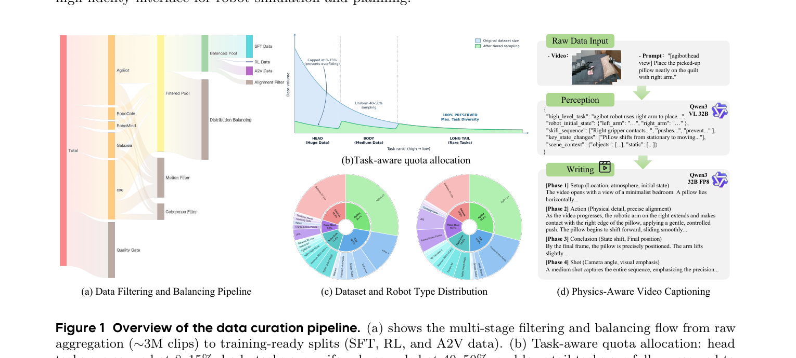

[← 返回 ABot-PhysWorld 主页](../README.md)

# §2 Data Curation

> 数据策划 3 阶段：embodied-specific filtering（§2.1）→ hierarchical distribution balancing（§2.2）→ physically grounded captioning（§2.3）。对应 Figure 1 的 (a)(b)(c)(d) 四个子图。

---

## §2.1 Embodied-Specific Data Filtering

> "we construct a foundational dataset of nearly three million real-world video clips by integrating five public datasets: AgiBot, RoboCoin, RoboMind, Galaxea, and OXE."

**翻译**：整合 5 个公开数据集 → ~3M 真实视频 clip。

⚠️ **为什么不能直接用通用 curation pipeline**：
> "General-domain curation pipelines such as Cosmos-Curate and VideoX-Fun are misaligned with embodied data: they rely on scene-cut detectors unsuitable for static-background manipulation videos, and prioritize visual aesthetics over physical causality."

通用 pipeline（Cosmos-Curate / VideoX-Fun）不适合具身数据 —— 它们的 scene-cut detector 对静态背景的 manipulation 视频没用，而且偏视觉美学不偏物理因果。

### 4 道过滤（video-level quality gate + 3 道语义过滤）

| 过滤 | 做什么 |
|---|---|
| **Video-level quality gate** | 丢掉异常分辨率 / 移动相机的 clip；限制 80-500 帧，超长的按 task index 切段 |
| **Optical-flow motion filtering** | 2 FPS 抽灰度帧 + Farnebäck 稠密光流 → 算全局运动分数 → 丢掉近零运动 / 非物理震荡的 clip |
| **CLIP temporal coherence** | 8 等距帧抽 768D CLIP feature → 相邻帧 cosine 相似度低的丢掉（去黑屏/剪辑/拼接错误）|
| **Vision-action alignment verification** | 把 calibrated action map 投到视频帧上 → Qwen3-VL 验证视觉运动和控制信号的时空对齐 |

💡 **批注**：第 4 道"视觉-动作对齐验证"很关键 —— 它保证训练数据里的 (video, action) 配对是真的对齐的，否则 AC-WM 学到的 action 映射就是错的。

---

## §2.2 Hierarchical Distribution Balancing

> "data diversity, not just volume, is key to scalable world models... scaling repetitive data often leads to memorization rather than out-of-distribution generalization."

**翻译核心观点**：**数据多样性比数据量更重要**。重复数据堆量只会导致 memorization 而非 OOD 泛化。

🔥 **Uni-WAM 关联**：这句话和翔哥 proposal 的"WM 记 pair 而非学 dynamics"是同一个担忧 —— 数据不够多样 → 模型背答案。

### 4 个层级的动态采样

| Level | 做什么 |
|---|---|
| **L1 数据集内多样性保留** | OXE 这种本身是小数据集聚合的，小子集全保留 |
| **L2 跨机器人再平衡** | 5 个源数据集间，欠表示的 robot 类型上权重（保留稀有交互模式，如双臂协调）|
| **L3 Task-aware quota** | head task 砍到 8-15% / body task 采 40-50% / **long-tail task 全保留** |
| **L4 Macro-dataset 规模调控** | 大数据集（AgiBot/OXE）均匀下采样，小数据集（RoboMind）保底覆盖；三轮补充策略 |

---

## §2.3 Physics-Aware Video Captioning

> "An effective annotation must capture three progressively deeper aspects of robotic manipulation: what the robot does (action semantics), how it interacts with the physical world (spatial and contact precision), and why the observed outcome occurs (causal reasoning)."

**翻译**：有效的标注要覆盖三个递进层次：**做什么**（动作语义）→ **怎么交互**（空间和接触精度）→ **为什么这样**（因果推理）。

### 三层标注系统

**1. Multi-level action semantics（多级动作语义）**：4 个粒度
- 宏观：自然语言任务意图
- 中观：verb-noun 动作分割（长程 planning 用）
- 微观：Cartesian 轨迹、相对运动、gripper 状态
- 场景级：物理关系（contact / support / containment）+ 任务结果（成功/失败/部分意外）

**2. Grounded spatial precision（grounded 空间精度）**：防幻觉
- few-shot in-context learning（带正负例）
- dynamic vocabularies（精确 grasp 类型）
- visible-fact baseline（只描述可观察证据）

**3. Causal physical modeling（因果物理建模）**：
- 显式标注物理因果（重力下落、表面形变、力反馈）
- 四阶段叙事结构：场景构建 → 动作流 → 终态确认 → 镜头总结

→ 对应 Figure 1(d)：**Perception 模块（Qwen3-VL 32B）** 抽结构化物理属性 + **Writing 模块（Qwen3 32B FP8）** 生成四阶段 caption。

---

## 💡 §2 整段 takeaway

| 阶段 | 一句话 |
|---|---|
| §2.1 过滤 | 4 道过滤把 ~3M raw clip 洗成训练就绪数据，重点是"视觉-动作对齐验证" |
| §2.2 平衡 | 4 级动态采样，核心原则"多样性 > 数据量"，long-tail 全保留 |
| §2.3 标注 | 三层物理感知 caption（做什么/怎么交互/为什么），用 Qwen3-VL 提属性 + Qwen3 写四阶段 caption |

🔥 **Uni-WAM 借鉴**：这套数据 pipeline **几乎可以直接搬给 Uni-WAM** —— Uni-WAM 也需要在真机 + 仿真数据上做类似的过滤、平衡、物理标注。特别是"视觉-动作对齐验证"和"long-tail 全保留"两点。

---

[← §1 Introduction](01-introduction.md) | [§3 Method →](03-method.md)
