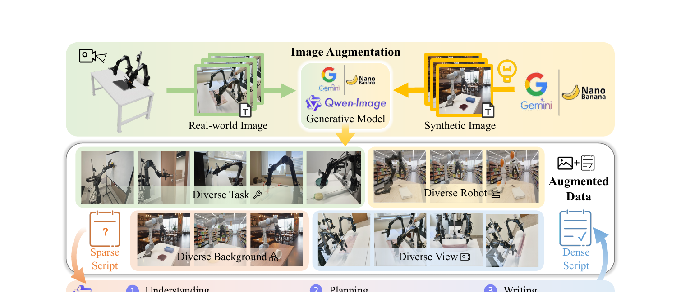

[← 返回 ABot-PhysWorld 主页](../README.md)

# §4 Embodied-ZeroShot Benchmark (EZSbench)

> "Existing embodied video generation benchmarks draw test samples from the same distribution as training data, making it difficult to assess genuine zero-shot generalization. We introduce EZSbench to evaluate physical fidelity and cross-embodiment generalization under fully out-of-distribution conditions."

**翻译**：现有具身视频生成 benchmark 的测试样本和训练数据**同分布** → 测不出真正的零样本泛化。EZSbench 在**完全 OOD 条件**下评估物理保真度和跨 embodiment 泛化 —— 多样的 robot 形态 / 环境 / 任务组合成**训练数据里没见过的组合**。

🔥 **Uni-WAM 关联**：这个"benchmark 不能和训练同分布"的论点，和翔哥 proposal 里 EWMBench 的 ❌ "测试数据仅来自训练分布"完全呼应。但**注意 EZSbench 的 OOD 维度是 robot/task/scene 组合，不是 off-expert action**。

---

## §4.1 Evaluation Set · 双源构造

### Branch 1：合成图（targets 形态/场景/任务泛化）

> "The first branch generates synthetic images using the text-to-image model Nano Banana, controlled by four orthogonal variables: robots, scenes, tasks, and perspectives."

用 text-to-image 模型 **Nano Banana** 生成合成初始观测，控制 **4 个正交变量**：
- robots（机器人形态 / 手臂结构）
- scenes（背景）
- tasks（从基础 pick-and-place 到长程操作）
- perspectives（视角）

### Branch 2：真实图背景编辑（保留前景交互）

> "The second branch uses a large VLM for controllable scene editing on real-world mechanical arm images, dynamically altering backgrounds while preserving foreground physical interactions."

用大 VLM 对真实机械臂图做**可控背景编辑** —— 改背景，但保留前景物理交互。

### 三阶段密集描述合成

> "a physics-heuristic dense description synthesis framework that progresses through visual anchoring, kinematically compliant action simulation, and narrative synthesis"

- **Visual anchoring**：grounding 场景布局和物体坐标
- **Action simulation**：推理运动学合规的轨迹 + 微观物理交互
- **Narrative synthesis**：生成纪录片风格 caption（整合初态、轨迹、终态）

→ 每个初始图 + dense description = 一个 core benchmark sample。

---

## §4.2 Evaluation Method · Decoupled 双模型协议

> "A key challenge in evaluating physical consistency is that a single model acting as both question generator and answer judge introduces self-evaluation bias."

**翻译**：物理一致性评估的核心挑战 —— 同一个模型既出题又判题会引入**自评估偏差**。

### 解耦双模型协议

| 角色 | 模型 | 做什么 |
|---|---|---|
| **出题端** | Qwen3-VL-32B-Thinking | 基于初态 + 文本指令动态生成物理 checklist；用 System 2 推理；few-shot 覆盖 9 个标准（空间/时间/物理三维度）；**强制 30-50% 负向问题**（如"红苹果是绿的吗"）防 shortcut learning |
| **答题端** | Qwen2.5-VL-72B-Instruct | 对 checklist 问题做 VQA |

**最终物理分数**：
$$S_v = \frac{1}{|Q_v|}\sum_{q\in Q_v}\mathbb{I}(\text{VQA}(v,q) = \text{GT}(q))$$

= VQA 预测和 checklist ground-truth 一致的比例。

💡 **批注**：注意 §4.2 的协议和 §3.2.1 的 DPO discriminator 协议**几乎一样**（都是"出题模型 ≠ 判题模型"+ 强制正负向问题混合）。区别：§3.2.1 用 Gemini 3 Pro 打分（训练时），§4.2 用 Qwen2.5-VL-72B 答题（评估时）。

---

## 💡 §4 整段 takeaway

| 子节 | 一句话 |
|---|---|
| §4.1 评估集 | 双源构造（Nano Banana 合成 + VLM 真实图背景编辑），4 个正交变量造 OOD 组合 |
| §4.2 评估方法 | Decoupled 双模型（Qwen3-VL 出题 + Qwen2.5-VL 答题）防自评估偏差，强制负向问题防 shortcut |

🔥 **Uni-WAM 视角的关键判断**：
- EZSbench 的 OOD = **robot / task / scene 组合的未见过组合**
- **不是 off-expert action 的 OOD** —— action 仍来自 kinematically compliant 的合理轨迹
- → EZSbench 和 Uni-WAM 的 Action Following Fidelity benchmark **是两个不同维度的 OOD**：EZSbench 测"场景泛化"，Uni-WAM 测"action 泛化"

---

[← §3 Method](03-method.md) | [§5 Experiments →](05-experiments.md)
