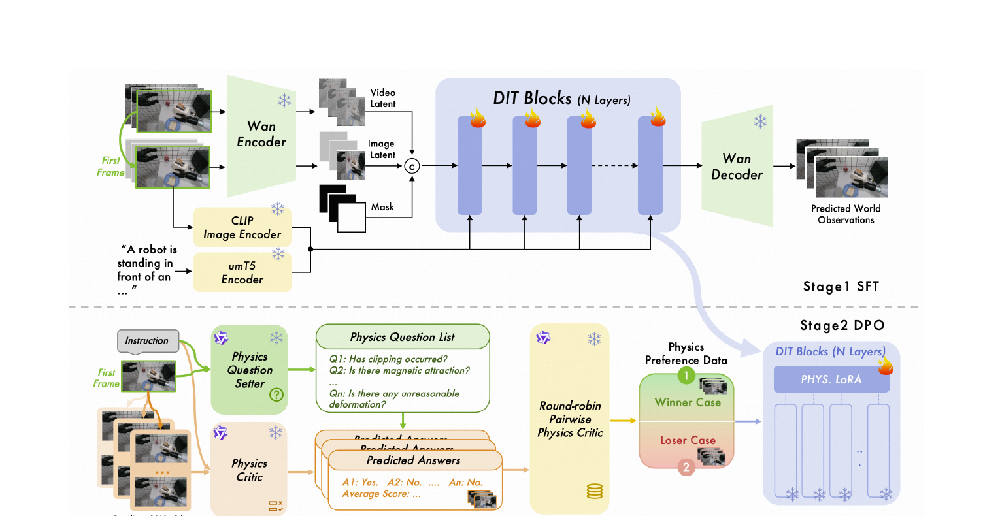
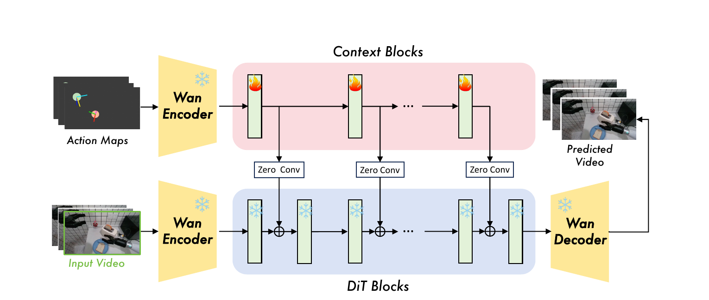
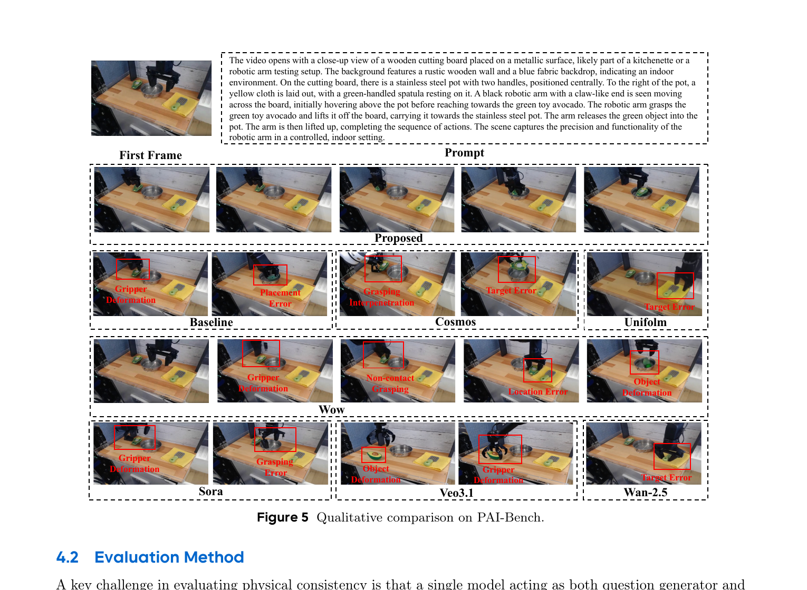

[← 返回 ABot-PhysWorld 主页](../README.md)

# 串讲 · 几张图过完 ABot-PhysWorld

> **arXiv 2603.23376 (v2 2026/03)** · AMAP CV Lab, Alibaba Group
>
> **Uni-WAM 视角的前置判断**：**a 类 AC-WM, 真具身 robot manipulation**。基于 **Wan2.1-I2V-14B**（和 Uni-WAM proposal 的 Wan2.2 同系列 backbone）。**核心切入角度不同** —— 它主打"物理合理性"（physics plausibility），用 DPO 后训练消除穿模/反重力，**不是主打 policy evaluation**。

---

## 1. 这篇 paper 解决的是什么问题？

| 痛点 | 现状 |
|---|---|
| **SOTA video model 物理违例严重** | Veo 3.1 / Sora v2 Pro 生成 manipulation 时频繁出现**物体穿模、无接触运动、反重力、不自然形变** |
| **根因 1: 训练数据缺具身交互信号** | 训在通用视觉数据上, 学不到摩擦/碰撞/质量分布等细粒度物理 |
| **根因 2: 最大似然目标对所有错误一视同仁** | 标准 MLE fine-tune 不区分"物理合理"和"物理违例"的预测 |
| **评估 benchmark 偏 in-distribution** | 现有 benchmark 测的样本和训练同分布, 测不出真正的 zero-shot 泛化 |

**ABot-PhysWorld 一句话定位**：
> 一个 **14B DiT**，通过**精心策划的数据 + 物理感知 DPO 后训练 + 并行 context block 动作注入**，生成"**视觉真实 + 物理合理 + 动作可控**"的 manipulation 视频；并配套 **EZSbench** 第一个 training-independent 的具身零样本 benchmark。

---

## 2. 方案全景 · 3 个贡献

ABot-PhysWorld 的 3 个 contribution 正好对应 3 个痛点：

| # | 贡献 | 解决什么 |
|---|---|---|
| **Data** | 数据策划 pipeline（3M clips 过滤 + 平衡 + 物理感知标注）| 根因 1（数据缺具身信号）|
| **Model** | 物理感知 DPO + 并行空间动作注入 | 根因 2（MLE 不区分物理对错）|
| **Evaluation** | EZSbench（training-independent 零样本 benchmark）| 评估 benchmark 偏 ID |

---

## 🔄 前置认知：ABot-PhysWorld 是怎么来的

```
        起点: Wan2.1-I2V-14B (passive I2V video gen model)
                       ↓
   Stage 1: TI2V 基础训练 (在 3M 策划 embodied 数据上 full fine-tune)
                       ↓
   Stage 2: DPO 物理对齐 (LoRA, 用 physics checklist 做偏好对齐)
                       ↓
   Stage 3: A2V 动作条件训练 (VACE 框架, 加并行 context block)
                       ↓
        终点: ABot-PhysWorld (physics-aligned + action-controllable AC-WM)
```

🔥 **和 Ctrl-World / GE-Sim 的共同范式**：都是"**通用 video model → 加改造 → 训练 → AC-WM**"。
- Ctrl-World：SVD → frame-level cross-attention
- GE-Sim：GE-Base → Pose2Image + Motion Vector
- **ABot-PhysWorld：Wan2.1 → 物理 DPO + 并行 context block**

---

## 3. 核心方法 · 3 张图

### Figure 1：数据策划 pipeline


**3 阶段数据处理**（对应 §2.1-2.3）：

**(a) 过滤 + 平衡**：~3M raw clips（来自 5 个公开数据集 AgiBot / RoboCoin / RoboMind / Galaxea / OXE）→ 训练就绪的 SFT / RL / A2V 数据
- 4 道过滤：视频质量门 / 光流运动过滤 / CLIP 时序连贯 / 视觉-动作对齐验证

**(b) Task-aware quota allocation**：
- Head task（高数据量）→ 砍到原来 8-15%（防过拟合）
- Body task（中量）→ 均匀采样 40-50%
- Long-tail task（稀有）→ **全保留**（最大化任务多样性）

**(c) 数据集 / 机器人类型分布**：左环是原始组成，右环是 hierarchical sampling 后的再平衡结果

**(d) 物理感知视频标注**：
- **Perception 模块**（Qwen3-VL 32B）→ 抽结构化物理属性
- **Writing 模块**（Qwen3 32B FP8）→ 生成四阶段 caption（场景设定 / 动作细节 / 状态转换 / 镜头总结）

### Figure 2：两阶段训练 pipeline（Physics Preference Alignment 的核心）



**Stage 1 SFT**（上半）：在 DiT 上做标准 SFT，从 observation + instruction 预测未来帧

**Stage 2 DPO**（下半）⭐ 核心创新：
1. 对一个 prompt 生成 **N 个候选视频**
2. **Decoupled VLM Discriminator**（解耦判别器，防自评估幻觉）：
   - **Qwen3-VL 32B Thinking = proposer**：看首帧 + 指令 → 动态生成**任务专属物理 checklist**（分 Tier 1 致命违例 / Tier 2 微观保真）
   - **Gemini 3 Pro = scorer**：用 Chain-of-Thought 推理对 N 个候选打分
   - 用 **knockout tournament** 选出最优 yw + 最差 yl，形成 DPO triplet (x, yw, yl)
3. **Diffusion-DPO**：用 LoRA（rank 64）注入 DiT，冻结 backbone，**禁用 LoRA 即得 reference model** → 解决 14B DiT 双计算图 OOM 问题

🔥 **关键 insight**：SFT 对所有样本一视同仁，**DPO 才能"教模型物理对错"** —— 主动降低 physics-compliant 视频的预测误差，同时抬高 physics-violating 的误差。

### Figure 4：动作条件生成架构（这才是 AC-WM 部分）



**两路并行结构**：
- **上路（Context Blocks，🔥 可训练）**：Action Maps → Wan Encoder → 一串 context blocks
- **下路（DiT Blocks，❄️ 冻结）**：Input Video → Wan Encoder → 主 DiT（保留预训练物理先验）
- **Zero Conv 连接**：context block 的输出经过 zero-initialized conv，**残差加到主 DiT** 对应 block
- 输出：Wan Decoder → Predicted Video

🔥 **Action 注入方式 = Action Maps + 并行 context block**：
- **Action Map 构造**（§3.3.1）：7D action `[3D 位置, 3D 朝向, gripper]`（双臂 14D）→
  - 3D 位置 (x,y,z) → project 到 2D 中心 (u,v)
  - 朝向 → rotation matrix 三个主轴 → 投影成**彩色箭头**（长度编码深度）
  - gripper → (u,v) 处的**圆形 mask**，透明度线性表示开合度
  - 双臂用红/蓝通道区分
- **注入机制**（§3.3.2）：clone 主 DiT 的部分 block（每隔 5 个）做成 parallel context blocks，**zero-init conv 残差融合** → 既学动作可控性，又不破坏预训练物理先验

⚠️ **和已读 paper 对比**：
| Paper | Action 注入 |
|---|---|
| Ctrl-World | frame-level cross-attention（pose K/V）|
| EnerVerse-AC / GE-Sim | Pose2Image RGB + Motion Vector cross-attention |
| **ABot-PhysWorld** | **Action Map（也是 pose 视觉化）+ 并行 context block（VACE 式）+ zero-conv** |

→ ABot-PhysWorld 的 action map **和 EnerVerse-AC 的 Pose2Image 思路几乎一样**（都是把 pose 画成 RGB），但**注入方式不同** —— 它用 VACE 式的并行 context block + zero-conv，而不是直接 cross-attention。

---

## 4. 实验 · Figure 5 + 三张表

### Figure 5：定性对比（PAI-Bench）



每个 baseline 的物理违例被逐一标出：
- **Sora v2 / Veo 3.1**：dense contact 时 gripper / object 形变
- **GigaWorld-0 / Cosmos**：抓取穿模（grasping penetration）
- **WoW**：无接触抓取 + 几何形变
- **UnifoLM / Wan 2.5**：认错目标（把抹布当成铲子）
- **ABot-PhysWorld（Proposed）**：正确识别目标 + 时空连贯 + 无形变穿模

### 三张表的核心数字

| Benchmark | 关键结果 |
|---|---|
| **Table 1 (PBench)** | DPO 版 Avg **0.8491**（SOTA），Domain Score **0.9306**，超 Veo 3.1 (0.8045) / Sora v2 Pro (0.7652) |
| **Table 2 (EZSbench)** | Our Model Avg **0.8030**（SOTA OOD），证明物理保真度能泛化到分布外 |
| **Table 3 (Action-Conditioned)** | Ours **PSNR 21.09 / SSIM 0.8126 / Traj 0.8522**，超 **EnerVerse-AC** (20.42/0.7542/0.8157) 和 Gen-Sim |

🔥 **关键发现**：
1. **DPO 让 Domain Score 从 0.8785 → 0.9306**（物理保真度大涨）而 Quality Score 几乎不变（0.7678 → 0.7676）—— 证明"物理对齐不牺牲视觉质量"
2. **直接打败 EnerVerse-AC**（动作条件生成 Table 3）—— 这是和我们调研的 AC-WM 的**正面对比**

---

## 5. EZSbench · 第一个 training-independent 零样本 benchmark

（详见 [04-benchmark.md](04-benchmark.md)，这里速览）

- **双源构造**（Figure 3）：
  - Branch 1：用 text-to-image（Nano Banana）生成合成初始观测，变化 4 个正交变量（机器人 / 场景 / 任务 / 视角）
  - Branch 2：用 VLM 对真实图做背景编辑，保留前景交互
- **Decoupled 评估协议**：Qwen3-VL-32B（出题）+ Qwen2.5-VL-72B（答题）分离，防自评估偏差
- **强制 30-50% 负向问题**（如"红苹果是绿的吗"）防 shortcut learning

---

## 6. Summary · 整篇 paper 一段话

> **ABot-PhysWorld** 是 AMAP CV Lab 基于 **Wan2.1-I2V-14B** 做的 **physics-aligned + action-controllable** 具身 AC-WM。三个核心创新：
> 1. **数据策划 pipeline**：3M clips 多级过滤 + 平衡 + 物理感知四阶段标注
> 2. **物理感知 DPO**：decoupled discriminator（Qwen3-VL 出题 + Gemini 3 Pro 打分）+ LoRA Diffusion-DPO，主动消除穿模/反重力
> 3. **并行 context block 动作注入**：Action Map + VACE 式 zero-conv 残差融合，保留预训练物理先验
>
> 配套 **EZSbench** 零样本 benchmark。结果：PBench / EZSbench 双 SOTA，动作条件生成直接超 **EnerVerse-AC**。

### 三个最该记住的点

| # | 点 | 一句话 |
|---|---|---|
| 1 | **物理感知 DPO** | 用 VLM 解耦判别器做偏好对齐，主动"教模型物理对错"，SFT 做不到 |
| 2 | **并行 context block + zero-conv** | VACE 式动作注入，保留预训练物理先验不被破坏 |
| 3 | **切入角度 = 物理合理性** | 不是 policy evaluation，是"让生成视频不违反物理" |

### 一句话标签

> **ABot-PhysWorld = "用 DPO 教 Wan2.1 守物理规矩"的 14B 具身 AC-WM**。

---

### 🔥 Uni-WAM 视角的简评

**对 Uni-WAM 的高价值借鉴**：
- ✅ **同 backbone 系列**：基于 Wan2.1-14B，Uni-WAM proposal 用 Wan2.2-TI2V-5B —— 数据 pipeline / 训练范式可直接参考
- ✅ **DPO 物理对齐思路**：Uni-WAM 的 GPR（Gated 物理合理性门）和这个 DPO 是**同一个目标的两种实现** —— 一个用 DPO 在训练时压制，一个用 Gate 在评估时筛选
- ✅ **Action Map 构造细节**：7D action 怎么画成 RGB 的具体做法（彩色箭头编码朝向 + 圆形 mask 编码 gripper）可直接复用
- ✅ **直接 baseline**：Table 3 已经把 EnerVerse-AC 当 baseline 比了 —— Uni-WAM 也可以拿 ABot-PhysWorld 当 baseline

**仍未碰的部分（Uni-WAM 切入空间）**：
- ⚠️ EZSbench 的 OOD 是 **robot / task / scene 组合的 OOD**，**不是 off-expert action 的 OOD**
- ⚠️ DPO 的 physics checklist 是测"物理违例"（穿模/反重力），**不测"WM 有没有真的 follow off-expert action"**
- ⚠️ 评估的 action 都来自 ground-truth trajectory（A2V dataset），没有 counterfactual / random-feasible / adversarial

**分类**：a 类 AC-WM（真具身 manipulation），**和 Uni-WAM 是正面竞品**（同 Wan 系 backbone + 同 robot manipulation），但**切入角度互补**（它做物理对齐，Uni-WAM 做 off-expert action 评估）。
