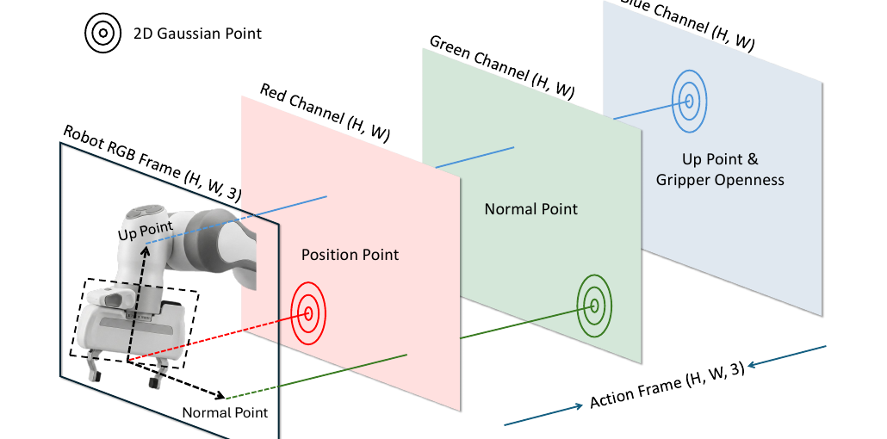
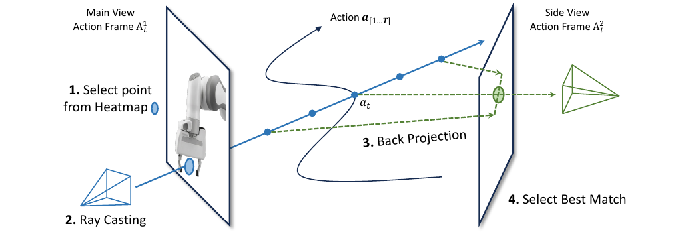
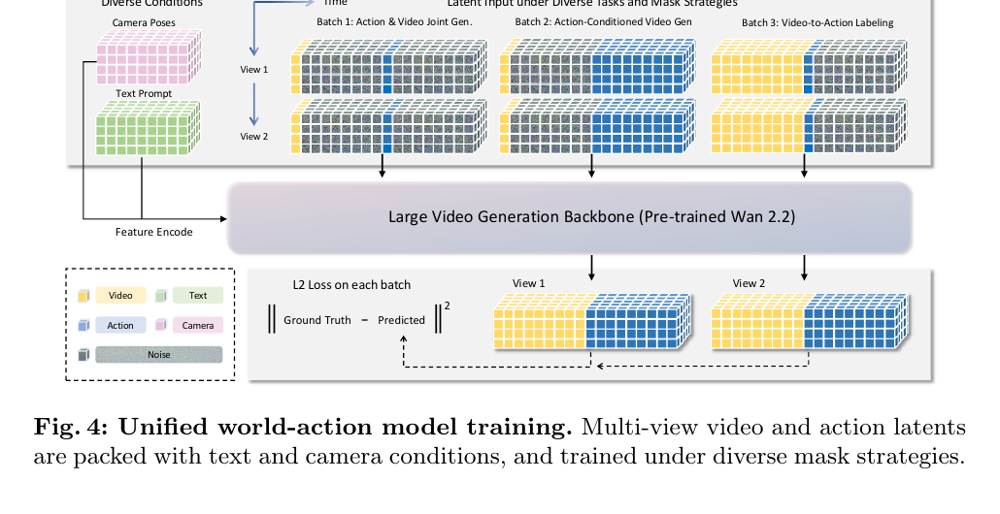

[← 返回 Action Images 主页](../README.md)

# §3 Method

> Method 三块：Action as Images（§3.1）→ Action Images Decoding（§3.2）→ Training Unified World Action Model（§3.3）。

---

## §3.1 Action as Images ⭐ 核心创新

> 💡 基础概念：action 注入的多种方式见 [`_concepts/action-conditioned-wm.md`](../../../_concepts/action-conditioned-wm.md)。Action Images 是一种全新路线 —— **action 不是注入，是变成 video 本身**。

### From 7-DoF action to semantic 3D points

> "At each time step t, the robot action is $a_t = [p_t, \theta_t, g_t] \in \mathbb{R}^7$... We convert this 7-DoF action into three semantic 3D points: a position point, a normal point, and an up point."

**翻译**：每个时刻 action $a_t = [p_t, \theta_t, g_t]$（位置 3D + 朝向 3D + gripper 1D）→ 转成 **3 个语义 3D 点**：

| 点 | 定义 | 编码什么 |
|---|---|---|
| **Position point** $q^{pos}$ | = 末端位置 $p_t$ | 末端在哪 |
| **Up point** $q^{up}$ | $= p_t + \ell \cdot R(\theta_t)e_x$ | gripper 的 in-plane 方向 |
| **Normal point** $q^{normal}$ | $= p_t + \ell \cdot R(\theta_t)(-e_z)$ | gripper 平面的法向 |

→ 3 个点一起 capture 了完整的末端 pose（位置 + 朝向），且都能直接投影到图像空间。$R(\theta_t) \in SO(3)$ 是从 action 朝向得到的旋转矩阵，$\ell$ 是一小段延伸长度。

### Multi-view action image rendering

> "Given a camera view v, we project the three semantic 3D points into image space using the camera intrinsics and extrinsics... We then render these projected points into an action image using 2D Gaussian."

**翻译**：给定相机视角 v，用内外参把 3 个 3D 点投影到 2D，渲染成 **2D Gaussian heatmap**：
- 🔴 **红通道** = position point
- 🟢 **绿通道** = normal point
- 🔵 **蓝通道** = up point + **gripper openness**

**蓝通道的细节**（公式 4-5）：
- 先把 up point 渲染成 Gaussian map $\tilde{A}^{(v)}_t(:,:,3)$
- 然后把**二值 gripper openness 信号注入低响应区域**：
  - 响应 > 0.25 的像素：保留 up point 的 Gaussian 值
  - 响应 ≤ 0.25 的像素：填入 $0.25 \cdot g_t$（gripper 开合度）

→ 蓝通道**同时**保留投影的 up point + 编码 gripper openness。

**时序堆叠** → action video $\mathcal{A}^{(v)} = \{A^{(v)}_1, ..., A^{(v)}_T\} \in \mathbb{R}^{T \times H \times W \times 3}$

🔥 **关键**：action video 和 robot RGB 观测 $O^{(v)}$ **同样的时空结构** → 天然形成**统一 video-space 表示**。

### Benefits

> "First, it makes action prediction spatially grounded: the model learns control through visible robot-arm motion rather than through abstract action tokens. Second, it is naturally compatible with pretrained video backbones."

**两个好处**：
1. **空间 grounded**：模型通过"可见的机械臂运动"学控制，不是通过抽象 action token
2. **天然兼容预训练 video backbone**：同一个模型能 reason over observation 和 action，不需要 action module

---

## §3.2 Action Images Decoding

> "A useful action representation should not only be easy to generate, but easy to decode back into continuous robot control."

好的 action 表示不仅要好生成，还要**好解码回连续控制**。

### Decoding gripper openness
直接从蓝通道**低响应区域平均**读出（公式 7）：$\hat{g}_t = \frac{1}{0.25} \cdot \text{avg of low-response pixels}$

### Reconstructing 3D semantic points from multi-view heatmaps

四步几何流程（对应 Figure 3）：
1. **Select point from heatmap**：main view heatmap 加权平均求质心 → 2D anchor 点
2. **Ray Casting**：从 main-view 相机中心穿过该 2D 点发射射线，沿射线在近/远平面间采样候选 3D 点
3. **Back Projection**：每个候选 3D 点投影到 side view
4. **Select Best Match**：选 side-view heatmap 响应最高的候选 → 恢复 3D 点

→ 对 3 个语义点都做一遍。**main view 提供 image-space anchor，side view 解决深度歧义**。

### From reconstructed points back to 7-DoF action

恢复了 3 个语义 3D 点 → 位置 $\hat{p}_t = \hat{q}^{pos}_t$；朝向用 $\hat{e}^x = \text{norm}(\hat{q}^{up} - \hat{q}^{pos})$、$\hat{e}^z = \text{norm}(\hat{q}^{pos} - \hat{q}^{normal})$、$\hat{e}^y = \hat{e}^z \times \hat{e}^x$ 确定 → 拼回 $\hat{a}_t = [\hat{p}_t, \hat{\theta}_t, \hat{g}_t]$。

### Discussion ⭐

> "the remaining decoding error is dominated not by representation mismatch, but by discretization."

**关键讨论**：解码误差**主要来自离散化**，不是表示本身的 mismatch：
- (i) 射线采样间隔 → 控制深度精度
- (ii) heatmap 空间分辨率 → 控制图像空间定位精度

→ **action-frame 参数化引入的信息损失是 minor 且可预测的** —— 更细采样 + 更高分辨率直接提升解码保真度。

💡 **批注**：这个 discussion 很重要 —— 它论证了"action 画成图"这件事**不会因为表示本身丢信息**，给整个方法立了根。

---

## §3.3 Training Unified World Action Model

### Backbone + tokenization

> "we build a unified world action model by fine-tuning a large pretrained video generator (Wan 2.2) to jointly model multi-view robot videos and multi-view action videos."

- **Backbone**：fine-tune 预训练 **Wan 2.2**
- 每个视角：robot video $V_{1:T}$ + action video $A_{1:T}$ → 用 3D-VAE 编码到 latent → **沿时间拼接**：$X_v = [V_{1:T}, A_{1:T}]$
- 模型看到的是"robot video → action video"的统一时间线
- 多视角共享权重

🔥 **Uni-WAM 关联**：Backbone **就是 Wan 2.2** —— 和 Uni-WAM proposal 计划用的 Wan2.2-TI2V-5B 完全同系列。

### Unified training via multiple mask strategies ⭐

> "we randomly sample masks over the concatenated latent sequence to instantiate different training objectives within the same diffusion-style denoising framework"

**4 种 mask 策略**（同一个 backbone，改 mask 切换任务）：

| # | Mask 策略 | mask 什么 | 训练成什么 |
|---|---|---|---|
| 1 | **Action & Video Joint Generation** | mask V 和 A（留第一帧）| 联合生成 = **zero-shot policy** |
| 2 | **Action-Conditioned Video Gen** | 留 A，mask V | 给 action 生成未来 video = **标准 AC-WM** |
| 3 | **Video-to-Action Labeling** | 留 V，mask A | 从 video 推 action = **action labeling（≈ IDM）** |
| 4 | **Video-only Generation** | 只有 video token | 没 action 标注的数据也能用 |

> "This masking scheme turns the same backbone into a unified world model that can switch behaviors by changing which token subsets are observed vs. predicted."

🔥 **Uni-WAM 关联**：这 4 个 mask 策略 = Uni-WAM proposal 的"一体化 MoT（VLA/WM/IDM/joint）"的**同款 idea 不同实现**。特别是 **mask 策略 3（video-to-action labeling）就是 IDM**。

### 额外：camera-controlled generation
注入 camera plücker embedding（follow ReCamMaster）→ 支持 camera-controlled generation + 维持多视角一致性。

### Optimization objective
- **flow matching** 目标，target velocity $v = \epsilon - X$
- masked token 上的 L2 loss：$\mathcal{L} = \mathbb{E}[\|M \odot (v - v_\theta(X, \mathcal{T}, cam))\|^2_2]$

### Training datasets
| 数据集 | #Traj | #Views | Real | Action Ann | Cam Calib | Cam Motion |
|---|---|---|---|---|---|---|
| DROID | 80k | 2 | ✓ | ✓ | ✓ | Static |
| RLBench | 180k | 4 | ✗ | ✓ | ✓ | Diverse |
| BridgeV2 | 30k | 1-4 | ✓ | ✓ | ✗ | Static |

- DROID：最完整真机标注，但 camera calibration 噪声大 → 过滤低质量样本
- RLBench：toy-like 但 action/camera 信号精确，用 Robot-Colosseum 增强视觉多样性
- BridgeV2：高质量真实视频但缺 camera label → 用 VGGT 估计，只用于 video-only generation

---

## 💡 §3 整段 takeaway

| 子节 | 一句话 |
|---|---|
| §3.1 Action as Images | 7-DoF → 3 个语义 3D 点 → RGB Gaussian heatmap，action 变成 video native 表示 |
| §3.2 Decoding | ray casting + side-view matching 解码回 7-DoF，误差只来自离散化（可控）|
| §3.3 Training | Wan 2.2 backbone + 4 mask 策略统一多任务 + flow matching |

**最关键设计**：action 和 obs 在**同一个 video space**，用 mask 策略统一所有任务 —— 这是"action 即视频"路线的核心。

---

[← §2 Related Work](02-related-work.md) | [§4 Experiments →](04-experiments.md)
