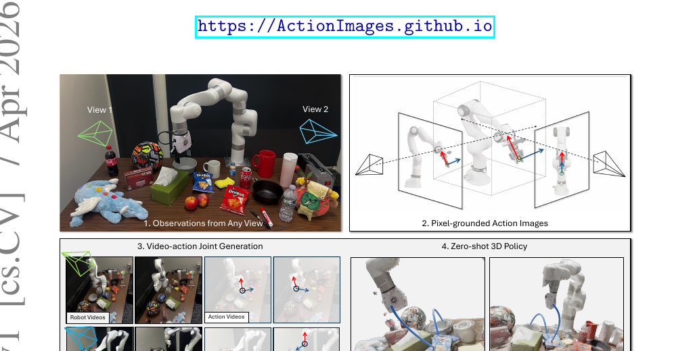

[← 返回 Action Images 主页](../README.md)

# 串讲 · 几张图过完 Action Images

> **arXiv 2604.06168 (2026/04)** · UMass Amherst / UTokyo / NVIDIA / Harvard / Genesis AI
>
> **Uni-WAM 视角的前置判断**：**a 类 AC-WM, 真具身 robot manipulation**。Backbone 是 **Wan 2.2**（和 Uni-WAM proposal 计划用的 backbone 完全一样）。**核心创新角度独特** —— 它把 action 也变成"视频"，让 video backbone 本身直接当 policy，**不需要单独的 action module**。

---

## 1. 这篇 paper 解决的是什么问题？

| 痛点 | 现状 |
|---|---|
| **video 泛化 ≠ policy 泛化** | 一个模型能生成合理的未来帧，**但仍可能不知道在新环境里该怎么动** |
| **现有 action 表示不 pixel-grounded** | 两条老路都有问题：(1) 在 WM 上挂**单独 policy head**（泛化责任转嫁给专门控制模块）；(2) 用**非空间 grounded** 的 action 表示 |
| **结果** | 预测知识和"行动"只是间接连接 → transfer 在控制模块处断裂 |

**Action Images 一句话定位**：
> 把 **7-DoF action 翻译成"action image"**（pixel-grounded 的 RGB Gaussian heatmap），让 action 和 observation 处在**同一个 video space** —— 这样 **video backbone 本身就能当 zero-shot policy**，不需要单独的 policy head / action module。

---

## 2. 方案全景 · Figure 1 看懂

**Figure 1 四块**：
1. **Observations from Any View** —— 多视角观测输入
2. **Pixel-grounded Action Images** —— 把 7-DoF action 翻译成 pixel-grounded 的 action image（核心创新）
3. **Video-action Joint Generation** —— 同时生成 robot video + action video
4. **Zero-shot 3D Policy** —— 解码 action image → 3D 轨迹 → 真机执行

🔥 **核心 insight**：
> 与其把 action 当"低维 token / latent code"丢给单独的 policy head，不如**把 action 也画成图**，丢回 video backbone 自己处理。**action 变成 video model 的 native 表示** → 同一个 backbone 能观察、预测、条件化、生成 action。

---

## 🔄 前置认知：Action Images 和其他 AC-WM 的根本区别

| 维度 | Ctrl-World / EnerVerse-AC / GE-Sim / ABot-PhysWorld | **Action Images** |
|---|---|---|
| Action 在哪 | **单独的 conditioning input**（cross-attention / context block 注入）| **就是另一段"视频"**（和 obs 同空间）|
| 有没有 policy head | 通常需要（或单独的 action decoder）| **不需要** —— video backbone 自己当 policy |
| Action 表示 | pose / latent / token | **action image**（RGB Gaussian heatmap）|
| 训练目标 | WM 预测 next_obs，policy 另外训 | **统一 video 生成目标**，多 mask 策略 cover 所有任务 |

→ 这是 AC-WM 设计哲学上的一个**分支**：**"action 即视频"** vs "action 是外挂条件"。

---

## 3. 核心方法 · 3 张图

### Figure 2：Action as Image（核心创新）

**怎么把 7-DoF action 变成一张 RGB 图**：

**Step 1: 7-DoF action → 3 个语义 3D 点**
- action $a_t = [p_t, \theta_t, g_t]$（位置 3D + 朝向 3D + gripper 开合 1D）
- **Position point** $q^{pos}$ = 末端位置
- **Up point** $q^{up}$ = 末端位置 + 沿 gripper 朝向轴延伸一小段
- **Normal point** $q^{normal}$ = 末端位置 + 沿 gripper 法向延伸一小段
- → 3 个点一起编码了完整的末端 pose

**Step 2: 投影到图像空间 + 渲染成 RGB Gaussian**
- 用相机内外参把 3 个 3D 点 project 到 2D
- 渲染成 **2D Gaussian heatmap**：
  - 🔴 **红通道** = position point
  - 🟢 **绿通道** = normal point
  - 🔵 **蓝通道** = up point + **gripper openness**（写在低响应背景区）

**Step 3: 时序堆叠 → action video**
- 每个视角一段 action video $\mathcal{A}^{(v)} \in \mathbb{R}^{T \times H \times W \times 3}$
- 和 robot RGB 观测**同样的时空结构** → 统一 video-space 表示

🔥 **为什么用 multi-view**：单视角对 motion 只是一个有歧义的投影，难以从像素恢复完整 action。多视角让 action image 更"可重建"，遮挡时更鲁棒。

### Figure 3：Action Images Decoding（解码回 7-DoF）

**怎么把生成的 action image 解码回可执行的 7-DoF action**：
1. **从 main view heatmap 选点**（加权平均求质心）
2. **Ray Casting**：从主视角相机中心穿过该 2D 点发射射线，沿射线采样候选 3D 点
3. **Back Projection**：每个候选点投影到 side view
4. **Select Best Match**：选 side-view heatmap 响应最高的候选 → 恢复 3D 点
- 对 3 个语义点都做一遍 → 恢复位置、朝向 → 拼回 7-DoF action
- gripper openness 直接从蓝通道低响应区平均读出

💡 **关键讨论**：解码误差**主要来自离散化**（射线采样间隔 + heatmap 分辨率），不是表示本身的 mismatch → **更细的采样 + 更高分辨率 = 直接提升解码精度**。

### Figure 4：Unified World-Action Model Training

**Backbone**：fine-tune **预训练 Wan 2.2**。

**输入打包**：每个视角，把 robot video $V_{1:T}$ 和 action video $A_{1:T}$ **沿时间拼接** → 统一序列 $X_v = [V_{1:T}, A_{1:T}]$（模型看到的是"robot video → action video"的统一时间线）。

**4 种 mask 策略**（同一个 backbone，改 mask 切换任务）：
| Mask 策略 | mask 什么 | 训练成什么 |
|---|---|---|
| **1. Action & Video Joint Gen** | mask 掉 V 和 A（只留第一帧）| 联合生成 video + action（= **zero-shot policy**）|
| **2. Action-Conditioned Video Gen** | 留 A，mask V | 给 action 生成未来 video（= **标准 AC-WM**）|
| **3. Video-to-Action Labeling** | 留 V，mask A | 从 video 推 action（= **action labeling**）|
| **4. Video-only Gen** | 只有 video token | 没 action 标注的数据也能用 |

**额外**：注入 camera plücker embedding 支持 camera-controlled generation。
**训练目标**：flow matching（target velocity $v = \epsilon - X$），masked token 上的 L2 loss。

🔥 **一个 backbone + 4 个 mask = 4 种能力**，这是 Action Images 的"统一性"核心。

---

## 4. 实验

**数据集**：DROID（80k，2 视角，真机）+ RLBench（180k，4 视角，仿真）+ BridgeV2（30k，video-only）

### 主结果：Zero-shot Policy（Table 2）

> Text-controlled action & video joint generation = primary 评估设定。一次开环预测，不在线 replanning。

在 RLBench + 真机的 zero-shot 测试上，Action Images 的成功率**全面领先**所有 robot policy baseline（MV-Policy / π0.5 / MolmoAct / TesserAct / Cosmos-Policy）。

### 附加能力

| 能力 | 对比 baseline | 结果 |
|---|---|---|
| **Action-conditioned video gen** | Tora | PSNR 31.35 vs 19.76，全指标领先 |
| **Video-to-action labeling** | TAPIR / CoTracker3 | Traj Err 5.785 vs 12.91，大幅领先 |

🔥 **关键发现**：一个统一模型在**三种任务**上都打过专门 baseline —— 证明"统一 video-space 表示"不是 trade-off，是 win-win。

### 定性（Figure 5/6）

zero-shot rollout 到 xArm 平台（未见物体/环境）+ FR3M 房间数据集（未见物体/任务/环境）—— 生成的 action image 解码出的 3D 轨迹能在真机上**复现执行**。

---

## 5. Summary · 整篇 paper 一段话

> **Action Images** 把 robot policy learning 重新表述成 **multiview video generation**：把 7-DoF action 翻译成 **pixel-grounded 的 action image**（3 个语义 3D 点 → RGB Gaussian heatmap），让 action 和 observation 处在同一个 video space。这样 **fine-tune 后的 Wan 2.2 backbone 本身就是 zero-shot policy**，不需要单独 policy head。同一个模型 + 4 种 mask 策略 = video-action 联合生成 / action-conditioned video gen / video-to-action labeling / video-only gen 四种能力。

### 三个最该记住的点

| # | 点 | 一句话 |
|---|---|---|
| 1 | **Action as Image** | 7-DoF → 3 个语义 3D 点 → RGB Gaussian heatmap，action 变成 video native 表示 |
| 2 | **video backbone = policy** | 不需要单独 policy head，video model 自己当 zero-shot policy |
| 3 | **4 mask 策略统一** | 一个 Wan 2.2 backbone cover 4 种任务 |

### 一句话标签

> **Action Images = "把 action 也画成视频"的统一 world-action model**，video backbone 自己当 policy。

---

### 🔥 Uni-WAM 视角的简评

**对 Uni-WAM 的高价值借鉴**：
- ✅ **同 backbone（Wan 2.2）** —— 和 Uni-WAM proposal 计划用的 Wan2.2-TI2V-5B 完全一样，训练范式直接可参考
- ✅ **"action 即视频"是一种全新的 action 注入思路** —— 区别于 Ctrl-World/EnerVerse-AC/GE-Sim/ABot 的"action 作为外挂条件"。Uni-WAM 可以考虑这条路线作为对照
- ✅ **多 mask 策略统一** —— Uni-WAM proposal 的"一体化 MoT（VLA/WM/IDM/joint）"和这个"4 mask 策略"是**同一个 idea 的不同实现** —— 都是"一个 backbone cover 多种 input/output 组合"
- ✅ **Video-to-action labeling 能力** ≈ Uni-WAM 的 IDM（从 video 反推 action）—— Action Images 的 mask 策略 3 就是 IDM

**仍未碰的部分（Uni-WAM 切入空间）**：
- ⚠️ 评估都是 **zero-shot policy success rate**（policy 自己产生的 action），**没有主动喂 off-expert action 测 WM**
- ⚠️ Action-conditioned video gen 评估用的 action 来自 ground-truth trajectory，**不是 counterfactual / random-feasible**
- ⚠️ 关注的是"policy 泛化"，**不是"WM 在 OOD action 下的 dynamics 保真度"**

**分类**：a 类 AC-WM（真具身 manipulation），**和 Uni-WAM 强相关**（同 Wan 2.2 backbone + 同"统一多任务"思路），但**action 表示路线不同**（action-as-image vs action-as-condition）。
