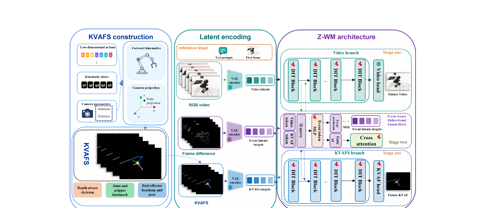

[← 返回 EA-WM 主页](../README.md)

# §3 Method

> EA-WM 基于 **Wan2.2-T2V** backbone。两块：KVAFs 构造（§3.1）+ Event-Aware Generative World Model（§3.2）。

---

## §3.1 Structured Kinematic-to-Visual Action Fields (KVAFs)

> 💡 基础概念：action 注入方式见 [`_concepts/action-conditioned-wm.md`](../../../_concepts/action-conditioned-wm.md)。EA-WM 属于"把 action 渲染成图像"路线，但渲染粒度最细（整条手臂）。

> "KVAFs convert low-dimensional robot actions and kinematic states into camera-aligned visual fields for future video generation."

**三步构造 KVAF**：

### Step 1: Forward Kinematics（恢复 3D robot 几何）

输入：arm joint values $q_t$、gripper state $g_t$、末端 pose $\xi_t$、相机参数 $(K_t, E_t)$。

公式 1（forward kinematics）：
$$T^W_k(t) = T^W_{k-1}(t) \cdot T^{orig}_k \cdot T^{mot}_k(q_{t,k})$$
- $T^W_k(t)$ = 第 k 个 robot link 的世界坐标系 pose
- $T^{orig}_k$ = 来自 kinematic chain 的静态 joint transform
- $T^{mot}_k(q_{t,k})$ = joint value 引起的运动 transform

→ 得到手臂和 gripper 的 keypoint $P_t = \{p^W_k(t)\}$（世界坐标系）。

### Step 2: Camera Projection（投影到 2D）

公式 2：用相机外参 $E_t$ 把世界坐标 keypoint 转到相机坐标，再用内参 $K_t$ 投影到像素 $(u, v)$。相机后方的点丢弃。

### Step 3: Render（渲染成 RGB visual action field）

公式 3：在**黑画布**上 rasterize：
- depth-aware **手臂骨架**
- **joint landmark**
- **gripper 几何**
- **末端 heatmap**
- **pose 轴**

→ 得到 RGB visual action field $V_t = \text{Render}(P_t, \xi_t, K_t, E_t)$。

🔥 **关键**：双臂都构造 KVAFs。KVAF 和目标 rollout **在同一图像域** → 提供空间 grounded + 时序对齐的运动线索，比 raw action token 更兼容 video-based world modeling。

⚠️ **和之前 paper 的区别**：EnerVerse-AC / GE-Sim / ABot / Action Images 都只画**末端 pose**，EA-WM **画整条手臂骨架 + 所有 joint** —— 渲染粒度最细。

---

## §3.2 Event-Aware Generative World Model

### 双分支架构

> "EA-WM builds upon the Wan2.2-TI2V backbone and preserves its original text-conditioned video denoising path. To inject structured action information, we encode KVAFs with the same video VAE and introduce a dedicated KVAF branch in the latent space."

- **Video branch**：原始 Wan2.2-TI2V DiT blocks（保留 text-conditioned video denoising path）→ 处理 video token stream $H^v$
- **KVAF branch**：DiT blocks 的 **full-depth copy** → 处理 KVAF token stream $H^k$
- 关键：让 action 信息**保持结构化视觉流**，不被压成低维 token

🔥 **Uni-WAM 关联**：这个**双分支（video + KVAF）full-depth copy** 设计，和 Uni-WAM proposal 的 **MoT（生成分支 + 动作分支）** 几乎一样。

### Event-Aware Fusion（在稀疏层集合 S 上）

公式 4：在每个 fusion 层 $\ell \in S$，event MLP 从当前 video + KVAF token 算**共享 event representation** $M_\ell$，然后预测：
- **event gate** $G_\ell = \Gamma_\ell(M_\ell)$ —— 调制 cross-stream 信息交换
- **event latent** $\hat{E}_\ell = \Psi_\ell(M_\ell)$ —— 由 EDLS 监督

公式 5-6（**双向 cross-attention**，gate 调制）：
$$\tilde{H}^v_{\ell-1} = H^v_{\ell-1} + G_\ell \odot \text{CA}_{v \leftarrow k}(H^v_{\ell-1}, H^k_\ell)$$
$$\tilde{H}^k_\ell = H^k_\ell + G_\ell \odot \text{CA}_{k \leftarrow v}(H^k_\ell, H^v_{\ell-1})$$
- 视频 token 吸收 KVAF 信息（$v \leftarrow k$）
- KVAF token 吸收场景信息（$k \leftarrow v$）
- **gate $G_\ell$ 控制两个方向各注入多少**

🔥 **Uni-WAM 关联**：这个 **gate 调制的双向 cross-attention** 就是 Uni-WAM proposal 的 **Shared Attention** 的近亲 —— 都是让两个分支在底层深度交互。

### EDLS（Event-Difference Latent Supervision）⭐ 核心创新

> "By supervising event predictions with VAE-encoded temporal difference latents, EDLS compels the model to dynamically allocate attention not only to the robot's geometric progression but also to regions undergoing state transitions and interaction dynamics."

**怎么构造 EDLS target**：
公式 7：计算帧差视频 $\Delta I_\tau = |I_\tau - I_{\tau-1}|$ → 用同一个 VAE 编码 → **event latent target $E$**

**训练 loss**（公式 8）：
$$\mathcal{L} = \omega(t)\left(\|\hat{Y}^v - Y^v\|^2 + \|\hat{Y}^k - Y^k\|^2\right) + \lambda_{evt} \cdot \frac{1}{|S|}\sum_{\ell \in S}\|\text{Unpatchify}(\hat{E}_\ell) - E\|^2$$
- 前两项：video 和 KVAF 分支的 flow-matching loss
- 第三项：**EDLS** —— 让预测的 event latent $\hat{E}_\ell$ 逼近帧差 latent $E$

🔥 **EDLS 的作用**：因为 event gate $G_\ell$ 和 event latent $\hat{E}_\ell$ 都从共享的 $M_\ell$ 出来，**EDLS 强迫 $M_\ell$ 编码"时序变化和交互线索"** → 通过 gate 调制 fusion → 模型**动态把注意力分到"状态转换 + 交互动态"区域**。

💡 **批注**：EDLS 不只是加一个 auxiliary event 预测头 —— 它**塑造了产生 gate 的共享表示**，gate 又直接控制 KVAF 信息注入多少。这是个精巧的设计。

---

## 💡 §3 整段 takeaway

| 子节 | 一句话 |
|---|---|
| §3.1 KVAFs | forward kinematics + camera projection + render，把 action 渲染成"整条手臂"的相机对齐视觉场 |
| §3.2 EA-WM | 双分支（video + KVAF full-depth copy）+ event-aware 双向 fusion，由 EDLS（帧差 latent 监督）驱动 gate |

**最关键的两个设计**：
1. **KVAFs 画整条手臂** —— 比之前 paper 只画末端更彻底，提供更丰富的几何线索
2. **EDLS-driven gate** —— 用帧差监督塑造共享表示，强迫模型关注交互/状态转换区域

---

[← §2 Related Work](02-related-work.md) | [§4 Experiments →](04-experiments.md)
