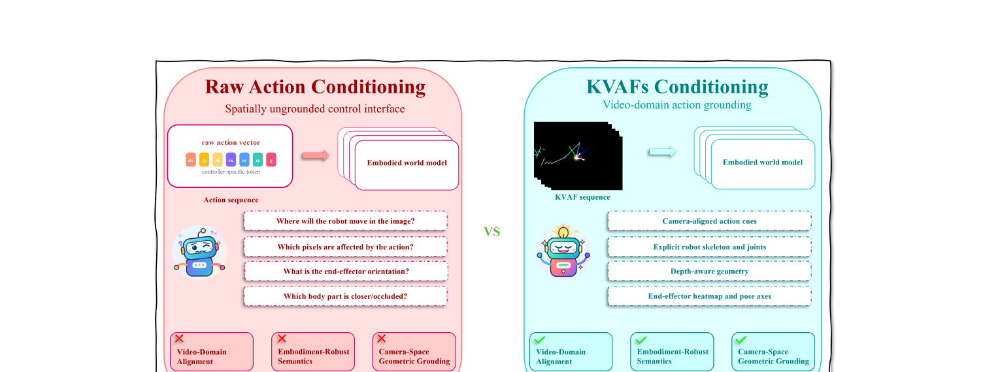

[← 返回 EA-WM 主页](../README.md)

# 串讲 · 几张图过完 EA-WM

> **arXiv 2605.06192 (2026/05)** · Fudan / Zhongguancun Academy / USTC / DeepCybo
>
> **Uni-WAM 视角的前置判断**：**a 类 AC-WM, 真具身 robot manipulation**。Backbone 是 **Wan2.2-TI2V**（和 Uni-WAM proposal 计划用的 Wan2.2-TI2V-5B 完全一样）。**双分支架构（video branch + KVAF branch）+ 双向 fusion** —— 这个设计和 Uni-WAM proposal 的 MoT + Shared Attention 高度相似。**直接和 Ctrl-World / IRASim 在 WorldArena 上对比**。

---

## 1. 这篇 paper 解决的是什么问题？

| 痛点 | 现状 |
|---|---|
| **现有 WAM 把 video 生成当"附属品"** | recent world-action models 联合优化 future video + action，但**主要把 video 当 policy learning 的辅助表示** |
| **没探索"逆问题"** | 它们没充分探索：**怎么用 action 信号引导精确的 video 合成** |
| **结果：rollout 质量退化** | 生成的 video 经常**保不住机器人精确空间几何 + 细粒度 robot-object 交互动态** |
| **根因：domain misalignment** | 低维控制信号（joint 参数 / 末端向量 / 抽象 token）和高维 video 合成之间有**域错配** —— 强迫 video generator 隐式推断跨域 kinematics |

**EA-WM 一句话定位**：
> 把低维 action 和 kinematic state **投影到目标相机视角**，变成 **Structured Kinematic-to-Visual Action Fields (KVAFs)** —— 渲染出 depth-aware 手臂结构 / joint landmark / gripper 几何 / 末端 heatmap / pose 线索。用 **event-aware 双向 fusion** 让 action 和 video 两路深度交互。

---

## 2. 方案全景 · Figure 1（KVAFs vs Raw Action）

**Figure 1 是核心动机图，左右对比**：

### 左：Raw Action Conditioning（旧路线）
- raw action vector（controller-specific token）→ embodied world model
- **问题**（图里列的 4 个问号）：
  - 机器人会移到图像哪里？
  - 哪些像素受 action 影响？
  - 末端几何是什么样？
  - 哪个 body part 更近/被遮挡？
- → **spatially ungrounded** —— video model 答不上这些问题

### 右：KVAFs Conditioning（EA-WM 路线）
- KVAF sequence → embodied world model
- **优势**：
  - camera-aligned action cues（相机对齐）
  - explicit robot skeleton and joints（显式骨架和关节）
  - end-effector heatmap and pose axes（末端 heatmap + pose 轴）
- → **video-domain action grounding** —— action 和 video 在同一图像域

🔥 **核心 insight**：和 EnerVerse-AC / GE-Sim / ABot-PhysWorld / Action Images 一样走"pose 视觉化"路线，**但 EA-WM 走得更彻底** —— 不只画末端，**画整条手臂骨架 + 所有关节 landmark**。

---

## 🔄 前置认知：EA-WM 在"pose 视觉化"谱系里的位置

之前读的 paper 里"把 action 画成图"已经出现 5 次，EA-WM 是第 6 个，但**渲染粒度最细**：

| Paper | 画什么 |
|---|---|
| EnerVerse-AC | Pose2Image（末端 pose RGB）|
| GE-Sim | Pose2Image（末端 pose RGB）|
| ABot-PhysWorld | Action Map（末端 7D pose 画成彩色箭头 + 圆形 mask）|
| Action Images | 3 个语义 3D 点 → RGB Gaussian heatmap |
| **EA-WM** | **整条手臂骨架 + joint landmark + gripper 几何 + 末端 heatmap + pose 轴**（最全）|

→ "action 即图像"已经是这个领域的**主流共识**，EA-WM 把它推到"渲染完整 robot 几何"。

---

## 3. 核心方法 · Figure 2 架构

**三大块**（对应 Figure 2 从左到右）：

### 块 1：KVAFs Construction（§3.1）

把低维 action + kinematic state 变成 camera-aligned visual field：
1. **Forward Kinematics**：用 arm joint values $q_t$ + gripper state $g_t$ + 末端 pose $\xi_t$ 恢复 3D robot 几何（公式 1）
2. **Camera Projection**：用相机内参 $K_t$ + 外参 $E_t$ 把 3D keypoint 投影到 2D 像素（公式 2）
3. **Render**：在黑画布上 rasterize depth-aware 手臂骨架 / joint landmark / gripper 几何 / 末端 heatmap / pose 轴（公式 3）→ RGB visual action field

→ 双臂都构造 KVAFs。

### 块 2：Latent Encoding

- RGB video → VAE encoder → video latent
- KVAF sequence → **同一个 VAE encoder** → KVAF latent
- Frame difference（帧差）→ VAE encoder → **event latents targets**（给 EDLS 用）

### 块 3：Z-WM Architecture（§3.2）—— 双分支 + event-aware fusion

- **Video branch**：原始 Wan2.2-TI2V DiT blocks（保留原 text-conditioned video denoising path）
- **KVAF branch**：**full-depth copy** of DiT blocks，专门处理 KVAF latent（让 action 信息保持"结构化视觉流"，不被压成低维 token）
- **Event-Aware Fusion blocks**：在稀疏的层集合 S 上插入，做**双向 cross-attention** —— event gate $G_\ell$ 调制两路信息交换：
  - 视频 token 吸收 KVAF 信息：$\tilde{H}^v = H^v + G_\ell \odot \text{CA}_{v\leftarrow k}$
  - KVAF token 吸收场景信息：$\tilde{H}^k = H^k + G_\ell \odot \text{CA}_{k\leftarrow v}$

🔥 **Uni-WAM 关联**：这个**双分支（video + KVAF）+ 双向 fusion** 的架构，和 Uni-WAM proposal 的 **MoT（生成分支 + 动作分支）+ Shared Attention** 几乎是同一个设计哲学！

### 关键创新：EDLS（Event-Difference Latent Supervision）

> 用 VAE 编码的"帧差 latent"来监督 event 预测

- 计算输入序列的帧差视频 $\Delta I_\tau = |I_\tau - I_{\tau-1}|$
- 用 VAE 编码 → event latent target $E$
- Event MLP 从 video + KVAF token 算共享 event representation $M_\ell$ → 同时预测 event gate $G_\ell$ 和 event latent $\hat{E}_\ell$
- 训练 loss 里加一项让 $\hat{E}_\ell$ 逼近 $E$

🔥 **EDLS 的作用**：强迫模型**动态把注意力分配到"状态转换 + 交互动态"发生的区域**，不只关注机器人几何进展 → 更物理一致的 rollout。

---

## 4. 实验 · WorldArena benchmark

> 注意：评估用 **WorldArena**（翔哥 proposal 已收录的 benchmark）。三个维度：Physics Adherence / 3D Accuracy / Controllability，综合成 **P3CScore**。

### Table 1：主结果

| Model | P3CScore |
|---|---|
| CogVideoX | 71.08 |
| Wan 2.2 | 60.83 |
| TesserAct | 62.02 |
| GigaWorld-0 | 59.32 |
| **Genie Envisioner** | 45.40 |
| **EA-WM (Ours)** | **76.60** |

→ EA-WM SOTA，比最强 baseline CogVideoX 高 5.52 分。Interaction Quality / Trajectory Accuracy / Instruction Following 提升最明显。

⚠️ **注意**：Genie Envisioner 在 WorldArena 上只有 45.40 —— EA-WM 把我们读过的 GE 也比下去了。

### Table 2：Ablation

| Variant | P3CScore |
|---|---|
| Wan2.2（baseline）| 60.83 |
| w/o KVAFs（换成数值 action）| 70.97 |
| w/o EAF（去掉 event-aware fusion）| 74.80 |
| **EA-WM（full）** | **76.60** |

→ **KVAFs 贡献 +5.63（vs w/o KVAFs），EAF 贡献 +1.80（vs w/o EAF）**。两者互补：KVAFs 管轨迹/3D 结构，EAF 管交互/视角。

### Table 4：和 action-conditioned baseline 直接对比 ⭐

| Model | P3CScore |
|---|---|
| **CtrlWorld** | 74.03 |
| **IRASim** | 69.75 |
| Cosmos-Predict 2.5 (action) | 66.12 |
| RoboMaster | 61.63 |
| **KVAF-conditioned (Ours)** | **78.13** |

🔥 **关键**：EA-WM 直接和 **Ctrl-World、IRASim** 在 WorldArena 上对比 —— **EA-WM 赢了**（78.13 vs Ctrl-World 74.03）。

### Table 3：Action recovery（一个诚实的 limitation）

从生成的 KVAF 视频里 heuristic 恢复数值 action：
- Raw-action baseline：translation err 0.004
- KVAF recovery：translation err 0.0155（**更差**），detection rate 仅 ~0.45

→ Paper 自己承认：**KVAF 是 image-domain action field，不是直接数值 action 输出 —— 从 KVAF 反解回精确数值 action 仍是 challenging problem**。

---

## 5. Summary · 整篇 paper 一段话

> **EA-WM** 是基于 **Wan2.2-TI2V** 的 event-aware 具身 AC-WM。核心是把低维 action + kinematic state 投影成 **KVAFs**（渲染整条手臂骨架 / joint landmark / gripper 几何 / 末端 heatmap / pose 轴的相机对齐视觉场）。架构上用**双分支（video + KVAF）+ event-aware 双向 fusion**，由 **EDLS（帧差 latent 监督）** 驱动 —— 强迫模型关注状态转换和交互区域。在 WorldArena 上 P3CScore SOTA 76.60，**直接打败 Ctrl-World / IRASim / Genie Envisioner**。

### 三个最该记住的点

| # | 点 | 一句话 |
|---|---|---|
| 1 | **KVAFs** | 把 action 渲染成"整条手臂骨架"的视觉场（比之前 paper 只画末端更彻底）|
| 2 | **双分支 + event-aware 双向 fusion** | video branch + KVAF branch + EDLS 驱动的 gate 调制 cross-attention |
| 3 | **WorldArena SOTA** | 直接打败 Ctrl-World / IRASim / Genie Envisioner |

### 一句话标签

> **EA-WM = "把整条机械臂都画进 action field"的 event-aware 双分支 AC-WM**，Wan2.2 backbone，WorldArena SOTA。

---

### 🔥 Uni-WAM 视角的简评

**对 Uni-WAM 的极高价值**：
- ✅ **同 backbone（Wan2.2-TI2V）** —— 和 Uni-WAM proposal 完全一致
- ✅ **双分支 + 双向 fusion 架构 ≈ Uni-WAM 的 MoT + Shared Attention** —— EA-WM 是这个设计哲学的现实验证（而且 work：WorldArena SOTA）
- ✅ **EDLS（帧差 latent 监督）思路值得借鉴** —— 强迫模型关注"状态转换区域"，和 Uni-WAM 想要"WM 真的学 dynamics"的目标一致
- ✅ **直接 baseline 对比** —— Table 4 已经把 Ctrl-World / IRASim 在 WorldArena 上比了，Uni-WAM 可以照搬这个评估设置
- ✅ **WorldArena 是 proposal 已收录的 benchmark** —— EA-WM 的实验设置可直接参考

**仍未碰的部分（Uni-WAM 切入空间）**：
- ⚠️ EA-WM 评估的 action 来自 WorldArena 的 RoboTwin 数据（**expert / GT trajectory**），**没有 off-expert action 测试**
- ⚠️ EDLS 监督的是"帧差"（视觉变化），**不是"WM 有没有真的 follow off-expert action"**
- ⚠️ Paper 自己承认 limitation 是"需要相机标定 + KVAF→数值 action 难反解"，**没提 off-expert action 这个轴**

**分类**：a 类 AC-WM（真具身 manipulation），**和 Uni-WAM 是最强竞品之一**（同 Wan2.2 backbone + 同双分支架构哲学 + 同 WorldArena 评估），但**切入角度仍是"生成质量/可控性"，不是"off-expert action 诊断"**。
