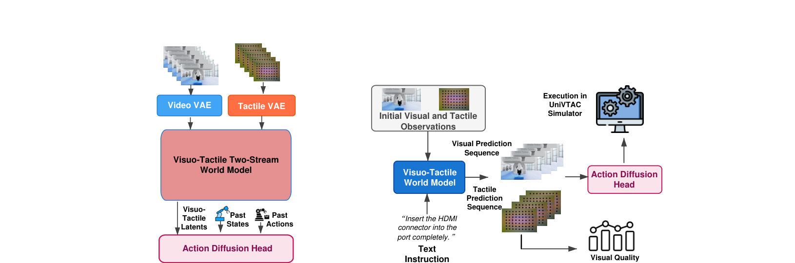
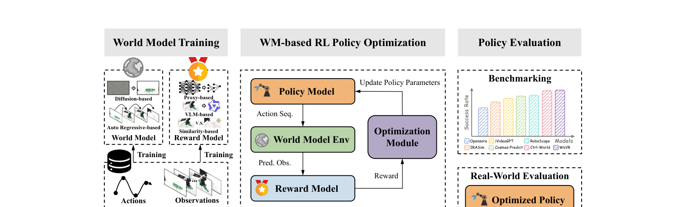
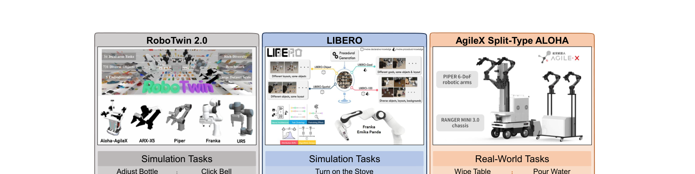

[← 返回主页](../README.md)

# §3 WorldArena 2.0 Benchmark

## §3.1 From WorldArena to WorldArena 2.0（1.0 → 2.0）

> "WorldArena established a unified benchmark for embodied world models by jointly evaluating perceptual quality and functional utility. Specifically, it assessed open-loop visual prediction through 16 metrics spanning six dimensions, including visual quality, motion quality, content consistency, physics adherence, 3D accuracy, and controllability. It further evaluated world models in three embodied roles: as data engines for synthetic data generation, as policy evaluators for proxy-based policy assessment, and as action planners for closed-loop task execution."

**翻译**：WorldArena（1.0）建了统一具身 WM benchmark，联合评估**感知质量 + 功能效用**。具体：用**6 维 16 指标**评估开环视觉预测（visual quality / motion quality / content consistency / physics adherence / 3D accuracy / controllability），并在三个具身角色上评估 WM —— **data engine（造合成数据）/ policy evaluator（代理式 policy 评估）/ action planner（闭环任务执行）**。

> "However, its scope remained centered on visual simulation and a restricted set of downstream uses."

**翻译**：但 1.0 的范围仍以**视觉仿真**为中心，下游用途也有限。

**2.0 沿三轴扩张**：

| 轴 | 1.0 | 2.0 |
|---|---|---|
| **Modality（模态）** | vision-only | → **visuotactile**（评估能否捕捉「接触感知」的物理交互）|
| **Functionality（功能）** | 离线下游用途（data engine / planner / evaluator）| → **在线交互 RL 环境**（测想象 rollout 能否支撑 policy 改进）|
| **Platform（平台）** | simulator-only | → **跨形态 sim-to-real testbed** |

> "Together, these extensions transform WorldArena from a unified simulation benchmark into a more realistic and deployment-oriented evaluation protocol for embodied world models."

**翻译**：三轴扩张把 WorldArena 从「统一仿真 benchmark」变成「更真实、面向部署」的评估协议。

---

## §3.2 Modality Extension：评估视触觉世界模型

**问题**：现有 WM 几乎都只做视觉感知，但**纯视觉对接触丰富的操作任务根本不够** —— 关键交互动力学只能从视觉线索里部分观测到，和人类多模态感官体验差很远。已有少数 visuotactile WM 工作（VTAM / Higuera 等 / OmniVTA），但它们各用各的触觉传感器配置、评估协议也不统一，**整个领域缺一个标准化的 visuotactile WM 评估管线**。

**解法：一条标准化「升级管线」**，把纯视觉 WM 升成视触觉 WM。基于一个现成视频 WM，加三个模块：

> "augmenting it with three primary modules: a tactile VAE, a visuotactile two-stream world model, and an action diffusion head."

1. **Tactile VAE**：编码触觉形变图（tactile deformation map）序列，并**对齐到原 WM 的 video latent 空间** —— 实现「即插即用增强，不动原架构」（plug-in augmentation without architectural surgery）。
2. **Visuo-Tactile Two-Stream World Model**：对「视频预测 + 触觉感知预测」同步去噪，保留各模态特有动力学的同时实现跨模态协调。
3. **Action Diffusion Head**：吃 `过去 states + 过去 actions + 预测出的视触觉 latent`，去噪直接推未来 action，闭合「感知预测 → 功能操作」的环。

> "This standardized pipeline follows a modular design philosophy, augmenting existing video world models with plug-in tactile components rather than altering their underlying architectures."

**翻译**：模块化设计哲学 —— 给现成视频 WM 挂即插即用的触觉组件，不改底层架构。

> 🔑 "We emphasize that our evaluation scope centers exclusively on world models, which predict future video observations, as distinct from world action models that directly predict future actions."

**翻译（重要）**：**评估范围只限「预测未来视频观测的 world model」，明确区别于「直接预测未来 action 的 world action model（WAM）」。**

**评估底座**：基于 **UniVTAC 仿真器**（用其官方数据集），在仿真里搭标准 visuotactile WM 评估管线。两个互补维度：
1. **触觉视频预测的感知质量**（PSNR / SSIM）
2. **下游操作任务的功能成功率**

---

## §3.3 Functionality Extension：把世界模型当 RL 环境

**动机**：WM 已能从真实数据里捕捉环境动力学，但评估大多限于「离线预测」。随着保真度提升，WM 可以当**真实环境的交互代理**，直接在「学到的模型」里做 RL。但现有做法多是「系统级设计、没有标准接口」，难以隔离各组件贡献、难以横向比较。

**解法**：提出一个标准化框架，把 WM 整进**闭环 RL 管线**做 policy 训练+评估。

> 把真实交互形式化为 POMDP：`M = (O, A, P, R, γ, ρ₀)`
> - `O` 观测空间，`A` 动作空间
> - `P(o_{t+1}|o_t, a_t)` 真环境转移核
> - `R(o_t, a_t)` 真实奖励函数，`γ∈[0,1)` 折扣因子，`ρ₀` 初始观测分布
>
> WM 用参数化的 `P̂_φ` 去逼近 `P`，**当真环境的 proxy**。

**四个核心组件**：

| 组件 | 参数 | 作用 |
|---|---|---|
| **World Model Env** | φ | 近似真转移 `P̂_θ(o_{t+1}\|o_t,a_t)`，吃当前观测+动作，出预测下一观测 |
| **Reward Model** | ψ | 预测即时奖励 `r_t = R_ψ(o_t,a_t)` |
| **Policy Model** | θ | 输出动作分布 `a_t ~ π_θ(·\|o_t)`，递归地基于 WM 预测的观测生成下一步动作 |
| **Optimization Module** | – | 最大化期望折扣回报 `J(θ)`，支持任何主流 RL 算法 |

**三段式评估管线**：
1. **World Model Training**：在真实数据 `D={(o_t,a_t,o_{t+1},r_t)}` 上训 WM，最小化任务对齐损失 `L_WM(φ;D)`。
2. **WM-based RL Policy Optimization**：固定预训练 WM + reward model，用 policy gradient（如 GRPO）更新 θ。递归 rollout：`o₀~ρ₀, a_t~π_θ(·|o_t), o_{t+1}~P̂_φ(·|o_t,a_t), r̂_t=R̂_ψ(o_t,a_t)`。
3. **Policy Evaluation**：把优化后的 policy 部署到真环境测成功率。

> "We evaluate the performance of a world model as an RL training environment by benchmarking the success rates of policies trained using different world models."

**翻译**：用「不同 WM 训出来的 policy 的成功率」来衡量「WM 当 RL 训练环境」的好坏。

---

## §3.4 Platform Extension：跨形态 Sim-to-Real 评估

**动机**：现有 benchmark 多在单一仿真器、固定任务集、有限物体变化上评估，**容易过拟合 → ranking 虚高**；单平台结论本身就不稳，给不了「模型学到的视觉/物理先验能否抗住不同机器人形态或真机感知条件下的分布偏移」的信号。

**解法**：跨形态评估协议，三平台构成「域随机化仿真 → 结构化知识迁移 → 真机物理执行」的梯度：

| 平台 | 性质 | 任务 | 设计意图 |
|---|---|---|---|
| **RoboTwin 2.0** | 双臂仿真，731 物体/147 类，强 domain randomization（杂乱/光照/纹理/桌高/语言指令）| Adjust Bottle（细粒度位姿调整+抓取稳定性）/ Click Bell（接触丰富动力学+精确力控）| 压测 **OOD 泛化**，逼模型学通用先验而非记背景纹理 |
| **LIBERO** | 单臂仿真，130 语言条件任务，过程化生成隔离 空间/物体/目标/混合 knowledge shift | Turn on the Stove | **诊断**到底学不会哪类 knowledge transfer（纯随机化 benchmark 给不了这种诊断力）|
| **AgileX Split-Type ALOHA** | **真机**：master-follower 遥操作，RANGER MINI 3.0 底盘 + PiPER 6-DoF 臂 | Pour Water（流体/形变物理）/ Wipe Table（长程接触+摩擦）| **真实世界终极裁判**（传感器噪声/可变摩擦/不完美执行）|

**沿用 1.0 的两个评估协议**：

> "(1) Embodied Data Engine, where synthetic trajectories generated by a world model are used to train downstream policies, with success rate on the target task measuring the data quality; (2) Embodied Action Planner, where the world model directly predicts closed-loop action sequences, and task completion rate reflects its planning reliability."

1. **Embodied Data Engine**：WM 生成合成轨迹 → 训下游 policy → 目标任务成功率衡量「数据质量」。
2. **Embodied Action Planner**：WM 直接预测闭环动作序列 → 任务完成率反映「规划可靠性」。

> "By running these protocols across RoboTwin, LIBERO, and the AgileX ALOHA platform, we systematically measure whether improvements in prediction fidelity translate into real-robot task competence."

**翻译**：跨三平台跑这两个协议，系统性衡量「预测保真度的提升能否转化为真机任务能力」。

---

## 💡 §3 整段批注（Uni-WAM 视角）

- **§3.2 的 plug-in 哲学** 和 EA-WM 的 KVAF branch、Action Images 的 mask 注入是同一类思路（不动 backbone，挂分支）。但 2.0 这里是为「加触觉模态」服务，不是为「注入 action」。
- **§3.2 明确分 WM vs WAM** —— 我们 proposal 分类轴的权威背书，可引用。
- **§3.3 把 WM 当 RL 环境** = 真正的闭环。它强调的「不严重累积误差 / action-consistent / reward-relevant 状态转移」，本质上要求 WM 在 policy 探索到的**各种 action（包括非最优）**下都能给出合理转移 —— 这其实**已经隐含碰到了 off-expert action**！但它没有把「off-expert action 下的保真度」单拎出来量化，而是用「最终 policy 成功率」这个间接指标兜底。**这是我们 proposal 可以切入的缝**：直接量化 WM 在 off-expert action 下的视频/轨迹保真度，比「看最终 policy 成功率」更直接、更可诊断。
- **§3.4 的 sim-to-real 梯度设计** 很漂亮，proposal 的实验平台可以照搬（RoboTwin 仿真起步，真机收尾）。

---

[← §2 Related Work](02-related-work.md) | [§4 Experiments →](04-experiments.md)
