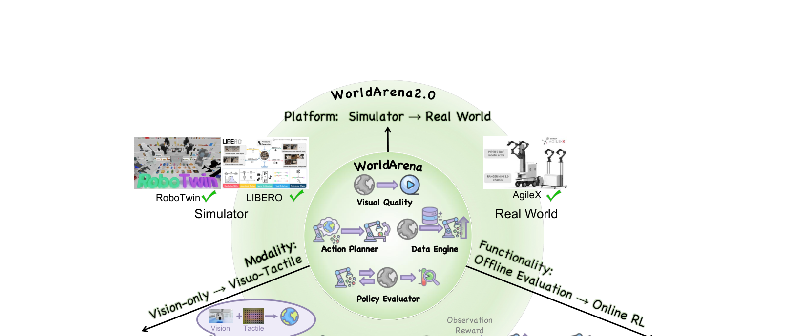

[← 返回 WorldArena 2.0 主页](../README.md)

# 🌟 WorldArena 2.0 串讲速读（4 张图过全文）

> 一句话：**WorldArena 2.0 = 把 WorldArena（1.0）沿三个轴往「更接近真实部署」的方向扩了一圈**。
> 三个轴：**模态（Modality）/ 功能（Functionality）/ 平台（Platform）**。
> 16 个视觉质量指标基本沿用 1.0，**本身没大改**；2.0 的新意全在「评估边界」的扩张上。

---

## 📍 先记住一张图：2.0 到底扩了什么

**Figure 1** 是全文的「地图」。看懂这张图，全文就懂一大半。它画的是一个**同心圆**：

- **内圈 = WorldArena（1.0）** —— 只做 `Visual Quality`（开环视频质量）+ 三个离线具身用途（Action Planner / Data Engine / Policy Evaluator）。**全在仿真里。**
- **外圈 = WorldArena 2.0** —— 在三条弧线上各往外扩一格：
  1. **Modality（模态）**：`Vision-only → Visuo-Tactile`（视觉 → 视觉+触觉）
  2. **Functionality（功能）**：`Offline Evaluation → Online RL`（离线评估 → 在线强化学习环境）
  3. **Platform（平台）**：`Simulator → Real World`（只在仿真 → 仿真 + 真机）

> 原文：*"WorldArena 2.0... systematically broadens embodied world model evaluation along three dimensions: modality, functionality, and platform."*
> 翻译：WorldArena 2.0 沿三个维度系统性拓宽具身世界模型的评估——模态、功能、平台。

**论文自己点名的三个「现有 benchmark 的局限」（对应三条扩张）**：

| # | 现有 benchmark 的局限 | 2.0 的应对 |
|---|---|---|
| 1 | 几乎只做 **vision-only**，忽略触觉（接触/摩擦/打滑这些视觉看不出来的物理量）| 上**触觉模态**（UniVTAC 仿真器）|
| 2 | 下游评估只到 **开环 planning / 静态 policy 评估**，没测「WM 当 RL 环境跑闭环」| 把 WM 当**在线 RL 环境**做 policy 优化 |
| 3 | 结果**几乎全在仿真**，sim-to-real gap 完全没查 | 加**真机平台**（AgileX ALOHA）|

---

## 🧩 三条扩张轴，逐个拆

### 轴① 模态扩张：视觉 → 视觉+触觉（§3.2）

**Figure 2** 是「怎么把一个纯视觉 WM 升级成视觉+触觉 WM」的标准管线，分两半：

- **(a) 标准化 visuo-tactile WM 架构**（左半）：
  - 输入两路：视频帧 → **Video VAE**；触觉形变图（tactile deformation map）→ **Tactile VAE**
  - 两路 latent 喂进 **Visuo-Tactile Two-Stream World Model**（双流世界模型，同步去噪两路）
  - 加一个 **Action Diffusion Head**：吃 `过去 states + 过去 actions + 预测出来的视触觉 latent`，去噪直接推 `未来 action`
  - 设计哲学是 **plug-in（即插即用）**：Tactile VAE 把触觉对齐到原 WM 的 video latent 空间，**不动原架构**，给任何现成视频 WM 挂一个触觉分支
- **(b) 评估管线**（右半）：基于 **UniVTAC 仿真器**，给初始视触觉观测 + 文本指令 → WM 预测视觉序列 + 触觉序列 → Action Diffusion Head 出动作 → 在 UniVTAC 里执行。两个评估维度：①触觉视频预测质量（**PSNR / SSIM**）②下游任务成功率。

> ⚠️ 论文特别强调：评估范围**只限 world model（预测未来视频观测的）**，明确区别于 **world action model（直接预测未来 action 的）**。这条对我们 proposal 的「AC-WM vs WAM」分类是个权威背书。

**实验发现（Table 1，2 个触觉任务）**：

| Model | PSNR↑ | SSIM↑ | Insert HDMI | Lift Bottle | Avg |
|---|---|---|---|---|---|
| ACT (baseline) | – | – | 20 | 80 | 50 |
| Vidar | 13.97 | 0.278 | 70 | 0 | 35 |
| Genie Envisioner | 13.36 | 0.456 | 0 | 0 | 0 |
| **Wan2.2** | **21.26** | **0.746** | **100** | 0 | 50 |

- 🔥 **通用大模型 Wan2.2 触觉预测质量反超专用具身模型** —— 因为通用模型保留了更丰富的跨模态知识先验，反而更易对齐触觉模态。Insert HDMI 直接 100%。
- ⚠️ **Lift Bottle 反直觉**：ACT 80%，所有 WM 全 0%。因为这是 long-horizon 任务需要持续力控，而当前 WM 的长程规划能力还很弱。

### 轴② 功能扩张：离线评估 → 在线 RL 环境（§3.3）

**Figure 3** 是「把 WM 当 RL 环境训 policy」的三段式管线：

1. **World Model Training**（左）：训两个东西 —— World Model（Diffusion-based / Auto-Regressive-based 都行）+ **Reward Model**（三种架构：Proxy-based / VLM-based / Similarity-based）
2. **WM-based RL Policy Optimization**（中）：Policy Model 出动作 → **World Model Env** 预测下一帧观测 → Reward Model 给奖励 → Optimization Module 更新 policy。**整个闭环在「想象」里跑**，WM 替代了传统 RL 里的 simulator。
3. **Policy Evaluation**（右）：训好的 policy 拿到真 RoboTwin 2.0 里测成功率。

> 数学上：把真实环境形式化成 POMDP `M=(O,A,P,R,γ,ρ₀)`，WM 用参数化的 `P̂_φ(o_{t+1}|o_t,a_t)` 去逼近真转移核 P，**当真环境的代理（proxy）**。用 GRPO 算法优化 policy。

**为什么这是更狠的测试**：WM 当 RL 环境，**必须在反复迭代里保持稳定 + action-consistent + 产出 reward-relevant 的状态转移 + 不能严重累积误差**。这比开环「喂一段 action 看一眼视频」苛刻得多。

**实验发现（Table 2，RoboTwin 2.0 两任务）**：

| Method | Click Bell | Adjust Bottle |
|---|---|---|
| SFT | 43.75 | 55.08 |
| **Simulator-based RL（天花板）** | **87.30** | **78.90** |
| Ctrl-World | 69.53 | **70.70** |
| WoVR | **75.00** | 67.19 |
| RoboScape | 68.75 | 60.74 |
| Cosmos-Predict-2.5(action) | 67.38 | 63.48 |
| IRASim / iVideoGPT / OpenSora | ~50-61 | ~56-61 |

- 用 WM 当 RL 环境训的 policy **还干不过用真 simulator 训的**，但最强的已经接近了。
- **WoVR** 短程任务（Click Bell）最强；**Ctrl-World** 长程任务（Adjust Bottle）SOTA。
- 三种 reward model 里 **proxy-based 最稳**（VLM-based 没在任务上 finetune，similarity-based 太依赖观测预测质量）。

### 轴③ 平台扩张：纯仿真 → 跨形态 sim-to-real（§3.4）

**Figure 4** 是三个测试平台，构成「仿真 → 真机」的梯度：

| 平台 | 类型 | 任务 | 作用 |
|---|---|---|---|
| **RoboTwin 2.0** | 仿真（双臂，731 物体 / 147 类，强 domain randomization）| Adjust Bottle / Click Bell | 压测 **OOD 泛化**（视觉/空间分布偏移）|
| **LIBERO** | 仿真（单臂，130 语言条件任务）| Turn on the Stove | **诊断**到底学不会哪类 knowledge transfer（空间/物体/目标解耦）|
| **AgileX Split-Type ALOHA** | **真机**（PiPER 6-DoF 臂 + RANGER MINI 3.0 底盘）| Pour Water / Wipe Table | **真实世界终极裁判**（流体/形变/长程接触/摩擦）|

平台扩张沿用 1.0 的两个评估协议：**Embodied Data Engine**（WM 生成合成轨迹训下游 policy，成功率衡量数据质量）+ **Embodied Action Planner**（WM 直接预测闭环动作序列，完成率衡量规划可靠性）。

**实验发现（Table 3，跨平台成功率）**：

| Model | RoboTwin DataEngine | RoboTwin Planner | LIBERO | Real Data | Real Planner |
|---|---|---|---|---|---|
| Vidar | 13/53 | 2/19 | 22/14 | **40/0** | 30/10 |
| Wan2.2 | 15/41 | 12/20 | 10/24 | 10/0 | 10/0 |
| TesserAct | 1/35 | 1/35 | 34/38 | 0/0 | 0/30 |
| CogVideoX | 3/28 | 8/16 | 0/2 | 10/10 | 0/50 |
| Genie Envisioner | 7/21 | 10/20 | 2/6 | 0/0 | 0/20 |
| GigaWorld | 2/13 | 6/19 | 0/0 | 0/0 | 0/0 |

🔥🔥 **核心结论 = sim-to-real usability gap**：
- 当 data engine 用，**没有一个 WM 能比真实示教数据强**，而且 gap 从仿真到真机越拉越大。
- 真机评估**最难**，只有少数模型非零成功率，全部远低于实用门槛。
- **跨平台 ranking 相关性**（Fig 6-9）：Visual / Motion / Physics / 3D 维度跨平台相关性强（低层保真度和几何推理迁移得还行）；**Content Consistency 和 Controllability 相关性弱**（语义/指令对齐对 domain 更敏感）。**task success 在两个仿真器间正相关，但跟真机比就崩了**（Spearman RoboTwin-Real 只有 0.348, p=0.499）。
- → **仿真表现（不管感知还是功能）都不是真机部署的可靠代理，物理评估不可省。**

---

## 🎯 16 个视觉质量指标：和 1.0 比有什么变化？

2.0 跨平台视频质量评估（Table 4-9）**沿用 1.0 的 6 维 16 指标**。逐一对照后，**只有一处实质变化**：

| 子维度 | 指标 | 1.0 → 2.0 变化 |
|---|---|---|
| ① Visual Quality | Image Quality / Aesthetic Quality / JEPA Similarity | 不变 |
| ② Motion Quality | Dynamic Degree / Flow Score / Motion Smoothness | 不变 |
| ③ Content Consistency | Subject / Background / Photometric Consistency | 不变 |
| ④ Physics Adherence | Interaction Quality / Trajectory Accuracy | 不变 |
| ⑤ 3D Accuracy | Depth Accuracy / Perspectivity | 不变 |
| ⑥ Controllability | Instruction Following / Semantic Alignment / **Action Response Sensitivity** | ⚠️ **1.0 的 `Action Following` → 2.0 改名 `Action Response Sensitivity`** |

> ⚠️ **这个改名对我们 proposal 极其敏感，必须深挖**：
> - 1.0 的 **Action Following**（CLIP-based）测的是「生成视频是否跟随指定 action」。
> - 2.0 的 **Action Response Sensitivity** 名字直接是「动作响应敏感度」—— 听起来像在测「**改变 action，输出是否随之改变**」。表里的数值非常小（0.006~0.14），不像 0-1 的对齐分，更像某种「敏感度/方差」量。
> - **这几乎就是我们 proposal『Action Following Fidelity』想测的东西的雏形！** 如果 WorldArena 2.0 自己已经在测「动作响应敏感度」，我们要么(a)证明它测得不够（只在 expert 分布内、没系统喂 off-expert action），要么(b)把它纳入我们的 baseline 对照。
> - 📌 **TODO：去 WorldArena GitHub 的 `aggregate_results.py` / 对应指标实现里确认 `Action Response Sensitivity` 的精确定义和计算方式。** 这条是 proposal 阶段必须搞清楚的。

**跨平台数值上的几个 takeaway（Table 4-9）**：
- 商用模型 **Veo3.1 / Wan2.6** 视觉质量领先，但优势在 **physics adherence 上收窄**，Ctrl-World / IRASim 的 Trajectory Accuracy 反而更好 → **视觉保真 ≠ 动力学建模**（和 1.0 的「感知-功能 gap」一脉相承）。
- 具身模型里 **WoW 和 CtrlWorld** 在 physics adherence + content consistency 上稳定靠前。
- Trajectory Accuracy 在真机上 **Ctrl-World 0.6865 一骑绝尘**（其它大多 0.0x~0.3x）。

---

## 🔑 对我们 Uni-WAM / Action Following proposal 的价值

| 点 | 价值 |
|---|---|
| **proposal 已收录 WorldArena** | 2.0 是它的升级版，是我们 benchmark 的直接上游，**必须跟踪** |
| ⭐ **`Action Response Sensitivity` 改名** | 最关键 —— 可能和我们「Action Following Fidelity」撞概念，必须查清定义，决定是「对手」还是「baseline 组件」 |
| **真机平台 + sim-to-real gap** | 给我们「expert 分布内表现好 ≠ 真部署可靠」提供了**官方实验背书**（虽然他们查的是 sim-to-real，不是 off-expert action）|
| **WM 当 RL 环境（闭环）** | 闭环、累积误差、action-consistency 是它强调的痛点 —— 和我们「off-expert action 下 WM 是否可信」是同源问题的不同切面 |
| **明确区分 WM vs WAM** | 权威背书我们的分类轴 |
| **baseline 名单** | 2.0 跑了 12 个模型（GigaWorld / GenieEnvisioner / TesserAct / Vidar / Wan2.2 / CogVideoX / WoW / CtrlWorld / Cosmos-Predict2.5 / IRASim / RoboMaster + 商用 Veo3.1/Wan2.6）—— 可直接照搬 baseline 设置 |

⚠️ **依旧没碰的轴**：和我们读过的所有 paper 一样，**2.0 的所有评估 action 仍来自 expert / GT trajectory（RoboTwin / LIBERO / 真机示教）**。它扩了模态、功能、平台三个轴，但**「off-expert action 下的可靠性」这个轴依然空着** —— 这正是我们 proposal 的立足点。2.0 的 `Action Response Sensitivity` 是最接近的一次试探，但（待确认）大概率仍是在 expert 分布内做扰动，没有系统性的 counterfactual / random-feasible action 测试。

---

## 📊 论文基本信息

- **标题**：WorldArena 2.0: Extending Embodied World Model Benchmarking on Modality, Functionality and Platform
- **arXiv**：2605.21971v1 [cs.RO] 18 May 2026
- **机构**：清华（牵头，Yong Li 通讯）+ SJTU + 浙大 + Stanford + HKU + Princeton + CAS + USTC + PKU + NUS
- **和 1.0 同一批人**（Yu Shang / Yiding Ma / Zhuohang Li 等）
- **项目页**：https://world-arena.ai
- **评估规模**：12 个具身 WM，跨仿真 + 真机

---

[返回主页 →](../README.md)
