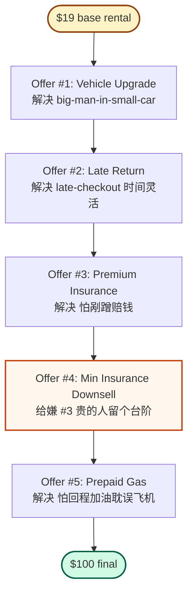

# Money Model = 一串**有顺序**的 offers

> **Source**: Alex Hormozi, *$100M Money Models* — "What is a Money Model?" 节，配租车公司案例
> [← 返回本书 README](../README.md)

---

## 🧠 一句话定义

**Money Model = 一组按顺序排好的 offers，每一个都在客户意识到问题的那一刻抛出。**

> *"A Money Model is a sequence of offers. ... If you offer the right thing when customers realize they need it, you can make as many offers as you like."*

📌 **关键不在 offer 多，关键在两件事：**
- **顺序**（order）—— 什么时候抛
- **匹配度**（fit）—— 是不是正好在客户**刚刚**意识到问题的那一秒

---

## 🚗 案例：租车公司怎么把 $19 单子做成 $100



| # | Offer | 解决的问题 | 性质 |
|---|---|---|---|
| 1 | Vehicle Upgrade | "big man in a small car"（嫌车小） | upsell |
| 2 | Late Return | "late checkout"（怕来不及还） | upsell |
| 3 | Premium Insurance | "worries about dinging the car"（怕剐蹭赔钱） | upsell |
| 4 | **Min Insurance Downsell** | 嫌 #3 太贵，但又不想完全裸奔 | **downsell** ⚠️ |
| 5 | Prepaid Gas | "risk of missing flight"（怕回程加油耽误飞机） | upsell |

💬 **客户感受**：不是"被坑"，是 *"I paid more, but it also solved more problems."* —— 心甘情愿付。

---

## 💡 我的归纳（三件让我眼前一亮的事）

### 1. 5 个 offer 里藏了一个 **downsell**，不是单调加价

Offer #3（Premium Insurance）报价高 → 直接配一个 Offer #4（Minimum Insurance）当台阶。这是**价格锚 + 风险逆转**的实战写法：

- **锚定**：先报高，低的就显得理性
- **不丢单**：嫌 #3 贵的人还有路可走，不会直接把"insurance 这一栏"整个跳过
- **心理学**：从"yes / no" 变成"贵 / 便宜"，决策路径完全不一样

→ 这条单独值得记下来，可能是这本书最容易抄的一招。

### 2. 不是"推销"，是"**预判 + 顺势**"

> *"They told me about the problem, then made their solution available to me."*

公式永远是：**先唤醒问题感知 → 再呈现方案**。颠倒过来 = 讨人嫌的 push sales。

公司事先把客户从下单到还车流程里**会**冒出来的微痛点全列出来，每个痛点配一个 ready offer。客户每一次掏钱都觉得"啊我刚好需要这个"，而不是"又来推销"。

### 3. 行业含义：**base price 只是钩子，利润在 sequence**

$19 的 base rental 是入口（loss leader 级），真正的利润全在 offer 序列里。Hertz / Avis 月入 billions 不是靠 base price，是靠 Money Model 累出来的客单价。

→ 反推：任何用"低价基础款"做获客的生意，**没有 Money Model 就是在亏钱**。

---

## 🧠 抽象公式

```
Money Model
  = ordered_sequence([offer_1, offer_2, ..., offer_n])
  where  offer_i  ↔  problem_i 客户刚好在第 i 步会意识到
```

**两个变量出错任意一个，链条就崩**：
- 顺序错（在客户没意识到问题前抛 offer）→ 当作骚扰
- 匹配错（offer 没对准当下的痛点）→ 没感觉，跳过

---

## 🎯 行动项（套到自己手上的项目）

1. **画客户旅程地图**：从首次接触 → 决策 → 使用 → 结束 → 复购，每一步列出来
2. **每一步问一句**：客户在这一刻**刚好**会冒出什么微痛点？
3. **每一个微痛点配一个 ready offer**：付费的、免费的都行
4. **专门检查 sequence 里有没有 downsell 路径**：哪一步价格高就配个降级版，避免一步贵直接劝退

---

## 💬 金句墙

> *"A Money Model is a sequence of offers."*

> *"If you offer the right thing when customers realize they need it, you can make as many offers as you like."*

> *"They told me about the problem, then made their solution available to me."*

> *"I paid more, but it also solved more problems."*
