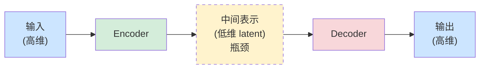
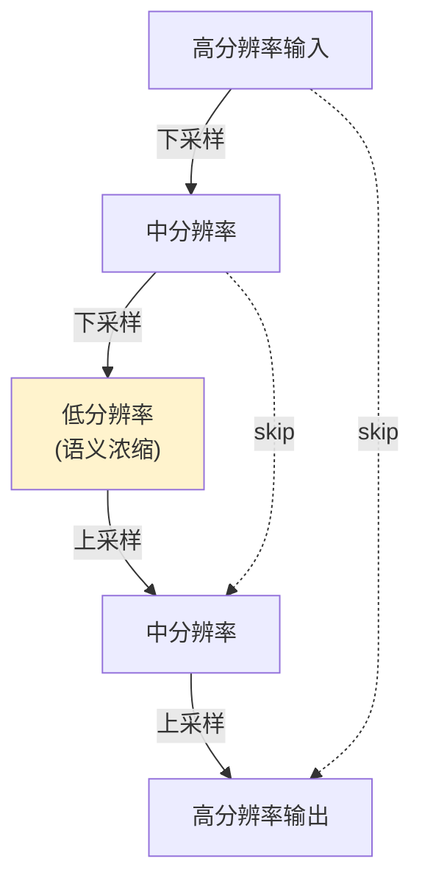
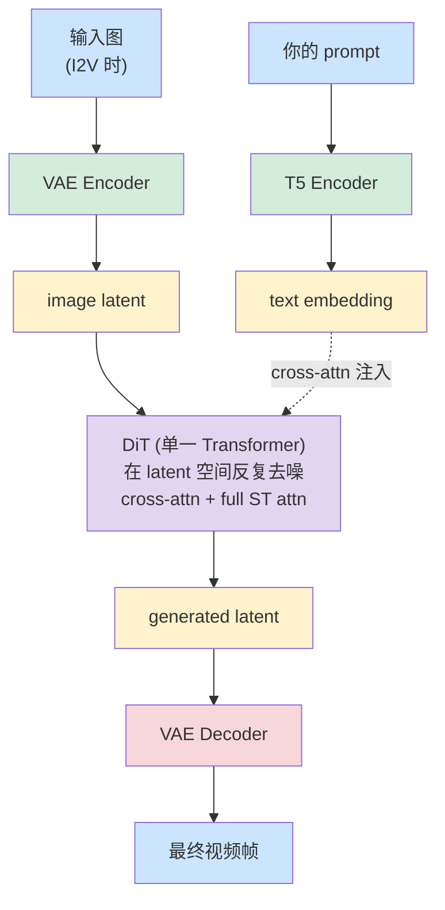

[← 返回概念词典](README.md)

# Encoder-Decoder 架构

## 🎯 一句话定义

**Encoder-Decoder = "先压后解"的设计模式**：Encoder 把输入压成关键信息浓缩的中间表示（latent / hidden / embedding），Decoder 从这个浓缩表示重建出输出。本质是**信息瓶颈 + 模块化**。

---

## 📐 通用结构



---

## 🌍 5 大常见场景

### ① 压缩 / 重建（VAE 最典型）
- 输入和输出**形状一样**（视频 → 视频）
- 中间 latent 维度低
- 例子：[VAE](vae.md)、JPEG（手写版）、自编码器去噪

### ② 翻译 / 转格式（Seq2Seq）
- 输入和输出**形状不一样**（中文句子 → 英文句子）
- Encoder 负责"理解"，Decoder 负责"表达"
- 例子：原版 Transformer、机器翻译、语音识别

### ③ 跨模态生成（Image Captioning / TTS / T2V）
- 输入和输出**模态不同**（图 → 文，文 → 视频）
- Encoder 把模态变成"中间语言"，Decoder 把"中间语言"变成另一种模态
- 例子：图像描述、文生图、**Wan T2V/I2V**

### ④ 自监督预训练（BERT / MAE）
- 让模型从**残缺信息**恢复完整数据
- 不需要人工标注（自监督）
- 例子：BERT 的 MLM、MAE 把图块挡住再预测

### ⑤ 多尺度处理（U-Net）
- Encoder 抽语义 + 下采样，Decoder 还原细节 + 上采样
- 多了 **skip connection** 把高分辨率细节直接传过去
- 例子：图像分割、Stable Diffusion 1.5/2.1



---

## 🤔 为什么这种结构有用？3 个根本原因

### 原因 1：信息瓶颈强迫"抽象"

如果 Encoder 输出维度和输入一样大，模型可以**偷懒**直接 copy。把中间 latent **强制压低**，模型就**不得不挑重点**：

> "我容量这么小不能什么都记。我必须挑出最重要的特征 —— 才能让 Decoder 还原出一段看得过去的输出。"

**这个"被迫挑重点"的过程，就是模型在学习"什么是重要的"**。这是**信息瓶颈原理**（Tishby 2000）。

### 原因 2：模块化 = 灵活复用

Encoder 和 Decoder 是**两个独立网络**，可以分开用：

```
VAE 训练完后：
  • 你只想压视频做存储 → 只用 Encoder
  • 你已经有 latent（diffusion 生成的）→ 只用 Decoder
  • Wan / Stable Diffusion / Sora 用的就是这种"VAE 当桥梁"的玩法
```

类比：USB 数据线两端是不同接口（USB-C / Lightning），中间一根线统一格式。**Encoder-Decoder 让不同的"接口"能互联互通**。

### 原因 3：训练目标天然简洁（重建损失 = 自监督）

```
普通监督学习：     需要 (输入, 标签) 成对数据 → 标注贵
Encoder-Decoder：  只需要 (输入, 输入) 自己跟自己对 → 数据无穷
```

VAE / BERT / MAE 都用这一招：**让模型自己当自己的老师**。这就是为什么这种架构能训巨大的模型 —— **不需要人工标注**。

---

## 🚫 什么时候**不**需要 Encoder-Decoder？

不是所有任务都需要。**当输入和输出形状一样、且不需要信息瓶颈时**，可以用更简单的"单网络"：

| 任务 | 用什么 | 为什么 |
|---|---|---|
| 图像分类 | 单一 CNN（只做 encoder） | 输出是 label，不需要"还原" |
| GPT 风格文本生成 | 单一 Transformer（只做 decoder） | 自回归生成，不需要单独 encoder |
| **DiT 视频去噪**（Wan 核心） | **单一 Transformer** | 输入 noisy latent，输出 clean latent，形状一样，不需要先压再解 |

⚠️ **关键点**：**Wan 的 DiT 本身不是 encoder-decoder**，它是一个 Transformer，输入和输出都是 latent。**Encoder-decoder 只出现在 VAE 那一层**。

---

## 🌳 Wan 整个推理 pipeline 里 Encoder-Decoder 的位置



整个架构里出现 **4 个不同形态的网络**：

| 网络 | 角色 | 是否 encoder-decoder? |
|---|---|---|
| T5 Encoder | 文本理解 | 只用了 T5 的 encoder 那一半 |
| VAE Encoder | pixel → latent | 半个 VAE |
| **DiT** | latent → latent 去噪 | **不是**，单一 Transformer |
| VAE Decoder | latent → pixel | 半个 VAE |

---

## 📜 Take-away

1. **Encoder-Decoder = 信息瓶颈 + 模块化** 的设计哲学
2. **5 大场景**：压缩重建 / 翻译 / 跨模态 / 自监督 / 多尺度
3. **强迫模型"抽象"**，因为瓶颈窄必须挑重点记
4. **训练天然简洁**：用"重建自己"作目标，无需标注
5. **不是所有架构都用它** —— Wan 的 DiT 就不是

---

## 🔗 相关概念

- [VAE](vae.md) — Encoder-Decoder 模式的经典实例
- _(待补) Transformer 原版_
- _(待补) U-Net_
- _(待补) BERT / MAE_
