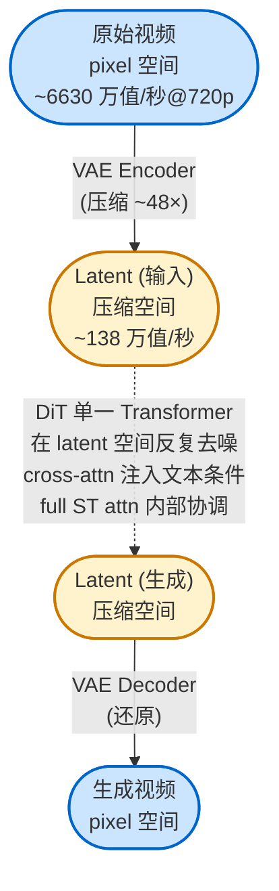
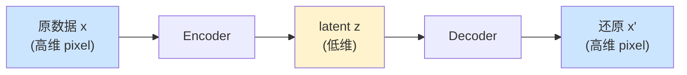

[← 返回概念词典](README.md)

# VAE · Variational Autoencoder

## 🎯 一句话定义

**VAE = AI 学出来的压缩器**。把高维数据（pixel 视频）压成低维 latent，再还原回来。中间多了一个"V"约束，让 latent 空间变光滑、可采样、对 diffusion 友好。

---

## 📐 整体结构（在视频生成里的角色）



⚠️ **注意**：DiT **不是 encoder-decoder**，它是单一 Transformer 在 latent 空间内做变换（输入 latent，输出 latent，形状一样）。**Encoder-Decoder 这个模式只出现在 VAE 这一层**。

---

## 🧱 概念分层拆解

### Layer 0 · 它是什么类比？

| 类型 | 例子 | 怎么工作 |
|---|---|---|
| 图像压缩 | JPEG | 几 MB 压成几百 KB（手写算法） |
| 视频压缩 | MP4 / H.264 | 压几十倍（手写算法） |
| **AI 压缩** | **VAE** | **让神经网络学怎么压**（学出来的规则） |

> VAE = "AI 时代的 JPEG/MP4"，差别在于压缩规则不是人写死的，是从数据学的。

---

### Layer 1 · 先讲 AE（不带 V 的版本）



- **Encoder**：吃高维数据 x，吐低维代码 z（"压缩"）
- **Decoder**：吃低维代码 z，吐回高维数据 x'（"解压"）
- **训练目标**：让 x' ≈ x（重建误差最小）

**为什么这能学到有用的压缩**？因为 latent z 维度很低，Encoder 必须**只保留最关键的信息**才能让 Decoder 还原。**冗余的细节会被自动丢掉**。

**Wan-VAE 的真实数字**：

```
原始 1 秒 720p 视频:  24 × 720 × 1280 × 3   = 6630 万 个像素值
        │  Encoder 压
        ▼
Latent (4×8×8 压缩): 6 × 90 × 160 × 16    = 138 万 个 latent 值
        │  Decoder 还原
        ▼
还原视频:           24 × 720 × 1280 × 3   = 6630 万 个像素值

压缩比 ≈ 48×
```

---

### Layer 2 · "V" 是什么意思？

**纯 AE 的 latent 空间是"坑坑洼洼"的** —— Encoder 把每个输入压到一个精确的点 z，但**z 周围的空间没意义**。

VAE 多加一个约束：**让 latent 整体服从某个光滑分布（标准正态分布 N(0, I)）**。这就是 "Variational" —— 数学上叫 KL 散度约束。

```
Plain AE 的 latent 空间          VAE 的 latent 空间
┌─────────────────────┐          ┌─────────────────────┐
│                     │          │   ░░ ▒▒ ▓▓ ▒▒ ░░    │
│   ●        ●        │          │   ▒▒ ▓▓ ██ ▓▓ ▒▒    │
│       ●             │          │   ▓▓ ██ ██ ██ ▓▓    │
│   ●        ●  ●     │          │   ▒▒ ▓▓ ██ ▓▓ ▒▒    │
│                     │          │   ░░ ▒▒ ▓▓ ▒▒ ░░    │
└─────────────────────┘          └─────────────────────┘
只在那几个 ● 点有意义            整个区域都"长得像合理数据"
```

**好处**：
- **采样能力**：从 latent 空间随便采一个点 → 解码出**有意义**的新数据
- **插值平滑**：两个 latent 之间画一条线，沿线解码 → 渐变过渡
- **Diffusion 友好**：diffusion 在 latent 空间加噪/去噪，光滑空间让训练更稳定

⚠️ **小白别怕这个数学**：你只需要记住 **"V = 让 latent 空间变光滑、可采样、可插值"** 就够了。

---

### Layer 3 · 为什么 Wan 必须用 VAE？

#### 动机 1：算量爆炸（最主要原因）

```
直接在 pixel 空间跑 diffusion              在 latent 空间跑 diffusion
─────────────────────────────────────────────────────────────────
处理 6630 万个值                            处理 138 万个值
attention O(N²)                            复杂度小约 (48)² = 2304 倍
                                             ↑
                                   没有 VAE，video diffusion 跑不动
```

#### 动机 2：低维 latent 信息密度高

视频 pixel 之间相邻像素几乎一样、相邻帧动作微小 —— **绝大部分都是冗余**。在 pixel 空间训 diffusion，模型大半算力浪费在学"红色像素旁边大概率还是红色"。**latent 空间把冗余榨干**，每个 latent 值都"信息密度高"。

---

### Layer 4 · Wan-VAE 的特殊修饰：3D Causal

Wan paper §4.1 标题是 "Spatio-temporal Variational Autoencoder" = 3D Causal VAE。两个修饰词：

#### "3D" vs 普通 2D VAE

| 普通图像 VAE（2D） | Wan-VAE（3D） |
|---|---|
| 只压空间 H × W | 同时压空间 + 时间 T × H × W |
| 一帧一帧独立处理 | 多帧当作 3D 体一起处理 |
| 没法捕捉帧间动作 | 能学到"运动"是什么 |

#### "Causal"（时间因果性）

```
非 Causal（普通 3D Conv）：               Causal 3D Conv：
计算第 5 帧时 kernel 看 [3,4,5,6,7]      计算第 5 帧时 kernel 只看 [3,4,5]
                              ↑            过去 → 现在，不允许未来 → 现在
                          剧透未来！
```

**为什么必须 causal**？流式生成时（生成第 5 秒不知道第 6 秒），**训练分布必须和推理分布一致**。

---

## 🔗 在我读过的论文里出现的位置

| Paper | Section | 怎么用 |
|---|---|---|
| Wan (2503.20314) | §4.1 Spatio-temporal VAE | 4×8×8 压缩，127M 参数，3D Causal，3-stage 训练，feature cache 推理 |

---

## 🔗 相关概念

- [Encoder-Decoder 架构](encoder-decoder.md) — VAE 是这个模式的一种
- _(待补) Diffusion 基础_
- _(待补) DiT (Diffusion Transformer)_
- _(待补) PSNR / LPIPS_
